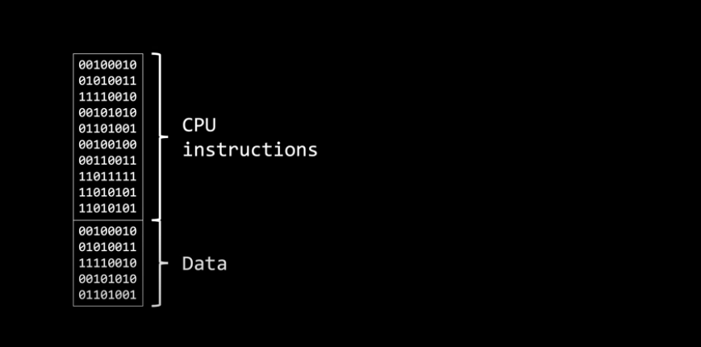
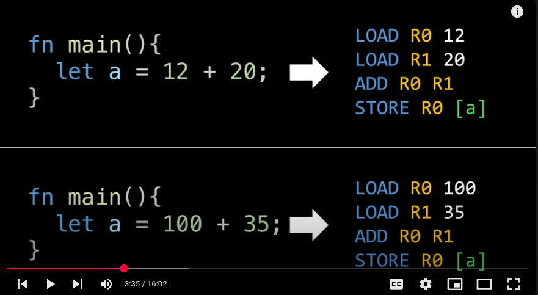

A program is a just a sequenece of instructions and the data that the CPU needs to accomplish for a specific task Or,

A program is a passive entity, such as an excutable file that can be launced to start running -> which is what happens when running an app on OS.

Looking at the below picture -> this is nothing but an excutable file -> that's what a program is

So, when clicked on (as image below), the clicked executable (that resides within machine's storage) file does something ....

When clicked on the excutable program file 

First, it will load that into memory as that's where the CPU can start fetching instrunctions and data, when loaded into memory the section containting the executable code is known as "TEXT" section while data such as "Global variables and constant values"  loaded into "data section" -> but running a program requires more than these two sections -> it also need extra space in memory to store all the data generated at runtime like "user input and temporary results or variables" 

N.B: STACK and HEAP are growing and shrinking in size all the time

N.B: The `Text` section is the only section that never changes (neither size nor content)

N.B: Same can't be said about the "DATA section" even though its size don't change but its content may vary depending on what the running program is doing

So, as seen here initally loaded the program into memory, when running this layout can no longer be considered as a program of course not -> it has now become a "PROCESS" -> note that this is the memory layout of the "PROCESS" not the "PROCESS itself"

## PROCESS:  A PROGRAM IN EXECUTION (often misleading)

So, here 2 text file has been opened -> this is what happens

First, process is working with a larger text file so it naturally requires more memory to manage - its data 

- A program by itself is not a "process"
- A Program is just a "passive entity" whereas in the contrast "a process is an active entity" -> although "processes" e.g. like above may be assocaited with the same "program" they are nevertheless considered two separate execution sequences

Everything that has been said so far, from the perspective of "compiled languages" i.e. c, c++, rust, golang etc.

So, when using languages like C or Rust -> the result of the compilation is an excutable file i.e. the "program itself" 

But what about interpreted languages like Javascript, Python etc. where there is no compilation e.g. everytime when running code we must first instruct the computer to run the interpreter and then tell the interpreter to execute our code (imgage below)

In other words, there are now two "passive entities" involved the python interpreter which is a programn "itself" and our python file which is practically a "text file" -> I would like to hightlight the fact that the python source file is not a program (source code/file is just a "TEXT" that computers can't understand and therefore cannot execute so in this kind of situations `the "program" we're actually asking the computer to run this interpreter not the python code we wrote`) -> once this new `process` is created -> it has its own memory region with `"TEXT"` and `"DATA"` sections as well as a `"STACK"` and `HEAP` just like any other process -> key point is that what's loaded into the "TEXT" section is not our python source code we wrote but the executable cdoe of the interpreter -> our source code by ther interpreter process into one of its data sections (most likely the heap) because it serves as the data that interpreter will work with to read and interpreter.

## Deep dive into interpreter later

# Quick Recap:

When running an `program` within OS, what happens internally is that its excutable file is loaded into memory.

At this point, our program becomes a process

The execution of this process might require additional memory to store such as user input and temporary results -> The OS is reponsible for allocating this memory (image below)

The memory assigned to it has a special name: the "address space" of this process.

A `process`, however, is more than just its `address space` — modern operating systems use concurrency to allow multiple processes to make progress by efficiently sharing computer resources. Concurrency means that multiple processes can appear to be in progress at the same time, even on a single-core, single-threaded CPU, by rapidly switching between them (context switching). This gives the illusion of simultaneous execution, but at any instant, only one process is actually running. 

Parallelism, on the other hand, requires at least two hardware threads or CPU cores, so that two or more processes (or threads) can truly execute at the same time. For example, a dual-core CPU with one thread per core can run two processes in parallel, while a single-core CPU can only achieve concurrency, not true parallelism.

Internally, the operating system manages processes and threads using scheduling algorithms. Each process or thread is placed in a queue, and the scheduler decides which one gets access to the CPU at any given time. 
This mechanism, known as context switching, allows the OS to rapidly switch between different processes or threads, giving the appearance of simultaneous execution. 

The scheduler ensures fair and efficient use of CPU resources, balancing responsiveness and throughput according to system policies and workload demands.

# CPU internals

Remember, the CPU has internal compoents like general-puporse registers, the instruction register, the address register (also known as the program counter), the stack pointer, and even flags.

When a process gains access to the CPU, it uses these components to manipulate and move data. This is what running a program essentially.

But alternating CPU access between multiple processes is not as simple as it seem to be. 

When switch proceesses, the process that gains access to the CPU would find itself in a CPU state belonging to the previous process -> this leads two major issues i) security (since current process could access from the previous process) ii) correctness of execution: current process still needs to manipulate the registers to carry out its own taks but in doing so, it alters the current CPU state of previous process -> so, when the previous process regains CPU access later, the CPU state it had when it was interupted would be now lost.

## Let's understand this issue with an example:

So, here are two programs and when compiled to assembly, they look something like above image.

To be executed by the machine, the code must first be compiled into machine code.

Since, binary will be hard to follow, so here showing the instructions in assembly just for clarify (so this is not accurate step) -> let's assume both programs launched at the same time, and so they are loaded into memory and for simplicity, let's also say the concurrency model used by the operating system allows each process to execute upto two instructions before switching CPU access to a different process.

https://www.youtube.com/watch?v=LDhoD4IVElk&list=PL9vTTBa7QaQPdvEuMTqS9McY-ieaweU8M&index=3 (4:10)

To start executing the first process, the operating system sets the program counter -> so, the CPU can begin fetching instruction for that process.