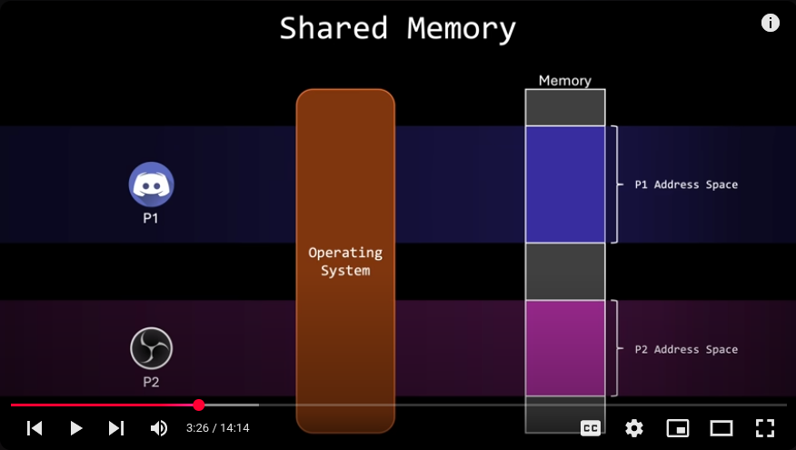
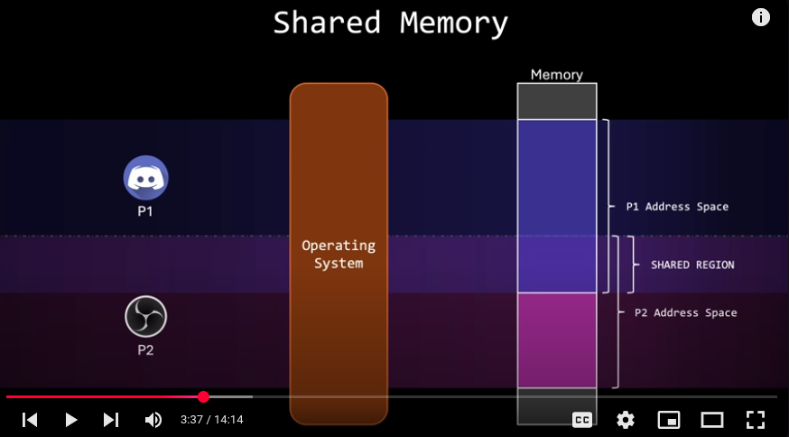

# When comes to "process" -> there are two types

1. Independent process that never communicates with other processes

2. Cooperating PROCESS where one PROCESS can communicate with others and there are two ways i) Shared memory ii) Messeage Passing

## INTER-PROCESS communication: shared memory

When run two processes, their "address spaces" by default isolated from each other unless a shared "memory space" created using system calls which will off course will have its own address 

## INTER-PROCESS communication: Message Passing

This mechanism allows `processes` to communicate and synchronize their actions without sharing the same "address space" so both process could remain isolated and instead of writing to `memory processed i.e. shared` can communicate by sending messages.

Popular message passing mechanisms included pipes, sockets, and remote procedure calls (RPC)