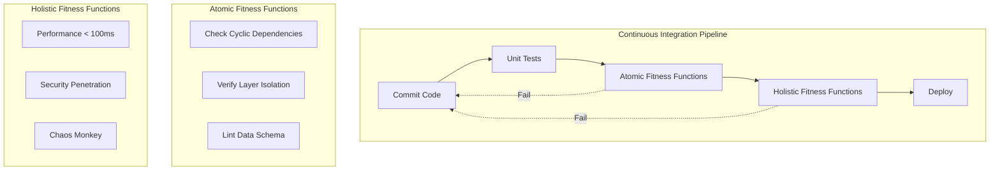
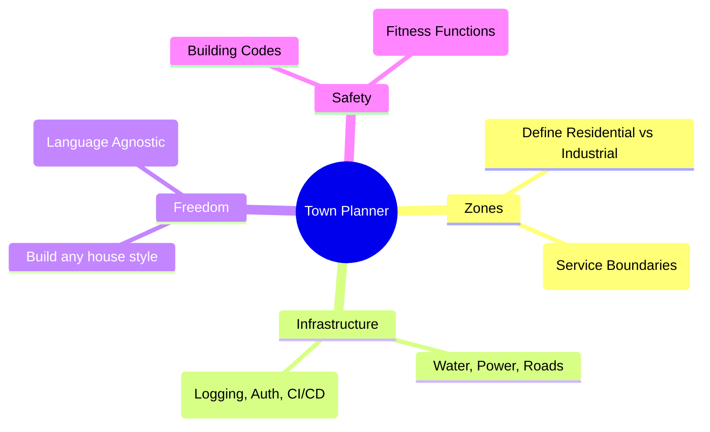

# Evolutionary Architecture: Designing for Change

> **Source**: [Evolutionary Architecture](https://youtu.be/8bEsNT7jdC4)

> [!IMPORTANT]
> **The Definition**: An architecture that supports **incremental, guided change** as a first principle.
> *   **Incremental**: Small, safe releases (Generations).
> *   **Guided**: Fitness functions ensure we don't drift away from requirements.
> *   **Change**: The only constant in software.

---

## 🧬 Core Concept: Fitness Functions

In biology, evolution is random. In software, it must be **guided**.
A **Fitness Function** provides an objective integrity assessment of some architectural characteristic.

### Types of Fitness Functions
1.  **Atomic**: Tests one thing in isolation (e.g., "Controllers must not import Repositories directly"). Run on every commit.
2.  **Holistic**: Tests the system interaction (e.g., "Latency must stay under 100ms when 1000 users log in"). Run nightly or continuously.
3.  **Continuous**: Tests in production (e.g., **Netflix Simian Army** killing random nodes).

---

## 🏗️ The Trap of "Vendor-Driven" Architecture

Many organizations fail because they buy a "Shopping List" of tools (ESB, BPM, CRM) and glue them together.

| Traditional (Static) | Evolutionary (Dynamic) |
| :--- | :--- |
| **Big Upfront Design** | **Emergent Design** |
| Decision made once | Decision deferred until "Last Responsible Moment" |
| Change is risky (Fear) | Change is routine (Confidence) |
| "Coupled to Vendor Roadmap" | "Platform Agnostic" |

---

## 👥 Organizational Mapping: Inverse Conway Maneuver

Conway's Law states: *Organizations design systems that mirror their communication structure.*

If you want Microservices, but you have a siloed DB Team, UI Team, and Backend Team, you will accidentally build a **Distributed Monolith**.

**The Maneuver**:
1.  **Reverse it**: Design the architecture you want first.
2.  **Reorg**: Change the team structure to match that architecture (e.g., Cross-functional "Squads" owning a vertical slice).
3.  **Result**: The architecture will naturally emerge from the communication paths.

---

## 🏘️ The Architect's Role: Town Planner

The "Ivory Tower" architect who dictates rules is dead. The modern architect is a **Town Planner**.

*   **Zones**: You define the boundaries (Bounded Contexts).
*   **Infrastructure**: You provide the shared plumbing (Auth, Logging, CI/CD).
*   **Freedom**: Inside the zone, the team decides usage (Go vs Java, SQL vs NoSQL).
*   **Safety**: If a house catches fire, it shouldn't burn the city (Circuit Breakers).

---

## 🧠 Strategic Application (The Magic Quadrant)

Not all systems need to be evolutionary.

| Quadrant | Strategy | Example |
| :--- | :--- | :--- |
| **Commodity** | Buy/Rent. Don't evolve. | Email Server, HR System. |
| **Utility** | Minimal investment. Stability over change. | Logging Cluster. |
| **Experimental** | Hack it. Throw it away. | Prototype, Market Test. |
| **Strategic** | **Evolutionary**. High value, High change. | **Core Business differentiator.** |

> [!TIP]
> **Only build Evolutionary Architecture for Strategic Systems.** It is expensive. Don't waste it on commodities.

---

## ✅ Principal Architect Checklist

1.  **Define Fitness Functions First**: Before coding, write the test that proves the architecture works (e.g., ArchUnit tests).
2.  **Optimize Cycle Time**: Migration is impossible if deployment takes 2 weeks. Aim for < 1 hour.
3.  **Use Architectural Decision Records (ADRs)**: Document the "Why" next to the code.
4.  **Practice the Inverse Conway Maneuver**: Don't fight your own org chart. Align teams to services.
5.  **Treat Infrastructure as Code**: You cannot evolve if your servers are "Snowflakes".
6.  **Avoid Vendor Lock-in (Coupling)**: Wrap vendor tools in an **Anti-Corruption Layer** so you can swap them later.

---

## 🔗 Related Documents
*   [Strangler Fig Pattern](strangler-fig/strangler-fig-pattern.md) — How to migrate to evolutionary states.
*   [Distributed Systems Theory](../networking/distributed-systems-theory.md) — The physics of the zones.
