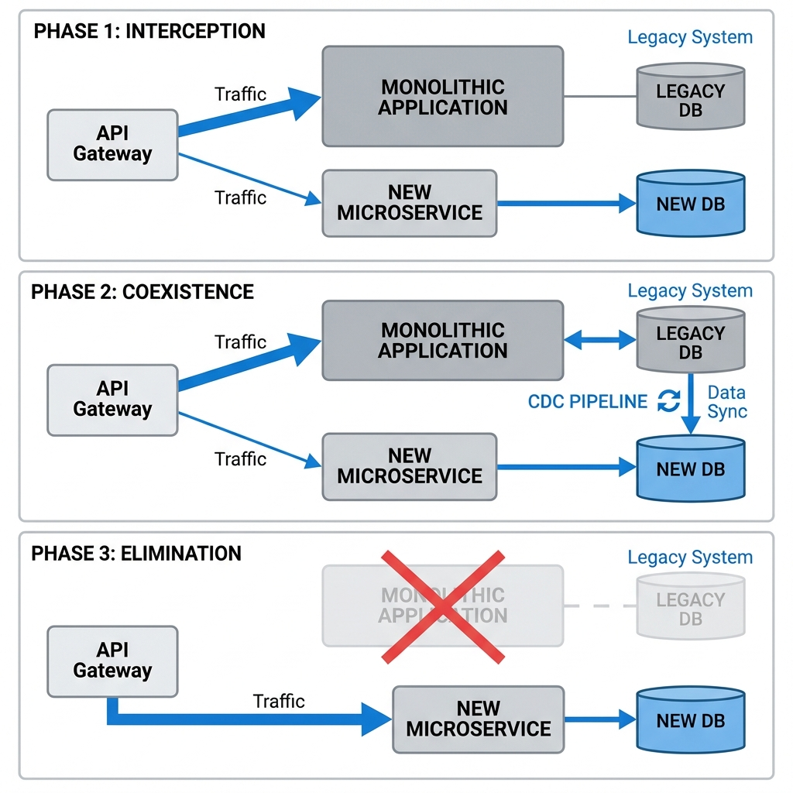
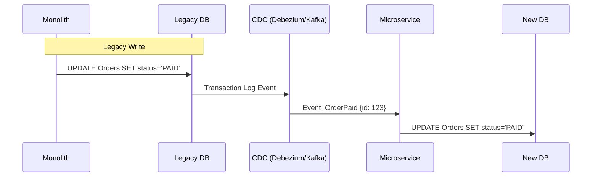

# Strangler Fig Pattern: Monolith to Microservices Migration

> **Source**: [Strangler Fig Architecture](https://youtu.be/MV11JStATVE)

> [!IMPORTANT]
> **The Core Concept**: You cannot rewrite a massive monolith from scratch. It takes too long, and by the time you finish, business requirements have changed.
> Instead, plant a **Strangler Fig** (the new system) around the host tree (the monolith). It gradually intercepts calls until the host dies.

---

## 🏗️ The 3-Phase Migration Architecture



We replace functionality *slice by slice* using a **Facade**.

```mermaid
graph TB
    subgraph "Phase 1: Interception"
        Client[Client App]
        Facade[API Gateway / Facade]
        Mono[Legacy Monolith]
        Micro[New Microservice]
        
        Client -->|1. All Traffic| Facade
        Facade -->|2. Default| Mono
        Facade -->|3. Feature X (Beta)| Micro
    end

    subgraph "Phase 2: Coexistence (Hard Part)"
        MonoDB[(Legacy DB)]
        MicroDB[(New DB)]
        Sync[CDC / Dual Write]
        
        Mono -.->|Read/Write| MonoDB
        Micro -.->|Read/Write| MicroDB
        MonoDB <-->|Sync| MicroDB
    end

    subgraph "Phase 3: Elimination"
        Client --> Facade
        Facade -->|100% Traffic| Micro
        Facade --x Mono
        Mono --x MonoDB
    end
```

### 1. The Facade (The Interceptor)
The most critical component. It separates the **Interface** from the **Implementation**.
*   **Layer**: Usually an **API Gateway** (Kong, Nginx) or a Load Balancer (ALB).
*   **Role**: Accepts all calls. Routes "legacy" calls to Monolith. Routes "modern" calls to Microservices.
*   **Safety**: Allows instant rollback. If the Microservice fails, change the route config to point back to Monolith.

---

## ⚔️ The Data Problem: Managing Shared State

Moving code is easy. Moving state is hard.

### Strategy A: Dual Write (The risky path)
The Monolith writes to both its DB and the New DB.
*   **Pros**: Simpler than setting up CDC.
*   **Cons**: **Distributed Transactions**. What if Write A succeeds but Write B fails? You have data inconsistency.

### Strategy B: Change Data Capture (The robust path)
Use **Debezium** or database triggers to stream changes from Legacy DB to New DB.



*   **Pros**: Eventual consistency without distributed transaction overhead.
*   **Cons**: Latency. The New DB might be 500ms behind.

---

## 🛡️ Patterns for Success

### 1. Anti-Corruption Layer (ACL)
The new Microservice should **not** speak the Monolith's internal language.
*   **Problem**: Monolith uses dirty schemas (e.g., `TBL_USR_01`).
*   **Solution**: Build an adapter (ACL) that translates `TBL_USR_01` into a clean Domain Object (`User`) before it enters your new clean architecture.

### 2. Dark Launching
Deploy the new microservice but **do not return its results**.
1.  Facade sends request to *both* Monolith and Microservice.
2.  Facade returns Monolith response to user.
3.  **Comparator sidecar** compares Monolith vs. Microservice response.
4.  Log any mismatches as bugs.
5.  Once match rate = 100%, switch traffic.

---

## 🚫 Common Pitfalls (Principal Architect View)

| Pitfall | Description | Solution |
| :--- | :--- | :--- |
| **Distributed Monolith** | You split the code but kept a **Shared Database**. | You must split the database, even if it means complex sync logic. |
| **Latency Explosion** | Facade + ACL + Network Hops adds up. | Monitor P99 latency. Use gRPC for internal service talk. |
| **"Big Bang" Release** | Waiting until "Feature Complete" to switch. | Switch *one endpoint at a time*. |
| **Orphaned Facade** | The Facade becomes a localized mess of logic. | Keep logic out of the Facade. It should only be a Router. |

---

## ✅ Principal Architect Checklist

1.  **Establish the Facade First**: Do not migrate a single line of code until you have a routing layer in front of the monolith.
2.  **Decouple the Database**: If services share tables, they are not microservices. Use CDC or Views to separate them.
3.  **Plan for Rollback**: Your toggle mechanism must be instant (seconds), not a re-deployment (minutes).
4.  **Preserve the API Contract**: The client should not know the backend changed. If you break the API, it's not a Strangler Fig, it's a rewrite.
5.  **Kill the Old Code**: Migration isn't done until the legacy code is **deleted**. Use "feature tombstones" to track dead paths.

---

## 📖 Analogy: The Renovation

> [!TIP]
> Strangler Fig is like **replacing the floorboards while the family lives in the house**.
>
> *   **The Facade**: A rug you place over the spot you are working on.
> *   **The Monolith**: The old rotting wood underneath.
> *   **The Microservice**: The new oak plank.
> *   **The Process**: Lift rug, swap one plank, replace rug. Repeat until the whole floor is new. The family (User) never has to move out.

---

## 🔗 Related Documents
*   [Data Mesh Foundation](../../mesh/data/data-mesh-foundation.md) — Decentralizing data ownership
*   [Event Sourcing Patterns](../../distributive-backend/eventing/event-sourcing.md) — Handling state changes
