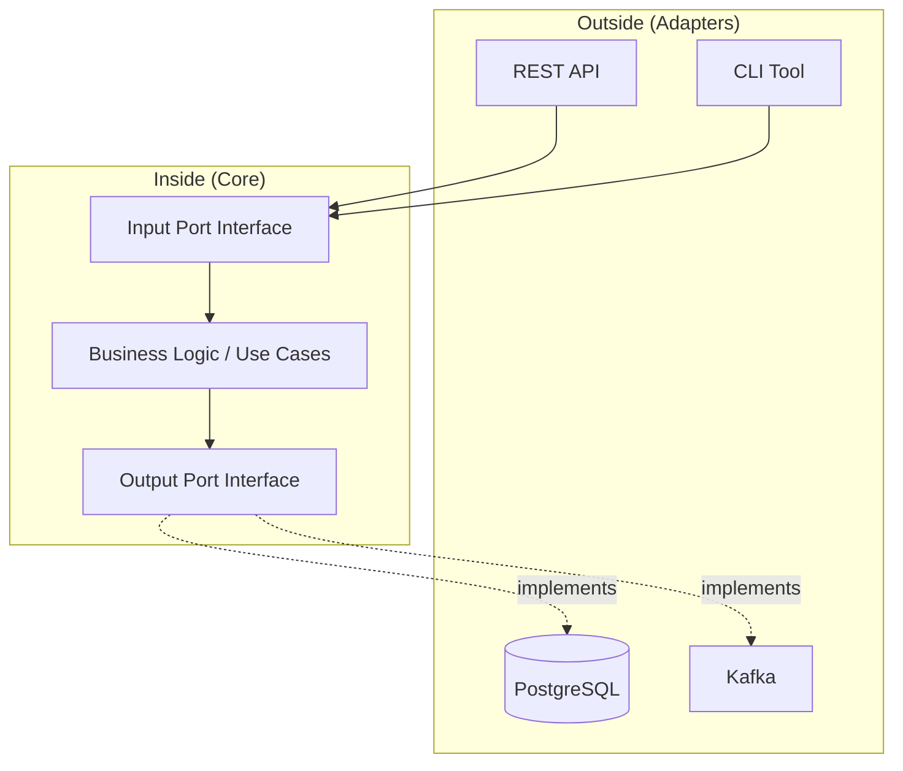

# Architecture Visualization & Implementation: The C4 Model + Clean Architecture

> **Source**: [Clean Architecture & C4 Model](https://youtu.be/lZqPdJra-yA)

> [!IMPORTANT]
> **The Dual Problem**:
> 1. **Most code is coupled** (Business logic depends on the Database).
> 2. **Most diagrams are useless** (They don't map to actual code structures).
> **The Solution**: Invert your dependencies (Clean Arch) + Visualize what exists (C4).

---

## 🏛️ Part 1: Clean & Hexagonal Architecture

The goal is to make Business Logic **the most stable** part of the system.

### The Dependency Inversion Principle


Traditional layered architecture:
```
UI → Business Logic → Data Access (SQL)
```
*Problem*: If you switch from MySQL to MongoDB, you rewrite Business Logic.

**Solution**: Define **Interfaces** in the Business Layer that the Data Layer implements.



*   **Ports**: Interfaces defined **in the core**.
*   **Adapters**: Implementations that "plug into" the Ports.
*   **Result**: You can swap PostgreSQL for DynamoDB without touching the core.

---

## 🎨 Part 2: Domain-Driven Design (DDD)

### Strategic Patterns
*   **Bounded Contexts**: Logical boundaries. "Customer" in the Billing context is different from "Customer" in Shipping.
*   **Ubiquitous Language**: Use the exact same terms (e.g., "Order Fulfillment") in code, docs, and conversations with Product Managers.

### Tactical Patterns
*   **Entities**: Objects with a unique ID (`User`, `Order`).
*   **Value Objects**: Immutable. Defined by their values (`Money`, `Address`).
*   **Aggregates**: Cluster of entities treated as a unit. The **Aggregate Root** is the entry point.
*   **Domain Services**: Logic that spans multiple entities (e.g., "Transfer Money" needs both `Account A` and `Account B`).

---

## 📐 Part 3: The C4 Model (Visualizing Reality)

Most teams produce "Box-and-Arrow" diagrams that no one understands. The C4 Model fixes this with **4 hierarchical levels**.

### Level 1: System Context
*   **Audience**: Non-technical stakeholders.
*   **Shows**: Your system, Users, and External dependencies (Stripe, Auth0).
*   **Omits**: Technology details.

### Level 2: Container
*   **Audience**: Tech leads, DevOps.
*   **Shows**: **Deployable units** (Web App, Mobile App, Database, Message Queue).
*   **Includes**: Tech stack (Node.js, Postgres, Redis).

### Level 3: Component
*   **Audience**: Developers.
*   **Shows**: Logical groupings **within a single container** (Controllers, Services, Repositories).
*   **Rule**: This **must** reflect your actual code structure.

### Level 4: Code (UML)
*   **Audience**: Yourself (debugging).
*   **Shows**: Classes and methods.
*   **Recommendation**: **Auto-generate** from IDE. Do not maintain manually.

---

## ✅ Principal Architect Checklist

1.  **Invert Dependencies**: Never let Business Logic import from `database/` or `http/`. Use Interfaces.
2.  **Close the Model-Code Gap**: Your C3 diagram should show the exact folders/namespaces in your repo. If the boxes say "Service Layer" but you don't have a `/services` folder, your diagram is fiction.
3.  **Add a Legend**: Shapes and colors are not universal. Every diagram must have a **Key**.
4.  **Test the Core in Isolation**: If you need Docker to run your unit tests, your architecture is wrong. Business Logic should be testable with zero I/O.

---

## 📖 Analogy: Building a Hospital

> [!TIP]
> **Clean Architecture** is the internal engineering: If the X-ray machine (Database) breaks, it doesn't shut down the entire hospital's electricity (Business Logic).
> **C4 Model** is the blueprint set:
> *   **Context**: The city map showing where the hospital is.
> *   **Container**: The floor plan showing ER, ICU, and Pharmacy wings.
> *   **Component**: The wiring diagram for Room 301.
> *   **Code**: The exact voltage spec for Outlet #4.

---

## 🔗 Related Documents
*   [Evolutionary Architecture](./evolutionary-architecture-guide.md) — Fitness Functions to enforce these rules.
*   [Strangler Fig](./stranger-fig/strangler-fig-pattern.md) — Migrating legacy code to Clean Arch.
