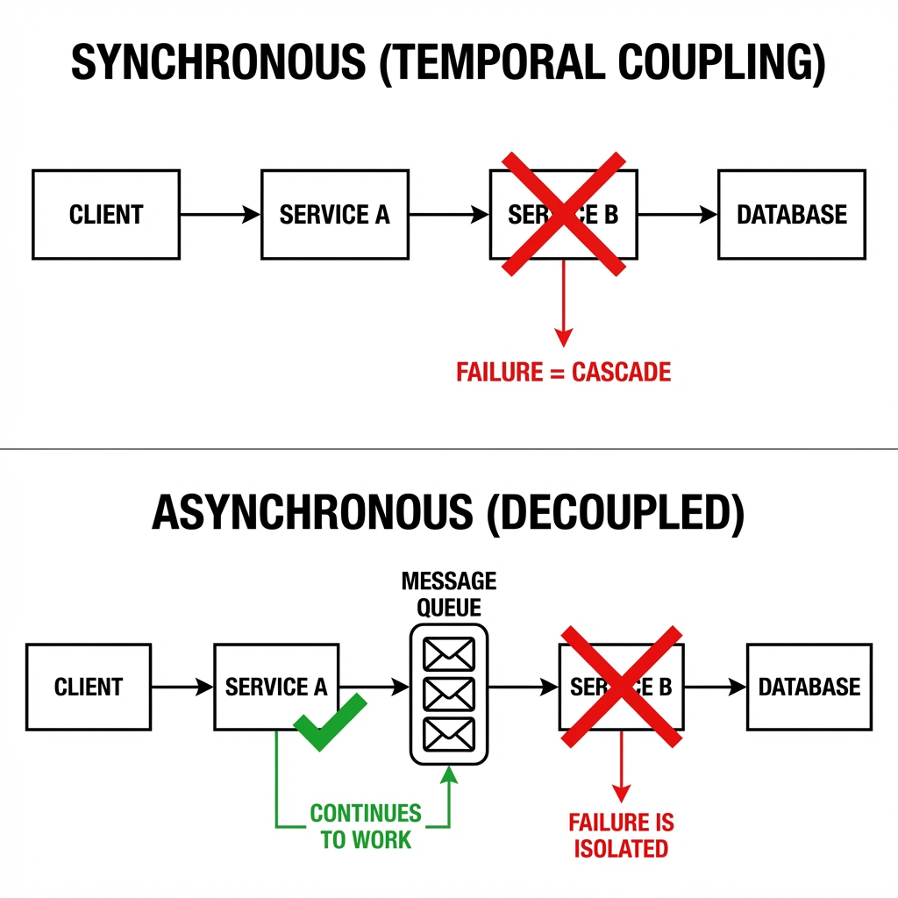

# Async Distributed Systems: Design & Trade-offs

> **Source**: [Asynchronous Distributed Systems Design](https://youtu.be/ODa23kAWHko) (David Ostrovsky, Proofpoint)

> [!IMPORTANT]
> **The Choice**: Synchronous systems fail with **Exceptions**. Asynchronous systems fail with **Latency**.
> **The Question**: Which failure mode can your business tolerate?

---

## 🔄 Synchronous vs Asynchronous



### Synchronous (Request/Response)
```
Client → [HTTP] → Service A → [HTTP] → Service B → [DB]
```
*   **Coupling**: **Temporal**. If Service B is down, Service A returns 500.
*   **Pros**: Simple. Excellent observability (stack traces).
*   **Cons**: Brittle. Cascading failures.

### Asynchronous (Message Queue)
```
Client → Service A → [Queue] → Service B → [DB]
```
*   **Decoupling**: Service A continues even if B is offline.
*   **Pros**: Resilient. Easy to scale.
*   **Cons**: Complex debugging. "Where did my message go?"

---

## 🎯 The CAP Theorem: Choosing Your Poison

In a **Partition** (network split), you must choose:
*   **Consistency**: Reject requests until the partition heals.
*   **Availability**: Serve stale data (Eventual Consistency).

### Real-World Example: The ATM
*   *Scenario*: ATM loses connection to the bank.
*   *Decision*: Allow withdrawal (up to $200). Accept "Negative Balance" risk.
*   *Rationale*: User Experience > Perfect Consistency.

---

## 📨 Asynchronous Messaging Patterns

### 1. Fire and Forget
Producer sends a message. Waits for **broker ACK** (not consumer ACK).
*   **Use Case**: Logging, Analytics.
*   **Pitfall**: If consumer is broken for 3 days, you don't know.

### 2. Publish/Subscribe (Pub/Sub)
One message → Many subscribers.
*   **Use Case**: Event Notification ("User Registered" → Email Service + Analytics + Recommendations).

### 3. Request/Response (Async RPC)
Mimics synchronous calls using two queues: `request_queue` and `response_queue`.
*   **Challenge**: Storing context. Use **Correlation IDs** or a Database to track state.

### 4. CQRS (Command Query Responsibility Segregation)
Write operations go to an **Event Log** (Kafka). Read operations go to a **Key-Value Store** (Redis).
*   **Benefit**: Writes scale horizontally. Reads are blazing fast.
*   **Trade-off**: Eventual Consistency (Reads lag 100ms behind Writes).

### 5. Event Sourcing
Store **every change** forever. The current state is derived by replaying the log.
*   **Use Case**: Audit logs, Time Travel debugging.

---

## 🚦 Delivery Guarantees

| Type | Meaning | Implementation |
| :--- | :--- | :--- |
| **At-Most-Once** | Fire and forget. Data loss OK. | UDP, Video Streaming |
| **At-Least-Once** | No data loss. Duplicates possible. | Kafka (Default) |
| **Exactly-Once** | No loss, no duplicates. | Kafka Transactions (Read + Write same topic) |

> [!WARNING]
> **Exactly-Once is a Myth** outside of narrow cases. If you write to Kafka and then send an Email, the Email is still At-Least-Once (you might send it twice on retry).

---

## 🛑 Back Pressure & Error Handling

### Back Pressure
*   *Problem*: Consumer processes 100 msg/sec. Producer sends 1000 msg/sec.
*   *Solutions*:
    1.  **Throttle the Producer** (Re-introduces coupling).
    2.  **Grow the Queue** (Requires disk space monitoring).

### Error Handling
1.  **Retry in Place**: Block the queue until success (Bad for transient errors).
2.  **Retry Out of Order**: Send to a Retry Queue (Uber's pattern).
3.  **Dead Letter Queue**: Manual inspection.

---

## ✅ Principal Architect Checklist

1.  **Choose the Right Tool**: If you need immediate user feedback ("Payment Declined"), use Sync. If the operation can wait ("Generate PDF Report"), use Async.
2.  **Design for Idempotency**: Your consumer **will** receive duplicates. Use unique IDs (`INSERT IGNORE`).
3.  **Monitor Queue Depth**: If a queue grows unbounded, you have a production incident brewing.
4.  **Use Compensating Transactions**: In a Saga, if Step 3 fails, you must **undo** Step 1 and 2 (e.g., refund the credit card).

---

## 🔗 Related Documents
*   [Saga Pattern](../database/saga/saga-pattern-guide.md) — Orchestrating async workflows.
*   [Kafka at Scale](../multi-tenancy/kafka-at-scale-guide.md) — The Message Transport.
