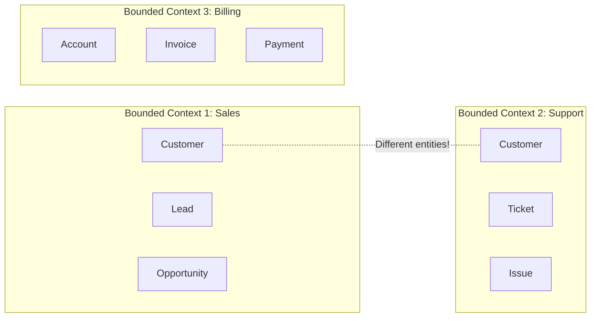

# Bounded Contexts & Domain-Driven Design: The Principal Architect Guide

> **Level**: Principal Architect / SDE-3
> **Scope**: Bounded Contexts, Context Mapping, and the "Team Topology" Connection.

> [!IMPORTANT]
> **The Principal Law**: A Bounded Context is not just a "module" or "service". It is an **organizational boundary** that aligns with **Team Ownership** and **Ubiquitous Language**. If two teams use "Account" to mean different things, they are in different Bounded Contexts.

---

## 🧠 What is a Bounded Context?

A **Bounded Context** is a semantic boundary within which a particular domain model is defined and applicable. Outside this boundary, the same term (e.g., "Customer") may have a completely different meaning.

**Key Insight**: "Customer" in Sales is a potential buyer (has `lead_score`). "Customer" in Support is a current user (has `support_tier`). They are **not the same entity**, even if they share an `id`.

---

## 🗺️ Context Mapping: The Integration Patterns

### 1. Shared Kernel
Two teams share a subset of the domain model (e.g., a common `Money` type).
*   **Risk**: High coupling. Changes require coordination.
*   **Use Case**: Small teams, tightly related domains.

### 2. Customer-Supplier
Upstream team ("Supplier") provides data; Downstream team ("Customer") consumes it.
*   **Power Dynamic**: Supplier defines the API. Customer adapts.
*   **Use Case**: Core Domain → Supporting Domain.

### 3. Anti-Corruption Layer (ACL)
Downstream team creates a translation layer to protect its model from the Upstream's complexity.
*   **Pattern**: "Don't let the legacy system's model leak into our clean domain."
*   **Use Case**: Integrating with a Legacy System or Third-Party API.

### 4. Open Host Service + Published Language
Upstream provides a well-documented, stable API (e.g., REST + OpenAPI).
*   **Use Case**: Public APIs, Platform Services.

### 5. Separate Ways
No integration. Each context solves its problem independently.
*   **Use Case**: Unrelated domains. Avoid forced integration.

---

## 🏛️ Principal Pattern: Conway's Law Alignment

> "Organizations which design systems are constrained to produce designs which are copies of the communication structures of these organizations." — Melvin Conway

**The Implication**: Your Bounded Contexts should **mirror your team structure**.

| Anti-Pattern | Problem |
| :--- | :--- |
| **One context, many teams** | No single owner. Model becomes a "Frankenstein". |
| **Many contexts, one team** | Team is spread too thin. Context boundaries are ignored. |

**The Ideal**: **One Team = One Bounded Context = One Microservice**.

---

## 🛡️ Strategic Design: Core, Supporting, Generic

Not all parts of your system are equally valuable. Classify your domains:

| Domain Type | Definition | Investment |
| :--- | :--- | :--- |
| **Core Domain** | Your competitive advantage. | Build in-house. Best engineers. |
| **Supporting Domain** | Necessary but not differentiating. | Build pragmatically. Can outsource. |
| **Generic Domain** | Commodity (Auth, Email). | Buy/Use SaaS. |

**Example (E-Commerce)**:
*   **Core**: Product Recommendation Engine.
*   **Supporting**: Order Fulfillment.
*   **Generic**: User Authentication (Use Auth0/Keycloak).

---

## ✅ Principal Architect Checklist

1.  **Map Your Contexts First**: Before writing code, draw the Context Map. Identify the relationships (ACL, Shared Kernel, etc.).
2.  **Enforce Language Boundaries**: If "Order" means different things, create separate `SalesOrder` and `FulfillmentOrder` entities.
3.  **Align with Teams**: A Bounded Context should be owned by exactly one team.
4.  **Protect Your Core Domain**: Apply the ACL pattern to shield it from external systems.
5.  **Embrace Duplication**: It is OK for two contexts to have their own `Customer` table. Data redundancy is a feature, not a bug (it enables autonomy).

---

## 🔗 Related Documents
*   [Async Systems Guide](async-systems-guide.md) — Communication between contexts.
*   [Event-Driven Microservices](event-drive-microservices/) — Eventual Consistency across contexts.
*   [Strangler Fig Pattern](../architechture/stranger-fig/strangler-fig-pattern.md) — Migrating legacy into new contexts.

---

## 📚 Source
*   [Strategic Domain-Driven Design (YouTube)](https://www.youtube.com/watch?v=am-HXycfalo)
