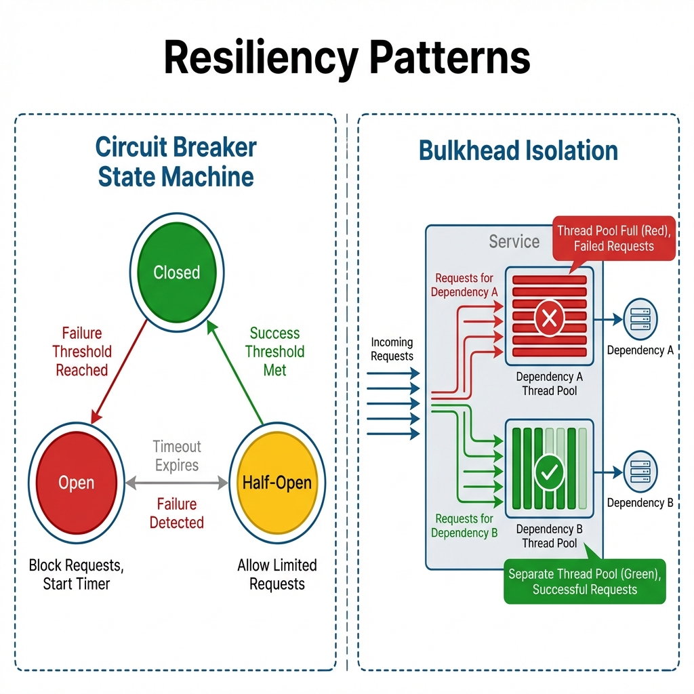
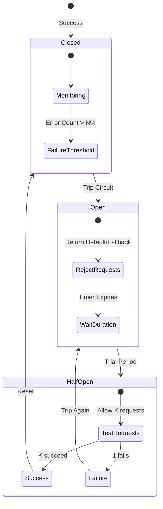

# Resiliency Patterns: Circuit Breaker & Bulkhead

> **Source**: [Circuit Breakers (Resilience4j)](https://youtu.be/ADHcBxEXvFA), [Bulkheads](https://youtu.be/R2FT5edyKOg)

> [!IMPORTANT]
> **The Goal**: In a distributed system, failures are **inevitable**.
> Your goal is not to prevent failure, but to **prevent cascading failure**. The system must degrade gracefully, not explode.

---

## ⚡ Pattern 1: Circuit Breaker



The **Circuit Breaker** prevents your application from spamming a dead service, allowing it time to recover.



### The Three States
1.  **Closed (Normal)**: Traffic flows. Errors are counted.
2.  **Open (Dead)**: Connection cut. Fail fast (No I/O).
    *   *Why?* To stop thread pool exhaustion and allow the victim to reboot.
3.  **Half-Open (Testing)**: Canaries are sent. If they survive, we fully reopen.

---

## 🛳️ Pattern 2: Bulkhead Isolation

Circuit Breakers stop *external* calls. **Bulkheads** protect *internal* resources.
Based on ship design: If the hull is breached, water fills only one compartment. The ship stays afloat.

### The Problem: Thread Pool Exhaustion
*   Service A calls Service B and Service C.
*   Service B hangs.
*   All of Service A's threads get stuck waiting for B.
*   **Result**: Service A cannot call Service C (which is healthy). Service A is dead.

### The Solution: Separate Pools
Assign independent Thread Pools (or Semaphores) to each dependency.

```mermaid
graph TD
    subgraph "Service A (Tomcat)"
        Request[Incoming Request]
        
        subgraph "Pool 1 (Service B)"
            ThreadsB[10 Threads Max]
            QueueB[Queue Full: Reject]
        end
        
        subgraph "Pool 2 (Service C)"
            ThreadsC[10 Threads Max]
            QueueC[Healthy]
        end
        
        Request -->|Route to B| ThreadsB
        Request -->|Route to C| ThreadsC
        
        ThreadsB -.->|Latency = 30s| ServiceB[Service B (Dead)]
        ThreadsC -->|Latency = 10ms| ServiceC[Service C (Alive)]
    end
```

*   **Result**: B's pool fills up. Calls to B are rejected immediately. **Calls to C continue working.**

---

## 🔄 Pattern 3: Retry (with Backoff)

Retries are dangerous.
*   **The Retry Storm**: If Service B is struggling, and 1000 clients retry 3 times, Service B gets 4000 requests. You DDoS yourself.

**Principal Architect Rules**:
1.  **Never Retry forever**. Max attempts = 3.
2.  **Always use Exponential Backoff**: Wait 100ms, then 200ms, then 400ms.
3.  **Use Jitter**: Randomize the wait (+/- 10%) to prevent "Thundering Herd".
4.  **Idempotency**: Retrying a `POST /payment` is fatal if the API isn't idempotent.

---

## 🛠️ Implementation: Resilience4j

Netflix **Hystrix** is dead (Maintenance Mode). Use **Resilience4j**.

| Feature | Hystrix (Legacy) | Resilience4j (Modern) |
| :--- | :--- | :--- |
| **Model** | Object-Oriented (One Command object per call) | Functional (Decorators / Higher-Order Functions) |
| **Bulkhead** | Thread Pool only | Semaphore & Thread Pool |
| **Response** | Heavy (RxJava) | Lightweight (Vavr / Standard) |
| **Config** | Global static | Granular per-instance |

---

## ✅ Principal Architect Checklist

1.  **Wrap Every Network Call**: No raw HTTP clients. Wrap in a Circuit Breaker.
2.  **Set Timeouts Tighter than Circuits**: If timeout=10s and circuit threshold=50%, you might hang for 10s * 50 requests before tripping. Fail fast.
3.  **Define Fallbacks**: If the Recommendation Engine is down, don't crash. Show "Popular Items" (Static Fallback).
4.  **Monitor the State**: Alert if `circuit_state == OPEN`. This means partial outage.
5.  **Separate Pools (Bulkhead)**: Critical paths (Login) should never share a thread pool with non-critical paths (Comments).

---

## 📖 Analogy: The Fuse Box

> [!TIP]
> *   **Circuit Breaker = Fuse**: Prevents your house from catching fire when the toaster shorts out.
> *   **Bulkhead = Sinks**: Your kitchen sink clogging shouldn't stop your bathroom toilet from flushing. Separate pipes.
> *   **Retry = Turning the key**: If the car doesn't start, wait 5 seconds before trying again. Don't hold the key down (Retry Storm).

---

## 🔗 Related Documents
*   [Saga Pattern](../../database/saga/saga-pattern-guide.md) — Handling business failures.
*   [Distributed Systems Theory](../../networking/distributed-systems-theory.md) — Why failures happen.
