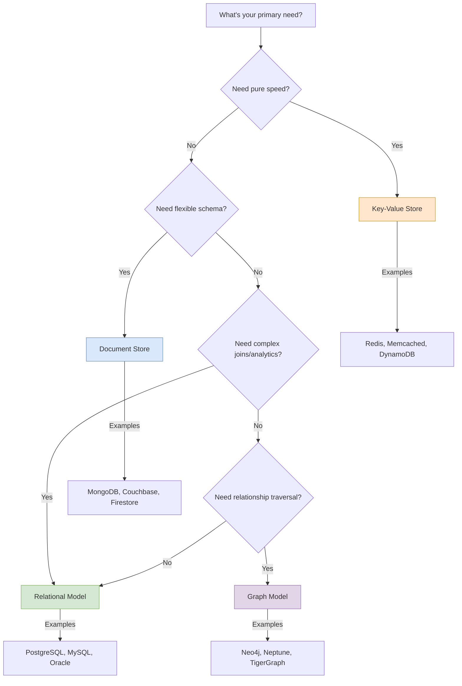
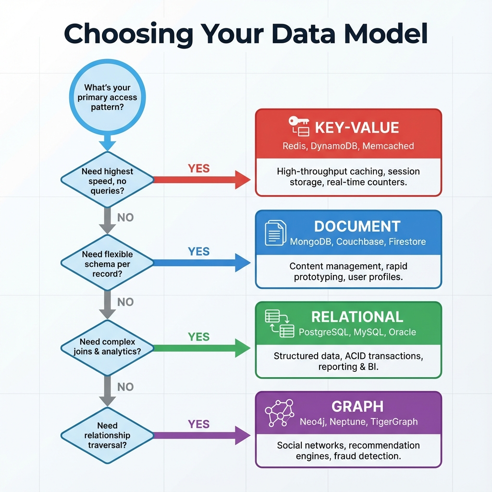

# Polyglot Persistence: Choosing the Right Data Model

> **Source**: [Data Models Explained (Gerald Venzl)](https://youtu.be/lg3RzaZAv0U)

> [!IMPORTANT]
> **Core Insight**: There's no "schemaless" database. You always pay the **Schema Tax**—either at **Write Time** (Relational) or **Read Time** (Key-Value/Document). Your choice determines where complexity lives.

---

## 🏛️ The Four Data Models (99% Coverage)

---

### 1. Key-Value Store
The simplest model: a **unique key** maps to an **arbitrary byte array**.

| Aspect | Detail |
| :--- | :--- |
| **Storage Format** | Raw bytes. DB does not parse or understand the value. |
| **Speed** | **Fastest possible** R/W to disk/memory. No parsing overhead. |
| **Flexibility** | Store anything: JSON, Protobuf, Images, Audio. |

**Operational Implications**:
*   **Application-Side Parsing**: The DB is "dumb". Your app must deserialize and understand the bytes.
*   **No DB-Level Filtering/Aggregation**: `SELECT * WHERE value.field = 'X'` is impossible. All filtering happens in-app after fetching.
*   **Scalability**: Trivially shardable by key hash.

**Best Use Cases**:
*   **High-Speed Caching** (Redis, Memcached).
*   **IoT Telemetry Absorption**: Write millions of sensor readings/sec without parsing.
*   **Session Storage**: Opaque blobs tied to a session ID.

**When to Avoid**:
*   When multiple applications need to read/interpret the same data.
*   When you need ad-hoc queries or aggregations.

---

### 2. Document Store (JSON/XML)
Hierarchical, self-contained structures where data and metadata live together.

| Aspect | Detail |
| :--- | :--- |
| **Schema** | **Schema-on-Read**. No upfront definition required. |
| **Self-Describing** | Document contains field names + values. External schema file not needed. |
| **Atomicity** | The entire document is the unit of update. |

**Operational Implications**:
*   **Storage Overhead**: Field names (metadata) are duplicated in *every* document. A `user_id` field in 1 billion docs = 1 billion copies of the string "user_id".
*   **Schema Drift ("Dumping Ground")**: One team uses `userId`, another uses `user_id`, a third uses `UserID`. Over time, this becomes a data quality nightmare. Cleanup is expensive.
*   **Partial Update Cost**: Updating a single field in a 1MB document requires reading, modifying, and rewriting the entire 1MB. This is inefficient for large, frequently-updated docs.
*   **Join Complexity**: Cross-collection joins are typically app-side or require aggregation pipelines.

**Best Use Cases**:
*   **REST API Payloads**: Data transfer where the schema is implicit.
*   **Product Catalogs**: Items have wildly different attributes (a "laptop" has `ram_gb`, a "shirt" has `size`).
*   **Content Management**: Blog posts, articles—self-contained entities.

**When to Avoid**:
*   High-frequency partial updates to large documents.
*   When you need strong, enforced consistency across documents.
*   When complex multi-document joins are a primary access pattern.

---

### 3. Relational Model
Data organized into pre-defined **tables with rows and columns**, linked by foreign keys.

| Aspect | Detail |
| :--- | :--- |
| **Schema** | **Schema-on-Write**. DB rejects non-conforming data at insertion time. |
| **Normalization** | Data is split across tables to reduce redundancy. Joins reassemble it. |
| **ACID Guarantees** | Strong transactional consistency. |

**Operational Implications**:
*   **Guaranteed Data Integrity**: If the schema says `email` is a string, it *will* be a string. This is invaluable for shared datasets consumed by many teams.
*   **Best for Analytics**: Because data format is guaranteed, SQL "slice and dice" operations (GROUP BY, JOIN, WINDOW functions) are efficient and reliable.
*   **Onboarding Overhead**: Adding a new data source requires DDL migrations. Schema changes in production require planning.
*   **ORM Tax**: To reconstruct a single "User" object, you might join `users`, `addresses`, `preferences` tables. This is developer overhead.

**Best Use Cases**:
*   **Financial Systems**: Where data integrity is paramount.
*   **CRM / ERP**: Many departments share one dataset.
*   **Data Warehouses / OLAP**: Complex analytical queries.
*   **Multi-Team Data Contracts**: When the schema *is* the API.

**When to Avoid**:
*   Simple single-table key-value workloads (use Key-Value instead).
*   Using it purely as a cache layer.

---

### 4. Graph Model
Data modeled as **Nodes (Entities)** and **Edges (Relationships)**.

| Aspect | Detail |
| :--- | :--- |
| **Storage** | Nodes store properties. Edges store relationship type + properties. |
| **Traversal** | O(1) to follow an edge. Finding "friends of friends of friends" is cheap. |

**Operational Implications**:
*   **Relationship Discovery**: Uncovers hidden connections that are computationally expensive to find in tabular data (e.g., "Show me all people within 3 degrees of separation from User X").
*   **Niche Use Case**: If your primary access pattern is *not* "traverse relationships", a Graph DB adds complexity without benefit.

**Best Use Cases**:
*   **Social Networks**: LinkedIn/Facebook "People You May Know".
*   **Recommendation Engines**: "Customers who bought X also bought Y".
*   **Fraud Detection**: Finding suspicious webs of transactions.
*   **Knowledge Graphs**: Entity resolution, semantic search.

**When to Avoid**:
*   Any workload where relationships are secondary.
*   Tabular reporting or analytics.

---

## 🧠 Principal Architect Checklist

1.  **Evaluate Multi-Model First**: Before adding a *new* database (e.g., Neo4j for Graph), check if your existing Postgres/MySQL/Oracle can handle it. Modern RDBMS support JSON columns, Graph extensions (AGE for Postgres), and full-text search. Adding a new DB = new ops burden.
2.  **Schema Tax Location**: Decide upfront where you want schema enforcement. **Write-time (Relational)** means slower ingestion but guaranteed quality. **Read-time (Document/KV)** means fast ingestion but app-side validation and potential data drift.
3.  **Access Pattern Drives Choice**:
    *   Need speed + no queries? → **Key-Value**.
    *   Need flexibility + self-contained entities? → **Document**.
    *   Need integrity + complex joins + analytics? → **Relational**.
    *   Need relationship traversal? → **Graph**.
4.  **Plan for Schema Drift**: If using Document stores, enforce naming conventions and validation at the *app layer* immediately. Cleaning up a "dumping ground" costs 10x more than preventing it.
5.  **Partial Update Cost**: If you're storing large documents (>100KB) and updating them frequently, model your data to split out frequently-updated fields into smaller documents or use a relational approach.

---

## 🧰 Analogy: The Home Workshop

| Model | Analogy | Implication |
| :--- | :--- | :--- |
| **Key-Value** | **Giant Bin** 🗑️ | Throw anything in fast. Dig through it yourself. |
| **Relational** | **Custom Tool Chest** 🧰 | Slow to organize. Fast to find anything for complex jobs. |
| **Document** | **Labeled Shipping Box** 📦 | Everything for one task in one box. 1000 boxes = inconsistent labels. |
| **Graph** | **Family Tree** 🌳 | Useless for receipts. Perfect for seeing connections. |
