# Saga Pattern: Data Consistency in Microservices

> **Source**: [Distributed Sagas](https://youtu.be/YPbGW3Fnmbc)

> [!IMPORTANT]
> **The Problem**: You cannot use 2PC (Two-Phase Commit) in modern microservices. It is a single point of failure (CAP Theorem).
> **The Solution**: Split the transaction into a sequence of **Local Transactions**. If one fails, execute **Compensating Transactions** to undo the previous steps.

---

## 🎭 Two Coordination Patterns

How do services talk? "Dance" or "Conductor"?

### 1. Choreography (The Dance)
Services exchange events directly. No central coordinator.
*   **Flow**: Order Service emits `OrderCreated`. Customer Service listens and emits `CreditReserved`. Order Service listens and emits `OrderApproved`.
*   **Pros**: Low coupling, easy to start.
*   **Cons**: **Cyclic Dependencies**. Hard to understand the workflow ("Who listens to what?").

### 2. Orchestration (The Conductor)
A centralized **Saga Orchestrator** tells participants what to do.

```mermaid
sequenceDiagram
    participant O as Orchestrator
    participant Order as Order Service
    participant Cust as Customer Service
    participant Inv as Inventory Service

    O->>Order: Create Order (Pending)
    Order-->>O: Success
    
    O->>Cust: Reserve Credit
    Cust-->>O: Success
    
    O->>Inv: Reserve Item
    Note right of Inv: ❌ Out of Stock!
    Inv-->>O: Failure
    
    Note over O: START COMPENSATION
    
    O->>Cust: Refund Credit (Undo)
    Cust-->>O: Success
    
    O->>Order: Reject Order (Final State)
    Order-->>O: Success
```

*   **Pros**: Clear State Machine. Separation of Concerns.
*   **Cons**: Single Point of Failure (requires high availability).
*   **Recommendation**: Use **Orchestration** for complex workflows (>4 steps). Use **Choreography** for simple pairs.

---

## 🗑️ The Undo Button: Compensating Transactions

In ACID, `ROLLBACK` is automatic. In Sagas, you must write it yourself.

| Forward Transaction ($T_i$) | Compensating Transaction ($C_i$) | Difficulty |
| :--- | :--- | :--- |
| **createOrder()** | **rejectOrder()** | 🟢 Easy (Update Status) |
| **reserveCredit()** | **refundCredit()** | 🟡 Medium (Math) |
| **emailUser()** | **sendApologyEmail()** | 🔴 Hard (Cannot un-send) |

> [!TIP]
> **Pivot Transaction**: The step where "No Turning Back" happens (e.g., Shipping the Box).
> *   Steps *before* the Pivot must have Compensations.
> *   Steps *after* the Pivot must be reliably retriable (cannot fail).

---

## 📨 The Infrastructure: Transactional Outbox Pattern

You cannot "Publish Event" and "Commit DB" atomically.
*   *Scenario*: DB Commit succeeds, but Message Broker is down. result: **Inconsistency**.

**Solution**: Use the **Outbox Pattern**.

1.  **Insert**: App inserts `Order` and `OutboxEvent` in the **same local transaction**.
2.  **Commit**: Both verify or both fail (Atomic).
3.  **Relay**: A separate process (Debezium) reads the Outbox and publishes to Kafka.

---

## ⚡ Isolation (The Missing "I" in ACID)

Sagas lack Isolation. Intermediate states are visible.
*   **Dirty Reads**: User sees "Order Pending" but it might be cancelled later.
*   **Lost Updates**: Two sagas modify the same data concurrently.

**Countermeasures**:
1.  **Semantic Locking**: Use a `_PENDING` flag (e.g., `RESERVATION_PENDING`).
2.  **Commutative Updates**: Designed operations so order doesn't matter (`add(5)`, `add(-5)`).
3.  **Version Files**: Store operations in order and re-execute if conflict occurs.

---

## ✅ Principal Architect Checklist

1.  **Prefer Orchestration**: For any workflow involving > 3 services, centralized logic is easier to debug than distributed events.
2.  **Design Compensations First**: Don't build the "Happy Path" without the "Undo Path".
3.  **Use the Outbox Pattern**: Never dual-write to DB and Kafka. You will lose data.
4.  **Handle Idempotency**: The Orchestrator *will* retry requests. Your `refundCredit()` API must handle being called twice.
5.  **Expose Pending States**: The UI must know that an Order is `PENDING`. Don't block the user interface waiting for a Saga.

---

## 🔗 Related Documents
*   [Event Sourcing Patterns](../../eventing/event-sourcing.md) — The ultimate audit log for Sagas.
*   [Strangler Fig](../../architechture/strangler-fig/strangler-fig-pattern.md) — Sagas help glue Legacy and Modern systems.
