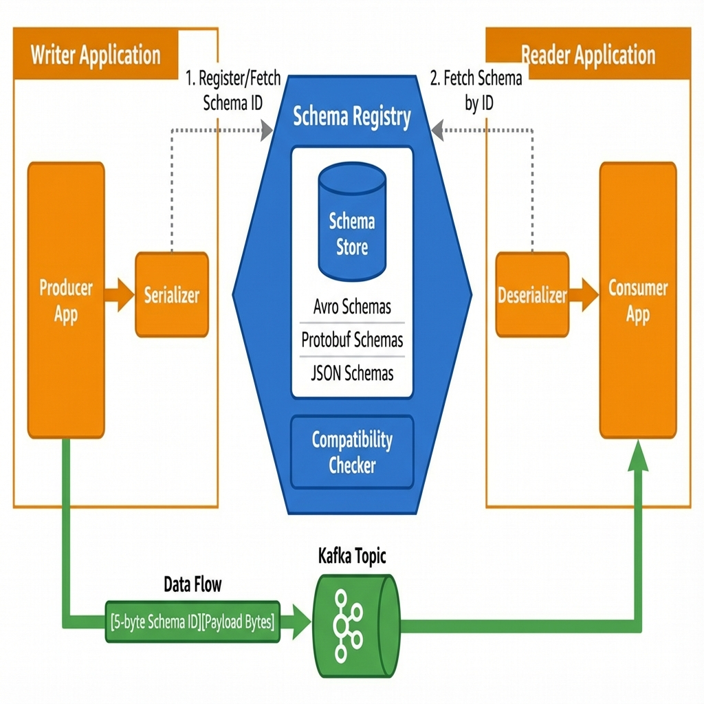
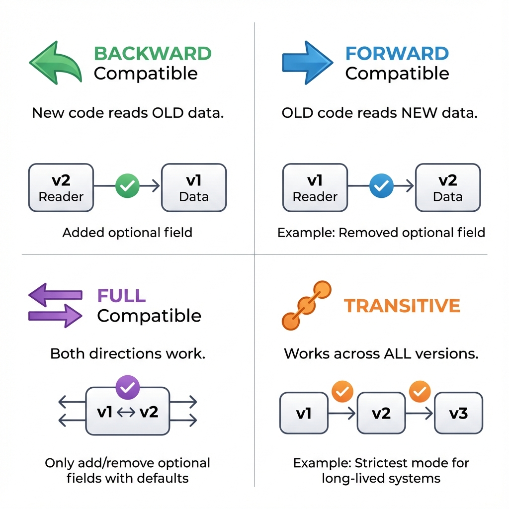
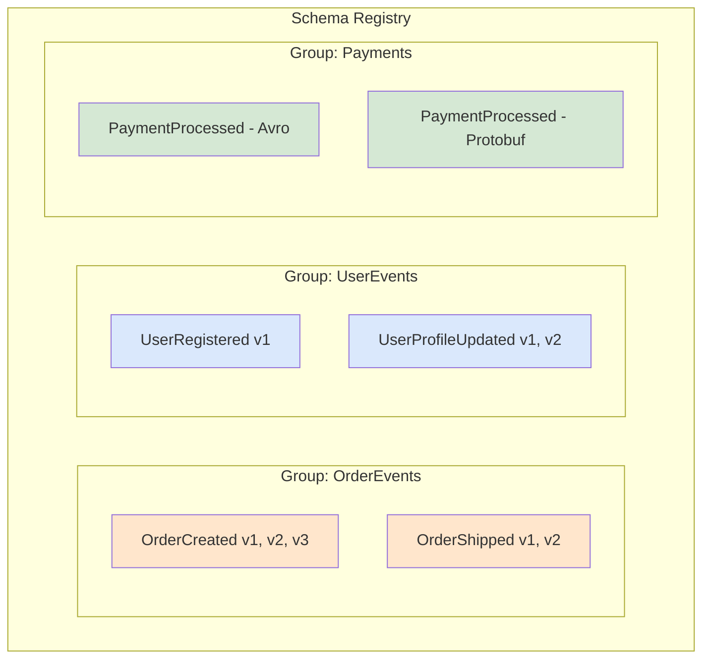

# Schema Registry: The Central Translation Library

> **Source**: [Schema Registry Deep Dive (Pravega)](https://youtu.be/Gqd1fKUQ6_E?list=TLGGpl5VDKRSoIQwODAxMjAyNg)

> [!IMPORTANT]
> **The Core Problem**: Applications understand *their own* data structure, but **consumers don't**. BI tools, analytics pipelines, and other services need to decode raw bytes. The Schema Registry provides a **centralized source of truth** for data structure.

---

## 📊 Architecture Overview



---

## 🏛️ The Fundamental Need

### The Problem Without a Registry
```
Producer App                                Consumer App
    │                                           │
    ▼                                           ▼
[Raw Bytes: 0x4A6F686E...]  ───────────►   [??? How to decode?]
                                               ERROR!
```

### The Solution: Centralized Metadata
*   **Schema Storage**: The Registry stores the **structure** (schema) of the data—not the data itself.
*   **Decoupling**: Producers and Consumers don't need to share code. They share a **Schema ID**.
*   **Runtime Lookup**: Consumers fetch the schema at runtime to decode the bytes.

---

## 🔄 Schema Evolution & Compatibility

As business requirements change, data structures evolve. The Registry manages this through **Compatibility Policies**.



### Compatibility Modes Explained

| Mode | Rule | When to Use |
| :--- | :--- | :--- |
| **BACKWARD** | New code can read OLD data | **Default for most systems.** Safe for rolling deployments. |
| **FORWARD** | Old code can read NEW data | When consumers are updated *after* producers. |
| **FULL** | Both directions work | Strictest. Only add/remove optional fields with defaults. |
| **TRANSITIVE** | Compatibility across ALL versions | Long-lived systems where you can't control all consumers. |

### What Changes Are "Safe"?

| Change | Backward | Forward | Full |
| :--- | :--- | :--- | :--- |
| **Add optional field** | ✅ Safe | ❌ Breaks old readers | ✅ If has default |
| **Remove optional field** | ❌ Breaks new readers | ✅ Safe | ✅ If has default |
| **Rename field** | ❌ Breaking | ❌ Breaking | ❌ Breaking |
| **Change field type** | ❌ Breaking | ❌ Breaking | ❌ Breaking |

> [!WARNING]
> **The Gatekeeper**: The Registry *validates* new schemas against the chosen policy. If a schema breaks compatibility, **registration is rejected**. This prevents accidental breaking changes from reaching production.

---

## 🗂️ Logical Organization: Schema Groups

The Pravega Schema Registry introduces **Schema Groups** for organization.



### Key Properties
*   **Logical Collections**: Group related schemas (e.g., all Order events).
*   **Multi-Format**: Store the *same* logical schema in different formats (Avro, Protobuf, JSON).
*   **Unique Naming**: Each group has a unique name within the registry.

---

## ⚡ Performance: Initialization, Not Per-Message

A critical design choice: the application contacts the Registry **once during initialization**, not for every message.

### The Flow
1.  **Producer Init**: Serializer fetches/registers schema. Gets `SchemaID = 42`.
2.  **Produce Message**: Serializer prepends `[5 bytes: SchemaID 42][Payload Bytes]`.
3.  **Consumer Init**: Deserializer fetches schema for ID `42`. Caches locally.
4.  **Consume Message**: Deserializer uses cached schema. **No network call.**

### Overhead
| Approach | Per-Message Overhead |
| :--- | :--- |
| Full Schema in Message | **Kilobytes** (schema text) |
| Schema ID in Message | **5 bytes** (int32 + magic byte) |

---

## 🛠️ Advanced Features

### 1. Pluggable Policies
Standard forward/backward compatibility doesn't fit every domain. The registry allows **custom compatibility checkers**.

*   **Example**: "Field `SSN` can NEVER be removed" (HIPAA compliance).

### 2. Opaque Storage
The registry can store schema formats it doesn't natively understand (e.g., custom DSLs) as raw bytes. It still tracks versions and IDs.

### 3. Decoupling from Storage Layer
The Schema Registry is **architecturally independent**. While it *can* use Pravega or Kafka as a backend, it's a standalone service usable with any messaging system.

---

## 📊 Operational Metrics

| Metric | Target | Why |
| :--- | :--- | :--- |
| **Schema Fetch Latency** | < 10ms (P99) | Impacts producer/consumer startup time. |
| **Registry Availability** | 99.99% | If down, new producers/consumers can't start. |
| **Schema Version Count** | < 100 per subject | Too many versions = poor schema hygiene. |
| **Breaking Change Rate** | 0 | Any breaking change should fail validation. |

---

## ✅ Principal Architect Checklist

1.  **Enable Compatibility Checks**: Never set mode to `NONE` in production. Default to `BACKWARD` or `FULL_TRANSITIVE`.
2.  **Use Avro or Protobuf**: JSON has no native schema evolution. Avro/Protobuf have first-class support for optional fields and defaults.
3.  **Cache Schemas Aggressively**: Clients should cache schemas locally. Network calls to the registry should only happen on startup or cache miss.
4.  **Deploy HA Mode**: Run 3+ registry replicas behind a load balancer. A single instance is a SPOF.
5.  **Monitor Schema Growth**: If a subject has 100+ versions, something is wrong (likely poor field naming or design).
6.  **Integrate with CI/CD**: Fail builds if a schema change breaks compatibility. Catch issues before deployment.

---

## 📦 Analogy: The Central Translation Library

> [!TIP]
> **Understanding Schema Registry**:
>
> Imagine an **International Shipping Company**:
>
> *   Each **Crate** contains products (data).
> *   Attaching a **50-page Instruction Manual** (full schema) to every crate is expensive and heavy.
> *   **The Solution**: The shipper writes a **small Reference Number** (Schema ID) on the crate.
> *   When the crate arrives, workers **call the Central Library** (Schema Registry) with the number and get the correct manual.
>
> **Evolution**: When the crate format changes (new padding, different straps), the library updates the manual. Old workers can still read old crates (Backward Compatible), and new workers can handle new crates.
