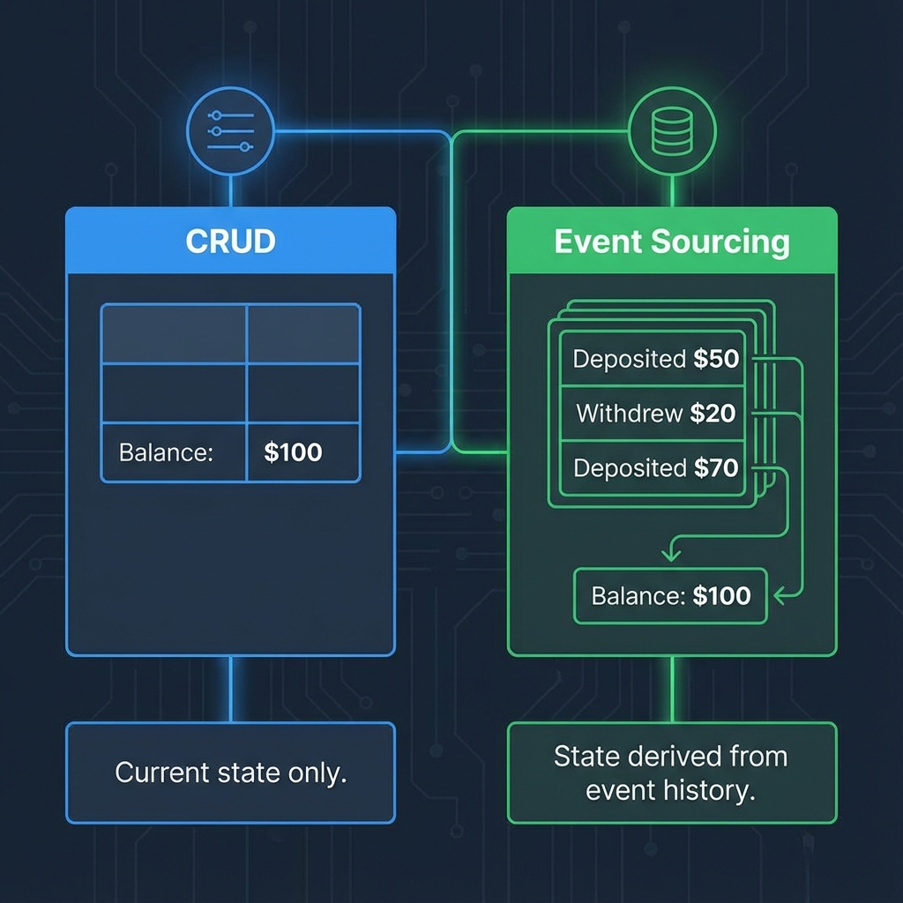
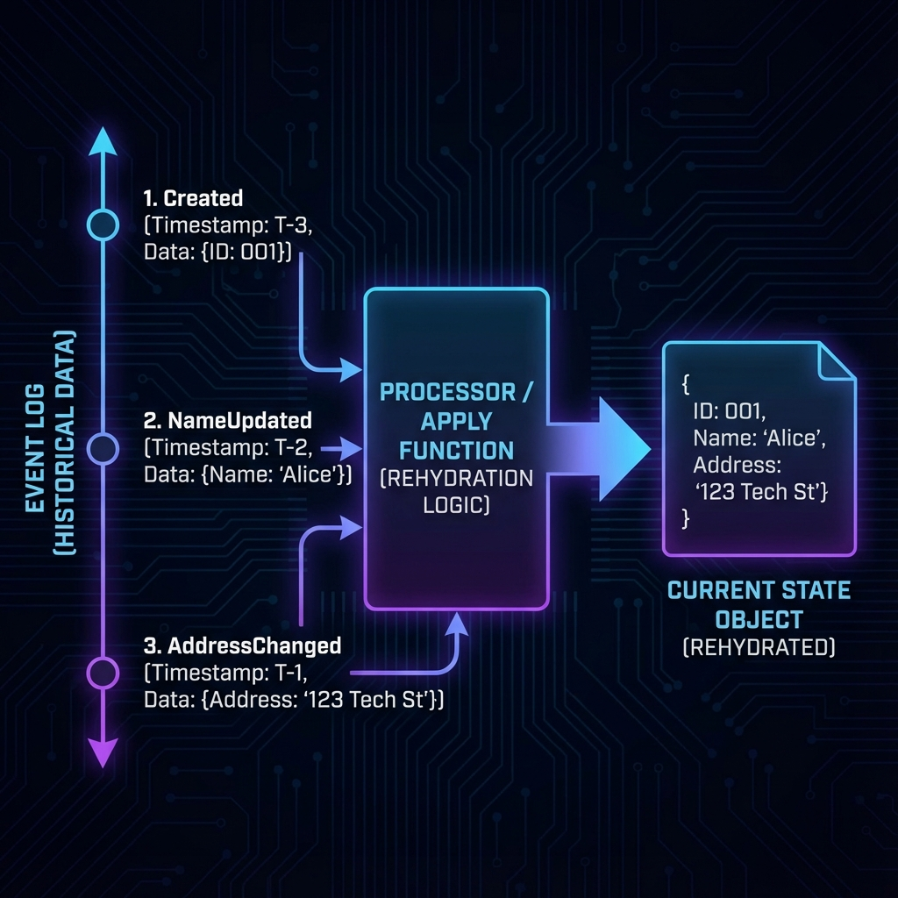
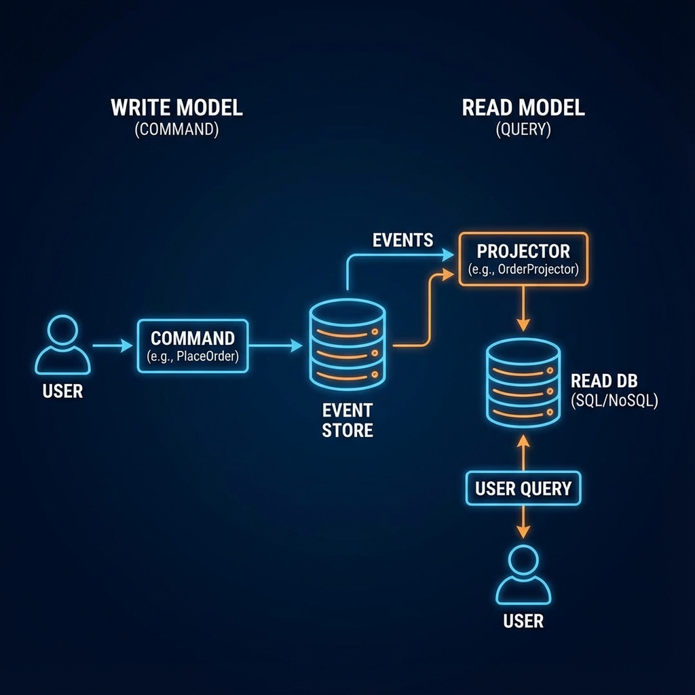
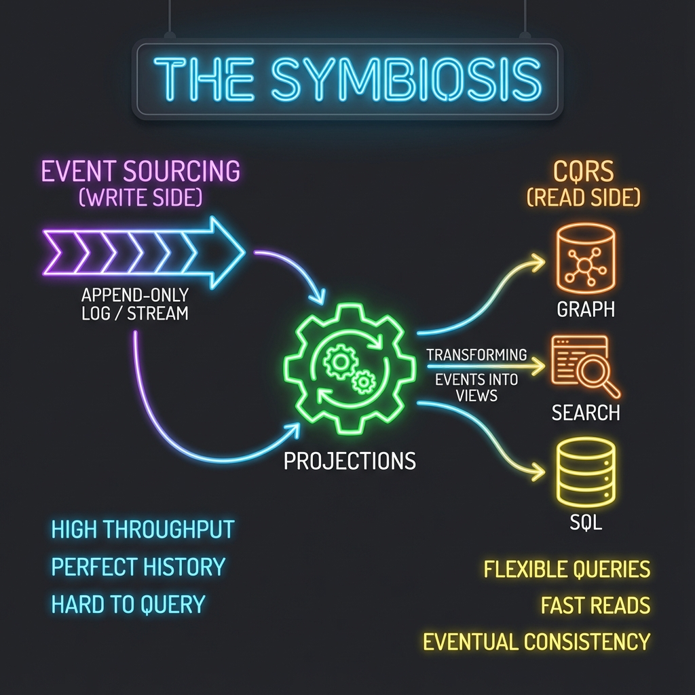
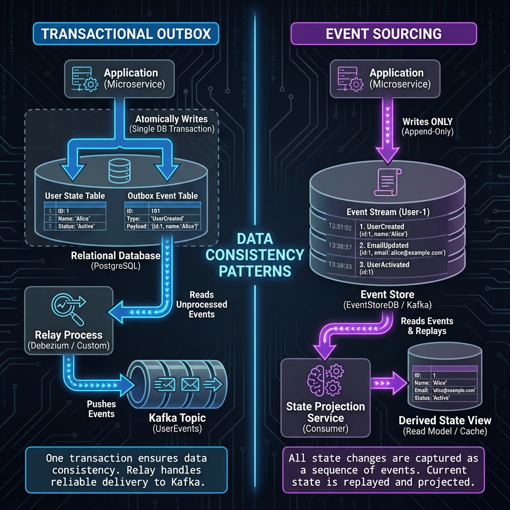
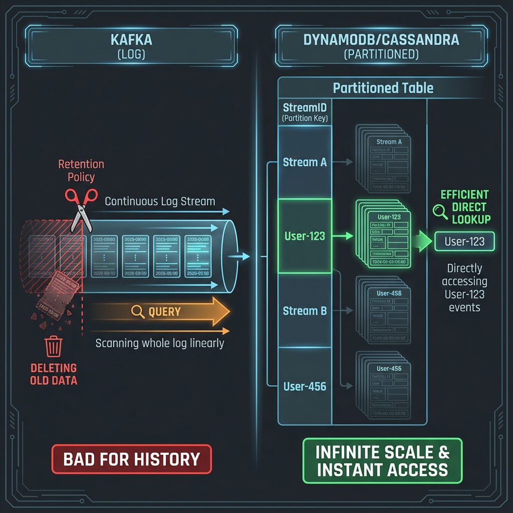

# Event Sourcing: Architecting for Tomorrow's Questions

> 📺 **Source**: [Event Sourcing: You are doing it wrong - Michał Ostruszka](https://www.youtube.com/watch?v=3lZkRxgmKt8)

---

## Overview

Event Sourcing is a fundamental paradigm shift from storing current state to storing **behavior**. Instead of overwriting data (CRUD), we append every state change to an append-only journal. This document details why this shift is powerful, how it works mechanically, and how to scale it to Google-level throughput.

---

## The Core Problem: The Pitfalls of CRUD

### The "Joe" Story
Imagine a developer, Joe, at a fintech startup. He builds a portfolio rebalancing feature using standard logic:
```javascript
if (user.balance > threshold) {
  portfolio.rebalance(); // Updates DB row
}
```
Months later, product managers ask: *"How many times did we SKIP rebalancing because the user was just $1 under the threshold?"*

> [!WARNING]
> Because Joe only stored the **current state**, he has no record of these "near-misses." The data is gone forever. **CRUD systems inherently destroy history.**

### The Event Sourcing Paradigm
Instead of destructive updates, we treat the system as a **sequence of immutable facts**.



| Feature | CRUD (State-Based) | Event Sourcing |
|---------|--------------------|----------------|
| **Primary Store** | Current State (Table) | Event Journal (Log) |
| **History** | Lost on update | Preserved forever |
| **Querying** | Only "Now" | "Now" or "Any point in time" |
| **Recovery** | Backup/Restore | Replay Events |

---

## Technical Mechanics

### 1. The Journal (Source of Truth)
The only thing that is truly persisted is the **Event Journal**. It is an ordered, append-only set of facts.

- **Command**: `UpdateAddress { id: 123, newCity: "NYC" }` (Intent, can fail)
- **Event**: `AddressUpdated { id: 123, newCity: "NYC" }` (Fact, cannot fail)

### 2. State Rehydration
State is **transient**. It is rebuilt on-the-fly by fetching past events and applying them to an empty object.



```typescript
class UserProfile {
  private state = { balance: 0 };

  // Rebuild state from history
  loadFromHistory(events: Event[]) {
    for (const event of events) {
      this.apply(event);
    }
  }

  // Apply logic (NO SIDE EFFECTS)
  private apply(event: Event) {
    if (event.type === 'Deposited') {
      this.state.balance += event.amount;
    }
    if (event.type === 'Withdrew') {
      this.state.balance -= event.amount;
    }
  }
}
```

### 3. CQRS (Command Query Responsibility Segregation)
Event Sourcing naturally leads to CQRS. Since the Write Model (Journal) is hard to query ("Give me all users who live in NYC"), we create separate **Read Models**.



- **Write Side**: Optimized for high throughput appending (latency < 10ms).
- **Read Side**: Projections (SQL/NoSQL/Elasticsearch) optimized for specific queries.

> [!NOTE]
> **Wait, where is the "Write DB"?**
> In Event Sourcing, the **Event Store IS the Write DB**. We do not update a `Users` table on the write side. The "Command" is validated against the event history (rehydrated state), and if valid, the new event is persisted to the store. That is the only write that happens.

### 🛠️ Technology Choices: What can be the "Event Store"?

You need a database that excels at **ordered, append-only writes** and **reading by stream ID**.

| Technology | Fit for Event Store? | Pros | Cons |
| :--- | :--- | :--- | :--- |
| **EventStoreDB** | ⭐️ **Best** | Built specifically for this. Native projections, streams, and subscriptions. | Niche technology to learn/host. |
| **PostgreSQL / MySQL** | ✅ **Great** | "Append-only table" pattern works well. Strong transactional guarantees. Familiar. | Requires manual polling/CDC for projections. Harder to scale past 10TB. |
| **Apache Kafka** | ⚠️ **Risky** | Fast. Good for *transit*, but bad for *storage*. | **Retention policies delete data!** Hard to query "all events for User 123" instantly. |
| **DynamoDB / Cassandra** | 🆗 **Good** | Infinite scale. | Hard to enforce strict ordering/transactional consistency within a stream. |

### 🔄 The Read/Write Split Implications

| Side | Technology Pattern | What happens? |
| :--- | :--- | :--- |
| **Write Model** | **Append-Only Log** | **Fast Writes.** No complex joins, no updates, no locking rows. Just `INSERT INTO events ...`. |
| **Read Model** | **Denormalized Views** | **Fast Reads.** Projections listen to the event stream and update optimized tables (e.g., `UserBalance` in Redis, `TransactionHistory` in Elastic). |

> [!TIP]
> **Polyglot Persistence**: You can have ONE Write Model (Postgres Event Table) feeding MANY Read Models (Redis for cache, Elastic for search, BigQuery for analytics) simultaneously.

---

## 🚀 Google-Scale Engineering Deep Dive

### ⚡ Performance: The "Long Stream" Problem

User Slide: *"Long streams, replay takes ages, IO costs skyrocket."*

**Problem**: After 5 years, `User:123` has 100,000 events. Loading them to validate a single command = 5 seconds + massive IO.

#### Symptom: Request Timeouts
-   User sends command.
-   System tries to rehydrate 100k events.
-   Request times out before state is ready.
-   **Result**: Broken UX.

#### Solution 1: Snapshots (The Standard)
Periodically persist the **hydrated state** as a checkpoint.

```
Without Snapshots:
[Event 1] -> [Event 2] -> ... -> [Event 100,000] -> Current State (SLOW!)

With Snapshots:
[Snapshot @ Event 99,000] -> [Event 99,001] -> ... -> [Event 100,000] -> Current State (FAST!)
```

**How Often to Snapshot?**
| Strategy | Trigger | Trade-off |
| :--- | :--- | :--- |
| **Every N Events** | Every 1000 events | Predictable, simple. |
| **Every N Minutes** | Every 10 minutes | Good for time-sensitive domains. |
| **On Demand** | When stream length > 5000 | Adaptive, but adds complexity. |

#### Solution 2: Stream Splitting / Archiving
If an entity is truly ancient (e.g., a 10-year-old account), split the stream.
-   `User:123:2020-2022` (Archived, Cold Storage)
-   `User:123:2023-Present` (Active, Hot Storage)
-   On load: Only read the active stream. If you need ancient history, fetch from archive.


### Concurrency Control
Scaling to millions of users requires handling concurrent writes.

**Optimistic Locking**:
1. Read stream version `v10`
2. Generate events
3. Append events containing `expectedVersion: v10`
4. If storage sees current version is `v11`, reject write (Client retry)

**Single Writer Principle (Akka/Cluster)**:
Sharding ensures only **one node** handles commands for `User:123` at a time. This eliminates DB locking entirely, allowing in-memory processing at extreme speeds.

### 🔥 Scaling Load: The "Hot Aggregate" Problem

User Slide: *"High-traffic aggregates replaying on multiple nodes. Optimistic locking checks keep failing. Database becomes bottleneck."*

**Scenario**: You're selling Taylor Swift concert tickets. 100,000 users hit "Buy" on the same `ConcertAggregate:TS2025` at the exact same second.

**The Problem**:
-   Each request reads version `v500`.
-   Each request tries to append `TicketReserved` with `expectedVersion: v500`.
-   Only 1 succeeds. 99,999 fail with "Version Conflict" and retry.
-   **Result**: Massive retry storm, DB becomes bottleneck, requests time out.

#### Solution 1: Aggregate Sharding (Split the Hot Spot)
Don't have ONE aggregate for all tickets. Shard it.
-   `ConcertAggregate:TS2025:Sector-A` (5000 tickets)
-   `ConcertAggregate:TS2025:Sector-B` (5000 tickets)
-   User requests are load-balanced across shards. Contention is 1/N.

#### Solution 2: Command Batching / Buffering
Accept commands asynchronously into a queue.
1.  User's "Buy" command goes to Kafka.
2.  A single consumer processes commands **sequentially** for `ConcertAggregate:TS2025`.
3.  No concurrent writes = No version conflicts.
4.  **Trade-off**: Slight latency (async), but guaranteed throughput.

#### Solution 3: Reservation Tokens (Eventual Consistency)
1.  User clicks "Buy" -> UI shows "Reserving..." (Optimistic).
2.  Backend puts a "soft hold" on a ticket (quick, non-blocking).
3.  A background job **later** confirms the hold by appending the real event.
4.  If confirmation fails (sold out), notify user.

> [!WARNING]
> **Stateless services + Optimistic Locking = Retry Storm** under high load. Use Single Writer (Akka Persistence) or Sharding to avoid this at Google scale.

### 🌊 Clarification: Event Sourcing vs. Event Streaming

User Question: *"What does Event Streaming mean in this case?"*

It is easy to confuse **Storage** (Sourcing) with **Transport** (Streaming).

| Concept | What is it? | Role | Tool Example |
| :--- | :--- | :--- | :--- |
| **Event Sourcing** | **Persistence Strategy** | "I store the database as a log." | Postgres Table, EventStoreDB |
| **Event Streaming** | **Transport Strategy** | "I move events from A to B." | Kafka, Kinesis, RabbitMQ |

> [!NOTE]
> In a Google-scale system, you **Source** into a DB (for truth) and then **Stream** those events via Kafka to other services (for reaction). They are complementary, not the same.

---

### 🧬 Advanced Versioning: The "Add Field" Dilemma

User Question: *"Should I make a new field optional? Or create a new event? Or rewrite the stream?"*

Here is the **Google-Scale Decision Matrix** for JIRA-895:

| Scenario | Strategy | Complexity | Recommendation |
| :--- | :--- | :--- | :--- |
| **Adding Data** e.g., Adding `AI_Reason` to `Adjustment` | **Optional Field** | 🟢 Low | **Do this 90% of the time.** Add `reason?: string`. Old events lack it (it is null), new events have it. Domain handles `null` gracefully. |
| **Changing Logic** e.g., `Adjustment` is now `ComplianceCheck` | **New Event Type** | 🟡 Medium | Create `ComplianceCheckPassed_v1`. Keep the old event handler for history, but use the new event for new actions. **Don't touch old events.** |
| **Breaking Meaning** e.g. `Amount` was cents, now dollars | **Upcasting** | 🟠 High | Keep the event name but write a transformer: `if (v1) return v1.amount * 100`. Shield the domain. |
| **Nuclear Error** e.g., PII Leak / Corrupt Data | **Rewrite Stream** | 🔴 Extreme | Read all history -> Filter/Fix -> Write to NEW StreamID -> Delete Old Stream. (Avoid at all costs). |

#### Why "Optional" is King
You asked: *"We can't touch past events, so should we make it optional?"*
**YES.**
If you make a field **Required** in your code, your code will crash when reading an old event (which doesn't have it).
**Rule**: All new fields added to existing events MUST be optional (nullable) in the code.

> [!TIP]
> **Weak Schema -> Strong Domain**
> Parse the JSON permissively (Weak Schema).
> Then, in your **Upcaster/Factory**, convert `null` to a sensible default (e.g., `reason: "Legacy Adjustment"`) so your Domain Object (Strong Domain) is always fully valid.


### 🛑 The Hardest Problem: Global Uniqueness (JIRA-999)

User Slide: *"[JIRA-999] Bank account number must be unique across all users."*

In CRUD, this is trivial: `ALTER TABLE ADD CONSTRAINT UNIQUE (account_number)`.
In Event Sourcing, this is **extremely hard**.
Why? Because `User:A` (Node 1) and `User:B` (Node 2) don't know about each other. They are sharded sequences. You cannot "lock" the entire system to check uniqueness.

#### Solution 1: The "Reservation" Pattern (Recommended)
You treat the Unique Constraint as its own Aggregate.
1.  **New Aggregate**: `BankAccountRegistry`.
2.  **Command**: User sends `ClaimAccountNumber { account: "123" }`.
3.  **Process**:
    -   Try to append `AccountClaimed { account: "123" }` to stream `Registry:123`.
    -   If stream version > 0, **Fail** (Already taken).
    -   If success, **Then** append `AccountAssigned` to `User:A` stream.
4.  **Trade-off**: Requires a tiny coordination step before the main write.

#### Solution 2: The "Consistency Sidecar" (Cheating)
You maintain a small, strongly consistent SQL table JUST for uniqueness indices.
-   **Write**:
    1.  Transaction: `INSERT INTO UniqueAccounts (acc) VALUES ('123')`.
    2.  If SQL Success -> Append Event to Journal.
    3.  If SQL UniqueViolation -> Reject Command.
-   **Pros**: Simple, familiar.
-   **Cons**: Introduces a dependency on a synchronous DB (reduces availability).

> [!WARNING]
> **Set Validation**
> "Uniqueness" is a type of **Set Validation** (validating a command against a set of all other aggregates). Pure Event Sourcing struggles with this. Use Solution 1 (Reservation) to keep it pure.

### Anti-Patterns to Avoid

| Anti-Pattern | Why it's bad |
|--------------|--------------|
| **Entity State in Event** | e.g., `OrderPlaced { ...full order state... }`. Events should contain *deltas* (changes), not full state. |
| **External Calls in Replay** | Replaying events must be deterministic. NEVER call payment gateways or send emails during rehydration. |
| **Global Sequence** | Relying on a global ordering of ALL events in the system. Use stream-local ordering for scalability. |

### Clarifications: Pattern Relationships

#### 🔗 Deep Dive: Event Sourcing & CQRS Symbiosis

You asked: *"Why is Event Sourcing often said in tandem with CQRS?"*

The answer is simple: **Event Sourcing breaks reads.** CQRS fixes them.



1.  **The Write Problem (Left Side)**:
    -   Event Sourcing stores data in a format optimized for **Writes** (Append-only Log).
    -   This format is **terrible for Reads**. You cannot ask a Log: *"Give me all users who live in NYC ordered by age."* To answer that, you'd have to replay the entire history of the world.

2.  **The Read Solution (Right Side)**:
    -   Because the Log is hard to query, you are **forced** to build a separate Read Model (CQRS).
    -   You create a "Projection" that listens to the Log and updates a normal SQL/NoSQL table: `UPDATE UserView SET City = 'NYC' WHERE ID = 123`.

**Verdict**: They are "Tandem" because ES creates a problem (Hard Reads) that only CQRS can solve (Dedicated Read Views).

#### 🏗️ Google-Scale CQRS Patterns

At massive scale, "just updating a table" isn't enough. You need specific patterns to manage the **Projections**:

1.  **Idempotency (The Standard)**
    -   **Problem**: What if the Projection crashes mid-processing and replays an event?
    -   **Solution**: Your projection logic must be idempotent.
    -   `NewBalance = OldBalance + 50` ❌ (Dangerous on replay)
    -   `NewBalance = 150` ✅ (Safe, derived from event data)

2.  **The "Replay" Capability (Zero-Downtime Migration)**
    -   **Scenario**: You want to show a new UI field "Total Lifetime Spend".
    -   **Old Way**: Impossible, data wasn't tracked.
    -   **ES/CQRS Way**:
        1.  Deploy a **new** Projection (v2) alongside the old one.
        2.  Replay **ALL** history from Day 1 to the new Projection.
        3.  Once v2 catches up to "Now", switch the API to read from v2.
        4.  Delete v1.
    -   *Result*: You retroactively added a feature without downtime.

3.  **Eventual Consistency (The Lag)**
    -   **Reality**: It takes 10ms-500ms for an event to propagate from Write → Read.
    -   **The "Read-Your-Own-Writes" Trick**: When a user clicks "Save", the UI should either:
        -   Fake the update locally (Optimistic UI).
        -   Wait for the specific Event ID to appear in the Read Model before reloading.

---

### ⚔️ Event Sourcing vs. Transactional Outbox (Visualized)

Many developers confuse these because both involve "saving state and sending events."



#### Transactional Outbox (Left Side)
1.  **Goal**: "I want to update my `Users` table and safely publish an event."
2.  **Mechanic**: ACID Transaction [`INSERT User` + `INSERT Outbox`].
3.  **Source of Truth**: The `Users` table (Current State).
4.  **History**: **LOST**. If you update "New York" to "San Francisco", the record of New York is gone from the primary store.
5.  **Use Case**: General microservices where current state is efficient.

#### Event Sourcing (Right Side)
1.  **Goal**: "I want to record that the user moved."
2.  **Mechanic**: Append `AddressUpdated` event.
3.  **Source of Truth**: The `Events` log.
4.  **History**: **PRESERVED**. You have "New York" event at T1 and "San Francisco" event at T2.
5.  **Use Case**: Audit-heavy, finance, complex logic where *how* we got here matters.

---

### ❓ FAQ: Busting Common Myths

#### Q1: "Is Event Sourcing bad for Read-Heavy systems?"
**Answer: NO! It is actually BETTER.**
-   **Misconception**: People think "I have to replay events to read." (That would be slow).
-   **Reality**: You NEVER replay events for a user query.
-   **How it works**: You read from the **Read Model** (e.g., Redis, Elastic).
    -   Writes are O(1) append.
    -   Reads are O(1) lookup from a pre-calculated View.
-   *Result*: You can scale reads infinitely (just add more Redis replicas) without touching the Event Store.

#### Q2: "Why do I see diagrams with a 'Write DB' (SQL) AND a 'Read DB'?"
**Answer: That is 'State-Based CQRS', NOT Event Sourcing.**
There are two flavors of CQRS:

| flavor | Architecture | Role of "Write DB" |
| :--- | :--- | :--- |
| **State-Based CQRS** | `UserTable (SQL)` -> `Kafka` -> `Redis` | **Primary Source of Truth**. Logic updates state in place. |
| **Event Sourcing** | `EventStore (Log)` -> `Projections` -> `Redis` | **Does Not Exist**. The Event Store *is* the DB. |

> [!WARNING]
> If you have a `Users` table (Write DB) AND an `Event Store`, you are doing **Transactional Outbox**, not pure Event Sourcing.

---

### ⚠️ Why Kafka Fails as an Event Store (Infinite Scale Edition)

"Since Event Sourcing is just a log, and Kafka is a log, why not use Kafka?"



#### The Problem with Kafka (Left Side)
1.  **Linear Scan**: To rehydrate `User:123`, you'd have to scan the entire topic partition (mixed with millions of other users). It's O(N).
2.  **Retention Policy**: Kafka is designed to **delete old data** (e.g., after 7 days or 1TB). Event Sourcing requires **infinite retention**.
3.  **Compaction**: Key-Compaction keeps only the *latest* value for a key, destroying the history you specifically wanted to keep!

#### Why DBs (DynamoDB/Cassandra) Win (Right Side)
1.  **Indexed Lookup (Partition Key)**: 
    -   In DynamoDB/Cassandra, we choose `StreamID` as the **Partition Key**.
    -   This makes `SELECT * FROM Events WHERE StreamID = 'User:123'` a specific **Key-Value lookup** (Query), not a scan.
    -   This is **O(1)**. You go directly to the server holding that user's partition and read strictly their events.
2.  **Ordered History (Sort Key)**: 
    -   We use the `Version` or `Timestamp` as the **Sort Key** (Clustering Key).
    -   This ensures events are physically stored in order: `[v1, v2, v3...]`.
3.  **Infinite Retention**: They are true databases. They don't auto-delete data unless you tell them to.
4.  **Partitioning**: They automatically shard data by `StreamID`. `User:A` goes to Node 1, `User:B` goes to Node 2. This allows **infinite horizontal scale**.

---

---

### �️‍♂️ Forensic Debugging: The Dispute Resolution Pattern

You asked: *"In CRUD we use WHERE clause, but in ES how do we debug disputes (based on what)?"*

**Scenario**: A user claims: *"I deposited $50 yesterday, but my balance is $20. Where is my money?"*

#### The CRUD Nightmare (Dead End)
1.  Dev: `SELECT balance FROM Users WHERE id = 123` -> Result: `$20`.
2.  Dev: "I only see $20."
3.  User: "But I sent $50!"
4.  Dev: "I have no proof. Maybe you hallucinated?" (Customer churns).

#### The Event Sourcing Solution (Forensic Replay)
1.  **Locate Stream**: `SELECT * FROM Events WHERE StreamID = 'User:123' ORDER BY Version`.
2.  **Replay History**: You replay the events locally or in a test environment.
    -   `v10: Balance $20` (Yesterday Morning)
    -   `v11: Deposited $50` (Yesterday Noon) -> **State is now $70**.
    -   `v12: SubscriptionFeeCharged $50` (Yesterday Night) -> **State is now $20**.
3.  **The "Aha!" Moment**: You see *exactly* what happened. "Ah, sir, looking at your history, the deposit arrived, but an automatic subscription renewal for 'Premium' triggered 2 hours later."
4.  **Evidence**: You can show the user the exact timestamped log of actions.

> [!TIP]
> **Debugging "Based On What"?**
> You debug based on the **StreamID**. Since all actions for one entity are in one stream, you don't need complex `WHERE` clauses. You just "watch the movie" of that user's life.

---

The speaker's slide asks a brutal question: *"Are you Netflix?"*
Event Sourcing adds **massive inherent complexity** (Replays, Versioning, Eventual Consistency). You should only pay this price if the business value is equally massive.

| Category | 🟢 **GREEN LIGHT (Use ES)** | 🔴 **RED LIGHT (Stick to CRUD)** |
| :--- | :--- | :--- |
| **Domain Type** | **Finance, Logistics, Legal.** Domains where "History" is the core product (e.g., Bank Ledger). | **CMS, Blogs, Identity.** Content where only the latest version matters. |
| **Why?** | You need to answer: *"Why is the balance $50?"* or *"Who changed this setting and when?"* | You just need: *"Show me the profile."* |
| **Team Skill** | Experienced with Async/Distributed systems. Comfortable with "Eventual Consistency". | Small team, focused on MVP speed. Needs simple ACID guarantees. |
| **Scale** | **High Concurrency**. Need to process thousands of complex writes without locking. | **Low/Medium**. Standard SQL transaction locks are sufficient. |

> [!CAUTION]
> **Not a Global Architecture**: Do not use Event Sourcing for your whole system. Use it *only* for the core Bounded Contexts that need it (e.g., "Orders"), and stick to CRUD for boring stuff (e.g., "User Preferences").

---

## Key Benefits

1.  **Time Travel**: "Show me the user's dashboard as it looked 3 months ago."
2.  **Audit Trail**: Free, perfect auditing for compliance/security.
3.  **Root Cause Analysis**: Copy production event stream -> Replay locally -> Reproduce bug instantly.
4.  **"What If" Analysis**: Replay history with new logic to calculate retrospective metrics (like Joe's missing rebalance data).

---

## 🔐 Advanced Topics (Production-Ready)

### 1. GDPR & Right to Erasure: "Crypto Shredding"

**The Problem**: GDPR says "Delete my data." But Event Sourcing says "Events are immutable."

**The Solution: Crypto Shredding**
1.  **Encrypt PII**: When storing events, encrypt sensitive fields (Name, Email) with a **per-user key**.
    -   Event: `{ userId: 123, email: "ENCRYPTED_BLOB" }`
2.  **Store Key Separately**: The encryption key for `User:123` is stored in a Key Management Service (KMS).
3.  **On Deletion Request**: **Delete the key.** The event body remains, but the encrypted PII is now unreadable garbage.
4.  **Benefit**: You preserved history (for audits) but made PII unrecoverable.

---

### 2. Testing Strategies for Event-Sourced Systems

| Test Type | What to Test | How |
| :--- | :--- | :--- |
| **Unit Test (Aggregate)** | Given events, When command, Then new events. | `aggregate.loadFromHistory([e1, e2]); aggregate.execute(cmd); expect(aggregate.uncommittedEvents).toEqual([e3]);` |
| **Unit Test (Projection)** | Given events, Expect read model state. | `projection.apply(e1); expect(projection.getView()).toEqual({ balance: 100 });` |
| **Integration Test** | Full flow: Command -> Event Store -> Projection. | Use Testcontainers for EventStoreDB / Postgres. |
| **Contract Test** | Event schema doesn't break consumers. | Use Pact / AsyncAPI to verify event schemas. |

> [!TIP]
> **Golden Rule**: Your Aggregates should have ZERO dependencies. No DB, no HTTP. They take events and produce events. This makes them trivially testable.

---

### 3. Saga Integration (Distributed Transactions)

**Scenario**: `PlaceOrder` requires: Reserve Inventory -> Charge Payment -> Ship.

In Event Sourcing, you use **Choreography-Based Sagas**:
1.  `OrderPlaced` event is published.
2.  `InventoryService` listens, reserves stock, publishes `StockReserved`.
3.  `PaymentService` listens to `StockReserved`, charges card, publishes `PaymentCharged`.
4.  `ShippingService` listens, schedules shipment, publishes `OrderShipped`.

**Failure/Compensation**:
-   If `PaymentCharged` fails, `PaymentService` publishes `PaymentFailed`.
-   `InventoryService` listens to `PaymentFailed` and publishes `StockReleased` (Compensating Action).

> [!NOTE]
> Event Sourcing + Sagas = **Eventual Consistency**. The system may be inconsistent for milliseconds/seconds during the saga. Design UIs to handle this (e.g., "Order Processing..." status).

---

### 4. Archiving & Cold Storage

**Problem**: After 5 years, you have 1 billion events. 99% are never read.

**Solution: Tiered Storage**
1.  **Hot Tier (0-1 year)**: Keep in primary Event Store (Postgres/EventStoreDB). Fast access.
2.  **Cold Tier (1+ year)**: Move old events to cheap object storage (S3/GCS). Compressed Parquet files.
3.  **On-Demand Replay**: If you need to rebuild projections from old data, you load from Cold Tier.

**Implementation**:
-   A scheduled job reads events older than X days.
-   Writes them to S3 in batches.
-   Deletes from the primary store (or marks as archived).

---

### 5. Monitoring & Observability

| Metric | Why it Matters | Alert Threshold |
| :--- | :--- | :--- |
| **Projection Lag** | How far behind is the Read Model from the Write Model? | > 5 seconds |
| **Event Append Latency** | How long does it take to persist an event? | > 100ms |
| **Stream Size** | How many events per aggregate? (Indicates need for snapshotting) | > 10,000 events |
| **DLQ Size** | How many events failed projection processing? | > 0 |

> [!TIP]
> **The "Catch-Up" Dashboard**: Always show the current position of each Projection vs. the total events in the store. If they diverge, something is broken.

---

### 6. Exactly-Once Semantics (The Holy Grail)

User Slide: *"[JIRA-1010] User transactions summary shows wrong numbers. Read model handled some events multiple times."*

**Problem**: Network hiccups cause event re-delivery. If a Projection is not idempotent, it double-counts (e.g., `Balance += 50` runs twice = `+100`).

**Solution 1: Deduplication via Event ID**
1.  Every event has a unique `EventID` (UUID).
2.  Projection stores the last successfully processed `EventID` in its own DB table.
3.  On receiving an event, check: "Have I seen this `EventID`?"
    -   If yes, skip.
    -   If no, process and update `lastProcessedEventID`.

**Solution 2: Transactional Projection Update**
-   Process the event and update Read Model in the **same database transaction**.
-   If the transaction commits, both succeed. If it fails, nothing happens. No duplicates.

**Solution 3: Idempotent Logic (Best Practice)**
-   Don't use `Balance = Balance + Amount`.
-   Use `Balance = ComputeFromEvents(allEventsUpToThisOne)`.
-   This is naturally idempotent because it recalculates from immutable facts.

---

### 7. Fraud Detection via Failed Events

User Slide: *"Can we tell how many attempts (and from which accounts) were there to assign the same account number? We want to use it to detect frauds."*

**The Power of Storing Rejections**:
In traditional systems, failed commands are discarded. In ES, you can **record them as events**.

-   `AccountNrRejected { userId: "A", attemptedAccountNr: "ABC123", reason: "Duplicate" }`

**Use Cases**:
1.  **Fraud Detection**: Query all `AccountNrRejected` events. If 50 different users tried to claim the same bank account in 1 hour, that's suspicious.
2.  **Rate Limiting**: Track how many times `User:A` triggered `PaymentFailed` in the last day.
3.  **Product Insights**: How often do users attempt to use features they don't have access to?

> [!TIP]
> This is a hidden superpower. Your Product team will love you for being able to answer questions about **what users tried to do but couldn't**.

---

### 8. Event Granularity: Coarse vs Fine

| Style | Example | Pros | Cons |
| :--- | :--- | :--- | :--- |
| **Fine-Grained** | `LineItemAdded`, `LineItemRemoved`, `QuantityChanged` | Very expressive, easy to understand individual changes. | Many events, complex rehydration. |
| **Coarse-Grained** | `OrderUpdated { ...fullDiff... }` | Fewer events, simpler. | Harder to track specific changes (similar to CRUD). |

**Recommendation**: Lean towards **Fine-Grained** for core business domains. Coarse is OK for simple, CRUD-like satellite data.

---

### 9. Tombstone Events (Soft Deletes)

**Problem**: You need to "delete" an entity, but events are immutable.

**Solution**: Use a **Tombstone Event**.
-   `UserDeleted { userId: 123, reason: "GDPR Request" }`
-   Projections react by removing the user from Read Models.
-   The event stream still exists (for auditing), but the current state is "deleted".

---

### 10. Multi-Tenant Event Stores

**Strategies for Isolation**:

| Strategy | How | When to Use |
| :--- | :--- | :--- |
| **Separate Databases** | Each tenant gets their own Event Store. | Strict compliance (healthcare, finance). |
| **Tenant ID in Stream ID** | `Tenant:ABC:User:123` | Simple sharding, good isolation. |
| **Shared Stream + Filter** | All events in one stream, filter by `tenantId`. | Small tenants, cost-sensitive. |

> [!CAUTION]
> For **noisy neighbor** protection at Google scale, prefer Separate Databases or Tenant ID in Stream ID.

---

### 11. Event Metadata: Correlation & Causation IDs

**Problem**: In a distributed system, how do you trace which command caused which event, and which event triggered which downstream event?

**Solution: Enriched Event Envelope**
```json
{
  "eventId": "uuid-1234",
  "eventType": "OrderPlaced",
  "streamId": "Order:456",
  "timestamp": "2024-01-08T10:00:00Z",
  "correlationId": "user-request-abc",  // The original user request
  "causationId": "event-xyz",           // The event that directly caused this one
  "data": { ... }
}
```

**Use Cases**:
-   **Tracing**: Find all events related to a single user action.
-   **Debugging Sagas**: If `ShippingFailed`, trace back to `OrderPlaced` via `causationId` chain.
-   **Analytics**: Measure latency from `OrderPlaced` to `OrderShipped`.

---

### 12. Backpressure: When Projections Can't Keep Up

**Scenario**: Your Event Store appends 10,000 events/sec. Your Elasticsearch projection can only process 2,000/sec.

**Symptoms**:
-   Projection lag grows infinitely.
-   Read Model becomes stale.
-   Memory fills up with buffered events.

**Solutions**:

| Strategy | How | Trade-off |
| :--- | :--- | :--- |
| **Bounded Queue** | Kafka consumer with fixed buffer. Slow down if full. | Writes may slow down (backpressure propagates). |
| **Reactive Streams** | Use Akka Streams / Project Reactor with `request(n)`. | Requires reactive architecture. |
| **Dedicated Projection Cluster** | Scale projection workers horizontally. | Cost. |
| **Sampling / Aggregation** | Don't project every event. Sample or aggregate (e.g., 1 per 100). | Loss of granularity. |

---

### 13. Cross-Aggregate Transactions

**Problem**: Business operation requires updating `Order:123` AND `Inventory:456` atomically.

**Rule**: In Event Sourcing, **you cannot transactionally span aggregates**. Each aggregate is its own consistency boundary.

**Solutions**:

| Pattern | How | When to Use |
| :--- | :--- | :--- |
| **Saga / Process Manager** | Orchestrate multiple aggregate commands. Compensate on failure. | Most common. |
| **Combine into One Aggregate** | If they MUST be consistent, maybe they're the same aggregate. | If domain allows. |
| **Accept Eventual Consistency** | Let downstream projections reconcile. | Low-risk operations. |

---

### 14. Blue-Green Projection Deployment

**Scenario**: You need to change projection logic (e.g., new aggregation formula). You can't just "update" the running projection.

**Strategy**:
1.  **Deploy Projection v2** alongside v1.
2.  **Replay entire history** to v2 (in the background).
3.  **Once v2 catches up**, switch API traffic to v2.
4.  **Decommission v1**.

> [!TIP]
> This is the Event Sourcing equivalent of a zero-downtime database migration. You can do it because you have the full history.

---

### 15. Event Replay for Production Debugging

**Scenario**: Bug reported: "User 123 should have $500, but shows $400."

**Traditional Approach**: Logs, guessing, frustration.

**ES Approach**:
1.  Extract stream: `SELECT * FROM Events WHERE StreamID = 'User:123'`.
2.  Replay locally or in a sandbox environment.
3.  **Step through** each event.
4.  Identify the exact event where the bug occurs (e.g., `DepositApplied { amount: 50 }` instead of `100`).
5.  Fix the code, replay to verify.

---

### 16. Dead Letter Queues (DLQ): Handling Poison Messages

> **Source**: Steven van Beelen (Lead Developer, Axon Framework) on DLQ design in event-driven systems.

#### The Problem: Consumer Failures Break Event Ordering

| Failure Type | Impact |
| :--- | :--- |
| **Publisher Failure** | Event never published. No downstream impact. |
| **Consumer Failure** | Event stuck. Subsequent events pile up. **Breaks ordering.** |

**Scenario**:
```
Events: [E1] → [E2] → [E3] → [E4] → [E5] → [E6]
                              ↑
                         E4 fails (DB down)
                         
Without DLQ: Consumer stops. E5, E6 never processed.
With DLQ:    E4 → DLQ. Consumer continues with E5, E6. ❌ WRONG ORDER!
```

#### The Solution: Sequence Dead-Letter Queue

> [!IMPORTANT]
> **A standard DLQ breaks ordering.** A **Sequence DLQ** maintains it.

**How it works**: When event fails, enqueue the **entire sequence** (all related events).

```
Sequence: User:123 events
[E1:User:123] → [E2:User:123] → [E3:User:123] → [E4:User:123]
                                                    ↑ FAILS

Result:
- E4 → Sequence DLQ
- E5:User:123, E6:User:123 → Also enqueued (same sequence)
- E5:User:456 → Continues processing (different sequence)
```

> [!TIP]
> **🧺 Dry Cleaner Analogy**: Imagine a dry cleaner. If the machine breaks while processing a customer's red shirt (failed event), the cleaner doesn't just put that shirt in a "failed" bin and keep washing that customer's trousers and socks. To keep the customer's order together and in sequence, the cleaner puts the **entire basket** (the sequence) aside. They continue processing other customers' clothes, but that specific customer's items stay paused until the red shirt issue is resolved.

#### Implementation Architecture

```
┌─────────────────────────────────────────────────────────────────┐
│                      Event Stream                               │
│  ┌─────┐ ┌─────┐ ┌─────┐ ┌─────┐ ┌─────┐ ┌─────┐              │
│  │ E1  │ │ E2  │ │ E3  │ │ E4  │ │ E5  │ │ E6  │              │
│  │U:123│ │U:456│ │U:123│ │U:123│ │U:123│ │U:456│              │
│  └──┬──┘ └──┬──┘ └──┬──┘ └──┬──┘ └──┬──┘ └──┬──┘              │
└─────┼──────┼──────┼──────┼──────┼──────┼────────────────────────┘
      │      │      │      │      │      │
      ▼      ▼      ▼      ▼      ▼      ▼
┌─────────────────────────────────────────────────────────────────┐
│                    Event Processor                              │
│  1. Check: Is sequenceId in DLQ? ───────────────────────────┐  │
│     └── YES → Enqueue this event to DLQ                     │  │
│     └── NO  → Process event                                 │  │
│                  └── SUCCESS → Continue                     │  │
│                  └── FAILURE → Enqueue sequence to DLQ ◀────┘  │
└─────────────────────────────────────────────────────────────────┘
                              │
                              ▼
┌─────────────────────────────────────────────────────────────────┐
│                  Sequence Dead-Letter Queue                     │
│  ┌───────────────────┐ ┌───────────────────┐                   │
│  │ Sequence: U:123   │ │ Sequence: U:789   │                   │
│  │ [E3] [E4] [E5]    │ │ [E7] [E8]         │                   │
│  │ FailedAt: E4      │ │ FailedAt: E7      │                   │
│  │ Reason: DB Down   │ │ Reason: Schema    │                   │
│  └───────────────────┘ └───────────────────┘                   │
└─────────────────────────────────────────────────────────────────┘
```

#### Performance Optimization: Caching Sequence IDs

**Problem**: Checking every event against DLQ is expensive.

**Solution**: Cache failed sequence IDs in memory.

```java
public class SequenceAwareDLQProcessor {
    private final Set<String> failedSequences = ConcurrentHashMap.newKeySet();
    
    public void processEvent(Event event) {
        String seqId = event.getSequenceId();
        
        // Fast check: Is this sequence already failed?
        if (failedSequences.contains(seqId)) {
            dlq.enqueue(event);
            return;
        }
        
        try {
            handler.handle(event);
        } catch (Exception e) {
            failedSequences.add(seqId);  // Mark sequence as failed
            dlq.enqueue(event);
        }
    }
}
```

#### Retry/Redrive Strategy

| Strategy | How | When |
| :--- | :--- | :--- |
| **Manual Retry** | Operator triggers via admin UI | Poison messages needing investigation |
| **Scheduled Retry** | Cron job retries every N minutes | Transient failures (DB restart) |
| **Predicate Filter** | Retry only sequences matching criteria | Selective replay |

**Best Practice**: Retry one event at a time, not batches.

```java
// WRONG: Batch retry (fails mid-batch = chaos)
dlq.retryBatch(sequenceId, batchSize: 100);

// RIGHT: Sequential retry
dlq.getEvents(sequenceId)
   .forEach(event -> {
       try {
           handler.handle(event);
           dlq.markProcessed(event);
       } catch (Exception e) {
           dlq.recordRetryFailure(event, e);
           throw e; // Stop retry for this sequence
       }
   });
```

#### Testing Async Systems with DLQ

**Problem**: Tests are synchronous. Event processing is async.

**Solution**: Use **Awaitility** (not Thread.sleep).

```java
@Test
void shouldEnqueueFailedEventToDLQ() {
    // Given: Handler that throws on specific event
    when(handler.handle(any())).thenThrow(new RuntimeException("DB down"));
    
    // When: Publish event
    eventPublisher.publish(new OrderPlaced(orderId));
    
    // Then: Wait for DLQ to receive it (up to 5 seconds)
    await().atMost(5, SECONDS)
           .until(() -> dlq.getSequence(orderId).size() > 0);
    
    assertThat(dlq.getSequence(orderId))
        .hasSize(1)
        .extracting("reason")
        .contains("DB down");
}
```

#### DLQ Monitoring Dashboard

| Metric | SLO | Alert |
| :--- | :--- | :--- |
| **DLQ Size** | < 100 messages | > 500 |
| **Oldest Message Age** | < 1 hour | > 4 hours |
| **Retry Success Rate** | > 90% | < 50% |
| **Sequences in DLQ** | < 10 | > 50 |

---

## 🏛️ Principal Architect Level: Strategic Considerations

### 1. Capacity Planning

**Event Store Sizing**:
```
Daily Events = (Users × Actions/User/Day)
Storage/Year = Daily Events × 365 × Avg Event Size × Replication Factor

Example:
10M users × 10 actions/day = 100M events/day
100M × 365 × 1KB × 3 replicas = 109.5 TB/year
```

**Kafka Cluster Sizing**:
| Component | Formula |
| :--- | :--- |
| **Partitions** | `Max(Throughput / Partition Throughput, Consumer Count)` |
| **Brokers** | `Partitions / 4000` (Kafka recommendation: max 4000 partitions/broker) |
| **Disk** | `Retention Days × Daily Data × Replication Factor` |

**Event Store (DynamoDB/Cassandra)**:
| Capacity Mode | When |
| :--- | :--- |
| **Provisioned** | Predictable, steady load. Lower cost. |
| **On-Demand** | Spiky, unpredictable. Higher cost but no throttling. |

---

### 2. Cost Analysis at Scale

**Cost Breakdown Example (GCP)**:
| Component | Monthly Cost (10M users) |
| :--- | :--- |
| **Event Store (Bigtable)** | ~$5,000 (100TB storage + reads/writes) |
| **Kafka (Confluent Cloud)** | ~$3,000 (3 brokers, 100 partitions) |
| **Read Model (Cloud SQL)** | ~$1,500 (HA instance) |
| **Compute (GKE)** | ~$2,000 (10 projectors) |
| **Total** | ~$11,500/month |

**Cost Optimization Strategies**:
| Strategy | Savings |
| :--- | :--- |
| **Tiered Storage** | Move old events to S3/GCS (10x cheaper). |
| **Compression** | LZ4/Snappy on events. 30-50% storage reduction. |
| **Right-size Projections** | Don't over-provision Read Model instances. |
| **Reserved Capacity** | 1-year commits for 30-50% discount. |

---

### 3. Disaster Recovery (DR)

**RPO/RTO Targets**:
| Scenario | RPO (Data Loss) | RTO (Downtime) |
| :--- | :--- | :--- |
| **Event Store Failure** | 0 (synchronous replication) | < 1 minute (auto-failover) |
| **Region Failure** | < 1 minute (async replication) | < 15 minutes (DNS failover) |
| **Complete Data Loss** | < 24 hours (daily backups) | < 4 hours (restore from backup) |

**DR Architecture**:
```
Primary Region (us-east1)              Secondary Region (us-west1)
[Event Store] ──(async replication)──▶ [Event Store Replica]
[Kafka Cluster] ──(MirrorMaker)──────▶ [Kafka Replica]
[Projections] ─────────────────────────[Cold Standby Projections]
```

**Runbook Essentials**:
1.  **Failover Trigger**: Automated (health checks) or manual (on-call decision).
2.  **DNS Switch**: Update Cloud DNS / Route53 to point to secondary.
3.  **Verify Consumers**: Ensure all projectors reconnect to new cluster.
4.  **Post-Incident**: Replay missed events from primary once recovered.

---

### 4. Security

**Event Encryption**:
| Layer | How |
| :--- | :--- |
| **At Rest** | Event Store encryption (AES-256). Managed by cloud provider. |
| **In Transit** | TLS 1.3 between all components. |
| **Field-Level** | Encrypt PII fields in event payload. Decrypt only when needed. |

**Access Control**:
| Pattern | How |
| :--- | :--- |
| **Topic-Level (Kafka)** | ACLs: `OrderService` can only write to `orders-topic`. |
| **Row-Level (Event Store)** | IAM policies per stream prefix (e.g., `tenant-A:*`). |
| **Read Model** | Standard DB RBAC. Projections have write access, APIs have read. |

**Audit Logging**:
-   Log all event appends with `userId`, `timestamp`, `source IP`.
-   Store audit logs separately (immutable, long retention).
-   Integrate with SIEM (Splunk, Chronicle).

---

### 5. Compliance Beyond GDPR

| Regulation | Requirement | ES Solution |
| :--- | :--- | :--- |
| **GDPR** | Right to erasure | Crypto Shredding |
| **HIPAA** | PHI protection | Field-level encryption + access logging |
| **PCI-DSS** | Cardholder data security | Never store PAN in events. Tokenize. |
| **SOC2** | Audit trail | Event log IS the audit trail. Export to compliance system. |

**Data Residency**:
-   Store events in region-specific clusters (e.g., EU data in `europe-west1`).
-   Use topic prefixes or separate clusters per jurisdiction.

---

### 6. Organizational Patterns

**Team Ownership**:
| Component | Owner |
| :--- | :--- |
| **Event Store Infrastructure** | Platform Team |
| **Domain Topics (e.g., `orders-*`)** | Domain Team (Orders) |
| **Cross-Domain Bridge** | Integration Team |
| **Observability / Alerting** | SRE Team |

**On-Call Rotation**:
-   **Tier 1 (Platform)**: Event Store down, Kafka cluster issues.
-   **Tier 2 (Domain)**: Projection lag, DLQ alerts.

**Runbook Template**:
```markdown
## Alert: Projection Lag > 5 minutes
### Symptoms
- `kafka_consumer_group_lag` > 300,000

### Diagnosis
1. Check consumer logs for errors.
2. Check DLQ for poison messages.
3. Check Event Store latency.

### Mitigation
1. Scale consumer replicas.
2. If poison message, route to DLQ and skip.
3. If Event Store slow, check cloud status page.
```

---

### 7. Event Catalog / Discovery

**Problem**: 50 teams, 500 event types. How do developers discover what exists?

**Solution: Event Catalog (AsyncAPI)**

```yaml
asyncapi: '2.6.0'
info:
  title: Order Events
  version: '1.0.0'
channels:
  orders.placed:
    publish:
      message:
        name: OrderPlaced
        payload:
          type: object
          properties:
            orderId: { type: string }
            customerId: { type: string }
            total: { type: number }
```

**Tooling**:
| Tool | Purpose |
| :--- | :--- |
| **AsyncAPI** | Document event schemas. |
| **Schema Registry UI** | Browse Avro/Protobuf schemas. |
| **Backstage** | Internal developer portal linking events to owning teams. |

---

### 8. Deprecation Strategy

**Lifecycle of an Event Type**:
```
[Active] ──▶ [Deprecated] ──▶ [Sunset] ──▶ [Removed]
```

**Deprecation Process**:
1.  **Announce**: Add `@deprecated` annotation in schema. Notify consuming teams.
2.  **Dual Publish**: Publish both old and new event types for 3 months.
3.  **Sunset**: Stop publishing old event. Consumers must have migrated.
4.  **Remove**: Delete old event schema from registry.

**Schema Registry Enforcement**:
-   Schema Registry can **reject** new consumers from subscribing to deprecated events.

---

### 9. Anti-Patterns Checklist

| Anti-Pattern | Why It's Bad | Better Approach |
| :--- | :--- | :--- |
| **Event Sourcing CRUD Entities** | Simple entities don't need history. Overkill. | Use CRUD for simple data. ES for core business. |
| **Storing PII in Events** | GDPR nightmare. Can't delete. | Encrypt or reference external PII store. |
| **Giant Events (> 1MB)** | Slow serialization, broker limits. | Store large payloads in blob storage, reference in event. |
| **Tight Coupling via Event Payload** | Consumer depends on every field. | Use Consumer-Driven Contracts. |
| **Replaying to Fix Data** | If you need to replay often, projection logic is unstable. | Fix projections, test thoroughly. |
| **Ignoring Idempotency** | Duplicates cause data corruption. | Always design for at-least-once. |
| **No Dead Letter Queue** | Poison messages block entire partition. | Always have DLQ. |
| **Underestimating Schema Evolution** | Breaking changes break consumers. | Use Schema Registry, backward compatibility. |

---

### 10. Performance Benchmarking

**Key Metrics to Benchmark**:
| Metric | Target |
| :--- | :--- |
| **Event Append Latency (p99)** | < 50ms |
| **Projection Lag** | < 5 seconds |
| **Stream Rehydration Time** | < 500ms for 10K events (with snapshots) |
| **Consumer Throughput** | > 10,000 events/sec per consumer |

**Load Testing Tools**:
| Tool | Use Case |
| :--- | :--- |
| **k6** | HTTP API load testing. |
| **kafka-producer-perf-test** | Kafka producer throughput. |
| **kafka-consumer-perf-test** | Kafka consumer throughput. |
| **Custom Benchmark** | Replay N events, measure rehydration time. |

**Benchmark Runbook**:
1.  **Baseline**: Measure current performance.
2.  **Stress Test**: 2x expected peak load for 1 hour.
3.  **Soak Test**: Expected load for 24 hours. Watch for memory leaks.
4.  **Chaos Test**: Kill nodes during load. Measure recovery time.

---

## Summary

> [!IMPORTANT]
> **Event Sourcing is architectural accounting.**

Just as a bank would never just store your balance (they store transactions), robust systems shouldn't just store current state. By recording immutable facts, you future-proof your system for questions business stakeholders haven't even thought to ask yet.

**Principal Architect Checklist**:
- [ ] Capacity planned for 3-year growth
- [ ] Cost model approved by finance
- [ ] DR runbook tested quarterly
- [ ] Security review passed
- [ ] Compliance certifications obtained
- [ ] Team ownership documented
- [ ] Event Catalog published
- [ ] Deprecation policy enforced
- [ ] Anti-patterns checklist shared with all teams
- [ ] Benchmarks meet SLOs
