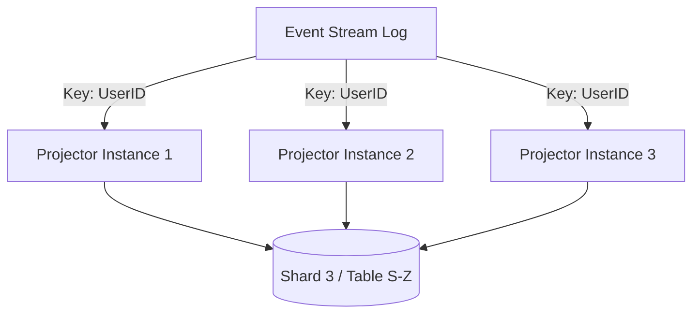

# Advanced CQRS Projections & Scaling at Scale

> **Target Audience**: SDE-3 to Principal Architect
> **Focus**: Production-ready patterns for high-throughput projection engines, replay strategies, and consistency management.

---

## 🚀 Scaling Projections (The "Write-Side" of Read Models)

When your event stream grows to billions of events, a single-threaded projector cannot keep up. You need parallelism.

### 1. Partitioned Projections (Sharding)

**Concept**: Parallelize projection processing by sharding based on `AggregateID` (or another consistent key).

**Architecture**:


**Implementation Details**:
*   **Consistent Hashing**: Use `hash(AggregateID) % N` to assign events to N projector instances.
*   **Competing Consumers**: Use consumer groups (e.g., Kafka Consumer Groups) where each instance claims a set of partitions.
*   **Ordering Guarantee**: Ordering is strictly maintained *within* a partition (and thus per aggregate). Global ordering is lost (usually acceptable).

**Principal Consideration**:
> [!WARNING]
> **Hot Partitions**: If one aggregate (e.g., a "Celebrity User") generates 1000x more events, one partition will lag.
> **Mitigation**: Detect hot keys and isolate them to dedicated consumers, or implement "intra-aggregate" parallelism if causality allows.

### 2. Batching for Throughput

**Problem**: Writing to the Read DB event-by-event is IO-bound and slow.

**Pattern**:
1.  **Buffer** incoming events in memory (e.g., `List<Event>`).
2.  **Flush** to DB when:
    *   buffer size > 1000 OR
    *   time since last flush > 500ms
3.  **Transactional Commit**: Update Read Model State + Store Offset in the *same transaction*.

```sql
BEGIN;
  INSERT INTO read_model (id, ...) VALUES (...), (...) ON CONFLICT UPDATE ...;
  UPDATE projection_offsets SET offset = 12345 WHERE projection_name = 'user-view';
COMMIT;
```

---

## 🔄 Replay Strategies (Zero-Downtime)

Rebuilding a read model from scratch (Replay) is a standard operation, not an exception.

### 1. The "Blue-Green" Replay Pattern

**Problem**: You can't truncate the live table and rebuild it while users are reading.

**Procedure**:
1.  **Current State**: `UserView_v1` is serving traffic.
2.  **Deploy**: Start `Projector_v2` writing to `UserView_v2` (new table).
3.  **Replay**: `Projector_v2` reads from Event Offset 0.
4.  **Catch-up**: `Projector_v2` processes historical events at max speed (no side effects, optimized batching).
5.  **Sync**: Once `v2` lag is near zero, keep running to stay in sync.
6.  **Switch**: Update API Gateway / Service Router to point to `UserView_v2`.
7.  **Teardown**: Drop `UserView_v1`.

### 2. Optimization: Projection Checkpoints

**Scenario**: Replay crashes at event 9,000,000 of 10,000,000.
**Naive**: Restart from 0. (Painful)
**Optimized**: Projectors persist their checkpoint (offset) periodically.

> [!TIP]
> **Checkpoint Strategy**:
> *   **Postgres**: Store offset in a separate table in the same transaction.
> *   **Elasticsearch/NoSQL**: Store offset as a field in a tracking document, or use idempotent writes relying on `sequenceID`.

---

## 🛡️ Idempotency & Deduplication

Events *will* be delivered multiple times (at-least-once delivery). Projections *must* be idempotent.

### 1. Deterministic ID Generation

**Rule**: The ID of a read model record should be deterministically derived from the event data.

*   **1:1 Mapping**: `PROJECTION_ID = AGGREGATE_ID`
*   **1:N Mapping**: `PROJECTION_ID = deterministic_hash(AGGREGATE_ID + EVENT_SEQ)`

### 2. Version Tracking (Optimistic Concurrency)

Store the `LastProcessedSequenceNumber` in the read model entity.

```sql
UPDATE user_view
SET name = 'New Name',
    last_sequence = 105
WHERE id = 'user-123'
  AND last_sequence < 105; -- Safety Check
```

*   **If RowCount == 0**: We already processed this event (or a newer one). Ignore.
*   **If RowCount == 1**: Update successful.

---

## 🌐 Multi-Region consistency

**Scenario**: Google-scale globally distributed system.
*   **Write Region**: US-East
*   **Read Regions**: US-East, EU-West, Asia-South

### 1. The "Replication Lag" Reality

Users in EU-West reading from a local Read Replica will see stale data due to:
1.  Event replication latency (Write Region -> Read Region Broker).
2.  Projection processing latency.

### 2. Pattern: "Read Your Own Writes" (Global)

**Flow**:
1.  **User (EU)** sends Command to **US-East**.
2.  **Command** succeeds, returns `Token { T: timestamp, V: version }`.
3.  **User (EU)** queries **EU-West** Read API with `Token`.
4.  **Read API Middleware**:
    *   Checks local Data Currency.
    *   Is `LocalVersion >= Token.Version`?
    *   **Yes**: Return data.
    *   **No**:
        *   Option A: Block/Wait (with timeout).
        *   Option B: Forward query to **US-East** (Primary).
        *   Option C: Return 202 Accepted / "Replication Pending" UI state.

---

## 🏗️ Managing Schema Evolution in Projections

**Scenario**: You need to add a `TotalSpent` column to the `UserSummary` table.

### Strategy A: On-the-fly Calculation (The "Lazy" Migration)
*   **Change**: Add column, nullable.
*   **Logic**:
    *   For new events: Update `TotalSpent`.
    *   For reads: If `TotalSpent` is null, calc on read (if feasible) or show "Pending".
*   **Backfill**: Background process iterates table, calculates, updates.
*   **Pros**: No full replay. **Cons**: Complex application logic.

### Strategy B: Full Replay (The "Clean" Migration)
*   Preferred for clean implementation. See "Blue-Green Replay" above.
*   **Resource Heavy**: Requires redundant storage and compute.

### Strategy C: Upcasters (At Event Level)
*   Transform the event *before* it hits the projector logic.
*   See `Event Sourcing > Event Evolution` docs.

---

## ✅ Principal Architect Checklist: Projection Readiness

| Category | Check |
| :--- | :--- |
| **Scalability** | Can we shard consumers? Is partioning key well-distributed? |
| **Performance** | Is batching enabled? Are DB indexes optimized for write-heavy loads? |
| **Reliability** | Is strictly-once handling (idempotency) implemented? |
| **Observability** | Do we track `ProjectionLag` (time & count)? |
| **Recovery** | Is the "Replay Runbook" tested and documented? |
| **Cost** | Do we prune old/unused read models? |

---

## 📊 Summary: Read Model Patterns

| Pattern | Best For | Trade-off |
| :--- | :--- | :--- |
| **Pull-Based (On-Demand)** | Rarely accessed complex reports | High read latency, complex query |
| **Push-Based (Materialized)** | High-traffic user views | High write cost, storage cost |
| **Hybrid (Lazy Materialization)** | Caching layers | Cache invalidation complexity |
