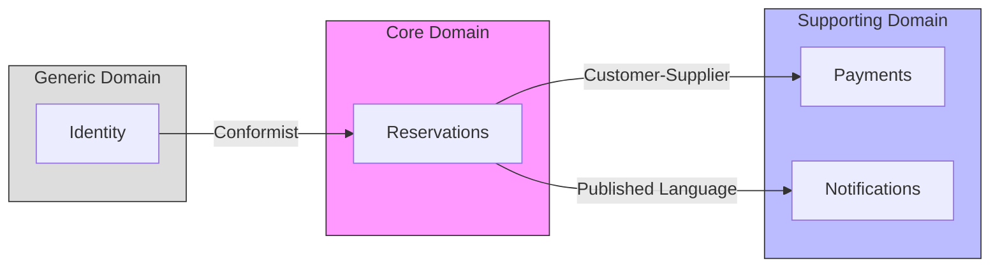

# Event-Driven Modelling Anti-Patterns

> **Source**: Oskar Dudycz's talk "Event-driven Modelling Anti-Patterns" — A comprehensive guide to avoiding common pitfalls when building event-driven systems.

---

## Table of Contents

1. [The Core Anti-Patterns](#the-core-anti-patterns)
2. [Message Semantics: The Foundation](#message-semantics-the-foundation)
3. [Advanced Anti-Patterns for SDE-3](#advanced-anti-patterns-for-sde-3)
4. [Principal Architect Considerations](#principal-architect-considerations)
5. [Anti-Pattern Detection Checklist](#anti-pattern-detection-checklist)
6. [Key Takeaways](#key-takeaways)

---

## The Core Anti-Patterns

### 1. CRUD Sourcing (Change Data Capture Abuse)

**What It Is**: Using Change Data Capture (CDC) to automatically publish events from database changes.

**The Pattern**:
```
Database Table Change → CDC Connector → Kafka → Consumers
                    ↓
              Events: "Created", "Updated", "Deleted"
```

**Why It Fails**:

| Aspect | Problem |
| :--- | :--- |
| **Semantics** | Events capture **what changed** in a row, not **what happened** in business |
| **Fragmentation** | Single business action → multiple table updates → fragmented events |
| **Consumer Burden** | Consumers must reconstruct business meaning from technical noise |

**Example**:
```
Business Action: Customer cancels reservation

❌ CRUD Sourcing produces:
- reservation_table: "DELETED" { id: 123 }
- payment_table: "UPDATED" { status: "REFUNDED" }
- room_table: "UPDATED" { availability: "FREE" }

✅ Proper Event Sourcing produces:
- ReservationCancelled { 
    reservationId: 123, 
    reason: "CustomerRequest",
    refundAmount: 250.00,
    cancelledAt: "2024-01-15T10:30:00Z"
  }
```

**The Solution: Outbox Pattern**

```
┌──────────────────────────────────────────────────────────────┐
│                      Application Service                     │
│                                                              │
│  1. Execute business logic                                   │
│  2. Update domain state                                      │
│  3. Write event to OUTBOX table ←── Same transaction         │
└──────────────────────────────────────────────────────────────┘
                              │
                              ▼
┌──────────────────────────────────────────────────────────────┐
│                        Database                              │
│  ┌─────────────────┐  ┌─────────────────────────────────┐    │
│  │ Business Tables │  │ OUTBOX Table                    │    │
│  │                 │  │ ┌─────────────────────────────┐ │    │
│  │ reservations    │  │ │ id | event_type | payload   │ │    │
│  │ payments        │  │ │ 1  | ResCancelled | {...}   │ │    │
│  │ rooms           │  │ └─────────────────────────────┘ │    │
│  └─────────────────┘  └─────────────────────────────────┘    │
└──────────────────────────────────────────────────────────────┘
                              │
                              ▼ (Polling or CDC on OUTBOX only)
┌──────────────────────────────────────────────────────────────┐
│                    Message Broker (Kafka)                    │
│                                                              │
│  Topic: reservations.events                                  │
│  Event: ReservationCancelled { ... business context ... }    │
└──────────────────────────────────────────────────────────────┘
```

> [!IMPORTANT]
> **CDC can be useful** — but only on the **Outbox table**, not on business tables directly. The Outbox ensures you publish **business events**, not database mutations.

---

### 2. Property Sourcing

**What It Is**: Creating an event for every individual property change.

**The Pattern**:
```
UI Form: Update guest profile
├── Email changed → "GuestEmailUpdated"
├── Phone changed → "GuestPhoneUpdated"  
├── Address changed → "GuestAddressUpdated"
└── Name changed → "GuestNameUpdated"
```

**Why It Fails**:

| Problem | Impact |
| :--- | :--- |
| **Event Explosion** | N fields × M entities = N×M event types |
| **UI Coupling** | Event schema mirrors UI, not domain |
| **Versioning Hell** | Every UI change requires event schema change |
| **Consumer Complexity** | Must handle every permutation |

**Example**:
```
❌ Property Sourcing:
GuestEmailUpdated { guestId: 123, email: "new@email.com" }
GuestPhoneUpdated { guestId: 123, phone: "+1-555-1234" }
GuestAddressUpdated { guestId: 123, street: "123 Main St", city: "NYC" }

✅ Business Event:
GuestPersonalDataRefined {
  guestId: 123,
  changes: {
    email: "new@email.com",      // optional
    phone: "+1-555-1234",        // optional
    address: { ... }             // optional
  },
  refinedBy: "guest-self-service",
  refinedAt: "2024-01-15T10:30:00Z"
}
```

**The Solution: Cohesive Business Events**

1. **Group related changes** into single business events
2. **Use optional fields** for partial updates
3. **Name events after business actions**, not data structure

---

### 3. Clickbait Events

**What It Is**: Events that tease information but don't provide enough for consumers to act.

**The Pattern**:
```
Producer publishes: ReservationStatusUpdated { reservationId: 123, status: "CONFIRMED" }
                                              ↓
                                   Consumer receives event
                                              ↓
                         "I need more data!" → Calls GET /reservations/123
                                              ↓
                                   ❌ Race Condition / DDoS
```

**Why It Fails**:

| Problem | Description |
| :--- | :--- |
| **Chattiness** | Event triggers API call → 2x traffic |
| **Race Conditions** | Consumer queries before read model updates |
| **Tight Coupling** | Consumer depends on producer's API |
| **DDoS Risk** | Retries on stale data hammer producer |

**Kafka Partition Ordering Trap**:
```
Partition 0: [Event A: ReservationCreated] ────────────────────→ Processed
Partition 1: [Event B: ReservationStatusUpdated] ───→ Processed
                                                         ↓
                                              Consumer queries API
                                                         ↓
                                              Read Model NOT YET UPDATED
                                              (Event A still propagating)
                                                         ↓
                                              ❌ 404 or Stale Data
```

**The Solution: Fat Events (Enriched Events)**

```json
// ❌ Clickbait Event
{
  "type": "ReservationStatusUpdated",
  "reservationId": "123",
  "status": "CONFIRMED"
}

// ✅ Enriched Event
{
  "type": "ReservationConfirmed",
  "reservationId": "123",
  "guestId": "456",
  "guestEmail": "guest@example.com",
  "roomNumber": "301",
  "checkIn": "2024-02-01",
  "checkOut": "2024-02-05",
  "totalAmount": 500.00,
  "confirmedAt": "2024-01-15T10:30:00Z",
  "confirmedBy": "system-auto"
}
```

> [!TIP]
> **Rule of Thumb**: If a consumer receiving your event needs to call you back, your event is a clickbait.

---

### 4. Passive-Aggressive Events

**What It Is**: Using events when you should use commands — broadcasting hints instead of making direct requests.

**The Analogy**:
```
Passive-aggressive roommate: "The dishwasher is finished." 
                                    ↓
                           (Implying: You should empty it)

Direct communication: "Please empty the dishwasher."
```

**In Systems**:
```
❌ Passive-Aggressive:
Producer: [InventoryLow { productId: 123, currentStock: 5 }]
          ↓
          Broadcasting hoping someone reorders...

✅ Direct Command:
Producer → Purchasing Service: [ReorderProduct { productId: 123, quantity: 100 }]
```

**Why It Fails**:

| Problem | Impact |
| :--- | :--- |
| **Unclear Responsibility** | Who should act? Everyone ignores it. |
| **No Acknowledgment** | Producer never knows if action was taken |
| **Distributed Monolith** | Everyone listens to everything |

**When to Use Events vs Commands**:

| Use Events When | Use Commands When |
| :--- | :--- |
| Broadcasting facts about the past | Requesting specific action |
| Multiple subscribers may care | Exactly one handler should respond |
| Subscribers can ignore safely | Failure should be reported |
| "This happened" | "Please do this" |

---

### 5. Distributed Monolith (Conway's Law Violation)

**What It Is**: Components "shouting" events at each other instead of designing proper integration contracts.

**The Pattern**:
```
┌─────────────────────────────────────────────────────────────┐
│                      Message Broker                         │
│                                                             │
│  Everyone publishes everything. Everyone subscribes to all. │
│                                                             │
│  ┌─────┐  ┌─────┐  ┌─────┐  ┌─────┐  ┌─────┐  ┌─────┐       │
│  │Svc A│  │Svc B│  │Svc C│  │Svc D│  │Svc E│  │Svc F│       │
│  └──┬──┘  └──┬──┘  └──┬──┘  └──┬──┘  └──┬──┘  └──┬──┘       │
│     │        │        │        │        │        │          │
│     └────────┴────────┴────────┴────────┴────────┘          │
│                      🗣️ SHOUTING 🗣️                          │
└─────────────────────────────────────────────────────────────┘
```

**Symptoms**:

| Symptom | Description |
| :--- | :--- |
| **Release Trains** | Every producer change requires all consumers to update |
| **Spaghetti Subscriptions** | No one knows who listens to what |
| **Consumer Coupling** | Consumers encode producer's internal logic |
| **Event Storms** | Minor changes cascade across system |

**The Solution: Internal vs External Events**

```
┌─────────────────────────────────────────────────────────────┐
│                    Reservation Service                      │
│                                                             │
│  Internal Events (Private):                                 │
│  ├── ReservationDraftCreated                                │
│  ├── PaymentValidationStarted                               │
│  ├── RoomAvailabilityChecked                                │
│  └── PricingCalculated                                      │
│                                                             │
│  External Events (Public API):                              │
│  ├── ReservationConfirmed  ←── Published to broker          │
│  ├── ReservationCancelled  ←── Published to broker          │
│  └── ReservationModified   ←── Published to broker          │
└─────────────────────────────────────────────────────────────┘
```

> [!IMPORTANT]
> **Treat external events like APIs**: version them, document them, don't break consumers.

---

## Message Semantics: The Foundation

> Based on Gregor Hohpe's Enterprise Integration Patterns

### The Magical Cross

```
                    COMMAND
                       │
                       │ "Please do X"
                       ▼
              ┌────────────────┐
              │                │
     STATE ──▶│ Business Logic │──▶ EVENT
              │                │
              └────────────────┘
   "Current     validates &        "X happened"
    Reality"    decides            (fact)
```

### Message Type Comparison

| Aspect | Command | Event | Document |
| :--- | :--- | :--- | :--- |
| **Direction** | Point-to-point | Broadcast | N/A |
| **Tense** | Imperative ("Create") | Past tense ("Created") | Present ("CurrentState") |
| **Can Reject?** | ✅ Yes | ❌ No (already happened) | ❌ No |
| **Can Ignore?** | ❌ No | ✅ Yes | ✅ Yes |
| **Coupling** | High (to target) | Low (to schema only) | Varies |

**Anti-Pattern: Mixing Semantics**

```
❌ Command disguised as Event:
"OrderShouldBeShipped" { orderId: 123 }  // Imperative in past-tense clothing

❌ Event that acts like Command:
"ShipOrder" { orderId: 123 }  // Command disguised as event

✅ Proper separation:
Command: ShipOrder { orderId: 123, shippingAddress: { ... } }
Event:   OrderShipped { orderId: 123, trackingNumber: "XYZ", shippedAt: "..." }
```

---

## Advanced Anti-Patterns for SDE-3

### 6. Event Schema Bloat

**Problem**: Over time, events accumulate optional fields, deprecated attributes, and versioning cruft.

```json
// V1 (2020)
{ "type": "OrderPlaced", "orderId": "123", "total": 100 }

// V7 (2024) - Same event, bloated
{
  "type": "OrderPlaced",
  "orderId": "123",
  "total": 100,
  "totalV2": 100.00,              // Added for precision
  "currency": "USD",              // Added later
  "customerId": "456",            // Was in separate event
  "customerIdLegacy": "456",      // Old format
  "items": [...],                 // Added for fat events
  "itemCount": 3,                 // Denormalized
  "deprecated_shoppingCartId": "x", // Should be removed
  "_schemaVersion": 7             // Meta noise
}
```

**Solutions**:

| Solution | Description |
| :--- | :--- |
| **Upcasters** | Transform old events to new schema on read |
| **Event Splitting** | Break bloated events into focused ones |
| **Schema Registry** | Enforce compatibility rules |
| **Sunset Policy** | Remove deprecated fields after grace period |

---

### 7. Temporal Coupling

**Problem**: Consumers assume events arrive in a specific order or within a time window.

```
Expected: [UserCreated] ────→ [EmailVerified] ────→ [ProfileCompleted]
                                                            ↓
                                              Consumer: "Now I can send welcome email"

Reality (network delays):
[UserCreated] ────→ [ProfileCompleted] ────→ [EmailVerified]
                           ↓
              Consumer: "Profile completed but email not verified?!"
              💥 NullPointerException
```

**Solutions**:

| Solution | Implementation |
| :--- | :--- |
| **Idempotency** | Process events regardless of order |
| **Saga State Machine** | Track expected events, wait for all |
| **Event Buffering** | Hold events until dependencies arrive |
| **Fat Events** | Include all needed context in each event |

---

### 8. Aggregate ID Leakage

**Problem**: Internal aggregate IDs leak into events, creating tight coupling.

```
❌ Leaking internal IDs:
OrderPlaced { 
  orderId: "internal-uuid-12345",
  customerId: "customer-table-pk-789",
  productIds: ["sku-internal-1", "sku-internal-2"]
}

// Consumers now depend on your internal ID format
// Change your DB? Breaking change for all consumers!

✅ Use business identifiers:
OrderPlaced {
  orderNumber: "ORD-2024-00123",       // Business key
  customerEmail: "customer@example.com", // Natural key
  productSkus: ["WIDGET-A", "GADGET-B"]  // Business key
}
```

---

### 9. Compensation Amnesia

**Problem**: Forgetting to design compensating events for reversible actions.

```
Happy Path Events:
OrderPlaced → PaymentCharged → InventoryReserved → OrderShipped

💥 Payment fails after inventory reserved...

Missing Compensating Events:
- InventoryReservationCancelled  ← Not designed!
- OrderCancelled                 ← Not designed!

Result: Inconsistent state, manual intervention required
```

**Solution: Design Events in Pairs**

| Forward Event | Compensating Event |
| :--- | :--- |
| OrderPlaced | OrderCancelled |
| PaymentCharged | PaymentRefunded |
| InventoryReserved | InventoryReservationReleased |
| ShipmentDispatched | ShipmentRecalled |

---

### 10. Event Timestamp Abuse

**Problem**: Using event timestamps for business logic ordering.

```
❌ Timestamp-based ordering:
events.sortBy(e => e.timestamp)

// Problems:
// - Clock skew between services
// - Leap seconds
// - NTP drift
// - Same-millisecond events

✅ Sequence-based ordering:
events.sortBy(e => e.sequenceNumber)  // Monotonic, gap-free
```

---

## Principal Architect Considerations

### Event Governance Framework

**Event Ownership Matrix**:

| Domain | Owner Team | Event Prefix | Schema Registry NS |
| :--- | :--- | :--- | :--- |
| Reservations | Platform-Booking | `booking.` | `booking.reservations` |
| Payments | Platform-Payments | `payments.` | `payments.transactions` |
| Notifications | Platform-Comms | `comms.` | `comms.notifications` |

**Event Lifecycle**:

```
┌───────────┐     ┌───────────┐     ┌───────────┐     ┌───────────┐
│  DRAFT    │────▶│  ACTIVE   │────▶│DEPRECATED │────▶│  SUNSET   │
│           │     │           │     │           │     │           │
│ In design │     │ In use    │     │ 6mo grace │     │ Removed   │
└───────────┘     └───────────┘     └───────────┘     └───────────┘
```

### Context Mapping for Event Integration

**DDD Integration Patterns**:



| Pattern | When to Use | Event Strategy |
| :--- | :--- | :--- |
| **Partnership** | Both teams evolve together | Shared event schema |
| **Customer-Supplier** | Upstream serves downstream | Upstream enriches events |
| **Conformist** | Accept upstream as-is | Anti-corruption layer on consumer |
| **Anti-Corruption Layer** | Protect from upstream changes | Translate at boundary |

### Technology Selection: Process Before Tools

> **"Kafka-rounding"**: Using Kafka to solve problems that should be solved with better modeling.

**Correct Order**:

```
1. WHY?     ──▶  Business features, use cases, domain modeling
                 What are we trying to achieve?

2. HOW?     ──▶  Integration patterns, message semantics
                 Events vs Commands? Sync vs Async?

3. WHICH?   ──▶  Kafka, RabbitMQ, Pub/Sub, EventBridge
                 Only now pick technology
```

**Tool Comparison for Anti-Pattern Mitigation**:

| Anti-Pattern | Kafka Solution | RabbitMQ Solution | Cloud Native |
| :--- | :--- | :--- | :--- |
| Ordering issues | Partition key | Single queue | Ordering key |
| Clickbait events | Schema Registry + Fat events | Same | Same |
| Distributed Monolith | Topic design + ACLs | Exchanges + Bindings | IAM policies |

### Organizational Anti-Patterns

**Conway's Law in Action**:

```
Team Structure                    →    System Architecture

Siloed teams that                      Distributed monolith where
don't communicate          ────▶       services shout events at
directly                               each other

Cross-functional teams                 Well-designed integration
with clear contracts       ────▶       contracts and enriched
                                       external events
```

**Mitigation**:

1. **Event Storming sessions** across team boundaries
2. **Published Language** documentation
3. **Consumer-Driven Contract Testing**
4. **Regular integration reviews**

---

## Anti-Pattern Detection Checklist

### Code Review Checklist

| Check | Pass | Fail |
| :--- | :--- | :--- |
| Event name is past tense? | `OrderPlaced` | `PlaceOrder` |
| Event contains business context? | `reason`, `actor`, `timestamp` | Just IDs |
| No callback required? | Self-contained | Consumer calls API |
| Compensation event exists? | `OrderCancelled` paired | Only happy path |
| Business key, not DB key? | `orderNumber` | `order_table_pk` |
| Internal vs External separated? | Different topics | All public |

### Architecture Review Checklist

| Check | Pass | Fail |
| :--- | :--- | :--- |
| Outbox pattern for consistency? | ✅ | Direct DB + Kafka publish |
| Schema Registry enforced? | ✅ | JSON strings everywhere |
| Event ownership documented? | ✅ | "Whoever needs it publishes" |
| Context mapping done? | ✅ | "We just use events" |
| Versioning strategy defined? | ✅ | Breaking changes surprise consumers |

### Monitoring for Anti-Patterns

| Metric | Threshold | Anti-Pattern Signal |
| :--- | :--- | :--- |
| Avg. event payload size | > 10KB | Bloated events |
| API calls per event consumed | > 0.1 | Clickbait events |
| Unique event types per domain | > 50 | Property sourcing |
| Consumer lag variance | High | Temporal coupling issues |
| Cross-domain subscriptions | > 10 per service | Distributed monolith |

---

## Key Takeaways

> [!IMPORTANT]
> **The Four Rules of Event Design**
> 
> 1. **Events are facts** — past tense, immutable, can be ignored but not rejected
> 2. **Enrich, don't tease** — include enough data for consumers to act independently
> 3. **Internal ≠ External** — treat external events as versioned public APIs
> 4. **Process before tools** — model the domain first, pick technology last

### Quick Reference: Anti-Pattern → Solution

| Anti-Pattern | Solution |
| :--- | :--- |
| CRUD Sourcing | Outbox Pattern with business events |
| Property Sourcing | Cohesive business events with optional fields |
| Clickbait Events | Fat/Enriched events |
| Passive-Aggressive Events | Use Commands for direct requests |
| Distributed Monolith | Internal vs External events, Context Mapping |
| Schema Bloat | Upcasters, Schema Registry, Sunset policy |
| Temporal Coupling | Idempotency, Saga State Machine |
| Aggregate ID Leakage | Business identifiers |
| Compensation Amnesia | Design events in pairs |
| Timestamp Abuse | Sequence numbers |

---

## References

- [Oskar Dudycz - Event-Driven Modelling Anti-Patterns](https://youtu.be/Lf1MZlpbkGA)
- [Gregor Hohpe - Enterprise Integration Patterns](https://www.enterpriseintegrationpatterns.com/)
- [Vaughn Vernon - Implementing Domain-Driven Design](https://www.amazon.com/Implementing-Domain-Driven-Design-Vaughn-Vernon/dp/0321834577)
