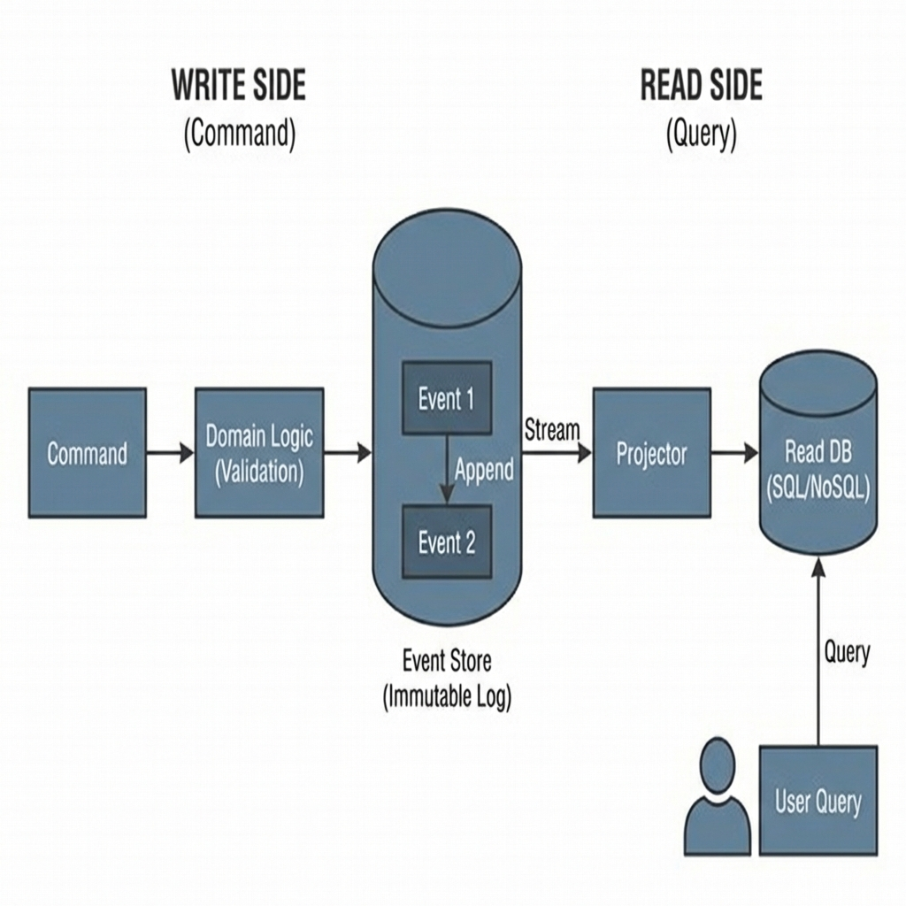

# Event Sourcing: The Source of Truth

> **Source**: [Opportunities and Pitfalls of Event Driven Architecture](https://youtu.be/PzGNpaGeHE4) (Bernd Rücker)

> [!IMPORTANT]
> **The Paradigm Shift**: Traditional databases store the *current state*. Event Sourcing stores the *history*.
> **State = f(History)**.
> You don't update a record. You append an event.

---

## 📜 The Core Concept: Persistent Change

In a unified log:
1.  `AccountCreated { id: 101, owner: "Alice" }`
2.  `Deposited { id: 101, amount: 50 }`
3.  `Withdrawn { id: 101, amount: 20 }`

**Current State (Projection)**: Calculate $0 + 50 - 20 = 30$.

### Why do this?
*   **Auditability**: Zero data loss. You know exactly *why* the balance is 30.
*   **Time Travel**: You can replay events up to timestamp $T$ to debug an issue from last Tuesday.
*   **Correctness**: Eliminates "Race Conditions" on update. You just append.

---

## 🏗️ CQRS: Use the Right Tool for the Job



Event Logs are terrible for queries ("Find all users with balance > 100").
**Solution**: Command Query Responsibility Segregation (CQRS).

```mermaid
graph LR
    User -->|Command (Deposit)| API
    
    subgraph "Write Side (Command)"
        API -->|Validate| Domain[Domain Logic]
        Domain -->|Append| EventStore[(Event Store)]
    end
    
    EventStore -->|Stream Events| Projector[Projector Service]
    
    subgraph "Read Side (Query)"
        Projector -->|Update View| ReadDB[(Read DB / SQL)]
        User -.->|Query (Get Balance)| ReadDB
    end
```

*   **Write Side**: Optimized for high-throughput appending (Kafka / EventStoreDB).
*   **Read Side**: Optimized for querying (Postgres / Elasticsearch).
*   **Trade-off**: **Eventual Consistency**. The Read DB might lag 100ms behind the Write DB.

---

## 🚧 The Hard Parts (Principal Architect View)

### 1. Snapshotting
Replaying 1,000,000 events to load a User Profile is too slow.
*   **Solution**: Every 100 events, save a **Snapshot** (serialized state).
*   *Load Process*: Load latest Snapshot + Replay only events *after* that snapshot.

### 2. Schema Evolution (The Versioning Hell)
Software changes. Event structures change.
*   *Event V1*: `{ address: "123 Main St" }`
*   *Event V2*: `{ street: "123 Main St", city: "NY" }`
*   **Problem**: You cannot change the immutable log.
*   **Solution**: **Upcasting**. The loader reads V1 event, transforms it to V2 object in memory, then hands it to the application. The App only ever sees V2.

### 3. GDPR (The "Right to be Forgotten")
How do you delete personal data from an **immutable** log?
*   **Solution**: **Crypto-Shredding**.
    *   Encrypt PII (Personal Identifiable Information) in the event with a per-user key.
    *   Store the key in a mutable Key-Value store.
    *   To "forget" the user, delete the key. The event data is now garbage bytes.

---

## 🗣️ Events vs. Commands

Don't confuse them.

| Type | Tense | Intent | Publisher | Recipient |
| :--- | :--- | :--- | :--- | :--- |
| **Command** | Imperative | "Do this" | 1 Sender | 1 Specific Receiver |
| **Event** | Past | "This happened" | 1 Sender | 0..N Subscribers |

*   **Pitfall**: "Passive Aggressive Commands". Sending `OrderCreated` but effectively expecting Shipping to react. If Shipping *must* react, use a Command.

---

## ✅ Principal Architect Checklist

1.  **Don't Event Source Everything**: It increases complexity 10x. Use it for core domains (Accounting, Orders) where history matters.
2.  **Separate Internal vs External Events**: Never expose your internal Event Sourcing events to other services. They are implementation details. Publish a simplified "Integration Event" instead.
3.  **Implement Idempotency**: Consumers *will* receive duplicate events. Handle `Deposited {id: 101}` twice without doubling the money.
4.  **Plan for Eventual Consistency**: The UI must handle "stale" data. Use Optimistic UI updates.

---

## 🔗 Related Documents
*   [Saga Pattern](../../database/saga/saga-pattern-guide.md) — Coordinating long-running processes.
*   [Distributed Systems Theory](../../../networking/distributed-systems-theory.md) — The CAP theorem context.
