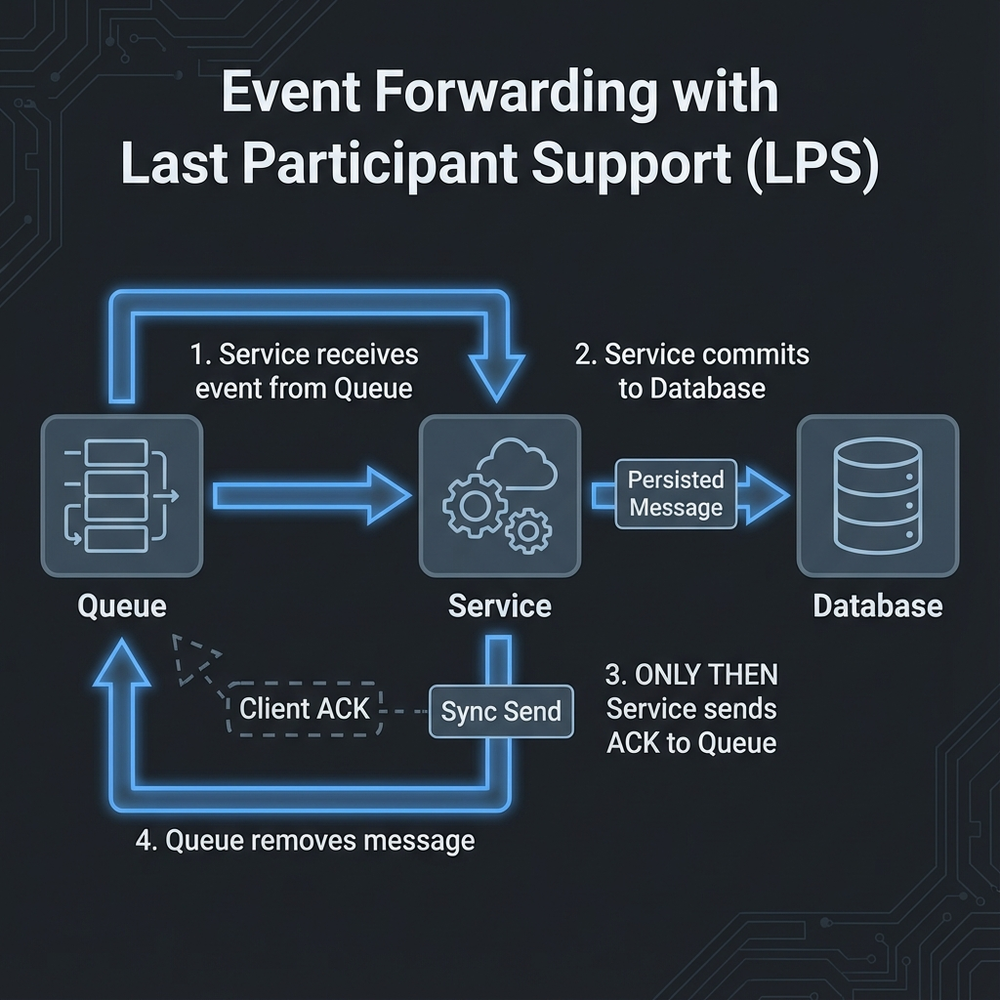
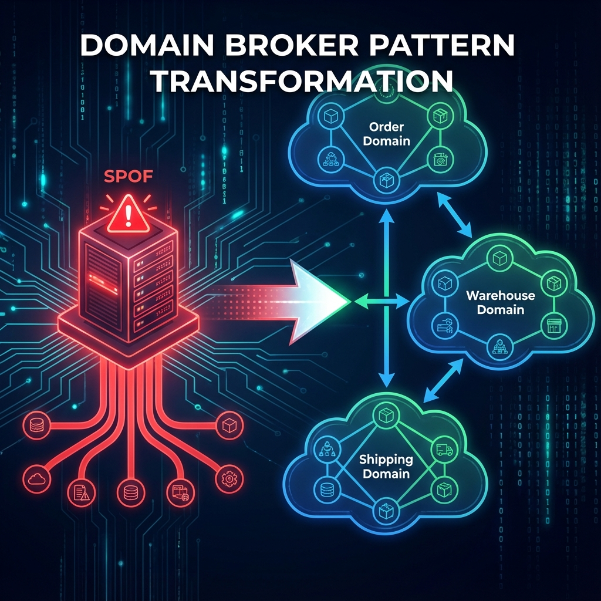
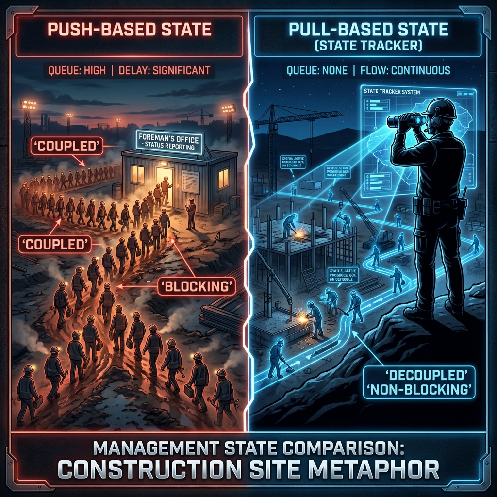

# Event-Driven Architecture Patterns

> **Source**: Mark Richards' presentation on navigating EDA complexities through specific patterns.

---

## 📚 Foundations

### Events vs Messages

| Concept | Definition | Contract Owner | Example |
| :--- | :--- | :--- | :--- |
| **Event** | Advertisement of a past state change | **Sender** (publisher) | `OrderPlaced { orderId: 123 }` |
| **Message** | Command or query directed at specific recipient | **Receiver** (consumer) | `ProcessPayment { orderId: 123 }` |

> [!IMPORTANT]
> **Events and Messages are NOT interchangeable**. An event is "fire and forget" (sender doesn't know/care who listens). A message expects a specific recipient.

### Event Types

| Type | Definition | Example |
| :--- | :--- | :--- |
| **Initiating Event** | Kicks off a process | `OrderPlaced` |
| **Derived Event** | Triggered by a service in response | `InventoryReserved`, `PaymentProcessed` |

---

## Pattern 1: Event Forwarding (Zero Data Loss)



### The Problem
In async messaging, events can be lost at multiple points:
-   Queue crashes before delivery.
-   Service crashes mid-processing.
-   Network partition.

### The Solution: Chain of Persistence

**Three Requirements**:
1.  **Synchronous Sends**: Sender waits for broker ACK.
2.  **Persisted Messages**: Broker stores to disk, not just memory.
3.  **Client Acknowledge Mode**: Message not removed until consumer confirms.

### Last Participant Support (LPS)

**The Golden Rule**: Commit to DB **first**, ACK to queue **last**.

```
1. [Queue] ──(persisted msg)──▶ [Service]
2. [Service] ──(writes)──▶ [Database] ✓ COMMIT
3. [Service] ──(ACK)──▶ [Queue] ✓ Remove Message
```

**Why this order?**
-   If crash after DB commit but before ACK: Message redelivered. You get a **duplicate** (handle with idempotency).
-   If crash before DB commit: Message not ACKed. Redelivered. **No data loss**.

### Trade-offs

| Benefit | Cost |
| :--- | :--- |
| ✅ Zero data loss | ❌ 3-4x slower than non-persisted |
| ✅ Guaranteed delivery | ❌ Potential duplicates |
| ✅ Crash recovery | ❌ Higher broker disk I/O |

### Google-Scale Enhancement: Transactional Outbox

Instead of relying on LPS, use the **Transactional Outbox** pattern:
1.  Write business data + outbox event in **same DB transaction**.
2.  Separate process polls outbox and publishes to broker.
3.  No two-phase commit, no LPS needed.

---

## Pattern 2: Domain Broker Pattern



### The Problem: Single Point of Failure

A **single central broker** creates a **single quantum** (deployable unit):
-   If the broker goes down, **all services** fail.
-   Even unrelated domains are coupled.

### The Solution: Federate the Broker

Partition the broker by **business domain**:
-   `orders-broker` (Order Placement domain)
-   `warehouse-broker` (Warehousing domain)
-   `shipping-broker` (Shipping domain)

### Architectural Quanta

| Concept | Definition |
| :--- | :--- |
| **Quantum** | Independently deployable unit with high cohesion |
| **Federated Broker** | Preserves quantum boundaries |

**Benefit**: If `warehouse-broker` fails, `orders` and `shipping` continue functioning.

### Google-Scale Implementation

| Cloud | How |
| :--- | :--- |
| **GCP** | Separate Pub/Sub topics per domain. Cross-project subscriptions if needed. |
| **AWS** | Separate SNS/SQS per domain. EventBridge for cross-account routing. |
| **On-Prem** | Kafka clusters per domain. MirrorMaker for cross-domain events. |

### When Events Must Cross Domains

Use a **Domain Gateway** pattern:
1.  Orders domain publishes `OrderPlaced` to `orders-broker`.
2.  A **Bridge Service** subscribes to `orders-broker`.
3.  Bridge republishes to `warehouse-broker` and `shipping-broker`.

> [!TIP]
> The Bridge Service is a **conscious coupling point**. It's explicit, testable, and can apply transformations.

---

## Pattern 3: Workflow State Patterns



### The Problem
How do you track where an order is in a distributed flow (Order → Inventory → Payment → Shipping) without a central orchestrator?

### Approach 1: Push-based State (❌ Anti-Pattern)

Each service **pushes** state updates to a central queue.

```
[Order Service] ──▶ [Central State Queue] ◀── [Inventory Service]
                           ▲
                           └── [Shipping Service]
```

**Problems**:
-   All services are **synchronously coupled** to the central queue.
-   If the queue fails, all services block.
-   **Destroys the federated quantum**.

### Approach 2: Pull-based State / State Tracker (✅ Recommended)

A separate **State Tracker Service** **listens** to existing events across domains.

```
[Order Service] ──▶ [Orders Broker]
                           │
[Inventory Service] ──▶ [Warehouse Broker] ──▶ [State Tracker] ──▶ [State DB]
                           │
[Shipping Service] ──▶ [Shipping Broker]
```

**Benefits**:
-   No new work for individual services (they already publish events).
-   State Tracker is **read-only** and **decoupled**.
-   Centralizes state machine logic.

### The Construction Site Analogy

| Push-based | Pull-based |
| :--- | :--- |
| Workers walk to foreman's office to report | Foreman watches from a hill with binoculars |
| If office closed, site stops | Workers keep working regardless |
| Coupled, Blocking | Decoupled, Non-blocking |

### Google-Scale Enhancement: CDC State Tracker

Use **Change Data Capture (CDC)** instead of listening to message brokers:
1.  Services write to their own databases.
2.  **Debezium** (or Dataflow) tails the DB transaction logs.
3.  State Tracker receives ALL state changes without any service modification.

---

## Pattern 4: Multi-Broker Pattern

### The Problem: Throughput Limit

A single broker has a limit (e.g., 11,000 messages/sec). What if you need 100,000 msg/sec?

### The Solution: Round-Robin Multiple Brokers

```
Producer ──▶ [Broker 1] ──▶ [Consumer Group]
        ├──▶ [Broker 2] ──▶
        └──▶ [Broker 3] ──▶
```

**This is the foundation of Kafka Partitions**.

### Kafka Partitions Explained

| Concept | Definition |
| :--- | :--- |
| **Partition** | A single ordered queue within a topic |
| **Partition Key** | Determines which partition receives the message |
| **Consumer Group** | Set of consumers that together read all partitions |

```
Topic: orders (3 partitions)
├── Partition 0: [Order:1, Order:4, Order:7...]  ──▶ Consumer A
├── Partition 1: [Order:2, Order:5, Order:8...]  ──▶ Consumer B
└── Partition 2: [Order:3, Order:6, Order:9...]  ──▶ Consumer C
```

### Trade-off: FIFO Order is Lost (Globally)

| Scope | Ordering Guarantee |
| :--- | :--- |
| **Single Partition** | ✅ FIFO guaranteed |
| **Across Partitions** | ❌ No global order |

**Implication**: If you partition by `customerId`, one customer's events are ordered. But events across customers may interleave.

### Solutions for Global Ordering (When Needed)

| Strategy | How | Trade-off |
| :--- | :--- | :--- |
| **Single Partition** | All events in one partition | No parallelism. Bottleneck. |
| **Sequencer Service** | Central service assigns sequence numbers before publishing | Single point of contention. |
| **Causal Ordering** | Use vector clocks. Consumers reorder based on dependencies. | Complex implementation. |

---

## 🚀 Advanced Scenarios (SDE-3 Level)

### Scenario 1: Idempotency in LPS

**Problem**: LPS guarantees redelivery, which means duplicates.

**Solution**: Idempotency Key
1.  Every event has a unique `eventId` (UUID).
2.  Consumer checks: "Have I processed this `eventId`?"
3.  If yes, skip. If no, process + store `eventId` in "processed" table.

```sql
-- In same transaction as business logic
INSERT INTO processed_events (event_id) VALUES ('uuid-1234')
ON CONFLICT DO NOTHING;
```

---

### Scenario 2: Dead Letter Queue per Domain

Each domain broker should have its own DLQ:
-   `orders-broker` → `orders-dlq`
-   `warehouse-broker` → `warehouse-dlq`

**Benefits**:
-   Errors in one domain don't pollute another.
-   Domain teams own their own DLQ monitoring.

---

### Scenario 3: Event Schema Versioning Across Domains

**Problem**: Order domain publishes `OrderPlaced v2`. Shipping domain still expects `v1`.

**Solution: Schema Registry + Consumer Contracts**
1.  **Schema Registry** (Confluent, Apicurio) validates compatibility.
2.  **Consumer-Driven Contracts (Pact)**: Shipping domain publishes what it expects. Producer tests against it.

---

### Scenario 4: Graceful Degradation When Broker Fails

Even with Domain Brokers, a single domain broker can fail.

**Strategies**:
| Strategy | How |
| :--- | :--- |
| **Circuit Breaker** | Producer stops sending after N failures. Buffers locally. Retries later. |
| **Fallback Queue** | Write to local file/DB if broker unreachable. Drain to broker on recovery. |
| **Multi-Region Broker** | Kafka MirrorMaker or Pub/Sub cross-region topic. |

---

### Scenario 5: Exactly-Once Across Domains

**Problem**: Order is placed. Inventory is reserved. Payment fails. How to rollback inventory?

**Solution: Saga Pattern**

| Type | How |
| :--- | :--- |
| **Choreography** | Each service listens for events and reacts (e.g., `PaymentFailed` → Inventory publishes `InventoryReleased`). |
| **Orchestration** | Central Saga Coordinator sends commands to each service and handles compensation. |

---

### Scenario 6: Observability Across Event Flow

**Tool**: Distributed Tracing (Jaeger, Zipkin, Cloud Trace)

**How**:
1.  Every event carries a `traceId` and `spanId`.
2.  State Tracker correlates events by `traceId`.
3.  Visualize the entire order flow: Order → Inventory → Payment → Shipping.

---

### Scenario 7: Consumer Lag Crisis

**Problem**: Consumer can only process 5,000 msg/sec. Producer emits 10,000 msg/sec. Lag grows unbounded.

**Detection**:
```
Metric: kafka_consumer_group_lag
Alert: lag > 100,000 for > 5 minutes
```

**Solutions**:
| Strategy | How |
| :--- | :--- |
| **Scale Consumers Horizontally** | Add more consumers (up to partition count). |
| **Increase Partition Count** | More partitions = more parallelism. (Requires topic recreation or migration.) |
| **Optimize Processing Time** | Profile consumer. Batch DB writes. Use async I/O. |
| **Shedding / Sampling** | Drop non-critical events during catch-up. |

---

### Scenario 8: Out-of-Order Event Arrival

**Problem**: `InventoryReserved` arrives before `OrderPlaced` due to network delays.

**Solutions**:
| Strategy | How |
| :--- | :--- |
| **Buffer & Reorder** | Consumer holds `InventoryReserved` until `OrderPlaced` arrives (timeout after X seconds). |
| **Causal Metadata** | Each event carries `causationId` (parent event). Consumer rejects if parent not seen. |
| **Eventually Consistent** | Process anyway, let downstream projections reconcile. (Simpler, but less strict.) |

---

### Scenario 9: Event Replay for Migration

**Scenario**: You're migrating from Postgres to Cassandra. How to replay 5 years of events?

**Steps**:
1.  **Stop Producers** (or dual-write during migration).
2.  **Read from Event Store** (not Kafka, which has retention limits).
3.  **Replay to New Consumer** that writes to Cassandra.
4.  **Verify Parity**: Compare row counts, checksums.
5.  **Switch Traffic** to new storage.

---

### Scenario 10: Blue-Green Consumer Deployment

**Problem**: You're deploying a new consumer version. Can't have both v1 and v2 processing the same events.

**Strategy**:
1.  **Deploy v2 with a NEW consumer group** (e.g., `order-processor-v2`).
2.  v2 starts from **latest offset** (not replaying).
3.  Once v2 is stable, **stop v1 consumer group**.
4.  v2 is now the primary.

> [!WARNING]
> If you need to replay, you must coordinate to prevent v1 and v2 both processing the same event.

---

### Scenario 11: Fan-Out with Filtering

**Problem**: `OrderPlaced` event goes to 50 consumers, but each consumer only cares about specific order types.

**Inefficient**: Each consumer receives ALL events, filters locally.

**Efficient Solutions**:
| Strategy | How |
| :--- | :--- |
| **Separate Topics** | `orders-food`, `orders-electronics`. Route at producer. |
| **Kafka Headers** | Add `orderType: food` header. Consumer filters without deserializing body. |
| **Pub/Sub Filters** | GCP Pub/Sub supports filter expressions on message attributes. |

---

### Scenario 12: Event Buffering During Outage

**Problem**: Broker is down for 30 minutes. Producer has 10,000 events to send.

**Solution: Local Buffer (Outbox Pattern)**
1.  Producer writes events to **local database** (outbox table).
2.  Background poller reads outbox and publishes to broker.
3.  On broker recovery, poller drains the backlog.

**Trade-off**: Events are delayed, but never lost.

---

### Scenario 13: Consumer Poison Message Handling

**Problem**: A single malformed event crashes the consumer in a loop.

**Detection**:
```java
int retryCount = 0;
while (true) {
    try {
        process(event);
        break;
    } catch (Exception e) {
        retryCount++;
        if (retryCount >= 3) {
            publishToDlq(event);
            break;
        }
        Thread.sleep(exponentialBackoff(retryCount));
    }
}
```

**DLQ Event**:
```json
{
  "originalEvent": { ... },
  "error": "NullPointerException at line 42",
  "retryCount": 3,
  "timestamp": "2024-01-08T10:00:00Z"
}
```

---

### Scenario 14: Consumer Scaling and Partition Assignment

**Problem**: 10 partitions, 5 consumers. You add 5 more consumers. What happens?

**Kafka Rebalancing**:
-   Before: Each consumer reads 2 partitions.
-   After: Each consumer reads 1 partition.

**Pitfall**: During rebalance, **no events are processed** (Stop-The-World).

**Mitigation**:
| Strategy | How |
| :--- | :--- |
| **Incremental Cooperative Rebalancing** | Kafka 2.4+. Only affected partitions reassigned. |
| **Static Partition Assignment** | Use `group.instance.id`. No rebalance on restart. |

---

### Scenario 15: Event Batching for Throughput

**Problem**: Publishing 10,000 events/sec with individual sends = 10,000 network round-trips.

**Solution: Batching**
```java
producer.send(event); // Buffered, not sent immediately
// Kafka default: batch.size=16KB, linger.ms=0
// Tune: linger.ms=5 (wait 5ms to batch more events)
```

**Trade-off**: Higher latency (wait for batch to fill), but higher throughput.

---

### Scenario 16: Two-Phase Commit Avoidance

**Problem**: You need to atomically update **DB + Broker**. Two-Phase Commit (2PC) is slow and fragile.

**Solution: Saga + Outbox**
1.  Write to DB (including outbox).
2.  Background process publishes from outbox.
3.  If publish fails, retry from outbox.
4.  No 2PC needed.

---

### Scenario 17: Event Deduplication at Consumer

**Problem**: Producer retry caused duplicate events in the topic.

**Solutions**:
| Strategy | How |
| :--- | :--- |
| **Idempotent Producer** | Kafka `enable.idempotence=true`. Broker deduplicates. |
| **Consumer Dedup** | Store `eventId` in DB. Skip if already exists. |
| **Idempotent Business Logic** | `SET balance = 100` instead of `SET balance = balance - 50`. |

---

### Scenario 18: Cross-Region Event Replication

**Problem**: Users in US and EU. Events must be visible globally with low latency.

**Architecture**:
```
US: [Producer] → [Kafka US] → [MirrorMaker] → [Kafka EU]
EU: [Producer] → [Kafka EU] → [MirrorMaker] → [Kafka US]
```

**Challenges**:
-   **Conflict Resolution**: If same entity modified in both regions, which wins?
-   **Ordering**: Events from different regions may interleave.

**Solutions**:
| Strategy | How |
| :--- | :--- |
| **Region Affinity** | User:123 always routes to US. No conflicts. |
| **Last-Write-Wins** | Compare timestamps. Latest event wins. |
| **CRDTs** | Conflict-free data types (counters, sets). |

---

### Scenario 19: Rate Limiting Producers

**Problem**: A misbehaving producer floods the broker with 1M events/sec, starving others.

**Solutions**:
| Strategy | How |
| :--- | :--- |
| **Kafka Quotas** | `quota.producer.default=10485760` (10MB/sec per producer). |
| **API Gateway Throttling** | Rate limit at ingress before events reach broker. |
| **Token Bucket per Tenant** | Distributed rate limiter (Redis) per tenant. |

---

### Scenario 20: Testing Event-Driven Systems

**Unit Testing**: Test event handlers in isolation.
```java
@Test
void shouldReserveInventory() {
    var event = new OrderPlaced(orderId: 123);
    var result = handler.handle(event);
    assertThat(result).isEqualTo(new InventoryReserved(orderId: 123));
}
```

**Integration Testing**: Use Testcontainers.
```java
@Container
static KafkaContainer kafka = new KafkaContainer();

@Test
void shouldPublishAndConsume() {
    producer.send(event);
    await().atMost(5, SECONDS).until(() -> consumer.received(event));
}
```

**Contract Testing**: Use Pact.
```java
// Consumer defines expectations
@PactTestFor(pactMethod = "orderPlacedPact")
void consumesOrderPlaced(MockServer mock) {
    // Consumer test against mock
}
```

---

## 🏛️ Principal Architect Level: Governance & Platform Strategy

### 1. Event Governance Framework

**Event Ownership Matrix**:
| Layer | Owner | Responsibilities |
| :--- | :--- | :--- |
| **Infrastructure (Kafka, Event Store)** | Platform Team | Availability, scaling, security |
| **Domain Events (e.g., `orders.*`)** | Domain Team | Schema, compatibility, deprecation |
| **Cross-Domain Events** | Integration Guild | Bridge services, transformations |
| **Observability** | SRE | Dashboards, alerts, SLOs |

**Event Standards Document**:
```yaml
# company-event-standards.yaml
naming:
  pattern: "{domain}.{entity}.{action}"
  examples: ["orders.order.placed", "payments.payment.completed"]
  
schema:
  format: Avro  # or Protobuf
  registry: Confluent Schema Registry
  compatibility: BACKWARD
  
metadata:
  required:
    - eventId (UUID)
    - timestamp (ISO8601)
    - correlationId
    - causationId
  optional:
    - userId
    - tenantId
```

---

### 2. Cross-Team Coordination Patterns

**Event Contract Negotiation**:
```
Producer Team (Orders) → Proposes OrderPlaced v2 schema
                            ↓
Consumer Teams (Shipping, Billing) → Review impact
                            ↓
Integration Guild → Approve or request changes
                            ↓
Schema Registry → Enforce compatibility
```

**Breaking Change Protocol**:
1.  **6 weeks notice**: Announce deprecation in schema annotations.
2.  **3 weeks notice**: Stop accepting new consumers on old version.
3.  **1 week notice**: Final warning email to all consuming teams.
4.  **D-Day**: Sunset old event type.

---

### 3. Event Contract Testing at Scale

**Producer Verification**:
```java
@Test
void publishedEventMatchesContract() {
    var event = new OrderPlaced(orderId, customerId, total);
    var validation = schemaRegistry.validate(event, "orders.order.placed");
    assertThat(validation.isValid()).isTrue();
}
```

**Consumer Verification (Pact)**:
```java
@Pact(consumer = "ShippingService")
RequestResponsePact orderPlacedContract(PactDslWithProvider builder) {
    return builder
        .given("an order exists")
        .expectsToReceive("OrderPlaced event")
        .with(body(
            newJsonBody(o -> {
                o.stringValue("orderId", "123");
                o.stringValue("customerId", "456");
            }).build()
        ))
        .toPact();
}
```

---

### 4. Production Readiness Review (PRR)

**Checklist Before Go-Live**:
| Category | Questions |
| :--- | :--- |
| **Scalability** | Can handle 10x current load? Partitions sufficient? |
| **Reliability** | DLQ configured? Idempotency implemented? |
| **Observability** | Lag alerts? Dashboards? Distributed tracing? |
| **Security** | ACLs configured? PII encrypted? |
| **Operability** | Runbooks exist? On-call trained? |
| **Recoverability** | DR tested? Replay possible? |

**Go/No-Go Meeting**:
-   Platform Team: ✅
-   Domain Team: ✅
-   SRE: ✅
-   Security: ✅
-   **Result**: Approved for Production

---

### 5. Multi-Tenancy Strategy

| Strategy | Isolation Level | Complexity | Cost |
| :--- | :---: | :---: | :---: |
| **Topic per Tenant** | 🟢 High | 🟡 Medium | 🟡 Medium |
| **Partition per Tenant** | 🟡 Medium | 🟢 Low | 🟢 Low |
| **Shared Topic + Filter** | 🔴 Low | 🟢 Low | 🟢 Low |
| **Cluster per Tenant** | 🟢 High | 🔴 High | 🔴 High |

**Recommended for Enterprise SaaS**:
-   **Standard Tenants**: Partition per Tenant (cost-effective).
-   **Enterprise Tenants**: Topic per Tenant or dedicated cluster.

---

## Summary

| Pattern | When to Use |
| :--- | :--- |
| **Event Forwarding (LPS)** | Zero data loss required. Can tolerate duplicates. |
| **Domain Broker** | Multiple bounded contexts. Need failure isolation. |
| **Pull-based State Tracker** | Track workflow state without coupling services. |
| **Multi-Broker / Partitions** | Throughput exceeds single broker capacity. |

**Key Takeaways**:
1.  **LPS = Commit DB, then ACK**. Duplicates are cheaper than data loss.
2.  **Federate Brokers by Domain** to preserve quanta and isolate failures.
3.  **Pull State, Don't Push** to keep services decoupled.
4.  **Partitions = Parallelism**, but you lose global FIFO.
5.  **Idempotency is non-negotiable** in any at-least-once system.
6.  **Consumer Lag is a critical SLI**. Monitor and scale accordingly.
7.  **Blue-Green Consumers** for zero-downtime deployments.
8.  **Batch and Buffer** to optimize throughput.
9.  **Avoid 2PC** with Outbox + Saga.
10. **Test with Testcontainers and Pact** for confidence.

**Principal Architect Checklist**:
- [ ] Event Governance Framework published
- [ ] Cross-team coordination process documented
- [ ] Contract testing in CI/CD
- [ ] PRR checklist enforced
- [ ] Multi-tenancy strategy defined
