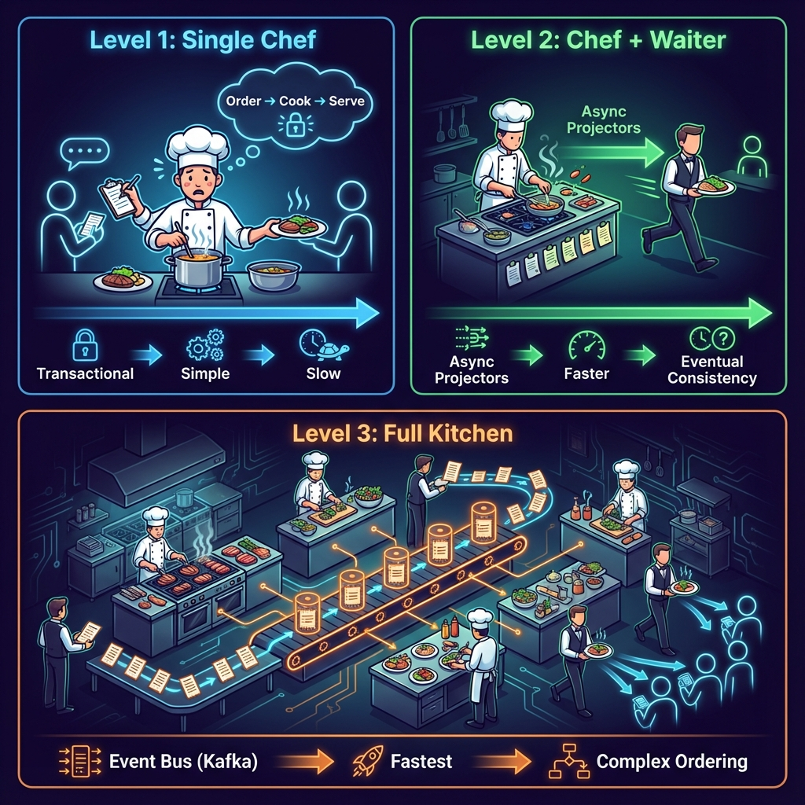
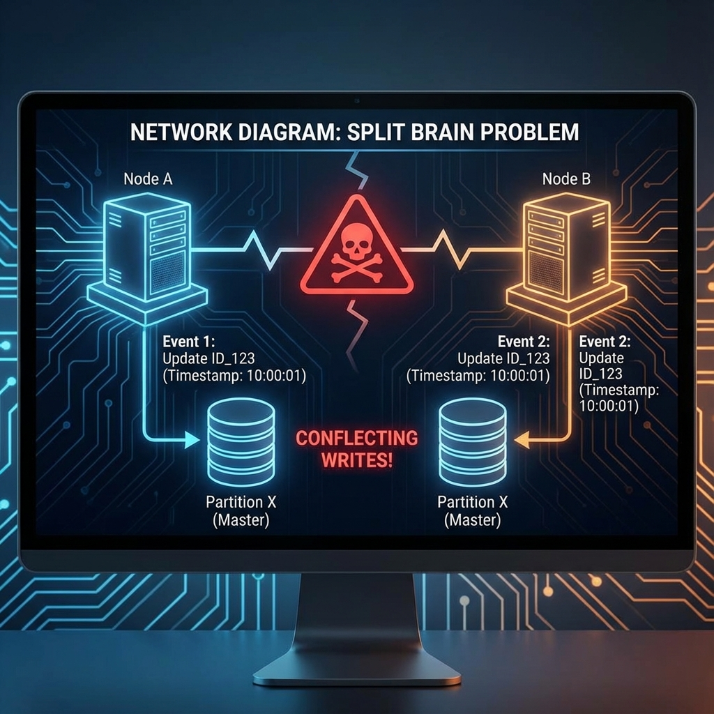

# Event Sourcing: Pitfalls & Production Challenges

> **Source**: Andrzej Ludwikowski's presentation on practical challenges of Event Sourcing.

---

## The Restaurant Kitchen Analogy



---

## 🍳 The Three Levels of Implementation

### Level 1: Transactional (The Single Chef)

**How it works**: Events and Read Models are updated in a **single database transaction**.

```
Command → [Write Event + Update Read Model] → COMMIT
```

| Pros | Cons |
| :--- | :--- |
| ✅ Simple to implement | ❌ Slowest performance |
| ✅ Zero eventual consistency | ❌ Limited scalability |
| ✅ Easy debugging | ❌ Read Model tied to Write Model |

**When to use**: Small systems, MVPs, "not-yet-event-sourced" prototypes.

---

### Level 2: Asynchronous Projectors (Chef + Waiter)

**How it works**: Events are written fast (append-only). A **Projector** reads them asynchronously to update Read Models.

```
Command → [Write Event] → COMMIT
                 ↓ (async)
            [Projector] → Update Read Model
```

| Pros | Cons |
| :--- | :--- |
| ✅ Faster writes (append-only) | ⚠️ Eventual Consistency |
| ✅ Read/Write separation | ⚠️ Potential projection lag |
| ✅ Projectors can be rebuilt | ⚠️ Need to handle idempotency |

**When to use**: Systems needing faster writes but can tolerate read lag.

---

### Level 3: Event Bus (Full Kitchen)

**How it works**: An **Event Bus** (Kafka, RabbitMQ) buffers events between the Event Store and Projectors.

```
Command → [Write Event] → [Event Bus (Kafka)] → [Projector 1]
                                              → [Projector 2]
                                              → [Projector N]
```

| Pros | Cons |
| :--- | :--- |
| ✅ Hundreds of projectors | ⚠️ Complex sequence tracking |
| ✅ DB not overloaded | ⚠️ At-least-once delivery |
| ✅ Decoupled microservices | ⚠️ Ordering challenges |

**When to use**: High-scale, microservice architectures (Google, Netflix).

> [!TIP]
> **Sequence Number Tracking**: Each projector stores its last processed `sequenceNumber`. On restart, it asks the Event Bus: "Give me everything after X."

---

## 🔧 Technical Deep Dives

### Serialization: JSON vs Binary

Ludwikowski recommends **Binary Serialization** (Protocol Buffers, Avro) over JSON.

| Format | Human Readable | Speed | Disk Space | Schema Evolution |
| :--- | :---: | :---: | :---: | :---: |
| **JSON** | ✅ | ❌ Slow | ❌ Large | ❌ Manual |
| **Protobuf** | ❌ | ✅ Fast | ✅ ~70% smaller | ✅ Built-in |
| **Avro** | ❌ | ✅ Fast | ✅ ~70% smaller | ✅ Schema Registry |

**Why it matters**:
-   Event stores grow indefinitely. 70% disk savings = significant cost reduction.
-   Schema evolution (adding/removing fields) is handled automatically.
-   Faster serialization = lower write latency.

---

### Event Enrichment: Delta vs Fat Events

**Problem**: A projector receives `WithdrawalEvent { amount: 50 }`. To update the user's balance, it needs to know the *previous* balance.

| Approach | Example | Projector Complexity |
| :--- | :--- | :--- |
| **Delta (Thin) Event** | `{ amount: 50 }` | Must query external source for current balance. ❌ |
| **Enriched (Fat) Event** | `{ amount: 50, newBalance: 450 }` | Self-contained. ✅ |

**Recommendation**: **Enrich events** with all data the projector needs. This keeps projectors stateless and decoupled.

---

## ⚠️ Practical Hazards ("Unicorns")

### 1. Exactly-Once Delivery is a Myth

> [!CAUTION]
> In distributed systems, **Exactly-Once delivery is impossible**. Network failures, retries, and failures mid-flight guarantee duplicates or losses.

**What to aim for instead**: **Effectively-Once** processing.

| Strategy | How |
| :--- | :--- |
| **Idempotent Updates** | `SET balance = 450` instead of `SET balance = balance - 50`. Same result if run twice. |
| **Sequence Tracking** | Store last processed `sequenceNumber`. Skip duplicates. |
| **Transactional Outbox** | Update Read Model and record processed event ID in the same transaction. |

---

### 2. Immutability: Events Must NEVER Be Changed

**Rule**: You cannot `UPDATE` or `DELETE` events in the Event Store.

**What if there's an error?**

| Wrong Way | Right Way |
| :--- | :--- |
| `UPDATE Events SET amount = 100 WHERE id = X` | Apply a **Healing Command** that produces a **Compensating Event**. |

**Example**:
```
[DepositApplied { amount: 50 }]   // Oops, should have been 100
[DepositCorrected { originalEventId: X, correctedAmount: 100, note: "JIRA-567" }]
```

The history shows *both* the mistake and the correction.

---

### 3. The Split Brain Problem



**Scenario**: In a clustered solution (Akka Cluster, Kafka Consumer Groups), a network partition occurs.

-   Node A believes it owns `User:123`.
-   Node B *also* believes it owns `User:123`.
-   Both nodes write conflicting events simultaneously.
-   **Result**: Data corruption.

**Solutions**:

| Strategy | How |
| :--- | :--- |
| **Split-Brain Resolver** | Akka's `keep-majority` or `keep-oldest` strategy. One node "wins", the other is killed. |
| **Lease-Based Ownership** | Node must hold a valid "lease" (e.g., etcd lock) to write. Lease expires on partition. |
| **Chaos Testing** | Simulate partitions regularly (Netflix's Chaos Monkey) to ensure resolvers work. |

> [!WARNING]
> **Test your Split-Brain Resolver**. The worst time to discover it doesn't work is in production at 3 AM.

---

### 4. GDPR: The "Right to Forget"

**Problem**: Events are immutable, but GDPR requires deleting personal data.

**Solution: Crypto Shredding**
1.  Encrypt user-specific data with a **per-user encryption key**.
2.  Store the key in a separate, deletable Key Management System.
3.  To "forget" a user: **delete their key**. Events become unreadable garbage.

---

## 🏗️ The Framework Dilemma

Ludwikowski critiques frameworks like **Axon** or **Lagom**:

| Framework Approach | Problem |
| :--- | :--- |
| **Axon** | Pollutes domain with `@Aggregate`, `@EventHandler` annotations. Domain becomes framework-dependent. |
| **Lagom** | Forces JSON serialization format. Hard to switch to Protobuf. |

**Recommendation: Library-Based Approach**

Use a **library** that treats persistence as a plugin, not a core concern.

| Library | Language | Philosophy |
| :--- | :--- | :--- |
| **Akka Persistence Typed** | Scala/Java | Domain stays "plain Scala". Persistence is just a side effect. |
| **Marten** | .NET | Postgres as Event Store. Domain stays POCO. |
| **Eventuous** | .NET | Lightweight, library-first. |

> [!TIP]
> **The "Plain Old Object" test**: Can you unit test your Aggregate without any framework imports? If not, your domain is polluted.

---

## 📊 Scaling the Write Side

Two strategies for handling concurrent writes:

| Strategy | How | Trade-off |
| :--- | :--- | :--- |
| **Optimistic Locking** | Check version before write. Retry on conflict. | Limited by DB capabilities. |
| **Single Writer Principle** | Only ONE node handles writes for a given Aggregate (via sharding/cluster). | Requires distributed coordination (Akka Cluster, Kubernetes). |

**Recommended Database**: **Cassandra / ScyllaDB**
-   Optimized for writes (no single master).
-   Partitioning by design (StreamID as partition key).
-   No single point of failure.

---

## 📡 Deep Dive: Kafka as Event Bus at Google Scale

### Why Kafka? (And When NOT to Use It)

| Use Case | Kafka? | Why |
| :--- | :---: | :--- |
| **Fanout to 100+ Projectors** | ✅ | Single write, many readers. DB polling doesn't scale. |
| **Cross-DC Replication** | ✅ | MirrorMaker replicates topics across datacenters. |
| **Long-term Event Store** | ❌ | Kafka is a BUFFER, not a database. Use Cassandra/EventStoreDB. |
| **Guaranteed Ordering across all events** | ❌ | Kafka orders per-partition only. Global order requires single partition (no parallelism). |

---

### Kafka Partitioning Strategy

**Problem**: You have 1M events/sec. One partition = one consumer = bottleneck.

**Solution**: Partition by `aggregateId` (e.g., `User:123`).

```
Topic: user-events
├── Partition 0: User:1, User:4, User:7...
├── Partition 1: User:2, User:5, User:8...
└── Partition 2: User:3, User:6, User:9...
```

**Benefit**: Events for the same aggregate are **always in the same partition** = **guaranteed ordering per aggregate**.

**Pitfall**: Hot keys (e.g., `SystemAggregate:Global`) end up in one partition = single consumer = bottleneck.

| Hot Key Solution | How |
| :--- | :--- |
| **Key Salting** | `SystemAggregate:Global:0`, `SystemAggregate:Global:1`... Fan out, fan in. |
| **Dedicated Topic** | Route hot aggregates to a separate topic with more partitions. |

---

### Consumer Group Semantics

**Scenario**: 3 consumers in group `projection-A`, 6 partitions.

```
Consumer 1: Partition 0, Partition 1
Consumer 2: Partition 2, Partition 3
Consumer 3: Partition 4, Partition 5
```

**What happens on Consumer 2 crash?**
-   Kafka **rebalances**: Partitions 2, 3 redistributed to Consumers 1, 3.
-   Consumer 1 now processes Partition 0, 1, 2.
-   **Lag spikes** during rebalance (no processing happens).

**Google-Scale Mitigation**:

| Strategy | How | Trade-off |
| :--- | :--- | :--- |
| **Incremental Cooperative Rebalancing** | Kafka 2.4+. Only reassign affected partitions, not all. | Still some lag. |
| **Static Group Membership** | Assign partitions manually via `group.instance.id`. No rebalance on restart. | Manual partition management. |
| **Over-Provision Consumers** | More consumers than partitions. Idle consumers = instant failover. | Cost. |

---

### Offset Management: The Commit Dance

**Rule**: Commit offset AFTER processing, not before.

| Commit Strategy | Behavior | Risk |
| :--- | :--- | :--- |
| **Auto-Commit (default)** | Commits every 5s, regardless of processing. | Message loss if crash mid-process. |
| **Manual Commit (at-least-once)** | Commit after processing complete. | Duplicates on crash (replay from last commit). |
| **Transactional (exactly-once)** | Kafka Transactions (EOS). Commit with side-effect in same atomic unit. | Complex, requires idempotent producer. |

**Google Recommendation**: **Manual Commit + Idempotent Projectors**.

```java
// Pseudo-code
for (record : records) {
    if (alreadyProcessed(record.eventId())) continue;  // Idempotency check
    process(record);
    markAsProcessed(record.eventId());
}
consumer.commitSync();  // Commit AFTER loop
```

---

### Reprocessing / Replay from Kafka

**Scenario**: You deployed a bug. Projection is corrupted. Need to replay last 7 days.

**Steps**:
1.  **Reset Consumer Offset**: `kafka-consumer-groups --reset-offsets --to-datetime 2024-01-01T00:00:00.000`.
2.  **Truncate Projection Table**: `TRUNCATE TABLE user_balance_read_model;`
3.  **Restart Consumer**: It replays from the new offset.

**Pitfall**: Kafka retention is 7 days by default. Events older than that are **deleted**.

| Retention Strategy | When |
| :--- | :--- |
| **Increase retention** | 30 days for critical topics. |
| **Tiered Storage (Confluent)** | Long-term on S3, recent on SSD. |
| **Dual Write (ES + Kafka)** | Event Store is truth. Kafka is buffer. Replay from ES if needed. |

---

### Dead Letter Queue (DLQ)

**Problem**: A poison message (malformed event) crashes the consumer in a loop.

**Solution**: Route failures to a DLQ topic.

```
Topic: user-events                   Topic: user-events-dlq
       │                                    │
       ├──▶ [Consumer] ──(fail 3x)──▶ [Publish to DLQ]
       │                                    │
       └──▶ [Process success]               └──▶ [Manual Review / Alert]
```

**Google Pattern**:
1.  Retry 3 times with exponential backoff (1s, 5s, 30s).
2.  After 3 failures, publish to `<topic>-dlq`.
3.  Alert on-call engineer.
4.  DLQ has infinite retention.

---

### Kafka vs Pub/Sub (Google Cloud)

| Feature | Kafka | Google Cloud Pub/Sub |
| :--- | :--- | :--- |
| **Ordering** | Per-partition guaranteed | Per-ordering-key (optional) |
| **Retention** | 7 days default (configurable) | 7 days (31 max) |
| **Replay** | Reset offset | Seek to timestamp |
| **Exactly-Once** | Kafka Transactions | Dataflow integration |
| **Managed** | Self-hosted or Confluent | Fully managed |

**When to use Pub/Sub**: Fully managed, GCP-native, no Kafka ops overhead.

---

## 🚀 Advanced Production Scenarios (SDE-3 Level)

### Scenario 1: The "Thundering Herd" on Startup

**Problem**: 100 projectors restart simultaneously. Each seeks to offset 0. Kafka brokers overwhelmed.

**Solution**:
-   **Staggered Startup**: Kubernetes `readinessProbe` with random delay.
-   **Rate-Limited Catch-Up**: Consumer config `max.poll.records=100` during catch-up, increase to 10000 once caught up.

---

### Scenario 2: Schema Evolution in Flight

**Problem**: Producer deploys new field `middleName`. Old consumers crash on deserialization.

**Solution: Schema Registry + Compatibility Checks**
1.  **Avro Schema Registry** (Confluent) validates schema compatibility on producer publish.
2.  **Backward Compatible** changes only: Add optional fields, never remove/rename.
3.  Consumer ignores unknown fields (forward compatibility).

| Compatibility Mode | Allowed Change |
| :--- | :--- |
| **Backward** | New schema can read old data. (Add optional fields.) |
| **Forward** | Old schema can read new data. (Consumers ignore unknown fields.) |
| **Full** | Both backward and forward. (Safest.) |

---

### Scenario 3: Cross-Region Active-Active

**Problem**: Users in US and EU write to local Event Stores. Events must be visible globally.

**Architecture**:
```
US Region                           EU Region
[Event Store US] ──▶ [Kafka US] ──▶ [MirrorMaker] ──▶ [Kafka EU] ──▶ [Projectors EU]
       │                                                                     │
       └────────────────────  [Global Read Model]  ◀─────────────────────────┘
```

**Challenges**:
-   **Ordering**: Events from US and EU may arrive out of order globally.
-   **Conflict Resolution**: If User:123 is modified in both regions simultaneously, which wins?

**Solutions**:
| Strategy | How |
| :--- | :--- |
| **Last-Write-Wins (LWW)** | Use timestamp. Latest event wins. |
| **Region Affinity** | User:123 always routes to US. No conflicts. |
| **CRDTs** | Conflict-free data structures (counters, sets). |

---

### Scenario 4: Poison Pill Detection

**Problem**: A single malformed event blocks the entire partition (consumer keeps crashing).

**Detection**:
```java
try {
    process(event);
} catch (DeserializationException e) {
    // Poison pill detected
    publishToDlq(event);
    return; // Skip, don't commit
}
```

**Prevention**:
-   Schema validation at producer.
-   Contract tests between producers and consumers.

---

### Scenario 5: Lag Alerting and SLOs

**Metric**: `kafka_consumer_group_lag` (offset difference between latest and committed).

| Lag Threshold | Severity | Action |
| :--- | :--- | :--- |
| < 1000 events | ✅ Healthy | None. |
| 1000 - 10000 | ⚠️ Warning | Investigate slow consumer. |
| > 10000 | 🚨 Critical | Page on-call. Scale consumers. |

**SLO Example**: "Read Model must be within 5 seconds of write."
-   Measure: `(latestEventTimestamp - lastProjectedEventTimestamp)`.
-   Alert if SLO breached for > 1 minute.

---

### Scenario 6: Blue-Green Projection Migration

**Problem**: You need to change projection logic (e.g., new aggregation). Can't update in-place.

**Steps**:
1.  Deploy **Projection v2** with a NEW consumer group (`projection-balance-v2`).
2.  v2 reads from **offset 0** (full replay).
3.  v2 writes to **new Read Model table** (`user_balance_v2`).
4.  Once v2 is caught up (lag = 0), **switch API traffic** to v2.
5.  Decommission v1 consumer group and old table.

---

### Scenario 7: Handling Clock Skew

**Problem**: Event timestamps are set by the producer. If Producer A's clock is 5 minutes ahead, events appear "from the future."

**Solutions**:
| Strategy | How |
| :--- | :--- |
| **Broker Timestamp** | Kafka can append broker receive time. Use `log.message.timestamp.type=LogAppendTime`. |
| **Logical Clocks** | Use Lamport timestamps or vector clocks for causal ordering. |
| **NTP Sync** | Ensure all producers use NTP. Tolerate small drift (< 1s). |

---

### Scenario 8: Compaction for "Latest State" Topics

**Use Case**: You want a topic that always has the "latest" event per key (e.g., user profile cache).

**Kafka Log Compaction**:
```
Before Compaction:
[User:1, v1] [User:2, v1] [User:1, v2] [User:1, v3]

After Compaction:
[User:2, v1] [User:1, v3]
```

**Pitfall**: Log compaction is NOT Event Sourcing. You lose history. Use only for derived "snapshot" topics.

---

### Scenario 9: Testing with Embedded Kafka

**Problem**: Integration tests need Kafka, but spinning up a cluster is slow.

**Solution**: **Testcontainers** or **Embedded Kafka**.

```java
@EmbeddedKafka(partitions = 3, topics = {"test-topic"})
class MyProjectorTest {
    @Test
    void shouldProjectEvent() {
        kafkaTemplate.send("test-topic", event);
        await().atMost(5, SECONDS).until(() -> readModel.contains(expected));
    }
}
```

---

### Scenario 10: Handling Aggregate Deletion

**Problem**: User requests account deletion. `UserDeleted` event is published. What happens to the stream?

| Strategy | What Happens |
| :--- | :--- |
| **Soft Delete (Tombstone)** | Publish `UserDeleted`. Projections remove user. Stream stays (audit). |
| **Crypto Shredding** | Delete user's encryption key. Events become unreadable. Stream stays. |
| **Hard Delete (Rare)** | Physically delete stream. Breaks replay. Avoid unless legally required. |

---

## 🏛️ Principal Architect Level: Operational Excellence

### 1. Incident Response Playbook

**Tier 1 Incidents (Platform)**:
| Incident | Detection | Immediate Action |
| :--- | :--- | :--- |
| **Kafka Broker Down** | `broker_up` metric = 0 | Failover to replica. Page platform on-call. |
| **Event Store Unreachable** | Connection timeout alerts | Circuit breaker activates. Buffer to local outbox. |
| **Split Brain Detected** | Multiple leaders for partition | Trigger split-brain resolver. Restart minority nodes. |

**Tier 2 Incidents (Domain)**:
| Incident | Detection | Immediate Action |
| :--- | :--- | :--- |
| **Projection Lag > 5 min** | `kafka_consumer_group_lag` | Scale consumers. Check for poison messages. |
| **DLQ Size Growing** | `dlq_message_count` | Investigate errors. Pause consumer if corrupting data. |
| **Duplicate Events Detected** | Business alerts (double charge) | Enable idempotency checks. Investigate producer. |

**Post-Incident Review Template**:
```markdown
## Incident: [TITLE]
### Timeline
- 10:00 - Alert fired
- 10:05 - On-call acknowledged
- 10:30 - Root cause identified
- 11:00 - Mitigation applied

### Root Cause
[Description]

### Action Items
- [ ] Fix in code
- [ ] Add monitoring
- [ ] Update runbook
```

---

### 2. Kafka Capacity Planning Matrix

| Workload | Partitions | Brokers | Retention | Consumer Instances |
| :--- | :---: | :---: | :---: | :---: |
| **Small (100K msg/day)** | 6 | 3 | 7 days | 3 |
| **Medium (10M msg/day)** | 30 | 5 | 14 days | 10 |
| **Large (1B msg/day)** | 300 | 15 | 7 days | 50 |
| **Google Scale (100B msg/day)** | 3000+ | 100+ | 3 days + Tiered | 500+ |

**Partition Sizing Formula**:
```
Partitions = max(
    Expected Throughput / Single Partition Throughput,
    Expected Consumer Parallelism
)
```

---

### 3. Migration Patterns

**Migrating to Event Sourcing**:
| Phase | Action |
| :--- | :--- |
| **1. Dual Write** | Write to both old DB and new Event Store. |
| **2. Shadow Read** | Read from Event Store, compare with old DB (no user impact). |
| **3. Switch Primary** | Read from Event Store, async sync to old DB (fallback). |
| **4. Decommission** | Remove old DB writes. |

**Migrating Off Event Sourcing**:
| Phase | Action |
| :--- | :--- |
| **1. Project to New Store** | Create projection that writes to new system. |
| **2. Backfill** | Replay entire history to new system. |
| **3. Dual Read** | Compare new system vs. Event Store. |
| **4. Switch Primary** | Point reads to new system. Stop ES writes. |

---

### 4. Operational Dashboards

**Essential Panels**:
| Panel | Metrics |
| :--- | :--- |
| **Event Store Health** | Append latency (p50, p99), error rate |
| **Kafka Health** | Broker count, under-replicated partitions |
| **Consumer Health** | Lag per consumer group, processing rate |
| **Projection Status** | Last processed offset vs. latest, age of last event |
| **DLQ Monitor** | Messages per topic, age of oldest message |

**SLO Dashboard**:
| SLI | SLO | Current |
| :--- | :--- | :--- |
| Event Append Latency (p99) | < 100ms | 45ms ✅ |
| Projection Lag | < 10 seconds | 3s ✅ |
| Availability | 99.9% | 99.95% ✅ |
| Error Rate | < 0.1% | 0.02% ✅ |

---

### 5. Chaos Engineering Scenarios

| Scenario | How to Simulate | Expected Behavior |
| :--- | :--- | :--- |
| **Broker Failure** | `kill -9` on Kafka broker | Partition leadership transfers. Consumers reconnect. |
| **Network Partition** | `iptables` block between nodes | Split-brain resolver activates. Minority side fences itself. |
| **Event Store Latency Spike** | Inject 5s delay | Circuit breaker trips. Writes buffer locally. |
| **Consumer Crash Mid-Processing** | `kill -9` during processing | Event redelivered. Idempotency prevents duplicates. |

**Chaos Test Cadence**:
-   Weekly: Single component failure.
-   Monthly: Multi-component failure.
-   Quarterly: Full region failover drill.

---

## Summary

> [!IMPORTANT]
> **Event Sourcing is not inherently simple**. The deeper you go (Level 1 → Level 3), the more operational complexity you take on.

**Key Takeaways**:
1.  **Start simple** (Level 1) and evolve only when needed.
2.  **Binary serialization** saves disk and simplifies evolution.
3.  **Enrich events** to keep projectors stateless.
4.  **Aim for Effectively-Once**, not Exactly-Once.
5.  **Test your Split-Brain Resolver** before it tests you.
6.  **Prefer libraries over frameworks** to keep your domain clean.
7.  **Kafka is a buffer, not a database.** Pair with a true Event Store.
8.  **Partition by aggregateId** for ordering + parallelism.
9.  **DLQ everything**. Poison pills will happen.
10. **Blue-Green Projections** for zero-downtime migration.

**Principal Architect Checklist**:
- [ ] Incident playbooks documented and tested
- [ ] Capacity planned for 3-year growth
- [ ] Migration runbook approved
- [ ] Dashboards and SLOs defined
- [ ] Chaos tests scheduled quarterly

10. **Blue-Green Projections** for zero-downtime migration.
