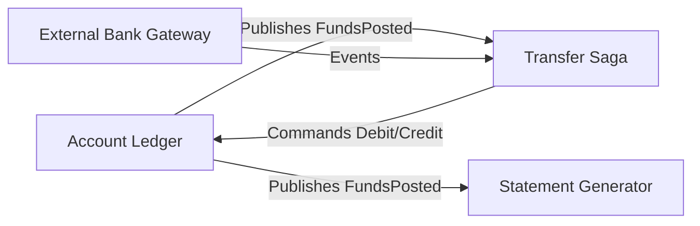

# Event Sourcing with Domain-Driven Design

> **Source**: Thomas Bøgh Fangel (Staff Engineer at Luna, Nordic Neo Bank) - 4 years of ES + DDD in banking.

---

## 🏦 Context: Why Luna Chose Event Sourcing

| Factor | Decision |
| :--- | :--- |
| **Domain** | Banking - managing people's money |
| **Primary Driver** | **Traceability** - must know exactly what happened at all times |
| **Scale** | ~300 microservices, ~100 using Event Sourcing |
| **Environment** | Cloud-native on GCP |

> [!IMPORTANT]
> **Event Sourcing is a perfect fit for financial domains** where audit trails and regulatory compliance are non-negotiable.

---

## 🏗️ Challenge 1: The Long Event Stream

### The Problem
Banking accounts naturally accumulate many events over years:
- Account opened
- 1000s of deposits/withdrawals
- Interest calculations
- Fee applications
- Regulatory holds

**Impact**: Loading every event to calculate current balance = **high latency for active accounts**.

### Solution 1: Snapshotting

```
Without Snapshots:
[Event 1] → [Event 2] → ... → [Event 10,000] → Calculate State (SLOW!)

With Snapshots (every 100 events):
[Snapshot @ Event 9,900] → [Event 9,901] → ... → [Event 10,000] → Calculate State (FAST!)
```

**Implementation**:
```java
public class AccountAggregate {
    private static final int SNAPSHOT_FREQUENCY = 100;
    
    public void loadFromHistory(List<Event> events) {
        Snapshot latest = snapshotStore.getLatest(accountId);
        if (latest != null) {
            this.state = latest.getState();
            this.version = latest.getVersion();
            events = events.stream()
                .filter(e -> e.getSequence() > latest.getVersion())
                .collect(toList());
        }
        events.forEach(this::apply);
    }
    
    public void save() {
        eventStore.append(this.uncommittedEvents);
        if (this.version % SNAPSHOT_FREQUENCY == 0) {
            snapshotStore.save(new Snapshot(accountId, version, state));
        }
    }
}
```

**Snapshotting Strategies**:
| Strategy | Trigger | Use Case |
| :--- | :--- | :--- |
| **Every N Events** | `version % 100 == 0` | Predictable, simple |
| **Every N Minutes** | Scheduled job | Time-sensitive domains |
| **On Demand** | `eventCount > threshold` | Adaptive |
| **On Read** | If load time > 500ms | Lazy optimization |

---

### Solution 2: Bounded vs Unbounded State

**Problem**: Storing all historical reservations in memory = **OOM crash**.

| State Type | Example | In-Memory? |
| :--- | :--- | :---: |
| **Bounded** | Current balance, status | ✅ Yes |
| **Unbounded** | All transaction history, all reservations | ❌ No |

**Solution**: Move unbounded views to **SQL-based read models** (accept eventual consistency).

```
Write Side (Event Store):
[Account Aggregate] → Current balance ✅

Read Side (Postgres):
[transactions_view] → All historical transactions
[reservations_view] → All reservations with status
```

---

### Solution 3: Event Evolution (Upgrades On-The-Fly)

**Problem**: Event schema changes, but old events are immutable.

**Luna's Approach**: Upcaster library that transforms old events during read.

```java
public class TransactionEventUpcaster implements Upcaster<TransactionEvent> {
    
    public TransactionEvent upcast(TransactionEvent event) {
        // v1 → v2: Add country code (didn't exist before)
        if (event.getVersion() < 2) {
            event = event.withCountryCode("DK"); // Default
        }
        
        // v2 → v3: Add clearing info
        if (event.getVersion() < 3) {
            event = event.withClearingInfo(
                lookupClearingInfo(event.getBankCode())
            );
        }
        
        return event;
    }
}
```

**Versioning Strategies**:
| Strategy | How | Trade-off |
| :--- | :--- | :--- |
| **Upcasting** | Transform on read | No storage cost, CPU cost |
| **Copy-Transform** | Migrate to new store | Storage cost, clean data |
| **Weak Schema** | Only add optional fields | Simple, limited changes |

---

## 🧩 Challenge 2: Getting the DDD Model Right

### The Anti-Pattern: Mixed Responsibilities

Luna's **initial (wrong) design**:

```
AccountAggregate
├── handleTransferInitiated()
├── handleFundsReserved()
├── handleTransferCompleted()
├── handleRetryTimeout()      // ← Orchestration logic!
└── handleTransferFailed()
```

**Problem**: The Account knows too much about transfers. It mixes:
- **Business Logic** (funds, balance)
- **Orchestration** (retries, timeouts)

### The Correct Model: Separation of Concerns

```
┌─────────────────────────────────────────────────────────────────┐
│                        Transfer Domain                          │
│  ┌─────────────────┐        ┌─────────────────┐                 │
│  │  TransferSaga   │───────▶│ RetryScheduler  │                 │
│  │  (Orchestration)│        │ (Infrastructure)│                 │
│  └────────┬────────┘        └─────────────────┘                 │
│           │ Commands                                             │
│           ▼                                                      │
│  ┌─────────────────┐                                            │
│  │ AccountLedger   │ ← Only knows about postings (debit/credit) │
│  │ (Business Logic)│ ← No knowledge of "transfer" concept       │
│  └─────────────────┘                                            │
└─────────────────────────────────────────────────────────────────┘
```

### Aggregate vs Saga Responsibilities

| Component | Responsibility | Events |
| :--- | :--- | :--- |
| **Account Ledger** | Business state: balance, holds | `FundsPosted`, `HoldPlaced`, `HoldReleased` |
| **Transfer Saga** | Orchestration: retry, timeout, compensation | `TransferInitiated`, `TransferCompleted`, `TransferFailed` |

**Key Insight**:
> [!TIP]
> **The Account Ledger should be "transfer-agnostic"**. It only records debits and credits. It doesn't know if the posting came from a transfer, a fee, or interest.

---

## 📡 Challenge 3: Resilient Subscriptions (Outbox Pattern)

### The Outbox Pattern Explained

When an event is written, it must also trigger:
- Read model updates
- Notifications
- External integrations

**Without Outbox**: Two separate transactions = risk of inconsistency.

```
// DANGEROUS: Two transactions
eventStore.save(event);         // Transaction 1
notificationService.send(event); // Transaction 2 (may fail independently)
```

**With Outbox**: Single transaction, separate processing.

```
// SAFE: Single transaction
database.transaction(() -> {
    eventStore.save(event);
    outbox.save(event);  // Same transaction
});

// Separate process reads outbox and dispatches
outboxProcessor.poll() → notificationService.send(event);
```

---

### Luna's Outbox Evolution

#### Version 1: Row-Level Locks (Problematic)

```sql
-- Every instance locks the same row
SELECT * FROM outbox WHERE processed = false FOR UPDATE;
-- Process event
UPDATE outbox SET processed = true WHERE id = ?;
```

**Problem**: All instances compete for the same lock = **lock congestion** = throughput bottleneck.

#### Version 2: Consistent Hashing (Current)

```
Event Stream ID → Hash → Partition Assignment → Instance

stream-123 → hash(123) → partition 0 → instance-1
stream-456 → hash(456) → partition 1 → instance-2
stream-789 → hash(789) → partition 2 → instance-3
```

> [!TIP]
> **✉️ Busy Mailroom Analogy**:
> *   **Locked Version (Row Locks)**: Every worker crowds around one single pile of mail. Only one person can touch the pile at a time to grab a letter, forcing everyone else to wait.
> *   **Partitioned Version (Consistent Hashing)**: Mail is pre-sorted into bins based on the recipient's name (ID). Each worker is assigned a specific set of bins, so they can all work simultaneously without bumping into each other.

**Benefit**: Each instance owns specific partitions. **No lock contention**.

```java
public class PartitionedOutboxProcessor {
    private final int instanceId;
    private final int totalInstances;
    
    public boolean ownsStream(String streamId) {
        int partition = Math.abs(streamId.hashCode()) % totalInstances;
        return partition == instanceId;
    }
    
    public void poll() {
        outbox.getUnprocessed()
            .filter(e -> ownsStream(e.streamId))
            .forEach(this::process);
    }
}
```

---

### Replay Support for Read Models

**Scenario**: New read model needs to be populated with historical data.

**Luna's Approach**: Backstage plugin for developer self-service.

```yaml
# Backstage catalog-info.yaml
apiVersion: backstage.io/v1alpha1
kind: Component
metadata:
  name: account-balance-read-model
  annotations:
    luna.io/supports-replay: "true"
    luna.io/replay-handler: "AccountBalanceProjector"
```

**Replay Workflow**:
1. Developer clicks "Replay" in Backstage.
2. System resets projector offset to 0.
3. System drops and recreates read model table.
4. Projector replays all events.
5. Dashboard shows progress.

---

## 🏛️ Principal Architect Level: ES + DDD Governance

### 1. Aggregate Design Rules

| Rule | Why |
| :--- | :--- |
| **One aggregate per transaction** | Ensures consistency boundary |
| **Aggregates reference by ID only** | Avoids deep object graphs |
| **Events are past-tense verbs** | `OrderPlaced` not `PlaceOrder` |
| **Don't model orchestration in aggregates** | Use Sagas for workflows |

### 2. Event Storming Cadence

| When | Activity |
| :--- | :--- |
| **New Domain** | Full event storming (2-3 days) |
| **Major Feature** | Focused storming (4-8 hours) |
| **Quarterly** | Domain health check (review boundaries) |

### 3. Bounded Context Mapping



### 4. When NOT to Use Event Sourcing

| Scenario | Recommendation |
| :--- | :--- |
| **Simple CRUD data** | Use regular database |
| **No audit requirement** | Overkill |
| **Team has no ES experience** | Start with 1 bounded context, not the whole system |
| **Short-lived data** | Events are forever overhead |

### 5. Technology Selection

| Component | Luna's Stack | Alternatives |
| :--- | :--- | :--- |
| **Event Store** | Custom on Postgres | EventStoreDB, Marten |
| **Outbox** | Custom partitioned | Debezium CDC |
| **Saga Orchestration** | Custom | Temporal, Conductor |
| **Developer Portal** | Backstage | Internal wiki |

> [!TIP]
> **Luna's Advice**: "New projects should look at mature existing tools like EventStoreDB rather than building custom."

---

## 🎓 Key Learnings from Luna

| Learning | Detail |
| :--- | :--- |
| **Traceability is the killer feature** | For financial domains, this alone justifies ES complexity |
| **Domain experts matter** | Don't ignore established players' knowledge |
| **Modeling mistakes are expensive** | Get DDD right before implementing ES |
| **Tooling is hard** | Build only what's unique to your domain |
| **Read-side migrations are trivial** | "Just throw all events at a new read model" |

---

## Summary

> [!IMPORTANT]
> **Event Sourcing amplifies both good and bad domain modeling.**

**Key Takeaways**:
1. **Snapshot long streams** every 100 events.
2. **Move unbounded state to read models** (SQL).
3. **Upcast events on read** for schema evolution.
4. **Separate Aggregates (business) from Sagas (orchestration)**.
5. **Use consistent hashing for outbox** to avoid lock contention.
6. **Event Storm before you code**.

**Principal Architect Checklist**:
- [ ] Aggregate design rules documented
- [ ] Event storming cadence established
- [ ] Bounded context map maintained
- [ ] Tech stack decisions recorded
- [ ] Replay tooling available
