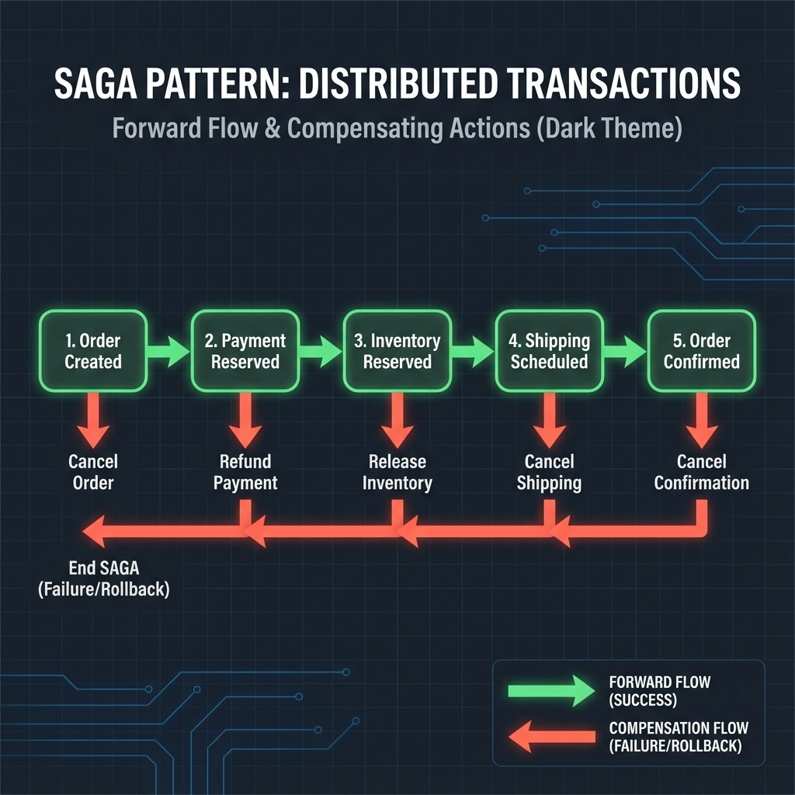
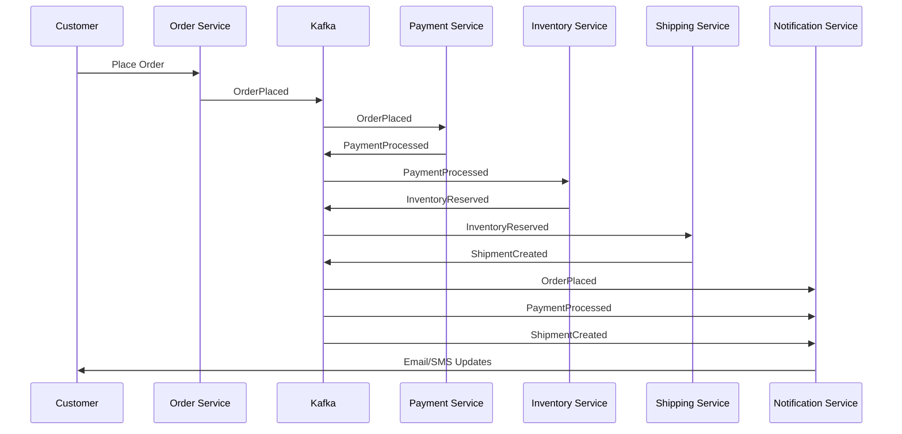

# Events, Workflows, and Sagas in Event-Driven Architecture

> 📺 **Source**: [Keeping Your Sanity with Event-Driven Architecture - Lutz Huehnken](https://www.youtube.com/watch?v=Uv1GOrZWpBM)

---

## Overview

This document explores the challenges and best practices of handling distributed processes in event-driven microservices. It examines common approaches (orchestration, workflow engines, sagas) and advocates for a mindset shift toward true choreography-based architecture.

---

## The "Windows on Mac" Problem

Huehnken opens with an anecdote: in 2008, a company bought Apple hardware but installed Windows XP, completely missing the benefits of the actual platform.

> [!WARNING]
> **Putting workflows on top of event-driven architecture (EDA)** is similar—while technically possible, it often counteracts the core benefits of being event-driven.

---

## Common Approaches to Distributed Processes

Developers typically handle multi-step processes (like order fulfillment) in three ways:

### 1. Central Coordinator
A single service (e.g., `OrderService`) manages the entire flow:
- Emits events and waits for responses
- Handles timeouts, retries, and process changes
- **Problem**: Technical bloat and single point of failure

### 2. Workflow Engines
External orchestration tools like **Temporal**, **Camunda**, or **Google Workflows**:
- Separates business logic from process logic
- **Problem**: Logic trapped in XML/YAML files; difficult to unit test

### 3. The Saga Pattern
A pattern for "all or nothing" distributed transactions:
- Uses **compensating transactions** to rollback on failure
- Accepts temporary inconsistency for eventual consistency
- Viewed as a spiritual successor to distributed transactions

---

## Understanding Workflows, Workflow Engines, and Sagas

> [!NOTE]
> This section clarifies the often-confused relationship between these concepts.

### What is a Workflow?

A **workflow** is simply a multi-step business process that executes in a specific order:
- Order → Payment → Inventory → Shipping → Notification
- User Registration → Email Verification → Profile Setup
- Loan Application → Credit Check → Approval → Disbursement

The challenge: **How do you coordinate these steps across distributed services?**

### What is a Workflow Engine?

A **workflow engine** (Temporal, Camunda, Conductor, Cadence) is a **tool** that provides:

| Capability | Description |
|------------|-------------|
| **State Tracking** | Knows which step you're on, even after crashes |
| **Failure Handling** | Automatic retries, timeouts, compensation |
| **Visibility** | Dashboards showing all running processes |
| **Durability** | Persists progress; survives restarts |
| **Long-running Support** | Can handle processes lasting days/weeks |

### How They All Relate

```
┌─────────────────────────────────────────────────────────────────┐
│              PROBLEM: Multi-step Distributed Processes           │
└─────────────────────────────────────────────────────────────────┘
                              │
        ┌─────────────────────┼─────────────────────┐
        ▼                     ▼                     ▼
   ┌─────────┐         ┌─────────────┐       ┌─────────────┐
   │  SAGA   │         │  WORKFLOW   │       │ CHOREOGRAPHY│
   │ Pattern │         │   ENGINE    │       │   (Pure)    │
   └─────────┘         └─────────────┘       └─────────────┘
        │                     │                     │
   A PATTERN for         A TOOL that can        An APPROACH
   handling failures     implement sagas        where services
   with compensation     with orchestration     self-coordinate
```

> [!IMPORTANT]
> **Saga** is a pattern (an idea). **Workflow Engine** is a tool (software). **Choreography** is an approach (architecture style). They are different categories!

### Comparison Table

| Concept | What It Is | Example |
|---------|------------|---------|
| **Saga** | A **pattern** for distributed transactions with compensation | "If payment fails, refund and release inventory" |
| **Workflow Engine** | A **tool** that can run orchestrated sagas | Temporal, Camunda, Netflix Conductor |
| **Choreography** | An **approach** where services coordinate via events | Each service listens and reacts independently |

### Why Use a Workflow Engine?

#### Without Workflow Engine (Pure Choreography)

```
OrderService → publishes "OrderPlaced" → done
PaymentService → listens, processes, publishes "PaymentProcessed"
InventoryService → listens, reserves, publishes "InventoryReserved"
```

**Pros:**
- ✅ Simple, decoupled
- ✅ Each team owns their service completely
- ✅ No central bottleneck

**Cons:**
- ❌ Hard to see the full end-to-end flow
- ❌ Failure handling scattered across services
- ❌ Debugging distributed failures is difficult

#### With Workflow Engine (Orchestration)

```python
# Temporal Workflow (pseudo-code)
@workflow
def order_workflow(order):
    try:
        payment = await PaymentService.charge(order)
        inventory = await InventoryService.reserve(order)
        shipment = await ShippingService.schedule(order)
        return "completed"
    except PaymentError:
        # Automatic compensation
        await InventoryService.release(order)
        await PaymentService.refund(order)
        return "failed"
```

**Pros:**
- ✅ Full flow visible in one place
- ✅ Built-in retries, timeouts, compensation
- ✅ Easy to debug and trace
- ✅ Handles long-running processes (days/weeks)

**Cons:**
- ❌ Additional infrastructure to maintain
- ❌ Central dependency (potential bottleneck)
- ❌ Logic in the engine, not in domain services

### When to Use What?

| Scenario | Recommended Approach |
|----------|---------------------|
| Simple flows (2-3 steps) | Pure choreography |
| Complex flows with many branches | Workflow engine |
| Autonomous team ownership | Choreography + micro-sagas |
| Long-running processes (days/weeks) | Workflow engine |
| Need explicit compensation logic | Orchestration-based saga |
| High throughput, low latency | Choreography |
| Regulatory/audit requirements | Workflow engine (better traceability) |

### Huehnken's Criticism

His point: **Don't use workflow engines just because you can.**

If you have:
- Autonomous teams
- Simple flows
- Event-driven mindset

Then choreography gives you **decoupling** and **team autonomy**. Workflow engines add complexity and can become a single point of failure—negating the benefits of microservices.

> [!CAUTION]
> Using heavy orchestration in microservices is like using SAFe (Scaled Agile Framework)—it attempts to force enterprise control onto something designed to be autonomous.

---

## Orchestration vs. Choreography

Understanding the fundamental difference between these two approaches is key to building maintainable event-driven systems.


| Aspect | Orchestration | Choreography |
|--------|---------------|--------------|
| **Control** | Central coordinator directs all services | Services react to events independently |
| **Coupling** | Tight—coordinator knows all services | Loose—services only know about events |
| **Failure Mode** | Single point of failure | Distributed failure handling |
| **Scalability** | Limited by coordinator | Scales naturally |
| **Visibility** | Easy to trace (one place) | Requires separate observability |

### 🎭 Theater Analogy

**Orchestration** = A director standing on stage shouting instructions to every actor. If the director trips, the whole play stops.

**Choreography** = A dance where every performer knows their part and reacts to others. No single person directs every moment, yet the group moves in harmony.

---

## The Saga Pattern Deep Dive

Sagas manage distributed transactions by breaking them into a series of local transactions, each with a compensating action.



### How It Works

1. Each step executes a local transaction and publishes an event
2. If a step fails, compensating transactions are triggered in reverse order
3. The system returns to a consistent state (eventual consistency)

### Saga Types

| Type | Description | Use Case |
|------|-------------|----------|
| **Choreography-based** | Services listen to events and decide actions | Simple flows, autonomous services |
| **Orchestration-based** | Central saga orchestrator coordinates steps | Complex flows, explicit control needed |

---

## 🎯 Saga Orchestration vs Saga Choreography: Deep Dive

> [!IMPORTANT]
> This is one of the most critical architectural decisions you'll make. At Google scale, the wrong choice can mean the difference between a system that scales to billions and one that becomes a bottleneck.

### Choreography-Based Saga

```
┌──────────┐    OrderPlaced     ┌───────────┐   PaymentProcessed   ┌─────────────┐
│  Order   │──────────────────▶ │  Payment  │─────────────────────▶│  Inventory  │
│ Service  │                    │  Service  │                      │   Service   │
└──────────┘                    └───────────┘                      └─────────────┘
     ▲                               │                                    │
     │         PaymentFailed         │      InventoryReserved            │
     └───────────────────────────────┘◀───────────────────────────────────┘
                (Compensation)
```

**How it works:**
1. Each service publishes events when it completes its work
2. Other services subscribe to relevant events and react
3. For compensation, services listen for failure events and undo their work

**Code Pattern (Event Handler):**
```typescript
// InventoryService - Choreography
@EventHandler('PaymentProcessed')
async onPaymentProcessed(event: PaymentProcessedEvent) {
  await this.reserveInventory(event.orderId, event.items);
  await this.eventBus.publish(new InventoryReservedEvent(event.orderId));
}

@EventHandler('PaymentFailed')
async onPaymentFailed(event: PaymentFailedEvent) {
  // Compensation - release any reserved inventory
  await this.releaseInventory(event.orderId);
}
```

### Orchestration-Based Saga

```
┌──────────────────────────────────────────────────────────────────┐
│                      SAGA ORCHESTRATOR                            │
│   ┌─────────────────────────────────────────────────────────┐    │
│   │  Step 1: Payment → Step 2: Inventory → Step 3: Shipping │    │
│   └─────────────────────────────────────────────────────────┘    │
└──────────────────────────────────────────────────────────────────┘
         │                    │                    │
         ▼                    ▼                    ▼
    ┌─────────┐         ┌───────────┐        ┌──────────┐
    │ Payment │         │ Inventory │        │ Shipping │
    │ Service │         │  Service  │        │ Service  │
    └─────────┘         └───────────┘        └──────────┘
```

**How it works:**
1. A central orchestrator knows the entire saga flow
2. It calls each service in sequence (or parallel where possible)
3. On failure, it explicitly calls compensation actions in reverse

**Code Pattern (Orchestrator):**
```typescript
// OrderSagaOrchestrator - Orchestration
class OrderSaga {
  async execute(order: Order): Promise<SagaResult> {
    const saga = new SagaBuilder()
      .step('payment')
        .invoke(() => this.paymentService.charge(order))
        .compensate(() => this.paymentService.refund(order))
      .step('inventory')
        .invoke(() => this.inventoryService.reserve(order))
        .compensate(() => this.inventoryService.release(order))
      .step('shipping')
        .invoke(() => this.shippingService.schedule(order))
        .compensate(() => this.shippingService.cancel(order))
      .build();

    return saga.run(); // Handles failures and compensation automatically
  }
}
```

### Head-to-Head Comparison

| Dimension | Choreography | Orchestration |
|-----------|--------------|---------------|
| **Coupling** | Loose (event contracts only) | Tight (orchestrator knows all services) |
| **Flow Visibility** | Hidden (scattered across services) | Explicit (one place) |
| **Adding Steps** | Add subscriber anywhere | Modify orchestrator |
| **Team Ownership** | Each team owns their reactions | Central team owns flow |
| **Failure Debugging** | Trace through event logs | Single point to debug |
| **Testing** | Test each service in isolation | Test full saga flow |
| **Latency** | Async (higher latency) | Can be sync (lower latency) |
| **Throughput** | Higher (no bottleneck) | Limited by orchestrator |

### When to Use Choreography

✅ **USE WHEN:**
- 2-5 services involved
- Teams are autonomous and own their domains
- Flow rarely changes
- High throughput is critical (>100K TPS)
- You want maximum decoupling
- Services are owned by different organizations

❌ **AVOID WHEN:**
- Complex branching logic (if-else-switch)
- Need to track overall saga state
- Strict ordering requirements
- Regulatory audit trails required

### When to Use Orchestration

✅ **USE WHEN:**
- 5+ services involved
- Complex conditional logic
- Need explicit compensation ordering
- Single team owns the entire flow
- Debugging/tracing is critical
- Long-running sagas (hours/days)

❌ **AVOID WHEN:**
- Orchestrator becomes a bottleneck
- Teams span organizational boundaries
- High fan-out (calling many services)
- Orchestrator team can't keep up with changes

---

## 🏗️ Workflow Engines: Architecture and When to Use

### What Layer Does a Workflow Engine Sit On?

```
┌────────────────────────────────────────────────────────────────────────┐
│                         APPLICATION LAYER                               │
│   ┌────────────────────────────────────────────────────────────────┐   │
│   │                    BUSINESS LOGIC / SAGAS                      │   │
│   │   (Your order processing, payment flows, etc.)                 │   │
│   └────────────────────────────────────────────────────────────────┘   │
│                                │                                        │
│                    ┌───────────▼───────────┐                           │
│                    │   WORKFLOW ENGINE     │  ◄── ORCHESTRATION LAYER  │
│                    │  (Temporal/Camunda)   │                           │
│                    │  - State Machine      │                           │
│                    │  - Durability         │                           │
│                    │  - Retries/Timeouts   │                           │
│                    └───────────┬───────────┘                           │
│                                │                                        │
└────────────────────────────────┼────────────────────────────────────────┘
                                 │
┌────────────────────────────────▼────────────────────────────────────────┐
│                         INFRASTRUCTURE LAYER                            │
│   ┌──────────────┐  ┌──────────────┐  ┌──────────────┐                 │
│   │    Kafka     │  │  PostgreSQL  │  │    Redis     │                 │
│   │ (Event Bus)  │  │ (Saga State) │  │   (Cache)    │                 │
│   └──────────────┘  └──────────────┘  └──────────────┘                 │
└─────────────────────────────────────────────────────────────────────────┘
```

### Workflow Engine vs Saga: The Relationship

> [!IMPORTANT]
> A workflow engine is **one way to implement** an orchestration-based saga. It's not a replacement for sagas—it's a tool that can run them.

| Relationship Type | Description |
|-------------------|-------------|
| **Workflow Engine implements Saga** | Temporal/Camunda can run your saga orchestration logic with built-in durability |
| **Saga without Workflow Engine** | You can build sagas with just Kafka + your own state machine |
| **Workflow Engine for non-Saga use cases** | Batch jobs, scheduled tasks, human approval workflows—not sagas at all |

### Workflow Engine Capabilities That Sagas Need

| Saga Requirement | How Workflow Engine Helps |
|------------------|---------------------------|
| **State Persistence** | Automatic checkpointing after each step |
| **Failure Recovery** | Resumes from last successful step after crash |
| **Timeout Handling** | Configurable timeouts per step with automatic compensation |
| **Compensation Logic** | First-class support for rollback actions |
| **Retry Policies** | Exponential backoff, max retries, etc. |
| **Visibility** | Dashboard showing all running sagas and their states |

---

## 🔥 Google-Scale Decision Framework

> [!CAUTION]
> At Google/Meta/Netflix scale (millions of TPS, thousands of services), these decisions have massive implications. What works for a startup won't work at hyperscaler level.

### Scale Dimensions to Consider

| Dimension | Startup Scale | Google Scale |
|-----------|---------------|--------------|
| **Transactions/sec** | 100-10K TPS | 1M+ TPS |
| **Services** | 5-20 | 1000+ |
| **Teams** | 1-5 | 100+ |
| **Data Centers** | 1-2 | 20+ globally |
| **Latency Requirements** | <500ms | <50ms (P99) |
| **Availability** | 99.9% | 99.999% |

### Decision Matrix at Scale

```
                        Low Complexity              High Complexity
                    ┌─────────────────────────┬─────────────────────────┐
                    │                         │                         │
     High Scale     │   CHOREOGRAPHY          │   CHOREOGRAPHY +        │
     (>100K TPS)    │   + Micro-Sagas         │   Regional Orchestrators│
                    │                         │                         │
                    │   Example: Google Ads   │   Example: YouTube      │
                    │   Event Ingestion       │   Content Pipeline      │
                    ├─────────────────────────┼─────────────────────────┤
                    │                         │                         │
     Low Scale      │   CHOREOGRAPHY          │   ORCHESTRATION         │
     (<10K TPS)     │   (Simple Events)       │   (Workflow Engine)     │
                    │                         │                         │
                    │   Example: Internal     │   Example: Hiring       │
                    │   Notifications         │   Pipeline              │
                    │                         │                         │
                    └─────────────────────────┴─────────────────────────┘
```

### Google's Internal Patterns

| System | Pattern Used | Why |
|--------|--------------|-----|
| **Spanner** | Choreography (Paxos) | Consensus across data centers |
| **Borg** | Orchestration (central scheduler) | Complex resource allocation |
| **Pub/Sub** | Choreography | High throughput, decoupled consumers |
| **Cloud Workflows** | Orchestration | User-defined business processes |
| **YouTube Transcoding** | Choreography + micro-orchestrators | Fan-out to thousands of workers |

### The Hybrid Pattern: Choreography + Micro-Orchestrators

At Google scale, you often see a **hybrid** pattern:

```
┌─────────────────────────────────────────────────────────────────────────────┐
│                        GLOBAL EVENT CHOREOGRAPHY                             │
│                                                                              │
│    OrderPlaced ─────────▶ Kafka/Pub-Sub ─────────▶ PaymentProcessed         │
│                                │                                             │
│         ┌──────────────────────┼──────────────────────┐                     │
│         ▼                      ▼                      ▼                     │
│   ┌───────────────┐    ┌───────────────┐    ┌───────────────┐              │
│   │ Payment Domain│    │Inventory Domain│    │Shipping Domain│              │
│   │               │    │               │    │               │              │
│   │ ┌───────────┐ │    │ ┌───────────┐ │    │ ┌───────────┐ │              │
│   │ │ Micro-    │ │    │ │ Micro-    │ │    │ │ Micro-    │ │              │
│   │ │Orchestrator│ │    │ │Orchestrator│ │    │ │Orchestrator│ │              │
│   │ │(Internal  │ │    │ │(Internal  │ │    │ │(Internal  │ │              │
│   │ │ Saga)     │ │    │ │ Saga)     │ │    │ │ Saga)     │ │              │
│   │ └───────────┘ │    │ └───────────┘ │    │ └───────────┘ │              │
│   │      │        │    │      │        │    │      │        │              │
│   │   ┌──┴──┐     │    │   ┌──┴──┐     │    │   ┌──┴──┐     │              │
│   │   ▼     ▼     │    │   ▼     ▼     │    │   ▼     ▼     │              │
│   │ [Svc] [Svc]   │    │ [Svc] [Svc]   │    │ [Svc] [Svc]   │              │
│   └───────────────┘    └───────────────┘    └───────────────┘              │
│         │                      │                      │                     │
│         └──────────────────────┴──────────────────────┘                     │
│                                │                                             │
│                 Publish Domain Events Back to Kafka                         │
└─────────────────────────────────────────────────────────────────────────────┘
```

**How it works:**
1. **Between domains**: Pure choreography via events (no coupling)
2. **Within domains**: Orchestration for complex internal flows
3. **Each team**: Owns their micro-orchestrator
4. **Scale**: Each domain scales independently

---

## ⚠️ Anti-Patterns to Avoid

### 1. The God Orchestrator
```
❌ WRONG: One orchestrator calling 50 services
   
   OrchestratorService → PaymentService
                       → InventoryService  
                       → ShippingService
                       → EmailService
                       → AnalyticsService
                       → ... (50 more)
```

**Problem**: Single point of failure, doesn't scale, team bottleneck

**Fix**: Domain boundaries with choreography between, orchestration within

### 2. Choreography Spaghetti
```
❌ WRONG: Every service listening to every event
   
   OrderService ──▶ 15 events
   PaymentService listens to: OrderPlaced, InventoryReserved, ShippingScheduled...
   Each service has 20+ event handlers
```

**Problem**: Hidden coupling, impossible to trace, change = break everything

**Fix**: Clear event ownership, bounded context alignment

### 3. Saga State Everywhere
```
❌ WRONG: Saga state duplicated in every service
   
   OrderService.sagaState = { step: 'payment', status: 'pending' }
   PaymentService.sagaState = { step: 'payment', status: 'pending' }
   InventoryService.sagaState = { step: 'payment', status: 'pending' }
```

**Problem**: Inconsistent state, no single source of truth

**Fix**: Either use an orchestrator's state OR pure event-driven (no shared state)

### 4. Workflow Engine for Everything
```
❌ WRONG: Using Temporal for a 2-service interaction
   
   Temporal Workflow:
     1. Call ServiceA
     2. Call ServiceB
     Done.
```

**Problem**: Overkill, adds latency, unnecessary infrastructure

**Fix**: Simple request-response or choreography for simple flows

### 5. Ignoring Idempotency
```
❌ WRONG: Assuming events are delivered exactly once

   @EventHandler('PaymentProcessed')
   async handle(event) {
     await this.reserveInventory(); // Called 3 times = 3x inventory reserved!
   }
```

**Problem**: Duplicate processing, inconsistent state

**Fix**: Idempotency keys, deduplication, exactly-once semantics

---

## 📋 SDE-3 Interview Checklist

At a Staff/Senior level interview, you should be able to discuss:

### Design Questions You Should Nail

| Question | Key Points to Cover |
|----------|---------------------|
| "Design an order fulfillment system" | Saga pattern, choreography vs orchestration trade-offs, failure handling |
| "How would you handle distributed transactions?" | No 2PC at scale, eventual consistency, saga compensation |
| "Design a workflow engine like Temporal" | State machine persistence, activity workers, retry policies |
| "What happens when a step in your saga fails?" | Compensation, idempotency, dead letter queues |
| "How do you debug a distributed saga?" | Correlation IDs, distributed tracing, event sourcing |

### Key Concepts to Articulate

1. **CAP Theorem Trade-offs**: Why you can't have distributed transactions at scale
2. **Eventual Consistency**: How sagas achieve consistency without locking
3. **Idempotency**: Why every saga step must be idempotent
4. **Exactly-Once Semantics**: At-least-once + idempotency = exactly-once
5. **Correlation IDs**: Tracing a request across 20 services
6. **Dead Letter Queues**: What happens when compensation fails
7. **Saga Timeout**: When to give up and compensate

### Quick Reference: Technology Choices

| Use Case | Recommended Stack |
|----------|-------------------|
| Simple choreography | Kafka + Service Event Handlers |
| Complex orchestration | Temporal or Cadence |
| Human-in-the-loop | Camunda (BPMN) |
| Serverless | AWS Step Functions or Google Workflows |
| Netflix-style | Conductor |
| Event Sourcing + Saga | Axon Framework |

---

## The Event-Driven Mindset

To keep architecture "sane," adopt these principles:

### Events as Facts, Not Commands

> [!IMPORTANT]
> Events are **immutable facts**—once emitted, the sender doesn't care who consumes them or what they do.

**Commands** (what we want to happen):
```
ReserveInventory { orderId, items }
ProcessPayment { orderId, amount }
```

**Events** (what happened):
```
OrderPlaced { orderId, items, timestamp }
PaymentProcessed { orderId, transactionId }
```

### Clear Responsibility
- The **receiver** is solely responsible for handling events
- Each service manages its own errors and retries
- No "passive-aggressive events" (commands disguised as events)

### Micro Workflows
- Break processes into small, team-aligned workflows
- Each team owns their micro workflow end-to-end
- Aligns with organizational boundaries (Conway's Law)

### Promise Theory
- Services make **promises** about their behavior
- No central controller commanding services
- Services emit facts when they fulfill their promises

---

## Control vs. Observability

A major concern with choreography is losing sight of the end-to-end process.

> [!TIP]
> **Separate control from observability**: Control should be distributed, but observability can be centralized.

### Solution Architecture
```
┌─────────────┐     ┌─────────────┐     ┌─────────────┐
│ Order Svc   │────▶│ Event Bus   │◀────│ Payment Svc │
└─────────────┘     └──────┬──────┘     └─────────────┘
                           │
                    ┌──────▼──────┐
                    │ Observability│
                    │   Service   │
                    └──────┬──────┘
                           │
                    ┌──────▼──────┐
                    │Elasticsearch│
                    │  Dashboard  │
                    └─────────────┘
```

A dedicated service aggregates events into a tool like **Elasticsearch** or **Datadog**, providing process visibility without controlling it.

---

## Real-World Use Case: E-Commerce Order Fulfillment

### Architecture Overview


### The Scenario

A customer places an order on an e-commerce platform. The following services participate:

| Service | Responsibility | Events Published |
|---------|----------------|------------------|
| **Order Service** | Accept orders, manage order state | `OrderPlaced`, `OrderConfirmed` |
| **Payment Service** | Process payments, handle refunds | `PaymentProcessed`, `PaymentFailed` |
| **Inventory Service** | Reserve stock, manage availability | `InventoryReserved`, `InventoryReleased` |
| **Shipping Service** | Create shipments, track delivery | `ShipmentCreated`, `ShipmentDelivered` |
| **Notification Service** | Send emails, SMS, push notifications | (Consumer only) |

### Event Flow (Happy Path)



### Failure Handling with Saga

If payment fails after inventory was reserved:

| Step | Action | Compensating Action |
|------|--------|---------------------|
| 1 | `OrderPlaced` | Cancel order |
| 2 | `InventoryReserved` | Release inventory |
| 3 | `PaymentFailed` | (Trigger rollback) |

The Inventory Service listens for `PaymentFailed` and automatically releases the reserved stock—no central coordinator needed.

---

## Other Real-World Examples

### 🏦 Banking: Money Transfer
- **Events**: `TransferInitiated`, `FundsDebited`, `FundsAccredited`, `TransferCompleted`
- **Saga**: If crediting fails, debit is reversed automatically

### 🚗 Ride-Sharing: Booking Flow
- **Events**: `RideRequested`, `DriverAssigned`, `RideStarted`, `RideCompleted`, `PaymentCharged`
- **Choreography**: Each service reacts independently to state changes

### 📦 Supply Chain: Procurement
- **Events**: `PurchaseOrderCreated`, `VendorAcknowledged`, `GoodsShipped`, `GoodsReceived`
- **Micro Workflows**: Procurement team, logistics team, and warehouse team each own their workflows

---

## Key Takeaways

> [!IMPORTANT]
> The friction in event-driven systems often stems from a **mismatch between architecture and organization**.

1. **Don't force orchestration onto EDA** — it's like running Windows on Mac
2. **Events are facts, not commands** — decouple sender from receiver
3. **Separate control from observability** — distribute control, centralize visibility
4. **Align with your organization** — use choreography for autonomous teams
5. **Embrace eventual consistency** — design for temporary inconsistencies
6. **Keep sagas simple** — prefer choreography-based sagas when possible

---

## 🏛️ Principal Architect Level: Saga & Workflow Governance

### 1. Saga vs Workflow Engine: Decision Framework

| Criteria | Choreography (Saga) | Orchestration (Workflow Engine) |
| :--- | :---: | :---: |
| **Team Autonomy** | 🟢 High (each team owns service) | 🔴 Low (central coordinator) |
| **Visibility** | 🔴 Requires separate tracking | 🟢 Built-in dashboards |
| **Complexity** | 🟢 Simple for 3-5 steps | 🟢 Scales to 10+ steps |
| **Failure Handling** | 🟡 Distributed compensation | 🟢 Central retry logic |
| **Latency** | 🟢 Low (async) | 🟡 Higher (coordinator hop) |
| **Debugging** | 🔴 Trace across services | 🟢 Single execution log |

**Decision Tree**:
```
Is your org highly autonomous?
├── YES → Do you have < 5 steps?
│         ├── YES → Choreography
│         └── NO  → Choreography + State Tracker
└── NO  → Do you need complex retry logic?
          ├── YES → Workflow Engine (Temporal)
          └── NO  → Simple Saga with DLQ
```

---

### 2. Compensation Strategy Design

**Compensation Guarantees**:
| Level | Guarantee | Example |
| :--- | :--- | :--- |
| **Best Effort** | Try once, log failure | Email notification failure |
| **At-Least-Once** | Retry until success | Inventory release |
| **Exactly-Once** | Idempotent compensation | Refund (use idempotency key) |

**Compensation Event Design**:
```json
{
  "eventType": "InventoryReleaseRequested",
  "correlationId": "order-123",
  "causationId": "payment-failed-456",
  "payload": {
    "sku": "WIDGET-X",
    "quantity": 5,
    "reason": "PaymentFailed",
    "originalReservationId": "res-789"
  }
}
```

**Compensation Order**:
```
Forward: OrderPlaced → InventoryReserved → PaymentProcessed → ShipmentCreated
Backward: ShipmentCancelled ← PaymentRefunded ← InventoryReleased ← OrderCancelled
```

---

### 3. Long-Running Process Monitoring

**Saga Health Dashboard**:
| Metric | SLO | Alert Threshold |
| :--- | :--- | :--- |
| **Saga Completion Time (p99)** | < 30 seconds | > 60 seconds |
| **Saga Failure Rate** | < 1% | > 3% |
| **Pending Sagas (age > 5 min)** | < 100 | > 500 |
| **Compensation Success Rate** | > 99% | < 95% |

**Saga State Tracker Query**:
```sql
SELECT saga_id, current_step, created_at, 
       CURRENT_TIMESTAMP - created_at AS age
FROM saga_state
WHERE status = 'IN_PROGRESS' AND age > '5 minutes'
ORDER BY age DESC;
```

**Alerting Strategy**:
-   **Warning**: Saga stuck > 5 minutes → Page domain team.
-   **Critical**: Saga stuck > 30 minutes → Page SRE.

---

### 4. Production Saga Anti-Patterns

| Anti-Pattern | Problem | Solution |
| :--- | :--- | :--- |
| **Saga Coordinator in Same Service** | Single point of failure | Use separate Saga service or choreography |
| **Synchronous Compensation** | Blocks on failure | Use async with DLQ |
| **No Compensation Timeout** | Stuck compensation | Set max retry with fallback |
| **Ignoring Partial Failures** | Data inconsistency | Implement idempotent rollback |
| **Coupling Business Logic to Saga** | Hard to test, rigid | Keep saga logic pure, inject side effects |

---

### 5. Workflow Engine Capacity Planning

**Temporal Cluster Sizing**:
| Workload | Frontend | History | Matching | Worker |
| :--- | :---: | :---: | :---: | :---: |
| **Small (1K workflows/day)** | 2 | 2 | 2 | 5 |
| **Medium (100K workflows/day)** | 4 | 6 | 4 | 20 |
| **Large (10M workflows/day)** | 8 | 16 | 12 | 100+ |

**Key Metrics to Monitor**:
| Metric | Description |
| :--- | :--- |
| `workflow_task_schedule_to_start_latency` | Time waiting for worker |
| `workflow_execution_latency` | End-to-end workflow time |
| `activity_task_failed` | Failed activities |
| `sticky_cache_hit` | Worker cache efficiency |

---

## Key Takeaways

> [!IMPORTANT]
> The friction in event-driven systems often stems from a **mismatch between architecture and organization**.

1. **Don't force orchestration onto EDA** — it's like running Windows on Mac
2. **Events are facts, not commands** — decouple sender from receiver
3. **Separate control from observability** — distribute control, centralize visibility
4. **Align with your organization** — use choreography for autonomous teams
5. **Embrace eventual consistency** — design for temporary inconsistencies
6. **Keep sagas simple** — prefer choreography-based sagas when possible

**Principal Architect Checklist**:
- [ ] Saga vs Workflow Engine decision documented
- [ ] Compensation strategy defined per step
- [ ] Saga monitoring dashboard deployed
- [ ] Anti-patterns training completed
- [ ] Capacity planned for workflow engine

---

## Further Reading

- [Microservices Patterns (Chris Richardson)](https://microservices.io/patterns/data/saga.html) — Saga pattern details
- [Enterprise Integration Patterns](https://www.enterpriseintegrationpatterns.com/) — Messaging fundamentals
- [Promise Theory (Mark Burgess)](http://markburgess.org/promise.html) — Theoretical foundations
- [Temporal.io](https://temporal.io/) — Modern workflow orchestration
- [Eventuate](https://eventuate.io/) — Saga framework for microservices