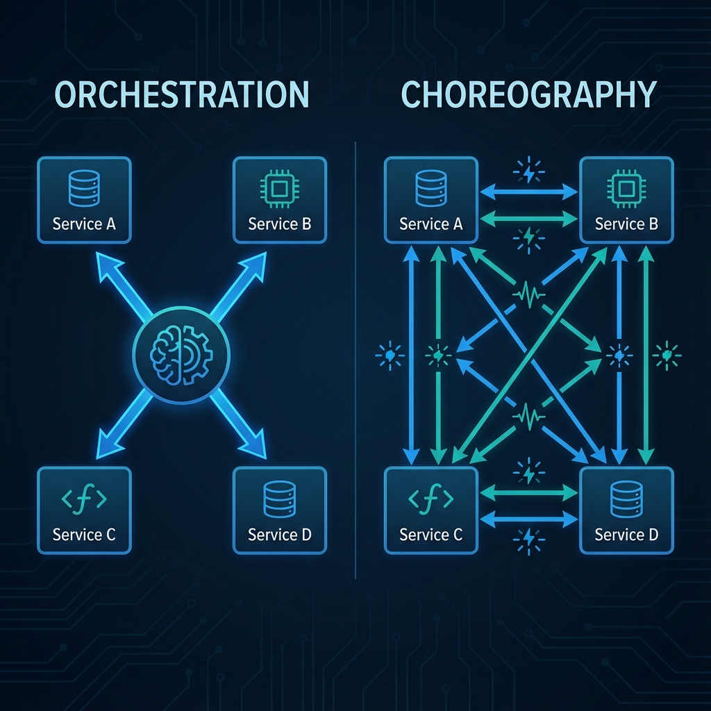
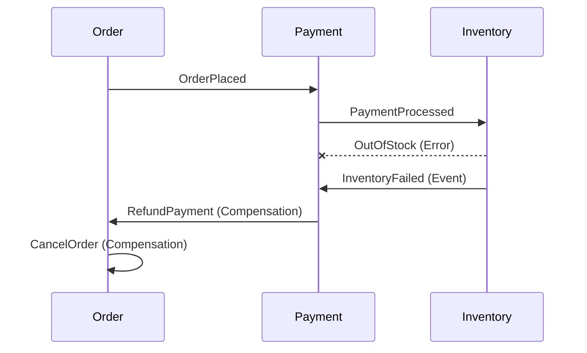

# Event-Driven Architecture: The Principal Architect Guide

> **Level**: Principal Architect / SDE-3
> **Scope**: Sagas, Event Sourcing, CQRS, and Orchestration vs. Choreography Strategies.

> [!IMPORTANT]
> **The Principal Paradigm**: In EDA, **Events are Facts**. Once emitted, the sender ceases to care. If you send an event expecting a specific response, you are building a **Distributed Monolith**, not an Event-Driven System.

---

## 🏗️ The Foundation: Mindset Shift

Transitioning to Event-Driven Architecture (EDA) requires unlearning "Request/Response" thinking.

| Concept | Traditional (REST/gRPC) | Event-Driven (EDA) |
| :--- | :--- | :--- |
| **Communication** | Synchronous (Blocking) | Asynchronous (Non-Blocking) |
| **Coupling** | High (Consumer knows Provider) | Low (Provider doesn't know Consumer) |
| **Intent** | **Command** ("Do this") | **Event** ("This happened") |
| **State** | Current State in DB | State derived from History (Event Log) |
| **Scaling** | Vertical / Load Balancers | Horizontal / Partitions |

### The "Windows on Mac" Problem
Lutz Huehnken coined this analogy: If you buy a Mac but install Windows XP, you miss the platform's benefits. Similarly, **if you build EDA but force strict orchestration on top**, you negate the decoupling benefits. You end up with the complexity of async systems *plus* the tight coupling of sync systems.

---

## 🎭 Choreography vs. Orchestration

This is the most critical architectural decision in EDA.

### 1. Choreography (The Dance)
Services emit events. Other services subscribe and react. No central coordinator.

*   **Flow**: `OrderService` -> emits `OrderPlaced` -> `PaymentService` listens & reacts.
*   **Pros**: Extreme decoupling, team autonomy, infinite scalability.
*   **Cons**: Hard to visualize requests end-to-end. "Who triggered this?"
*   **Use Case**: E-commerce fulfillment, simple async notifications.

### 2. Orchestration (The Conductor)
A central service (Mediator) tells other services what to do.

*   **Flow**: `OrderOrchestrator` -> calls `PaymentService.charge()` -> waits -> calls `Inventory.reserve()`.
*   **Pros**: Centralized visibility, error handling, retries.
*   **Cons**: Single Point of Failure (SPOF), tight coupling, potential bottleneck.
*   **Use Case**: Complex workflows with strict ordering (e.g., Loan Approval).

> [!TIP]
> **The Google Hybrid Pattern**: Use **Choreography between domains** (Orders, Payments, Shipping) and **Orchestration within domains** (Complex internal logic).



---

## 🔄 The Saga Pattern: Distributed Transactions

In distributed systems, **Two-Phase Commit (2PC) is the killer of scalability**. It holds locks across databases. Instead, we use **Sagas**.

**Definition**: A Saga is a sequence of local transactions. Each step has a **Compensating Transaction** to undo work if a later step fails.

### Choreography-Based Saga
Services listen for failure events and trigger their own compensation.



### Orchestration-Based Saga
A central Saga Coordinator (State Machine) manages the rollback.

```typescript
// Pseudo-code for Orchestrator
try {
  await payment.charge();
  await inventory.reserve();
} catch (error) {
  // Explicitly call compensation
  await inventory.release();
  await payment.refund();
}
```

> [!CAUTION]
> **Compensation is not Magic**. You must design "Undoing" actions carefully. You cannot "un-send" an email. You send a "correction" email. You cannot "un-delete" a row if you hard-deleted it. (Soft deletes help).

---

## 📜 Event Sourcing: State = f(History)

Most databases store **Current State**. Event Sourcing stores **Transitions**.

*   **Traditional**: User table has `balance: 30`.
*   **Event Sourcing**: Event Log has `[Deposited: 50, Withdrawn: 20]`. Current state is calculated on read.

### Why Event Sourcing?
1.  **Auditability**: Zero data loss. You know *why* the balance is 30.
2.  **Time Travel**: "What was the system state last Tuesday at 4 PM?" Replay events up to that timestamp.
3.  **Root Cause Analysis**: Debugging complex race conditions by replaying the exact sequence of events.

### CQRS (Command Query Responsibility Segregation)
Event Logs are terrible for queries ("Find users with balance > 100").
**Solution**: Separate Write and Read models.


1.  **Write Side**: Appends to Event Log (Kafka/EventStore). Fast, simple.
2.  **Projector**: Listens to Log -> Updates Read DB (Postgres/Elasticsearch).
3.  **Read Side**: Queries the Read DB.

> [!WARNING]
> **Eventual Consistency**: The Read DB will lag behind the Write DB (ms to seconds). Your UI must handle this (e.g., Optimistic UI, Loading spinners).

---

## 🛠️ Workflow Engines (Temporal, Camunda)

Workflow Engines are **Saga Orchestrators on steroids**. They provide:
*   **State Persistence**: "We are at Step 3". Survives crashes.
*   **Timers**: "Wait 3 days, then send email".
*   **Retries**: Exponential backoff.

### When to use a Workflow Engine?
| Scenario | Use Workflow Engine? | Why? |
| :--- | :--- | :--- |
| **Micro-services Saga** | ❌ No | Overkill. Use Choreography or simple Orchestrator. |
| **Long-Running Process** | ✅ Yes | Can manage state over days/weeks (e.g., User Onboarding). |
| **Human-in-the-Loop** | ✅ Yes | Waiting for Manager Approval is just a long "sleep". |
| **Critical Financial Tx** | ✅ Yes | Guaranteed execution and audit trails. |

---

## ⚠️ Anti-Patterns to Avoid

### 1. The God Orchestrator
A single Orchestrator service calling 50 other services.
*   **Result**: It becomes a Distributed Monolith.
*   **Fix**: Break into Domain-Specific Orchestrators.

### 2. "Passive-Aggressive" Events
Emitting an event named `OrderCreated` but *expecting* the Shipping service to ship it immediately, and failing if it doesn't.
*   **Reality**: This is a **Command** disguised as an event.
*   **Fix**: Be honest. Send a Command `ShipOrder` if you require specific action.

### 3. Ignoring Idempotency
Assuming events arrive Exactly-Once. (They effectively never do).
*   **Result**: Double charging the customer.
*   **Fix**: **Idempotency Keys**. `PaymentProcessed { txId: "uuid" }`. If `txId` exists, ignore.

### 4. Schema Breaking Changes
Changing an event structure (`userId` -> `user_id`) and breaking all 50 consumers.
*   **Fix**: **Upcasting**. The Consumer reads V1 event, converts to V2 in memory. Or support both versions for a deprecation period.

---

## ✅ Principal Architect Checklist

1.  **Define Your Boundaries**: Where does Choreography end and Orchestration begin? (Recommend: Choreography across Bounded Contexts).
2.  **Mandate Idempotency**: No consumer code passes Review without an idempotency check.
3.  **Governance**: Who owns the Event Schema? (Schema Registry is mandatory at scale).
4.  **DLQ Strategy**: What happens when a message fails 3 times? Dead Letter Queue. Who monitors the DLQ? (Alerts required).
5.  **Observability**: Distributed Tracing (OpenTelemetry) is not optional. You need `trace_id` propagated through Kafka headers.

---

## 🔗 Related Documents
*   [Message Brokers Guide](message-broker-architecture-guide.md) — Kafka vs RabbitMQ patterns.
*   [Distributed Tracing](../distributed-tracing.md) — Tracing events across boundaries.
*   [Bounded Contexts](../bounded-context-guide.md) — Domain alignment.
