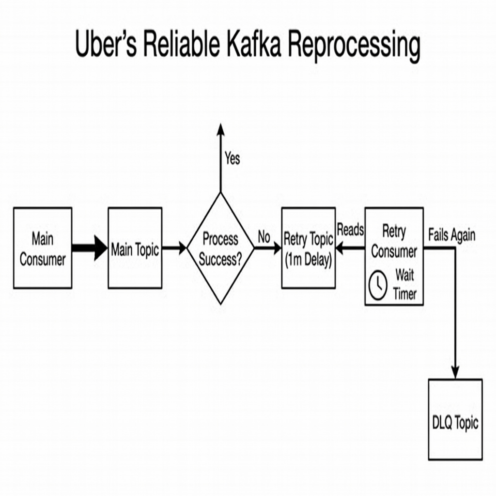

# Message Brokers: The Principal Architect Guide

> **Level**: Principal Architect / SDE-3
> **Scope**: Kafka, RabbitMQ, SQS, BullMQ, and Reliability Patterns.

> [!IMPORTANT]
> **The Principal Choice**: **Smart Broker** (RabbitMQ/SQS) vs. **Smart Consumer** (Kafka/Kinesis).
> *   Do you need complex routing, filtering, and individual message ACKs? Use **RabbitMQ/SQS**.
> *   Do you need massive throughput, replayability, and strict ordering? Use **Kafka**.

---

## 🥊 RabbitMQ vs. Kafka: The Philosophy

| Feature | RabbitMQ (Queue) | Kafka (Stream) |
| :--- | :--- | :--- |
| **Model** | **Push**. Broker pushes to consumer. | **Pull**. Consumer polls broker. |
| **Storage** | **Transient**. Delete after consume. | **Durable**. Log retention (e.g., 7 days). |
| **Ordering** | FIFO (mostly). | Strict per Partition. |
| **Throughput** | 20k - 50k / sec | 1M+ / sec |
| **Routing** | Complex (Exchanges, Bindings). | Simple (Topics). |
| **Scale** | Vertical (harder to cluster). | Horizontal (Partitions). |

---

## 🛠️ Kafka Patterns at Scale

> **Source**: [Uber's Kafka Engineering](https://youtu.be/xsdoQkoao2U)

### 1. The Paradox of "Queuing on Streams"
Kafka is optimized for streaming (high throughput, sequential). However, engineers often try to use it for work queues (individual retries).
**Problem**: Head-of-Line Blocking. If Message A fails processing, Message B (which is fine) is blocked behind it because the offset cannot move forward.

### 2. The Uber "Reliable Reprocessing" Pattern
How to handle failures without stopping the stream? **Leveled Retry Topics**.

*   **Main Topic**: Fast path. If processing fails, push to `Retry-1m` topic and COMMIT the main offset.
*   **Retry-1m Topic**: Consumer checks timestamp. If `now < msg.time + 1m`, pause/sleep.
*   **DLQ (Dead Letter Queue)**: After N retries, push here for manual alert.

### 3. In-Sync Replicas (ISR) Alert
The most dangerous metric in Kafka.
*   **Scenario**: Leader writes faster than Followers can copy.
*   **Risk**: If `ISR < MinInSyncReplicas`, the producer gets `NotEnoughReplicas` error (Availability hit). Or if `acks=1`, you lose data (Durability hit).
*   **Principal Rule**: Alert on `ISR Shrink`. It means your cluster is unhealthy (Network/Disk/CPU saturation).

---

## 🐇 RabbitMQ / ActiveMQ Patterns

### 1. The "Competing Consumers" Pattern
Use when you have expensive tasks (e.g., Image Resizing).
*   **Setup**: 1 Queue, 10 Consumers.
*   **Behavior**: RabbitMQ distributes messages Round-Robin (or based on QoS `prefetch`).
*   **Benefit**: Easy to scale processing power by adding more consumers.

### 2. Dead Letter Exchanges (DLX)
RabbitMQ handles failures gracefully out of the box.
*   **Config**: Set `x-dead-letter-exchange` on your main queue.
*   **Flow**: If consumer NACKs (or TTL expires), message is automatically routed to DLX.

---

## 🌩️ Cloud Queues: SQS & SNS

### SQS Standard vs. FIFO
*   **Standard**: Unlimited throughput. "Best-effort" ordering (mostly ordered). "At-least-once" (duplicates possible).
*   **FIFO**: Strict ordering. Limited throughput (300/s without batching, 3000/s with batching). Exactly-once processing.

> [!TIP]
> **SNS + SQS Fanout**: The "Broadcast" pattern.
> Publisher -> SNS Topic -> [SQS Queue A, SQS Queue B, SQS Queue C].
> This allows decoupling. Team A can attach their Queue A to your SNS Topic without you changing code.

---

## 📦 lightweight Queues: BullMQ (Redis)

For Node.js/TypeScript shops, **BullMQ** is a powerful alternative to heavy infrastructure.
*   **Backend**: Redis (Lua scripts).
*   **Features**: Delayed jobs (`delay: 5000`), Prioritization, Rate Limiting (`limit: 10 per 1s`).
*   **Use Case**: Transactional emails, background report generation, weak ordering requirements.

---

## ✅ Principal Architect Checklist

1.  **Select the Right Tool**: Don't use Kafka for a delayed email job (Use SQS/BullMQ). Don't use RabbitMQ for clickstream analytics (Use Kafka).
2.  **Idempotency**: Always assume `At-Least-Once` delivery. Consumers must handle duplicates.
3.  **Backpressure**: What happens if consumers are slow?
    *   **RabbitMQ**: Queue fills up -> RAM fills up -> Broker crashes. (Set `max-length` or `TTL`).
    *   **Kafka**: Consumer lag increases. Data expires from disk (retention). Broker is fine.
4.  **Schema Registry**: For Kafka, enforce schemas (Avro/Protobuf) to prevent "Poison Pills" (bad data crashing consumers).
5.  **Ordering key**: If using Kafka, ensure you partition by `user_id` so all events for User A land on Partition 1 (preserving order).

---

## 🔗 Related Documents
*   [Event-Driven Architecture](../event-driven-architecture-guide.md) — The broader context of EDA.
*   [Circuit Breakers](../../cicuit-breaker/resiliency-patterns-guide.md) — Protecting consumers.
