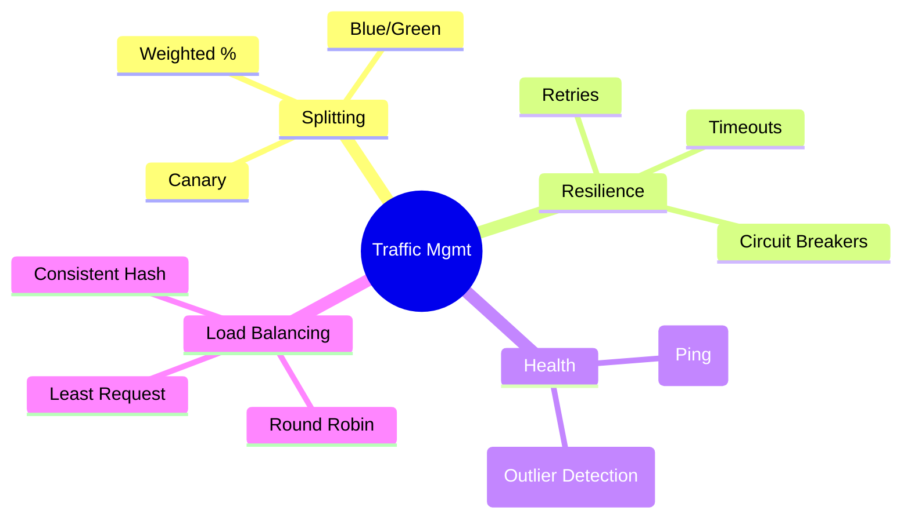
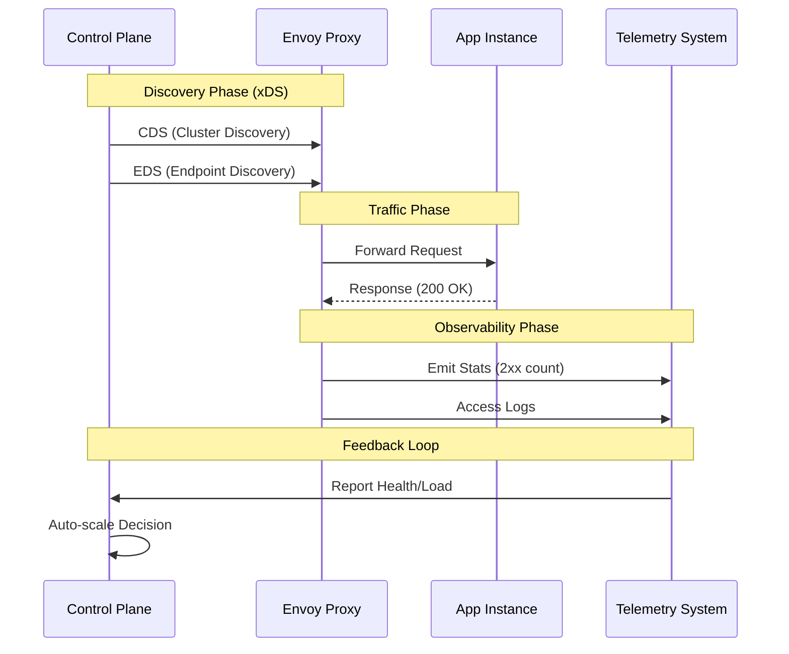

# AWS App Runner Scale: Multi-Tenant Routing with Envoy

> **Source**: [AWS App Runner: Envoy at Scale](https://youtu.be/6-akjOASvxc)

> [!IMPORTANT]
> **The Core Challenge**: Building a request router for a fully managed service (App Runner) that handles **hundreds of millions of customers** with **zero infrastructure experience**. The router must solve multi-tenancy, traffic splitting, and high throughput without the user configuring anything.

---

## 🏗️ Why Envoy?

The team chose **Envoy Proxy** as the backbone for its out-of-process architecture:
*   **Language Agnostic**: Bridges services in C++, Java, Go with identical behavior.
*   **Independent Lifecycle**: Proxy updates don't require application restarts.
*   **Best-in-Class Observability**: Lightweight, portable, and deep metrics.

---

## 📊 Architecture: The Request Router

The Router sits between the public URL and application instances.

```mermaid
graph TB
    subgraph "Public Internet"
        User[User Request]
    end

    subgraph "Request Router (Envoy)"
        L[Listener]
        HCM[HTTP Connection Manager]
        R[Route Matcher]
        L --> HCM
        HCM --> R
    end

    subgraph "Upstream Clusters"
        C1[Cluster A (v1)]
        C2[Cluster B (v2)]
    end
    
    subgraph "Control Plane"
        xDS[Management Server]
    end

    User --> L
    R -->|Main Traffic| C1
    R -->|Canary 10%| C2
    
    xDS -.->|ADS / xDS APIs| Router
```

### Envoy Building Blocks

| Component | Function |
| :--- | :--- |
| **Listener** | Network location (IP:Port) receiving external traffic. |
| **HTTP Connection Manager** | Network filter translating bytes to HTTP. Handles logs, tracing, IDs. |
| **Route** | Matches requests (URI, Header) and defines destination. |
| **Cluster** | Group of logical upstream hosts (e.g., "Service V1"). |
| **Endpoint** | Specific IP/Port of an application instance. |

---

## 🚦 Traffic Management Features

Envoy enables advanced features critical for a managed platform:



1.  **Traffic Splitting**: Weighted distribution between clusters (e.g., 90% Stable, 10% Canary).
2.  **Circuit Breakers**: "Fail fast" to protect downstream services from cascading outages.
3.  **Passive Health Checks**: Detects outliers by monitoring 5xx responses on real traffic.

---

## ⚙️ The Control Plane ecosystem

Managing Envoy at scale requires a custom **Control Plane** utilizing xDS APIs.



*   **xDS APIs**: Envoy dynamically discovers Clusters (CDS) and Endpoints (EDS) over gRPC.
*   **Event Streamer**: Reports service health to support safe deployment strategies (blue/green).

---

## ✅ Principal Architect Checklist

1.  **Decouple Proxy from App**: Use an out-of-process proxy (sidecar/router) like Envoy. Don't embed routing logic in app code.
2.  **Use Passive Health Checks**: Active pings aren't enough. Monitor real traffic 5xx errors to detect "zombie" instances.
3.  **Implement Circuit Breaking**: Protect your upstream services. If a service is failing, stop sending it traffic immediately.
4.  **Centralize Observability**: The router sees everything. Use it to generate golden signals (Latency, Traffic, Errors) for every service.
5.  **Build a Control Plane**: For dynamic environments, static config files fail. Use xDS to push config updates in real-time.
6.  **Plan for Capacity**: Monitor CPU/Memory of the proxy itself. The router is a critical bottleneck.

---

## 🔗 Related Documents
*   [Shopify Scale](shopify-scale.md) — Routing with Nginx/Lua (Different approach)
*   [Istio Service Mesh](../../mesh/service/istio-service-mesh.md) — Envoy in a Service Mesh context
