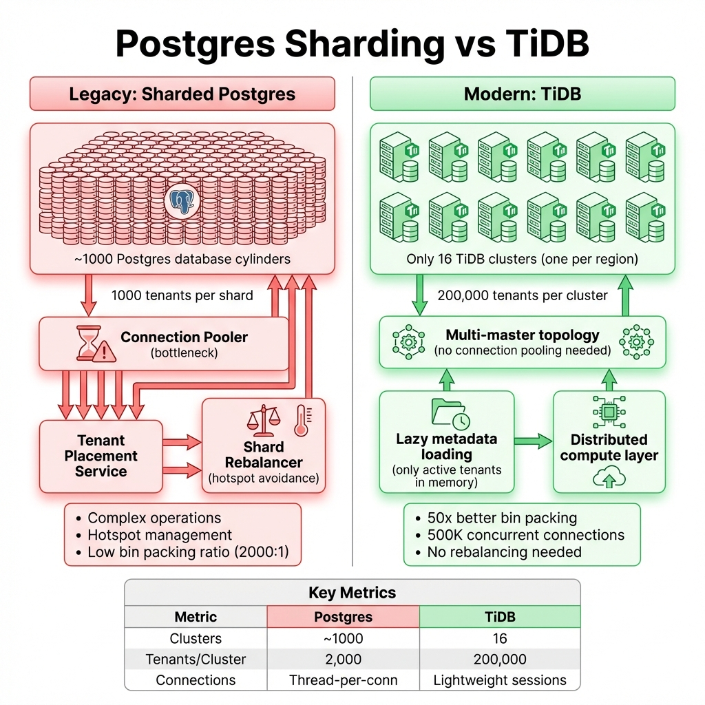
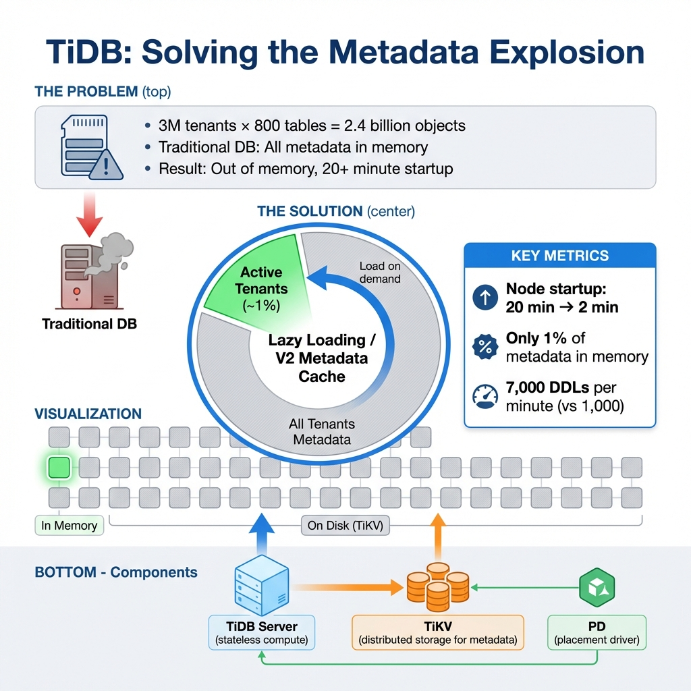

# Atlassian Multi-Tenancy at 3 Million Tenants: The TiDB Migration

> **Source**: [Multi-Tenancy at Atlassian Scale](https://www.youtube.com/watch?v=asnCJI39MpE)

> [!IMPORTANT]
> **The Scale**: Atlassian manages **3 million tenants** for Jira, Confluence, and Trello. With **800+ tables per product** and **700+ third-party plugins** each adding their own schema, the challenge isn't query volume—it's **metadata explosion**.

---

## 📊 Why Traditional Models Fail at This Scale

---

## 🏢 The Enterprise Requirements

Atlassian operates in high-compliance environments (FedRAMP) with strict requirements:

| Requirement | Description |
| :--- | :--- |
| **Encryption at Rest (BYOK)** | Customers bring their own keys. Per-tenant encryption required. |
| **Data Residency** | Pin or migrate tenant data to specific regions. |
| **Point-in-Time Recovery** | Restore a specific tenant's data to a specific moment. |

> [!CAUTION]
> These requirements are **impossible** with a simple shared `tenant_id` column. You can't encrypt, migrate, or restore one tenant's data efficiently when it's mixed with millions of others.

---

## 🔴 Multi-Tenancy Models: Why They All Failed

### Model 1: Shared (Discriminator Column)
*   Single database, `tenant_id` column.
*   ✅ Simple to operate.
*   ❌ Can't do per-tenant encryption.
*   ❌ Can't migrate data for residency.
*   ❌ Can't restore single tenant.

### Model 2: Silo (Database-per-Tenant)
*   Every tenant gets their own database + schema.
*   ✅ Perfect isolation for operations.
*   ❌ **Metadata explosion**: `3M tenants × 800 tables = 2.4 billion objects`.
*   ❌ Most databases have a **1 million object limit**.
*   ❌ DDL operations take forever.

### Model 3: Hybrid (99% Shared, 1% Silo)
*   Enterprise tenants get dedicated databases.
*   ❌ At Atlassian scale: `1% × 3M = 30,000 databases`.
*   ❌ With 700 plugins: `30K × 700 = 21 million databases`.
*   ❌ Back to silo problems.

---

## 🔄 Legacy Platform: Sharded Postgres

### How It Worked
*   ~1,000 Postgres clusters (shards).
*   1,000 tenants per shard (2,000:1 bin packing ratio).

### The Pain Points

| Component | Problem |
| :--- | :--- |
| **Connection Pooler** | Thread-per-connection consumes massive memory. |
| **Tenant Placement Service** | Complex logic to assign tenants to shards. |
| **Shard Rebalancer** | Constantly avoiding "hot spots". |
| **Operations** | Difficult upgrades, complex monitoring. |

---

## ✅ The TiDB Solution

### Why TiDB?
*   **Goal**: Increase bin packing from 2,000:1 to **200,000:1**.
*   **Result**: Consolidate ~1,000 Postgres clusters into **16 TiDB clusters**.

### Technical Solutions

| Solution | How It Works | Result |
| :--- | :--- | :--- |
| **Connection Management** | Multi-master topology + lightweight sessions | **500K concurrent connections** per cluster |
| **Lazy Metadata Loading** | Only active tenants (~1%) loaded into memory | **Node startup: 20 min → 2 min** |
| **DDL Throughput** | Optimized DDL pipeline | **7,000 DDLs/min** (was 1,000) |
| **Backup & Restore** | BR tooling optimized for massive metadata | Per-tenant PITR possible |

### Configuration Tuning
*   Tuned **region sizes** for high metadata volume.
*   Disabled **automatic table splitting** to manage object count.

---

## 📊 Results & Current Status

| Metric | Before (Postgres) | After (TiDB) |
| :--- | :--- | :--- |
| **Clusters** | ~1,000 | 16 |
| **Bin Packing Ratio** | 2,000:1 | 200,000:1 |
| **Improvement** | — | **50x** |
| **Upgrades** | Downtime required | No-downtime possible |

### Migration Roadmap
*   ✅ **Phase 1**: Smaller products (Atlas, Loom).
*   🔄 **Phase 2**: Major products (Jira, Confluence).

---

## ✅ Principal Architect Checklist

1.  **Calculate Your Metadata Volume**: At 3M tenants × 800 tables, you have 2.4B objects. Most databases can't handle this.
2.  **Evaluate Lazy Loading**: If only 1% of tenants are active, you don't need 100% of metadata in memory.
3.  **Measure DDL Throughput**: Adding a column to 3M schemas means 3M DDL operations. What's your DDL/minute rate?
4.  **Consider Bin Packing Ratio**: If you're at 2,000:1, you need 1,500 clusters for 3M tenants. Is that manageable?
5.  **Test Connection Scaling**: Thread-per-connection doesn't scale. Look for lightweight session architectures.
6.  **Plan for Enterprise Requirements**: BYOK, data residency, and PITR require tenant isolation at the storage level.

---

## 📖 Analogy: The Hotel with Millions of Rooms

> [!TIP]
> Scaling 3 million tenants is like **managing a massive hotel**:
>
> *   **Shared Model**: One giant communal room where everyone's luggage is mixed but tagged. Impossible to give one person a private key to just their suitcase.
>
> *   **Silo Model**: Every guest gets their own room with 800 drawers. The front desk can't remember where all the rooms are.
>
> *   **TiDB**: A modern skyscraper with a **digital directory** (lazy metadata) and **automatic elevators** (distributed compute). The front desk only thinks about guests currently in the lobby—allowing infinite scale without overwhelm.

---

## 🔗 Related Documents
*   [Multi-Tenancy with Spring](multi-tenancy-spring.md) — Application-level implementation
*   [Cortex: Multi-Tenant Prometheus](cortex-prometheus-scale.md) — Observability at scale