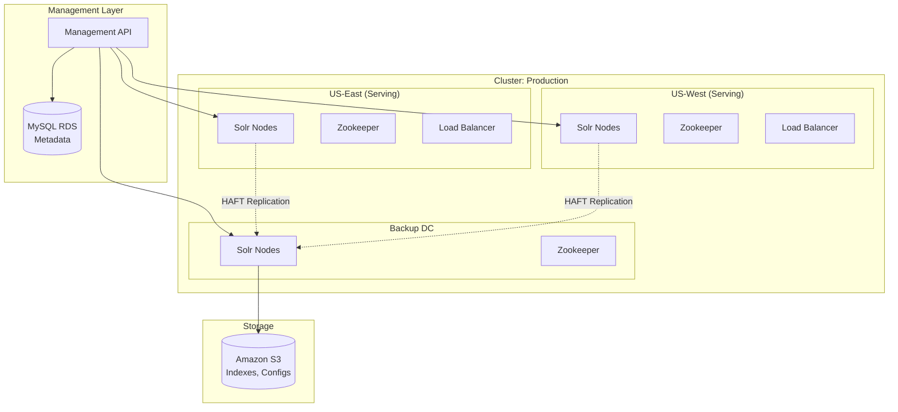
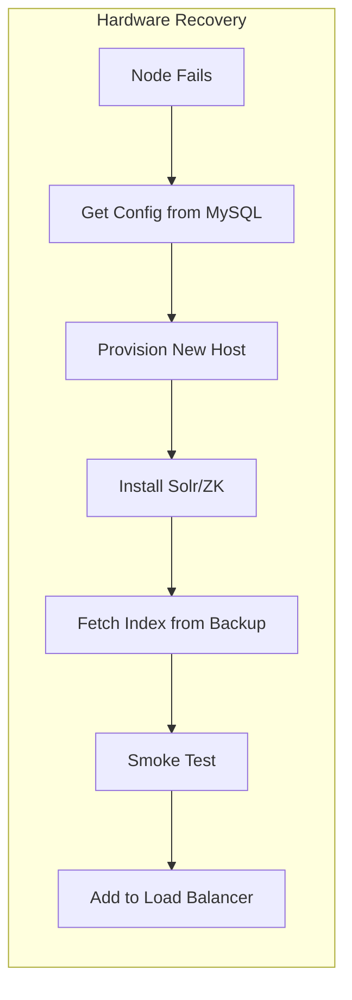
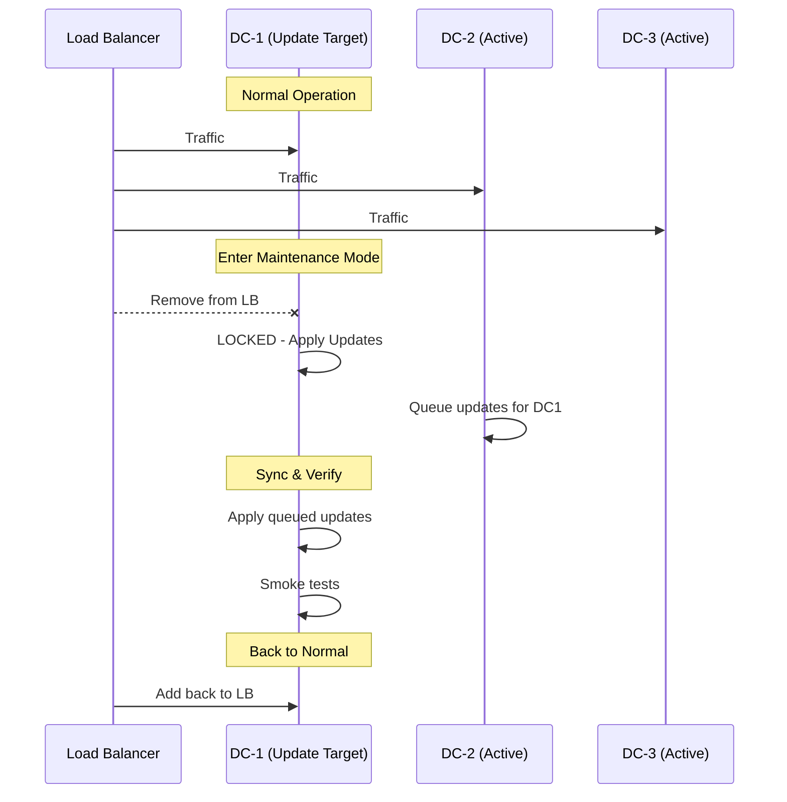

# SolrCloud Cluster Management at Scale: Bloomreach Case Study

> **Source**: [SolrCloud Multi-DC Management - Bloomreach](https://youtu.be/IW3EglkY-R0)

> [!IMPORTANT]
> **The Challenge**: Bloomreach serves **hundreds of millions of documents** for multiple tenants on SolrCloud. Their retail search app ("Snap") requires **zero downtime** and **low latency** across multiple data centers—while handling customer-specific code that can crash JVMs.

---

## 📊 Multi-DC Architecture

---

## 🔴 Core Challenges

| Challenge | Description |
| :--- | :--- |
| **Custom Tenant Code** | Customer-specific ranking code runs in same JVM. Bad code = JVM crash. |
| **Large Ranking Files** | Some tenants upload massive files → memory spikes, unresponsive nodes. |
| **Multi-DC Coordination** | Global customers need multiple DCs. Single Zookeeper = SPOF. |
| **Zero Downtime** | Retail search cannot afford any outages. |

---

## 🏗️ Logical Abstraction Layer

### Key Concepts

| Concept | Definition |
| :--- | :--- |
| **Logical Data Center** | A unit of Solr + Zookeeper nodes representing a role (serving, backup, preview). |
| **Cluster** | A collection of logical DCs (e.g., "Production Cluster" = US-East + US-West + Backup). |
| **Metadata Storage** | MySQL RDS stores all configuration and state for every node. |

> [!TIP]
> Each DC has **independent Zookeeper**. No single point of failure across DCs.

---

## 🛠️ Management APIs

| API | Purpose |
| :--- | :--- |
| **HAFT (Replication)** | Replicates indexes from indexing clusters to production. Open-sourced. |
| **Ranking File Management** | Versions and stores customer ranking files on S3. |
| **Deployment Service** | Provisions new capacity or restores failed nodes. |
| **Recovery Service** | Automates hardware and software recovery. |

---

## 🔄 Recovery Procedures

### Hardware Recovery (Fully Automated)
1.  Detect node failure.
2.  Retrieve existing configuration from MySQL.
3.  Provision new host on AWS.
4.  Install Solr/Zookeeper.
5.  Fetch indexes from backup DC.
6.  **Smoke test**: Compare query results with other DCs.
7.  Add back to load balancer.

### Software Recovery (Soft Recovery)
1.  Detect bad JAR or JVM memory exhaustion.
2.  **Snapshot** current state (configs, jars) to S3.
3.  **Revert** to known stable version.
4.  Sync queued updates.
5.  Return to load balancer.

### Capacity Expansion (On-Demand)
1.  Holiday traffic spike detected.
2.  Provision new DC machines.
3.  Install Solr/ZK via automation.
4.  Fetch indexes from backup DC.
5.  Pull configs from serving DC.
6.  Add to cluster.

---

## 🔧 Maintenance Mode Pattern

### Key Points
*   DC is **locked** and removed from load balancer.
*   Other DCs handle 100% of traffic.
*   Updates are **queued**, not lost.
*   Rollback possible at any stage.

---

## 📊 Monitoring Strategy

| Level | What's Monitored |
| :--- | :--- |
| **Node Level** | Ping nodes, check queryable collections, JVM/CPU usage. |
| **Cluster Level** | Ensure all DCs have consistent indexes and configurations. |

---

## 🚀 Future: Full Auto-Recovery

| Capability | Description |
| :--- | :--- |
| **Auto-Restart** | Automatically restart Zookeeper/Solr nodes on failure. |
| **Auto-Resync** | Resync mismatched configs from S3. |
| **Auto-Rollback** | Roll back code if JVM usage exceeds 90% after deployment. |

---

## ✅ Principal Architect Checklist

1.  **Eliminate Single Points of Failure**: Each DC should have independent Zookeeper. No cross-DC ZK dependencies.
2.  **Store All State Externally**: Configs, indexes, ranking files in S3/MySQL. Nodes should be replaceable.
3.  **Implement Smoke Tests**: Before adding recovered nodes to load balancer, verify query results match other DCs.
4.  **Use Maintenance Mode for Updates**: Never update all DCs simultaneously. Queue updates, roll DC-by-DC.
5.  **Snapshot Before Changes**: Always snapshot to S3 before deployments. Enable instant rollback.
6.  **Monitor at Both Levels**: Node-level (health) AND cluster-level (consistency) monitoring required.

---

## 📖 Analogy: Global Cargo Ship Fleet

> [!TIP]
> Managing this infrastructure is like operating a **global fleet of automated cargo ships**:
>
> *   **Centralized Control Tower** (Management API) instead of a captain on every ship.
> *   **Hardware Failure**: Tower launches new identical ship, transfers cargo from nearby support vessel.
> *   **Software Error**: Tower swaps bad fuel for previous proven version (Snapshot Revert).
> *   **Customers** never notice delays.

---

## 🔗 Related Documents
*   [Atlassian Multi-Tenancy at Scale](atlassian-scale.md) — Database-level multi-tenancy with TiDB