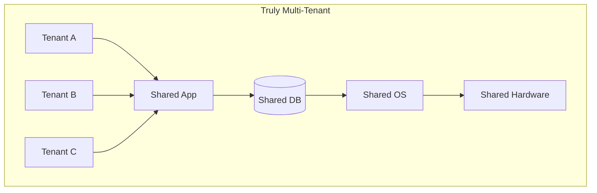
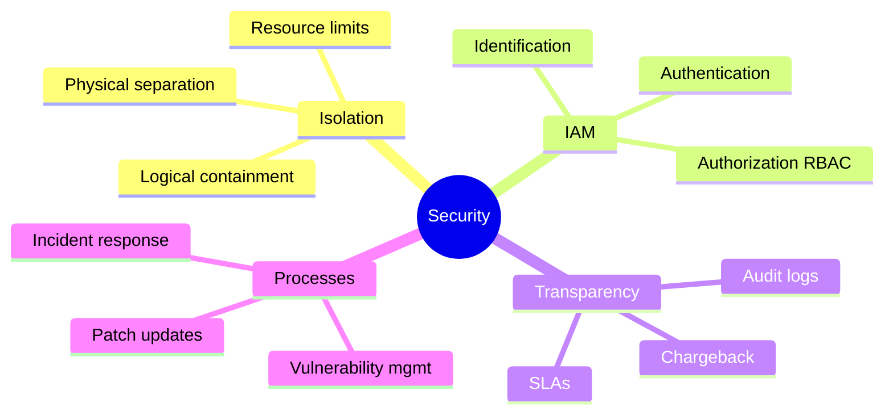
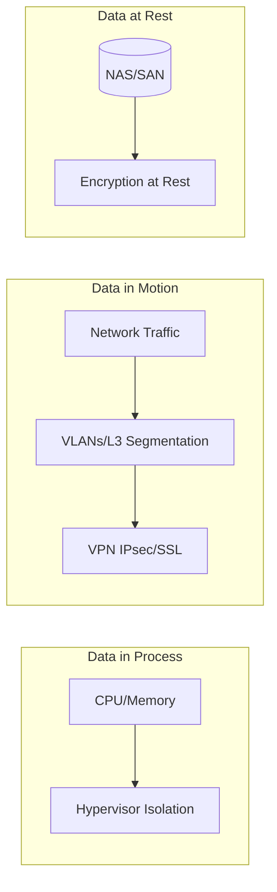

# Multi-Tenancy Foundations: What, When, and Why

> **Source**: [Planning for Multi-Tenancy](https://youtu.be/zRZeJFQzWgM)

> [!IMPORTANT]
> **Definition**: Multi-tenancy is a **single integrated infrastructure** serving multiple client organizations (tenants) to provide agility, scalability, and operational savings.

---

## 📊 Architectural Approaches

### The Four Levels

| Level | Apps | Database | OS | Hardware | Use When |
| :--- | :--- | :--- | :--- | :--- | :--- |
| **Truly Multi-Tenant** | Shared | Shared | Shared | Shared | Maximum efficiency, SaaS |
| **Multi-App Instance** | Separate | Shared | Shared | Shared | Per-tenant customization needed |
| **Multistack** | Separate | Separate | Shared | Shared | Data isolation required |
| **Multi-VM** | Separate | Separate | Separate | Shared | Cloud-native, strongest isolation |

> [!TIP]
> **Multi-VM** is the most viable for cloud environments—tenants have isolated apps, databases, and OS, all running on shared hardware.

---

## 🔒 Security Considerations

### The Four Pillars

| Pillar | Description |
| :--- | :--- |
| **Isolation & Containment** | Ensure tenants sharing physical resources are appropriately separated. |
| **Identity & Access Management** | Control identification, authentication, and authorization (RBAC). |
| **Transparency** | Accountability via audit logs, chargeback systems, and well-defined SLAs. |
| **Processes & Procedures** | Manage vulnerabilities and updates to prevent security gaps. |

---

## 🗄️ Data Isolation States

Data must be secured in **three different states**:

| State | Location | Protection Mechanism |
| :--- | :--- | :--- |
| **Data in Process** | Memory, processors | Hypervisor provides complete isolation |
| **Data in Motion** | Network (internal/external) | VLANs, firewalls, L3 segmentation, VPNs |
| **Data at Rest** | NAS, SAN storage | Encryption, access controls |

> [!CAUTION]
> Avoid **flat Layer 2 networks**—they create a single point of failure. Use L3 segmentation instead.

---

## 🏢 Production Use Cases

### Use Case 1: Large APAC Cloud Provider

| Component | Implementation |
| :--- | :--- |
| **Logical Architecture** | User Domains per tenant (not physical HW) |
| **Networking** | ~24 virtual firewalls/routers (software-defined) |
| **Virtualization** | Nested VMs within app environments (Inventory, HR, Oracle) |
| **Environment Separation** | Strict QA vs Production isolation per tenant |

### Use Case 2: Government "Data Center on Demand"

| Component | Implementation |
| :--- | :--- |
| **Templates** | Standardized 30,000-foot data center encapsulated in VM |
| **Softwarified Tiers** | Web, App, DB, Management all virtualized |
| **Deployment** | Single-click rollout with standardized IPs and policies |
| **Benefit** | Rapid emergency response, simplified troubleshooting |

---

## 🌐 Software-Defined Networking (Vyatta Example)

### Architecture
*   400+ open-source packages unified in single data model
*   Common CLI, API, and GUI
*   Supports BGP, OSPF, IPv6, stateful firewalls, NAT, VPNs

### Performance vs Cisco CSR 1000v

| Metric | Vyatta | Cisco CSR 1000v |
| :--- | :--- | :--- |
| **Throughput** | 500+ Mbps | 50 Mbps |
| **Cores Used** | 1 | 4 |
| **Cost** | Free (OSS) or Enterprise | Commercial |

---

## ✅ Principal Architect Checklist

1.  **Choose Isolation Level Wisely**: Multi-VM for cloud, Truly Multi-Tenant for maximum efficiency.
2.  **Address All Four Security Pillars**: Don't skip Transparency or Processes—they catch issues over time.
3.  **Secure All Three Data States**: In-process, in-motion, at-rest all require different controls.
4.  **Avoid Flat L2 Networks**: Use L3 segmentation and VLANs to prevent blast radius issues.
5.  **Consider Software-Defined Networking**: Virtual firewalls/routers enable rapid tenant provisioning.
6.  **Use Standardized Templates**: "Data Center on Demand" patterns accelerate deployment and simplify ops.

---

## 📖 Analogy: The Apartment Complex

> [!TIP]
> Multi-tenancy is like an **apartment complex inside a flexible warehouse**:
>
> *   **Warehouse** (Shared Infrastructure) — Provides roof and power.
> *   **Apartments** (Multi-VM approach) — Each tenant has their own door, kitchen, bathroom.
> *   **Security** (Isolation) — Your neighbor can't wander into your living room.
> *   **Software-Defined Networking** — Robotic walls: click a button to build a new apartment with its own security system, no construction crew needed.

---

## 🔗 Related Documents
*   [Multi-Tenancy with Spring](multi-tenancy-spring.md) — Application-level implementation
*   [Atlassian Multi-Tenancy at Scale](atlassian-scale.md) — Database-level at 3M tenants
*   [Cortex: Multi-Tenant Prometheus](cortex-prometheus-scale.md) — Observability platform