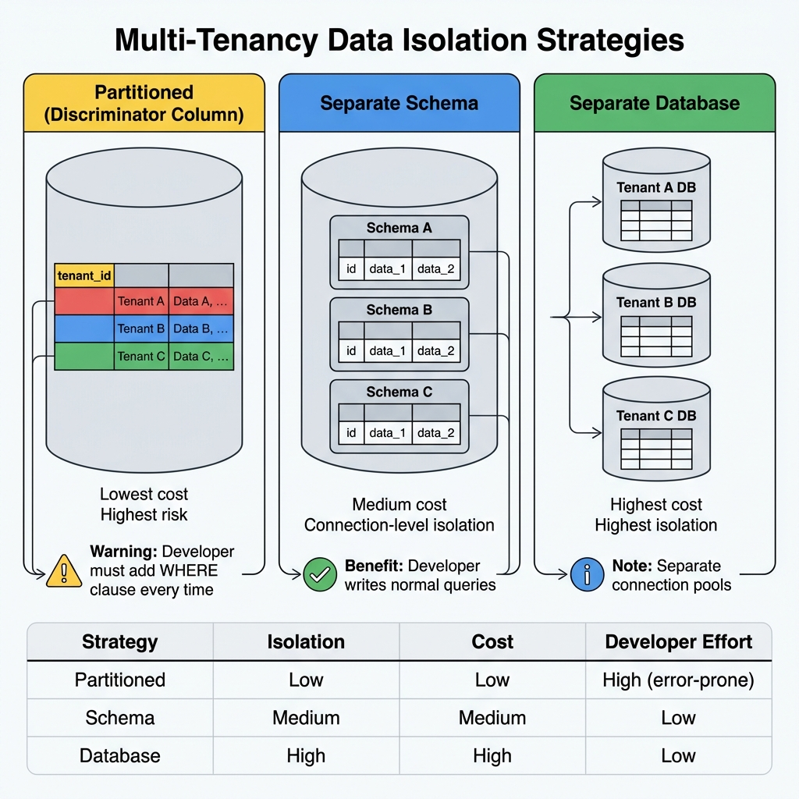
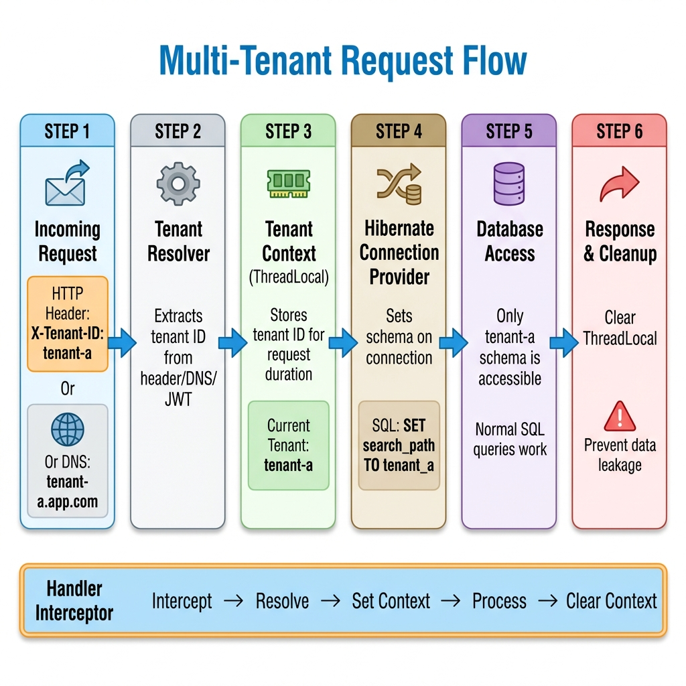
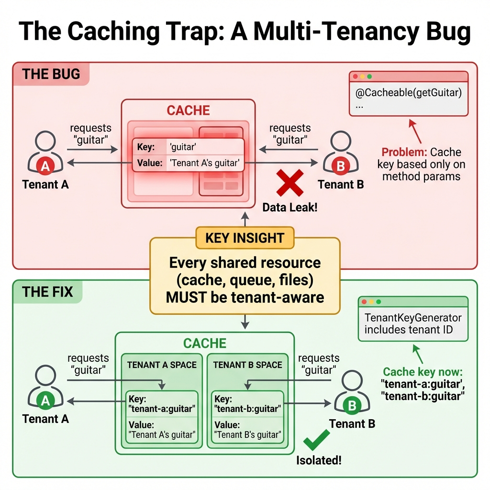

# Multi-Tenancy with Spring: Architecture and Implementation

> **Source**: [Multi-Tenancy with Spring](https://www.youtube.com/watch?v=pG-NinTx4O4)

> [!IMPORTANT]
> **The Core Concept**: Multi-tenancy is an architectural pattern where a **single running instance** serves multiple clients (tenants). The primary goal is **cost optimization**—without it, you'd need a new instance for every customer, which doesn't scale.

---

## 📊 Data Isolation Strategies



---

## 🏢 What is Multi-Tenancy?

### The Definition
*   **One application instance** serves **many customers** (tenants).
*   Tenants share infrastructure but have **isolated data**.
*   Primary driver: **Cost optimization** (operations, maintenance, resources).

### The Building Analogy

> [!TIP]
> Think of a **building where rock bands share apartments**:
> *   Bands (tenants) share infrastructure (staircase, elevator, roof).
> *   Each band has their own private apartment (data storage).
> *   **Result**: Lower costs than each band owning a building.

---

## 🔄 Request Flow: Establishing Tenant Context



### The Three Components

| Component | Purpose |
| :--- | :--- |
| **Tenant Resolver** | Extracts tenant ID from request (header, JWT, DNS). |
| **Tenant Context** | Stores tenant ID for request duration (ThreadLocal in MVC). |
| **Handler Interceptor** | Sets context before processing, **clears after** to prevent leakage. |

### Sources of Tenant ID
*   **HTTP Header**: `X-Tenant-ID: tenant-a`
*   **DNS/Subdomain**: `tenant-a.myapp.com`
*   **JWT Claim**: Token contains `tenant_id` field

---

## 🗄️ Data Isolation Strategies

### Strategy 1: Partitioned (Discriminator Column)
*   Add `tenant_id` column to **every table**.
*   **Lowest cost**: Single database, single schema.
*   **Highest risk**: Developer must add `WHERE tenant_id = ?` to **every query**.

> [!CAUTION]
> One forgotten `WHERE` clause = **data leak**. This strategy is error-prone at scale.

### Strategy 2: Separate Schema (Recommended)
*   Same database, **different schema per tenant**.
*   Isolation handled at **connection level**.
*   Developers write **normal queries**—schema is set automatically.

### Strategy 3: Separate Database
*   Each tenant gets their **own database**.
*   **Highest isolation** and **highest cost**.
*   Separate connection pools per tenant.

---

## ⚙️ Implementation with Hibernate

### Required Interfaces

| Interface | Purpose |
| :--- | :--- |
| `CurrentTenantIdentifierResolver` | Tells Hibernate how to get current tenant ID (from ThreadLocal). |
| `MultiTenantConnectionProvider` | Maps tenant ID to schema; sets schema on connection. |

### Configuration (Spring Boot 3.1+)
Hibernate doesn't auto-pickup Spring beans. Use `HibernatePropertiesCustomizer`:

```java
@Bean
HibernatePropertiesCustomizer hibernatePropertiesCustomizer(
    CurrentTenantIdentifierResolver resolver,
    MultiTenantConnectionProvider provider) {
    return props -> {
        props.put(MULTI_TENANT_IDENTIFIER_RESOLVER, resolver);
        props.put(MULTI_TENANT_CONNECTION_PROVIDER, provider);
    };
}
```

### Modern Tooling
*   **Spring Boot 3.1+**: Native multi-tenancy support.
*   **Testcontainers**: Use `@ServiceConnection` for auto-configured test DBs.

---

## 📊 Observability in Multi-Tenant Systems

Debugging requires filtering by tenant.

### Logs (MDC)
Add tenant ID to **Mapped Diagnostic Context**:
```java
MDC.put("tenantId", tenantContext.getTenantId());
```
Now every log line includes tenant context.

### Metrics & Traces (Micrometer)
Hook into `ServerHttpObservationFilter` to add tenant ID:
*   **Traces**: Use **High Cardinality** (tenant IDs can be unbounded).
*   **Metrics**: Be careful—high cardinality metrics are expensive.

---

## 🌐 Networking & Security

### Spring Cloud Gateway
Improve UX by extracting tenant from DNS:
*   User requests `tenant-a.myapp.com`.
*   Gateway injects `X-Tenant-ID: tenant-a` header internally.
*   Application doesn't know about DNS parsing.

### Dynamic Identity Providers
Different tenants may use **different IDPs** (e.g., different Keycloak realms).

Use `AuthenticationManagerResolver`:
```java
// Dynamically resolve IDP based on tenant
return request -> resolveAuthManager(tenantContext.getTenantId());
```

---

## ⚠️ The Caching Trap



### The Bug
```java
@Cacheable("guitars")
public Guitar getGuitar(String name) { ... }
```
*   Tenant A requests "guitar" → cached with key `"guitar"`.
*   Tenant B requests "guitar" → **returns Tenant A's guitar!**

### The Fix
Implement `TenantKeyGenerator`:
```java
// Cache key includes tenant ID
return tenantContext.getTenantId() + ":" + params[0];
```

> [!CAUTION]
> **Every shared resource must be tenant-aware**: caches, queues, file storage, background jobs, WebSockets.

---

## ✅ Principal Architect Checklist

1.  **Choose Isolation Strategy**: Default to **Separate Schema** unless you have specific requirements for partitioning or separate databases.
2.  **Clear ThreadLocal Always**: Use `try/finally` or interceptor hooks. A leaked context = data leak.
3.  **Audit All Caching**: Every `@Cacheable` annotation must use a tenant-aware key generator.
4.  **Test Tenant Isolation**: Write integration tests that switch tenants mid-test to verify isolation.
5.  **Add Tenant to Observability**: MDC for logs, high-cardinality tags for traces.
6.  **Review Background Jobs**: Async tasks and scheduled jobs must explicitly set tenant context—there's no HTTP request to extract from.

---

## 📖 Analogy: The Library for Secret Societies

> [!TIP]
> Multi-tenancy is like a **library serving different secret societies**:
>
> *   **The Context**: Members wear badges (Tenant ID).
> *   **The Schema**: Librarian uses badge to unlock the correct room (Schema).
> *   **The Observation**: Every book checkout logs the badge color (Observability).
> *   **The Caching Trap**: If the "quick-access basket" doesn't check badges, Society A's secrets go to Society B.
