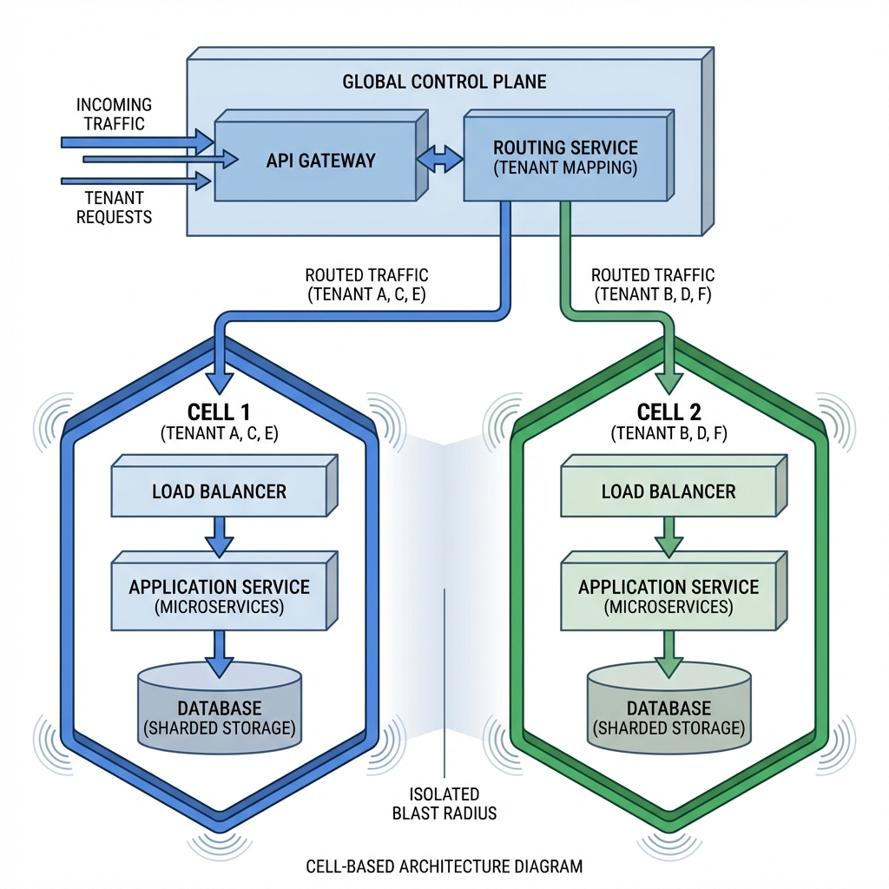
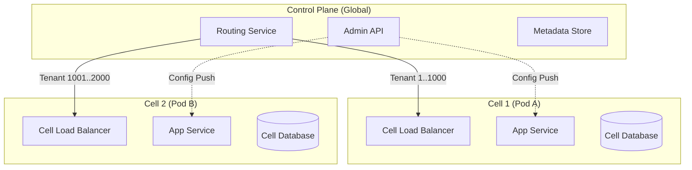
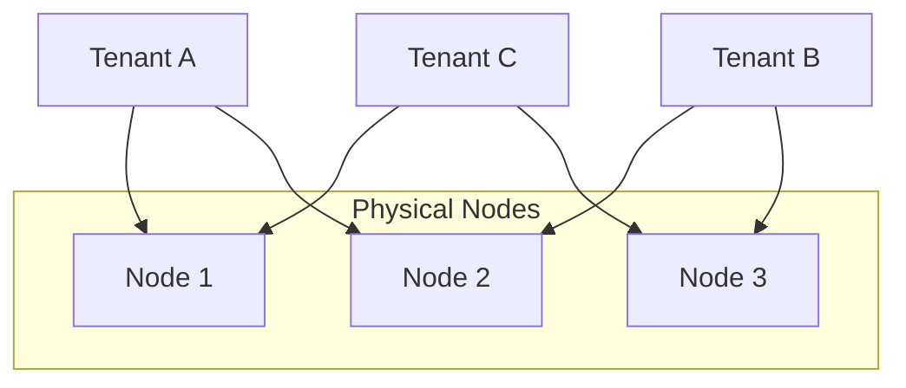

# Multi-Tenant Architecture: A Principal Architect's Guide

> **Context**: This guide synthesizes industry standards (Google, AWS, Azure) for building massive-scale multi-tenant systems. It goes beyond basic "logical separation" to address **failure domains**, **noisy neighbors**, and **control plane isolation**.

---

## 🏗️ The Multi-Tenancy Spectrum: Isolation vs. Efficiency

Multi-tenancy is not a binary choice. It is a sliding scale of risk vs. cost.

| Level | Description | Cost | Isolation | Use Case |
| :--- | :--- | :--- | :--- | :--- |
| **Pooled (Share Everything)** | All tenants share app/DB/cache. | 📉 Lowest | 🔴 Weak | Free Tier, Low-risk apps. |
| **Bridge (Sharded)** | Shared app, sharded DB (by tenant ID). | 📉 Low | 🟡 Medium | Standard SaaS (B2B). |
| **Silo (Share Nothing)** | Dedicated infrastructure per tenant. | 📈 Highest | 🟢 High | Enterprise, Compliance (FedRAMP). |
| **Cell-Based (The Gold Standard)** | Fixed-size "Cells" containing X tenants. | ⚖️ Balanced | 🟢 High | **Hyperscale (Google/AWS)**. |

---

## 🧬 Cell-Based Architecture (The Google Standard)

At scale, the "Blast Radius" of a failure is your #1 enemy. If a shared database goes down, **only a subset of tenants** should suffer.

### Why Cells?
1.  **bounded Blast Radius**: If Cell 1 fails, Tenants in Cell 2 are unaffected.
2.  **Linear Scalability**: Need more capacity? Add Cell 3.
3.  **Deterministic Testing**: You can test an entire Cell in isolation.

---

## 🛡️ The "Noisy Neighbor" Defense: Shuffle Sharding

Standard sharding (Hash mod N) is risky. If Node A fails, 100% of its load moves to Node B, potentially crashing it (Cascading Failure).

**Shuffle Sharding** creates virtual shards by mapping tenants to a **unique combination** of physical nodes.

*   **Benefit**: If Tenant A attacks the system (DDoS), they degrade only N1 and N2. Tenant B (on N2 & N3) sees minor degradation. Tenant C (on N1 & N3) sees minor degradation. **Wait...**
*   *Correction*: With large numbers of nodes (e.g., 100 modes, 2 shards per tenant), the probability of two tenants sharing *both* nodes is mathematically effectively zero.
*   **Result**: Complete fault isolation without dedicated hardware.

---

## 🧠 Control Plane vs. Data Plane

The most critical separation in multi-tenancy.

| Plane | Responsibility | Characteristics |
| :--- | :--- | :--- |
| **Data Plane** | Processing user requests (Search, Insert, View). | **High Volume**, Low Latency. Disconnects affect users immediately. |
| **Control Plane** | Configuration (Create Tenant, Update Billing). | **Low Volume**, High Integrity. Disconnects prevent *changes*, not usage. |

> [!CRITICAL]
> **Never let the Control Plane crash the Data Plane.**
> *   Do not effectively synchronize tenant config on every request.
> *   Push config to the Data Plane asynchronously (eventually consistent).
> *   If Admin API is down, tenants should still be able to log in and work.

---

## ⚖️ Operational Reality

### 1. Throttling (Rate Limiting)
You cannot rely on "fair use". You must enforce it.
*   **Global Quota**: Total RPS system can handle.
*   **Tenant Quota**: Max RPS per tenant (e.g., 100 RPS).
*   **Token Bucket Algorithm**: Allow bursts, but enforce average.

### 2. Tiering Strategy
Map tenants to infrastructure tiers based on revenue.

| Tier | Infrastructure | Latency SLO | Support |
| :--- | :--- | :--- | :--- |
| **Bronze** | Pooled (Spot Instances) | 500ms | Community |
| **Silver** | Sharded (Reserved Capacity) | 200ms | Email |
| **Gold** | Shuffle Sharded / Isolated Cell | 50ms | 24/7 Phone |

### 3. Data Gravity & Migration
Moving a tenant from Cell A to Cell B is hard.
*   **Dual Write**: Write to both A and B.
*   **Backfill**: Copy historical data.
*   **Validation**: Compare checksums.
*   **Cutover**: Switch routing to B.

---

## ✅ Principal Architect Checklist

1.  **Define Your Blast Radius**: "If a database fails, what % of customers go down?" Aim for < 5%.
2.  **Separate Control & Data**: Ensure your app works even if the Admin dashboard is dead.
3.  **Implement Shuffle Sharding**: If you are at hyperscale, simple round-robin is a vulnerability.
4.  **Enforce Limits at the Door**: Rate limiters must sit at the *edge* (Gateway), not deep in the app/database.
5.  **Use GUIDs for Everything**: Integer IDs prevent you from merging shards later.
6.  **PaaS > IaaS**: Don't build your own load balancer. Use the cloud provider's (ALB/GLB) to handle the raw socket pressure.

---

## 🔗 Related Documents
*   [Scalable Search](scallable-search.md) — Index-per-tenant patterns (Elasticsearch)
*   [Shopify Scale](shopify-scale.md) — Pod-based architecture (Cells in practice)
*   [Atlassian Scale](atlassian-scale.md) — Database metadata explosion
