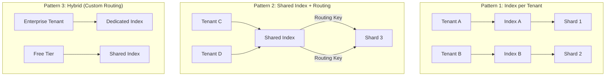
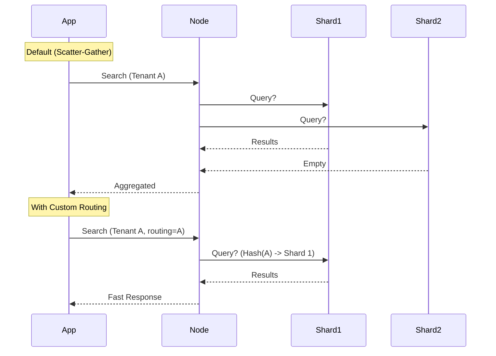

# Scalable Search: Multi-Tenant Patterns for Elasticsearch & Solr

> **Source**: [Elasticsearch Multi-Tenancy Patterns](https://www.youtube.com/watch?v=bbbtVQCezaU)

> [!IMPORTANT]
> **The Scale Problem**: Search engines (Lucene-based) are heavy. You cannot spawn 1 million processes for 1 million tenants. The challenge is mapping **Logical Tenants** to **Physical Shards** without blowing up the Cluster State (metadata).

---

## 📊 The Three Core Patterns

We must choose a strategy based on tenant size and strictness of isolation.

### Pattern 1: Index Per Tenant
Every tenant gets their own dedicated index (and thus, dedicated shards).

| Dimension | Verdict | Logic |
| :--- | :--- | :--- |
| **Isolation** | 🛡️ **Best** | Physical separation. One tenant's corruption doesn't touch others. |
| **Management** | ✅ **Easy** | "Drop Index" = Instant delete. Backup/Restore is per-tenant. |
| **Scalability** | ⚠️ **Poor** | **Cluster State Explosion**. Zookeeper/Master nodes crash with >50k indices. |
| **Overhead** | 🔴 **High** | Each shard has Lucene segments, transaction logs, and buffers. |

> [!CAUTION]
> **The "Oversharding" Trap**: A cluster with 100,000 tiny indices (1 shard each) will spend 90% of heap on metadata. **Do not use this for massive numbers of small tenants.**

### Pattern 2: Shared Index (with Routing)
All tenants share one massive index. Data is separated by a `tenant_id` field.

| Dimension | Verdict | Logic |
| :--- | :--- | :--- |
| **Isolation** | ❌ **Weak** | Logic-based (`filter: tenant_id`). Bug in app code = Data Leak. |
| **Management** | ⚠️ **Hard** | "Delete Tenant" = `delete_by_query` (Expensive O(N) operation). |
| **Scalability** | 🚀 **Infinite** | Can hold millions of tenants. Only limited by disk size. |
| **Performance** | ⚠️ **Risk** | **Noisy Neighbor**: One heavy tenant query kills the cache for everyone. |

### Pattern 3: Filtered Aliases (The Abstraction)
You create a *logical* alias per tenant (`alias_tenant_A`) that points to a shared index with a pre-baked filter (`{"term": {"tenant_id": "A"}}`).
*   **Pros**: Application thinks it's talking to a dedicated index.
*   **Cons**: Aliases are still metadata. 1M aliases = 1M entries in Cluster State. Same scalability limit as Pattern 1.

---

## 🚀 Efficient Routing: The "Google-Scale" Optimization

By default, Elasticsearch scatters documents to *any* shard. This is bad for multi-tenancy.
**Optimization**: Use custom routing to force a tenant's data into a **single shard**.

*   **Benefit**: Query goes to **1 shard** instead of all shards.
*   **Throughput**: 50x to 100x improvement for high-cardinality clusters.

---

## 🏗️ Operational Nightmares & Solutions

### 1. The "Noisy Neighbor" Problem
in a shared index, Tenant A decides to re-index 1TB of logs. Tenant B's search latency spikes to 5 seconds.
*   **Solution**: **Indexing Throttling**. You must implement a token-bucket rate limiter *before* the search engine. Do not rely on Lucene to be fair.

### 2. The "IDF Skew" Problem
Search relevance (TF-IDF) depends on global term frequency. In a shared index, Tenant A's documents ("medical") pollute the statistics for Tenant B ("gaming").
*   **Solution**: Use `dfs_query_then_fetch` (slow) or simply accept that relevance scores are approximate in shared environments.

### 3. The "Tiering" Strategy
Don't treat all tenants equally.

| Tier | Strategy | Hardware | Cost |
| :--- | :--- | :--- | :--- |
| **Free / Small** | Shared Index | HDD / Warm Nodes | $ |
| **Pro / Mid** | Shared Index (Low Density) | SSD / Hot Nodes | $$ |
| **Enterprise** | Dedicated Index | NVMe / Dedicated Nodes | $$$$ |

---

## ✅ Principal Architect Checklist

1.  **Enforce Shard Limits**: Keep shard size between **20GB - 50GB**. Any smaller = overhead. Any larger = recovery pain.
2.  **Monitor Cluster State Size**: If `cluster_state` size > 100MB, you are in danger. Stop creating indices.
3.  **Use Custom Routing**: Always provide `?routing=tenant_id` for queries and index operations.
4.  **Implement Application-Level Security**: Never trust the search engine's query filter alone. Wrap it in a service layer.
5.  **Plan for Deletion**: In shared indices, consider **Time-Based Indices** (e.g., `logs-2024-01`) so you can delete old data cheaply by dropping indices, rather than expensive `delete_by_query`.
6.  **Avoid Mapping Explosion**: In shared indices, disable dynamic mapping. One tenant defining 1000 custom fields shouldn't crash the index for everyone.

---

## 🔗 Related Documents
*   [Atlassian Scale](atlassian-scale.md) — Solving Metadata Explosion (Database)
*   [Cluster Management](cluser-management-large-scale.md) — SolrCloud Ops