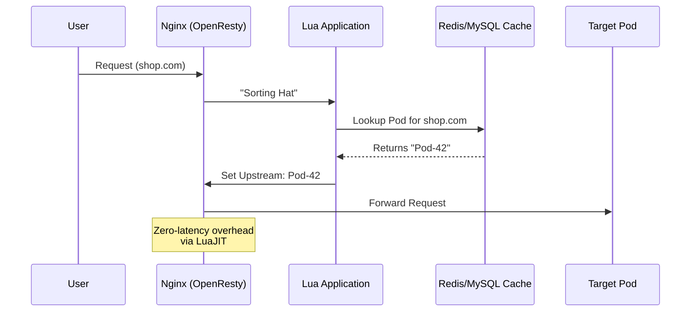
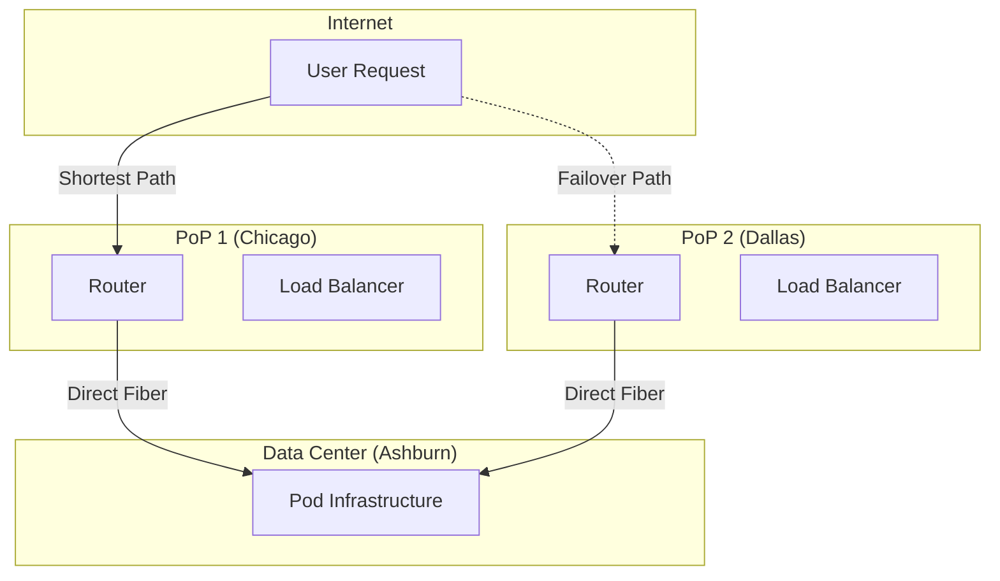

# Shopify Scale: Multi-Tenancy for Flash Sales

> **Source**: [Shopify's Multi-Tenant Architecture](https://youtu.be/QvpZc2x8Pvw)

> [!IMPORTANT]
> **The Challenge**: Handling "Flash Sales" (e.g., Kylie Jenner drops) where traffic spikes from zero to millions in seconds. Traditional auto-scaling is too slow. Shopify solves this with **Podding**, **Floating Capacity**, and **BGP Anycast**.

---

## 🏗️ The Multi-Tenancy Spectrum: Podding

Shopify moved from "Share Everything" to massive "Podding".

```mermaid
graph TB
    subgraph "Global Load Balancer"
        LB[Nginx + OpenResty]
        SH[Sorting Hat (Lua)]
        LB --> SH
    end

    subgraph "Pod 1 (Isolated)"
        P1_WEB[Web Servers]
        P1_Job[Job Workers]
        P1_DB[(Shard 1)]
    end

    subgraph "Pod 2 (Isolated)"
        P2_WEB[Web Servers]
        P2_Job[Job Workers]
        P2_DB[(Shard 2)]
    end

    subgraph "Floating Capacity (Shared)"
        FC[Spare Web Servers]
    end

    SH -->|Standard Traffic| P1_WEB
    SH -->|Standard Traffic| P2_WEB
    
    SH -.->|Flash Sale!| FC
    FC -->|Assigned Temporarily| P1_DB
```

| Strategy | Pros | Cons | Shopify's Choice |
| :--- | :--- | :--- | :--- |
| **Share Nothing** (Magento) | High isolation | Low utilization, expensive | ❌ |
| **Share Everything** | High utilization | Cascading failures, "noisy neighbors" | ❌ (Legacy) |
| **Podding** | Isolation + Utilization | Complex routing (Sorting Hat) | ✅ **Current** |

### The "Floating Capacity" Concept
*   **Pods** have fixed capacity for normal traffic.
*   **Floating Capacity** is a massive shared pool of web servers.
*   When a flash sale hits Pod 1, Sorting Hat dynamically routes extra capacity to Pod 1's database.

---

## 🎩 "Sorting Hat": The Routing Layer

To route requests to the correct pod (Shard), Shopify built an intelligent routing layer.



### Components
*   **Nginx + OpenResty**: The foundation.
*   **Lua Scripts**: Custom logic to routing, logging, and SSL termination.
*   **Performance**: LuaJIT is so fast that routing latency is negligible.
*   **Safety**: If Nginx crashes, it withdraws its BGP route instantly.

---

## 🌍 Network Scaling: BGP Anycast

DNS failover was too slow (TTL caching). Shopify moved to **BGP Anycast**.



### Key Network Decisions
1.  **Own Your IPs**: Rented IPs belong to the data center. Owned IPs move with you.
2.  **BGP Anycast**: Announce the *same IP* from all locations. Traffic flows to the nearest PoP.
3.  **Direct Fiber**: If traffic hits the "wrong" DC during failover, tunnel it over private fiber (not public internet) to the correct DC.
4.  **ECMP (Equal Cost Multipath)**: Consistent hashing distributes TCP flows across load balancers.

---

## 🚦 Automated Failover

| Metric | Manual Failover | Automated Failover |
| :--- | :--- | :--- |
| **Team Size** | 10 people | 0 people (Script) |
| **Duration** | Hours/Days | < 5 Minutes |
| **Downtime** | Significant | Zero storefront downtime |
| **Mechanism** | Human coordination | MySQL Replication + Script |

---

## ✅ Principal Architect Checklist

1.  **Don't Rely on Auto-Scaling for Flash Sales**: By the time VMs boot, the sale is over. Use **Floating Capacity** (over-provisioned pool) instead.
2.  **Move Routing to the Edge**: Use OpenResty/Lua (like "Sorting Hat") to route efficiently before hitting app servers.
3.  **Own Your IP Space**: Cloud provider IPs lock you in. BYOIP with BGP enables global traffic shifting.
4.  **Avoid DNS Failover**: TTL caching kills RTO. Use BGP for instant traffic redirection.
5.  **Isolate Tenants into Pods**: "Share Everything" breaks at scale. "Share Nothing" is too expensive. Pods are the sweet spot.
6.  **Script Your Failover**: If failover requires a "war room", you aren't resilient. It must be a script effectively running under 5 minutes.

---

## 📖 Analogy: City Utility & The Floating Reservoir

> [!TIP]
> Architecture for Flash Sales:
>
> *   **Share Everything**: One giant water main for the city. If a factory (Kylie Jenner) opens a hydrant, pressure drops for everyone.
> *   **Pods**: Distinct neighborhoods with their own water towers.
> *   **Floating Capacity**: A massive **"Floating Reservoir"** on standby. When a neighborhood hosts a festival (Flash Sale), the city instantly pumps this reserve water ONLY to that neighborhood's tower.
> *   **Sorting Hat**: The smart valve system deciding where water goes.

---

## 🔗 Related Documents
*   [Atlassian Scale](atlassian-scale.md) — Solving Metadata Explosion (Database focus)
*   [Knative Eventing](serverless-aspect-and-why.md) — Serverless Auto-Scaling