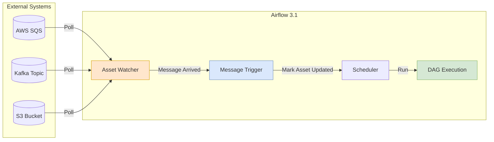

# Airflow 3.1: The Shift to Event-Driven Scheduling

> **Source**: [Airflow 3.1 Event Triggers Explained](https://youtu.be/9dtT9eKe7hU?list=TLGGUYhep7E3FX8wODAxMjAyNg)

> [!IMPORTANT]
> **The Paradigm Shift**: Moving from **Time-Based** (Cron) to **Event-Based** (Triggers).
> *   **Old Way**: Run every 30 mins to check for data.
> *   **New Way**: Run *immediately* when a message lands in SQS/Kafka.

---

## 🏗️ Architecture: The Event Trigger System

Airflow 3.1 introduces native support for reacting to external messages without custom API calls.

### Core Components
1.  **External Message Queue**: The source of truth (SQS, Kafka, RabbitMQ).
2.  **Asset Watcher**: A process that treats the Queue as a "Data Asset" and watches for changes.
3.  **Message Trigger**: An async service that polls the queue and fires the DAG when conditions are met.

### The Workflow
1.  **Registration**: DAG Processor registers the `Asset` and `Trigger` in the DB.
2.  **Monitoring**: Async Trigger process polls SQS/Kafka (efficiently).
3.  **Execution**: On message arrival, the Trigger marks the Asset as "Updated", causing the DAG to run.

---

## 📊 Event Trigger Architecture



---

## 🛠️ Implementation (AWS SQS Example)

**Prerequisites**: `apache-airflow-providers-amazon` + `apache-airflow-providers-common-messaging`.

**Code Structure**:
*   **The Trigger**: Inherits from base asset trigger. Configured with `queue_name` and `poll_interval`.
*   **The Asset**: Defined with an `AssetWatcher` class.
*   **The DAG**:
    ```python
    # Pseudo-code concept
    my_sqs_asset = Asset(name="my_queue", watcher=SQSAssetWatcher(...))

    with DAG(schedule=[my_sqs_asset]):
        # This DAG runs instantly up on SQS message
        process_data()
    ```

---

## 🆚 Before vs After

| Feature | Pre-Airflow 3.1 | Post-Airflow 3.1 |
| :--- | :--- | :--- |
| **Trigger Mechanism** | Custom Lambda/Script calling `api/v1/dags/trigger`. | **Native Asset Definition** inside python code. |
| **Complexity** | High (Managing external scripts + Auth). | Low (Managed entirely by Airflow Scheduler). |
| **Latency** | Dependent on Cron interval OR API latency. | Near Real-Time. |

---

## ✅ Principal Architect Checklist

1.  **Upgrade to Airflow 3.1+**: Native Event Triggers eliminate the need for external Lambda/API scripts. This is a significant ops simplification.
2.  **Install Required Providers**: For SQS, you need `apache-airflow-providers-amazon` AND `apache-airflow-providers-common-messaging`. Missing deps cause silent failures.
3.  **Set Appropriate Poll Intervals**: Too short = wasted API calls (cost). Too long = latency. Start with 30 seconds, tune based on SLA.
4.  **Monitor Trigger Lag**: Add metrics to track time from "message in queue" to "DAG started". This is your end-to-end latency.
5.  **Migrate Incrementally**: Don't convert all DAGs at once. Start with low-risk, high-latency-sensitive DAGs. Validate, then expand.
6.  **Handle Dead Letter Queues**: If a message triggers a DAG that fails, ensure the message is moved to a DLQ for retry/analysis. Don't lose events.

---

## 🚌 Analogy: Bus Schedule vs Ride-Sharing

> [!TIP]
> **Understanding the Shift**:
> *   **Traditional Airflow (Cron)** is a **Bus Schedule**.
>     *   The bus arrives every 30 minutes.
>     *   Sometimes it's empty (Resource Waste).
>     *   Sometimes passengers wait 29 minutes (Latency).
> *   **Airflow 3.1 (Event Triggers)** is a **Ride-Sharing App**.
>     *   The car sits parked (No Resources) until a passenger hits "Request Ride".
>     *   The car arrives immediately.
>     *   **Efficiency + Speed**.
