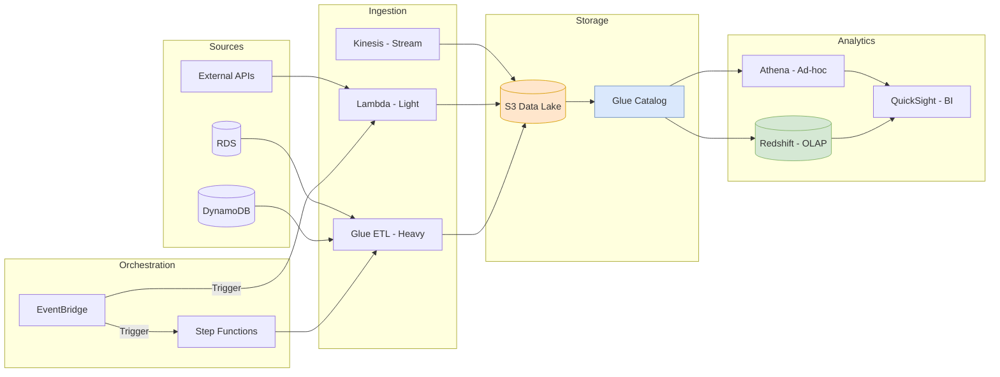

# AWS Services for Data Engineering: The Essentials

> **Source**: [Must Know AWS Services for Data Engineers](https://www.youtube.com/watch?v=tykcCf-Zz1M)

> [!IMPORTANT]
> **Use Case**: Consolidating RDS/DynamoDB data into a central repository for analytics.
> **Key Principle**: Choose the right tool for the **Volume** and **Latency** requirements.

---

## 📊 AWS Data Pipeline Architecture

---

## 1. Data Ingestion: Getting Data In

| Service | Use Case | Constraint/Note |
| :--- | :--- | :--- |
| **AWS Lambda** | **Lightweight/Event-Driven**. Small files, API calls. | **< 15 min** execution limit. Not for Big Data. |
| **AWS Glue** | **Serverless Big Data**. ETL jobs scaling to billions of rows. | Uses **Spark**. Pricing based on DPU (Data Processing Unit). |
| **Amazon EMR** | **Managed Cluster**. Heavy, persistent workloads. | You manage the cluster (Hadoop, Spark, Hive). |
| **AWS Kinesis** | **Real-Time Streaming**. | **Firehose** loads to S3. **Analytics** runs SQL on streams. |

---

## 2. Storage & Catalog: The Data Lake

### Amazon S3 (The Foundation)
The specific storage layers for a "Medallion" architecture:
*   **Raw Zone**: Landing data as-is.
*   **Processed Zone**: Cleaned, deduplicated.
*   **Consumer Zone**: Optimized for analytics (Parquet).

### AWS Glue Catalog (The Brain)
To prevent a **Data Swamp**, you need metadata.
*   **Glue Crawlers**: Automatically scan S3 to discover schema/partitions.
*   **Catalog**: A central Hive Metastore that allows other tools (Athena, Redshift) to "see" S3 files as "Tables".

---

## 3. Analytics & Serving: Consuming Data

| Service | Type | Use Case |
| :--- | :--- | :--- |
| **AWS Redshift** | **Data Warehouse (OLAP)** | Complex joins, high-performance aggregations on TB/PB scale. |
| **Amazon Athena** | **Serverless SQL** | **Ad-hoc queries** directly on S3. Pay-per-TB-scanned. Great for occasional checks. |
| **QuickSight** | **BI Dashboarding** | Serverless visualization. Integrates ML insights. |

---

## 4. Orchestration: Tying It Together

*   **Amazon EventBridge**: **The Trigger**. "Run this job when file lands in S3".
*   **AWS Step Functions**: **The Orchestrator**. State machines to manage complex dependency graphs with error handling.
*   **SNS / SQS**: **The Glue**. Decoupling components via async messaging (Fan-out architecture).
*   **CloudWatch**: **The Eyes**. Centralized logging and monitoring.

---

## ✅ Principal Architect Checklist

1.  **Lambda vs Glue Decision Tree**:
    *   Job < 15 min AND data < 1GB? → **Lambda**.
    *   Job > 15 min OR data > 1GB? → **Glue (Spark)**.
    *   Need persistent cluster (long-running, complex deps)? → **EMR**.
2.  **Prevent the Data Swamp**: Deploy **Glue Crawlers** on a schedule to auto-populate the Catalog. Without metadata, your Data Lake becomes a dumping ground.
3.  **Athena Cost Control**: Athena charges per-TB-scanned. Partition your data by date/region to minimize scan size. Use Parquet/ORC for compression.
4.  **Event > Cron**: Use **EventBridge** to trigger jobs on S3 file arrival, not on a fixed schedule. This reduces latency and wasted compute.
5.  **Step Functions for Complex Workflows**: If you have > 3 dependent jobs, use Step Functions for visual debugging and error handling. Glue Workflows are limited.
6.  **Monitor with CloudWatch Alarms**: Every Lambda/Glue job should have CloudWatch alarms for errors/duration. Use SNS to notify on-call.

---

## 🏭 Analogy: The Automated Factory

> [!TIP]
> **Understanding the Ecosystem**:
> *   **Lambda/Glue** are the **Conveyor Belts & Robotic Arms** (Ingestion) bringing raw materials in.
> *   **S3** is the massive **Warehouse** where everything is stored.
> *   **Glue Catalog** is the **Inventory System**—without it, you lose boxes.
> *   **Redshift** is the **Heavy Forge** for building massive machinery (Complex Analytics).
> *   **Athena** is the **X-Ray Scanner**—quickly peer inside a box without moving it.
> *   **Step Functions** is the **Factory Manager**, ensuring machine A finishes before machine B starts.
