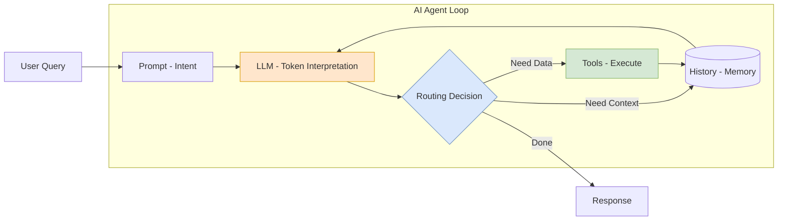

# Data Engineering in the Era of AI (Vision 2026)

> **Source**: Christophe Blefari - "The Future of Data Engineering"

> [!IMPORTANT]
> **The Shift**: The era of "move bytes from A to B" is ending. By 2026, the primary role of data teams will shift from **Pipeline Engineering** to **Context Engineering**.

---

## 🤖 The Reality of Automation
*   **The Prediction**: Leaders (Anthropic, Microsoft) predict AI will write 90-95% of code.
*   **The Signal**: Entry-level data hiring is down **60%** YoY.
*   **The Conclusion**: If your value is purely "writing SQL transformation scripts", you are obsolete. The value is now in **invention** and **system design**.

---

## 🧠 The Mechanism: What is an AI Agent?
Blefari demystifies the buzzword:
> "An Agent is just a **while loop** on top of **token interpretation**."

### Components of an Agent
1.  **Prompt**: The Intent ("You are a Data Analyst").
2.  **Tools**: The Hands (Read DB, Execute SQL, Hit API).
3.  **History**: The Memory (Previous steps).
4.  **Routing (The Brain)**: Non-deterministic logic. Unlike Airflow (DAGs), an Agent decides its *own* path.

---

## 📉 Why "Chat with Data" Fails
Since 2022, companies rushed to build "Chat with your Database" interfaces. Most failed.
*   **Reason**: Stakeholders lack **Domain Context**.
*   **Scenario**:
    *   *User*: "What was revenue last month?"
    *   *AI*: "Does revenue include taxes? What about coupons? Do chargebacks count?"
    *   *User*: (Gives up, asks a human).

---

## 🏗️ The New Strategy: Context Engineering
If the AI has the "Skills" (Coding) but lacks the "Knowledge" (Business Logic), the new job is to bridge that gap.

### 1. Serialize the Business
Data teams must convert "tribal knowledge" into "machine-readable context":
*   **Metric Hierarchies**: Explicitly defining `Revenue = (Gross - Tax - Refunds)`.
*   **Lineage**: Where did this data come from?
*   **Documentation**: Not just "what" but "why".

### 2. Context Window Optimization
Treat the **LLM Context Window** like a scarce resource (RAM).
*   **Compaction**: Summarize meeting notes and documentation before feeding them to the Agent.
*   **Relevance**: RAG (Retrieval) is not enough; you need *semantic* relevance.

### 3. The "Translation Layer"
Data Engineers have always translated "Business Speak" to "SQL". Now, they must build the **Translation Layer** that allows AI Agents to do that mapping autonomously.

---

## 💡 The Enduring Human Element
AI handles the "how" (writing the code). Humans handle the "what" and "why".
*   **The Decision Factory**: Humans deep-dive into **messy, fallible, creative** problems.
*   **Advice**: Don't just use tools. **Write your own Agent**. Understand the loops, the context injection, and the failure modes.

---

## ✅ Principal Architect Checklist

1.  **Audit Your "Tribal Knowledge"**: Identify undocumented business rules. If a human must explain "revenue doesn't include refunds" every time, that's a Context Engineering failure.
2.  **Build a Metric Dictionary**: Create a machine-readable definition layer (e.g., dbt Metrics, LookML) that AI agents can query. This is the "Employee Handbook".
3.  **Measure Context Window Usage**: Treat LLM tokens like RAM. Profile how much context your agents consume. Compress/summarize aggressively.
4.  **Invest in Semantic Lineage**: RAG (Retrieval) is necessary but not sufficient. Build systems that understand *semantic* relationships between data assets, not just physical lineage.
5.  **Build Your Own Agent**: Don't just use off-the-shelf tools. Understand the loop (Prompt → Tool → History → Route). This is the new core competency.
6.  **Plan for Non-Determinism**: Agents don't follow DAGs. They decide their own path. Your monitoring and error handling must account for this.

---

## 🧩 Analogy: The "Temp Worker"

> [!TIP]
> **Context Engineering Explained**:
> Imagine hiring a **High-Skilled Temp Worker** (The AI Agent).
> *   **Scenario A**: You give them a desk and say "Do the accounting."
>     *   *Result*: Failure. They ask 1,000 questions or do it wrong.
> *   **Scenario B (Context Engineering)**: You give them:
>     1.  The Employee Handbook (Documentation)
>     2.  Keys to the filing cabinet (Tools)
>     3.  Meeting notes from the last year (History/Context)
>     *   *Result*: They are productive **immediately**.
>
> **Your job is no longer doing the accounting. Your job is creating the Handbook.**
