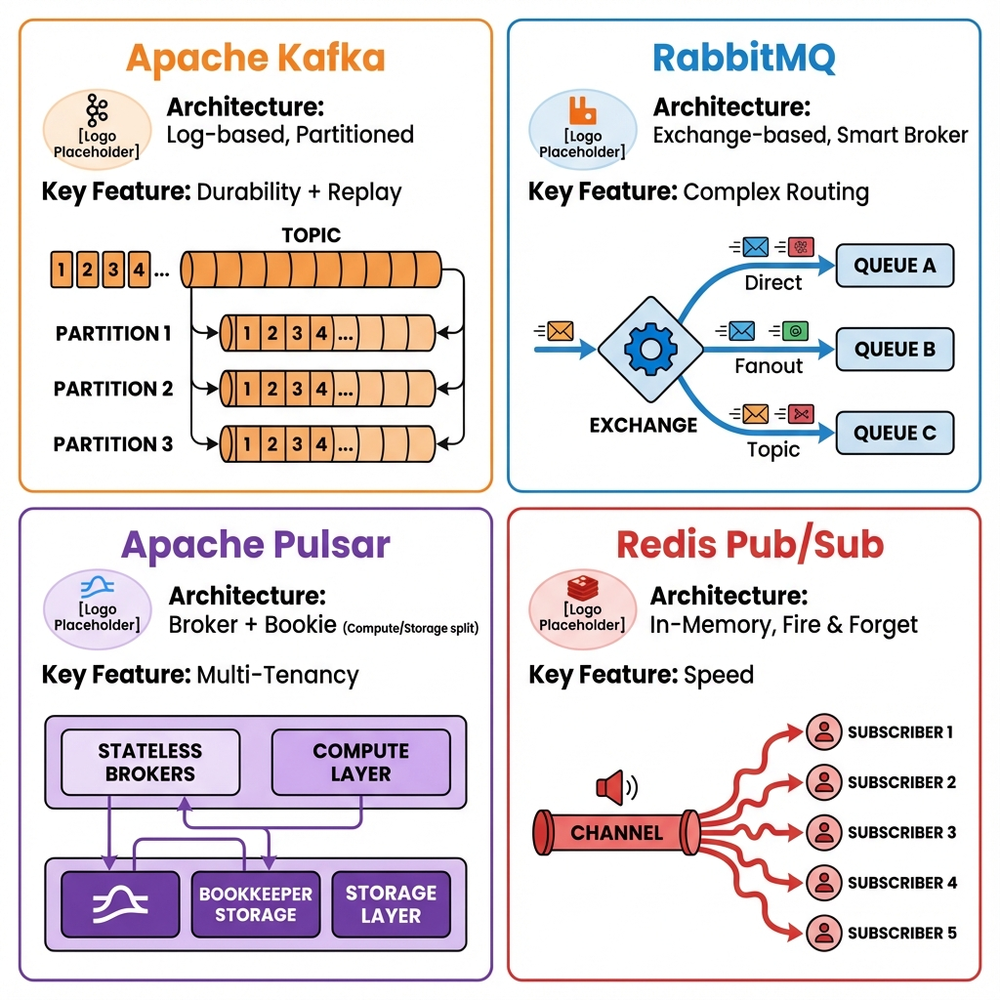

# Message Brokers: The Comparison Guide

> **Source**: [Kafka vs RabbitMQ vs Pulsar vs Redis](https://youtu.be/rKOMmqIVZK8?list=TLGG62H7FAD1DSEwODAxMjAyNg)

> [!IMPORTANT]
> **Selection Cheat Sheet**:
> *   **Kafka**: High Scale, Durable Log (The "Standards").
> *   **RabbitMQ**: Complex Routing, Traditional Queue (The "Router").
> *   **Pulsar**: Hybrid, Geo-Replication, Multi-tenant (The "Modern All-in-One").
> *   **Redis**: Instant, Ephemeral (The "Speedster").

---

## 📊 Broker Architecture Comparison

```mermaid
graph TB
    subgraph "Kafka - Log Based"
        KP[Producer] --> KT[Topic/Partitions]
        KT --> KC[Consumer Group]
        KT --> KS[(Durable Storage)]
    end

    subgraph "RabbitMQ - Exchange Based"
        RP[Producer] --> RE[Exchange]
        RE -->|Routing Rules| RQ1[Queue 1]
        RE -->|Routing Rules| RQ2[Queue 2]
        RQ1 --> RC1[Consumer]
        RQ2 --> RC2[Consumer]
    end

    subgraph "Pulsar - Layered"
        PP[Producer] --> PB[Broker - Stateless]
        PB --> PBK[(Bookie - Storage)]
        PB --> PC[Consumer]
    end

    subgraph "Redis - Fire & Forget"
        RdP[Publisher] --> RdC[Channel]
        RdC --> RdS1[Subscriber 1]
        RdC --> RdS2[Subscriber 2]
    end

    style KS fill:#ffe6cc,stroke:#d79b00
    style RE fill:#dae8fc,stroke:#6c8ebf
    style PBK fill:#d5e8d4,stroke:#82b366
    style RdC fill:#e1d5e7,stroke:#9673a6
```

---

## 🏛️ The Four Contenders

| Broker | Type | Strength | Weakness |
| :--- | :--- | :--- | :--- |
| **Apache Kafka** | Distributed Streaming Platform | **Throughput & Persistence**. Millions of msgs/sec. Durable Storage. | Complexity (Zookeeper). "Dumb" routing (Consumer acts smart). |
| **RabbitMQ** | Message Queue | **Routing Logic**. Complex patterns (Fanout, Topic, Header exchanges). | Lower throughput than Kafka. Harder to scale horizontally. |
| **Apache Pulsar** | Unified Platform | **Architecture**. Separates Compute/Storage. Best of both worlds. | Newer ecosystem (though 10+ years old). |
| **Redis Pub/Sub** | In-Memory Broker | **Latency**. Lowest latency. Simplest setup. | **No Persistence**. If you blink, you miss the message. |

---

## 🔍 Deep Dive

### 1. Apache Kafka
*   **Philosophy**: "Smart Client, Dumb Broker". The broker just appends bytes. The consumer tracks its own offset.
*   **Best For**: Log Aggregation, Event Sourcing, Data Pipelines.

### 2. RabbitMQ
*   **Philosophy**: "Smart Broker, Dumb Client". The broker handles complex routing rules (Exchanges/Queues) to deliver messages precisely.
*   **Best For**: Task Queues, Order Processing, Legacy integration.

### 3. Apache Pulsar
*   **Philosophy**: "Cloud Native". Separates Brokers (Stateless) from Bookies (Storage).
*   **Best For**: Multi-tenant platforms, Geo-replication requirements, Hybrid constraints (Need Queue + Stream).

### 4. Redis Pub/Sub
*   **Philosophy**: "Fire and Forget".
*   **Best For**: Chat apps, Live Notifications, Dashboard updates.

---

## ✅ Principal Architect Checklist

1.  **Kafka for Event Sourcing**: If you need to replay events or build derived views, Kafka's durable log is essential. RabbitMQ deletes messages after ack.
2.  **RabbitMQ for Task Queues**: If you need complex routing (dead-letter, priority, TTL per message), RabbitMQ's "smart broker" model is simpler than implementing this in Kafka consumers.
3.  **Pulsar for Multi-Tenancy**: If you have many teams sharing one cluster, Pulsar's native isolation (Namespaces, Quotas) reduces operational burden vs running N Kafka clusters.
4.  **Redis for Ephemeral Speed**: If you can tolerate message loss (e.g., live dashboard updates), Redis Pub/Sub is the simplest and fastest. Never use it for critical data.
5.  **Evaluate "Smart Broker vs Smart Client"**:
    *   **RabbitMQ**: Routing logic in broker. Simpler clients.
    *   **Kafka**: Consumer manages offset. Broker is "dumb". More flexible, but more client complexity.
6.  **Decision Tree**:
    *   Need durability + replay? → **Kafka**.
    *   Need complex routing rules? → **RabbitMQ**.
    *   Need both + multi-tenancy + geo-replication? → **Pulsar**.
    *   Need instant, ephemeral pub/sub? → **Redis**.

---

## 🏢 Analogy: The Office Building

> [!TIP]
> **Understanding the Systems via Office Comms**:
>
> 1.  **Kafka is the Security Camera System** 📹
>     It captures *everything* (Massive Scale). It stores it on tape/disk for weeks (Persistence). If you miss something, you rewind and watch it later (Replay).
>
> 2.  **RabbitMQ is the Internal Mailroom** ✉️
>     It follows strict rules. "If envelope has Red Stamp, send to Accounting. If Blue, send to IT". Highly organized delivery, but slower than a camera feed.
>
> 3.  **Pulsar is the Modern Digital Hub** 💻
>     It's Slack + Dropbox + Email. It archives messages forever (Stream) OR sends instant pings (Queue). It's built for the cloud era.
>
> 4.  **Redis Pub/Sub is the Intercom/PA System** 📢
>     **"Attention everyone!"**. Instant. Everyone hears it *now*. But if you were in the bathroom (Offline subscriber), you missed it forever. No recording exists.
