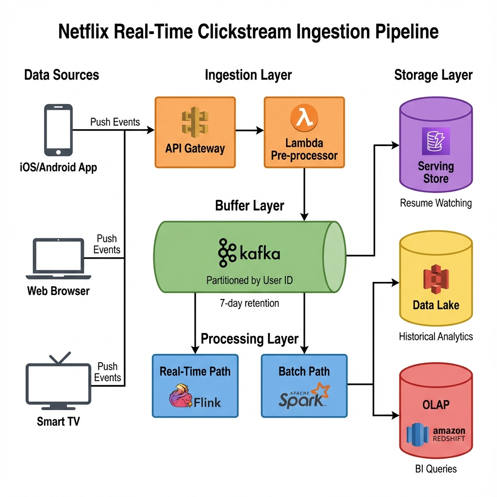
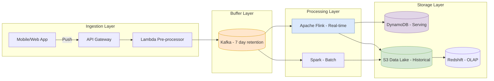

# Real-Time Clickstream Ingestion (Netflix)

> **Source**: [System Design Interview - Netflix Data Pipeline](https://youtu.be/53tcAZ6Qda8)

> [!IMPORTANT]
> **Use Case**: Designing a pipeline to handle **50,000+ events/second** (peaks much higher) for **200M subscribers** to track Churn, Path Analysis, and Playback Behavior.

---

## 📊 Pipeline Architecture

---

## 🏗️ Architecture Design

### 1. Data Capture: Push vs Pull?
How to get events from the App to the Server?
*   **Pull (Polling)**: Infrastructure asks App for data.
    *   *Cons*: High Latency. Bad for real-time marketing.
*   **Push (Demon/Gateway)**: App sends events immediately to API Gateway.
    *   *Pros*: Real-time.
    *   *Decision*: **Push Model** via API Gateway + Lambda Pre-processors.

### 2. The Buffer: Apache Kafka
*   **Role**: Resilient storage (7-day retention).
*   **Why**: Decouples Producers (App) from Consumers (Analytics). If S3 goes down, Kafka holds the data.

### 3. Stream Processing: Flink vs Spark
*   **Spark Streaming**: Micro-batching. Good, but higher latency.
*   **Apache Flink**: True streaming. Required for **Sub-second latency** needed for immediate personalized recommendations.

### 4. Storage Layers
| Store | Layer | Purpose |
| :--- | :--- | :--- |
| **S3 (Data Lake)** | Raw & Processed | Historical Analysis (Petabytes). "Truth". |
| **DynamoDB** | Serving | Real-time features (e.g., "Resume Watching"). Schema-less speed. |
| **Redshift/RDBMS** | OLAP | Business Reporting (not in critical ingestion path). |

---

## 📊 Business Metrics to Engineering

| Metric | Engineering Requirement |
| :--- | :--- |
| **Customer Churn** | Needs granular "Session" tracking over weeks (S3 Historical). |
| **Path Analysis** | Needs sequence graphs ("3 clicks to play"). |
| **Playback Pause** | Needs high-resolution event timestamping. |

---

## 📊 Capacity Estimation (Back of Envelope)

| Metric | Calculation | Result |
| :--- | :--- | :--- |
| **Subscribers** | Netflix | 200M |
| **Daily Active Users** | 50% of Subscribers | 100M |
| **Peak Users/Sec** | 80/20 Rule (80% traffic in 20% of day) | ~5,000 users/sec |
| **Events/User** | Avg 10 clicks/session | 10 |
| **Peak Events/Sec** | 5,000 * 10 | **50,000 events/sec** (baseline) |
| **Spikes** | Popular release (Stranger Things) | **500,000+ events/sec** |

---

## ✅ Principal Architect Checklist

1.  **Choose Push over Pull for Real-Time**: Polling introduces latency. For sub-second personalization, push events to an API Gateway immediately.
2.  **Kafka as the "Shock Absorber"**: 7-day retention allows replay if downstream (S3/Flink) fails. Never skip the buffer.
3.  **Flink for Stateful, Spark for Batch**: If you need exactly-once windowed joins (e.g., "Session > 30 min = Churn Signal"), Flink is required. Spark's micro-batches add latency.
4.  **Separate Serving from Historical**: DynamoDB for real-time features ("Resume Watching"), S3 for historical analysis. Don't serve TB-scale queries from the serving layer.
5.  **Keep RDBMS Off the Critical Path**: Use Redshift/Postgres for OLAP reporting, but don't let slow queries block ingestion.
6.  **Plan for Spikes**: Popular releases can 10x baseline traffic. Kafka partitions and Flink parallelism must be provisioned for peak, not average.

---

## ✈️ Analogy: The International Airport

> [!TIP]
> **Understanding the Pipeline Components**:
> *   **Events**: Passengers arriving from different cities.
> *   **API Gateway**: **Security Check**. The entry point.
> *   **Kafka**: The **Terminal Lounge**. A safe place for passengers to wait if the planes are delayed.
> *   **Flink**: **High-Speed Jets**. For passengers who need to get to "Real-Time Insights" immediately.
> *   **Data Lake (S3)**: **Long-Term Parking**. Where records of every passenger are kept for months for auditing (History).
