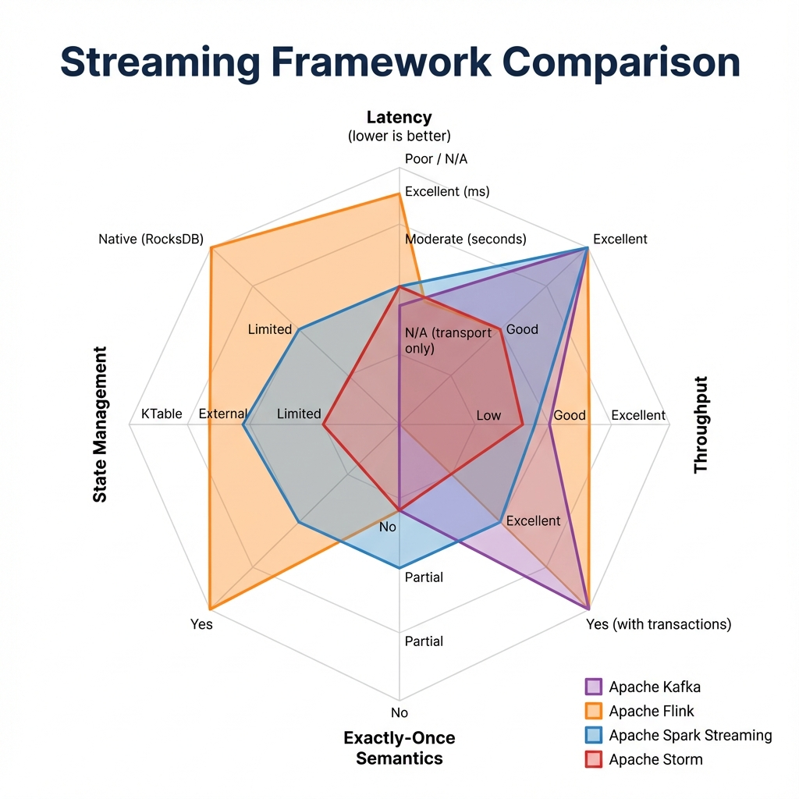
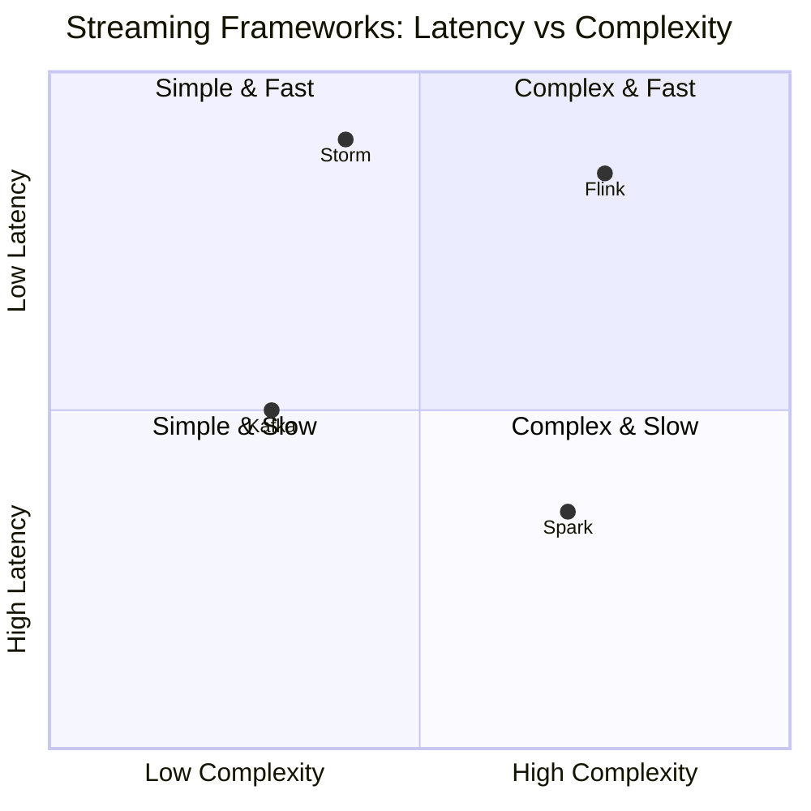
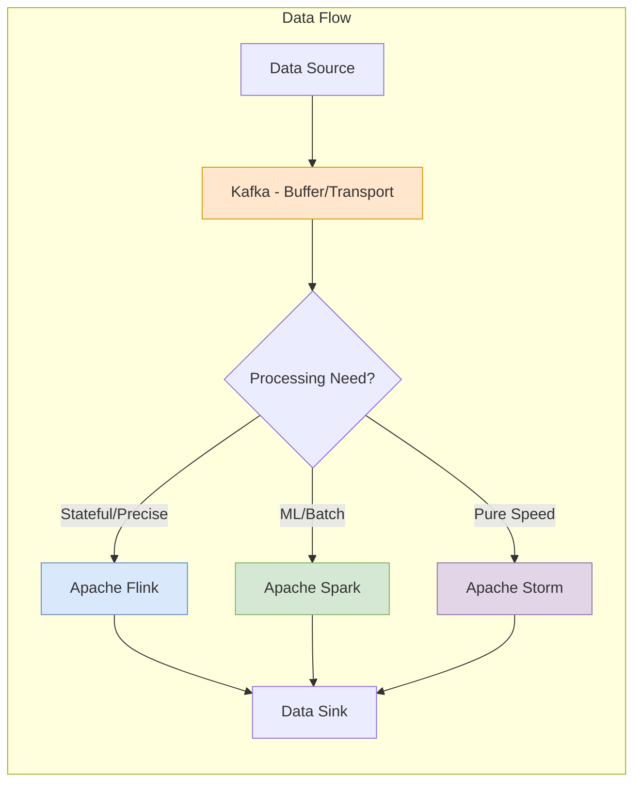

# Big Data Streaming Frameworks: The Comparison

> **Source**: [Kafka vs Flink vs Spark vs Storm](https://youtu.be/V3Q3EkbEc_k)

> [!IMPORTANT]
> **The Golden Check**:
> *   Need Storage? **Kafka**.
> *   Need Logic + Accuracy? **Flink**.
> *   Need Logic + ML/Batch? **Spark**.
> *   Need Pure Speed? **Storm**.

---

## 📊 Framework Positioning

---

## 🏗️ The Big Four at a Glance

| Framework | Core Identity | Semantics | Best For |
| :--- | :--- | :--- | :--- |
| **Apache Kafka** | **Storage & Transport** | Log-based (Pub/Sub) | Moving data reliably; Event Sourcing; Decoupling. |
| **Apache Flink** | **Stateful Stream Processing** | Precise Event-Time | Complex logic; Fraud detection; Exactly-once requirements. |
| **Apache Spark** | **Unified Analytics Engine** | Micro-Batches | Heavy aggregations; Machine Learning; Lambda Architectures. |
| **Apache Storm** | **Low-Latency Processing** | Tuple-by-Tuple | Simple, "Pneumatic Tube" speed; Real-time alerting. |

---

## 🔍 Deep Dive

### 1. Apache Kafka
*   **Architecture**: Topics, Partitions, Zookeeper (Metadata).
*   **Pros**: Massive throughput, durability. It's the "backbone".
*   **Cons**: Complex logic (Joins/Windows) is harder in native Kafka Streams compared to Flink.

### 2. Apache Flink
*   **Architecture**: JobManager + TaskManagers.
*   **Pros**: **True Streaming** (not batches). Handles "Late Data" correctly (Event Time).
*   **Cons**: Steep learning curve (Process Function API).

### 3. Apache Spark
*   **Architecture**: Driver + Workers. RDDs.
*   **Pros**: **Unified API** (SQL, Batch, Stream, ML). Great for "Lambda" architecture (Batch + Speed).
*   **Cons**: High memory usage. Latency is limited by batch size (seconds, not milliseconds).

### 4. Apache Storm
*   **Architecture**: Spouts (Source) -> Bolts (Logic).
*   **Pros**: **Millisecond Latency**. Proven reliability.
*   **Cons**: Lacks advanced abstractions (Windows, Event Time) out of the box. Losing popularity to Flink.

---

## ✅ Principal Architect Checklist

1.  **Kafka is Not a Processing Engine**: Kafka Streams exists, but for complex logic (stateful joins, CEP), use Flink. Kafka's strength is transport and durability.
2.  **Flink for Exactly-Once Stateful**: If your use case requires "exactly-once" semantics with complex state (e.g., fraud detection), Flink is the only choice. Spark's micro-batches can duplicate.
3.  **Spark for ML Integration**: If your pipeline feeds a machine learning model, Spark's unified API (DataFrame, MLlib) is unmatched. Don't fight it.
4.  **Storm is Legacy**: Storm lacks native event-time and advanced windowing. For new projects, prefer Flink. Only use Storm if you're maintaining an existing system.
5.  **Consider Memory Costs**: Spark's in-memory model is powerful but expensive. Profile memory usage before committing. Flink's RocksDB state backend is more disk-friendly.
6.  **Decision Tree**:
    *   Need durable log + transport? → **Kafka**.
    *   Need sub-second stateful processing? → **Flink**.
    *   Need batch + stream + ML in one SDK? → **Spark**.
    *   Need millisecond latency, simple logic? → **Storm** (or Flink with low watermarks).

---

## 🚚 Analogy: The Logistics Operation

> [!TIP]
> **Understanding the Role of Each Tool**:
>
> 1.  **Kafka is the Warehouse** 🏭
>     It stores and organizes everything (Topics). Trucks move goods in and out efficiently. It doesn't *make* products, it *holds* them.
>
> 2.  **Flink is the Precision Factory** 🦾
>     It takes items and assembles them with **extreme accuracy**. Even if parts arrive late or out of order, it waits and slots them perfectly (Exactly-Once).
>
> 3.  **Spark is the Assembly Line** 🚂
>     It works in **Batches**. It waits until it has a tray of 100 parts, then processes them all at once. Highly versatile (can switch products/ML), but there is a "wait time" for the tray to fill.
>
> 4.  **Storm is the Pneumatic Tube** 🚀
>     **Pure Speed**. It shoots individual items across the building instantly. It can't "Assemble" complex products, but it gets the message from A to B faster than anyone else.
