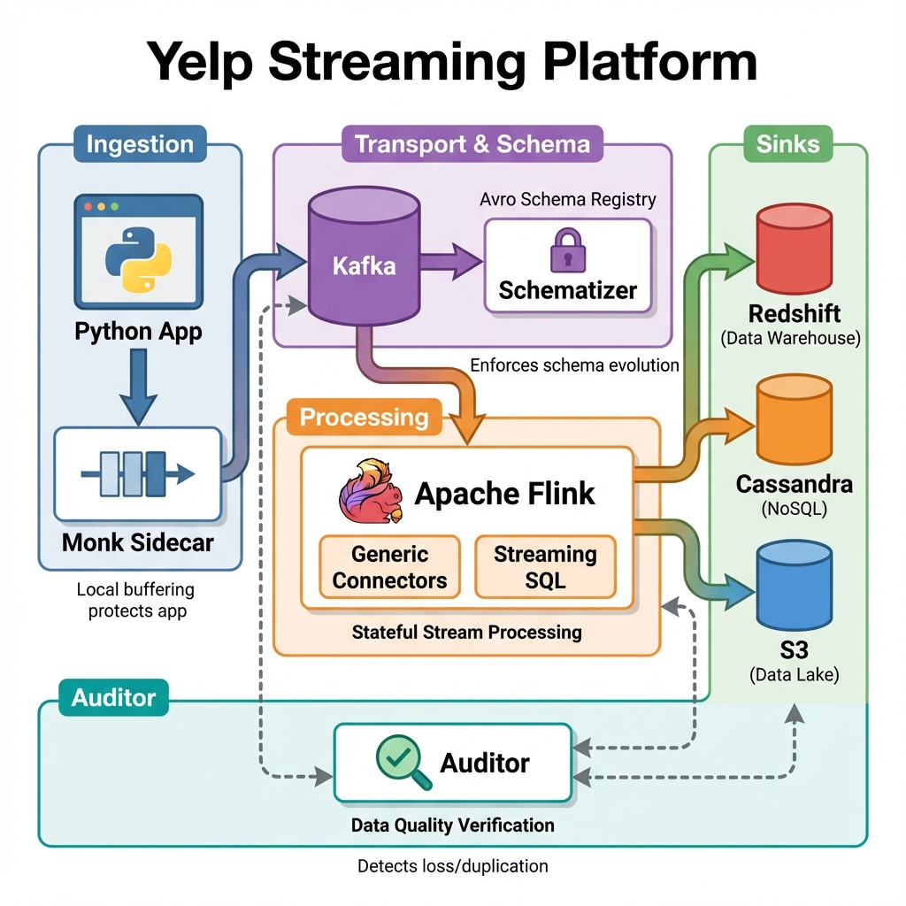
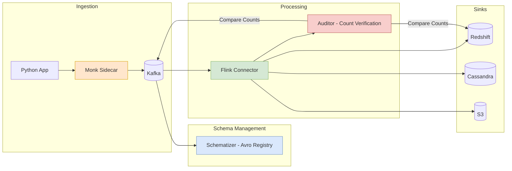

# Yelp's Real-Time Streaming Platform (Flink & Kafka)

> **Source**: [Yelp's Evolution to Flink](https://youtu.be/CmBP5bUd2OU)

> [!IMPORTANT]
> **Key Innovation**: The **"Connector Ecosystem"**.
> Instead of writing custom pipelines for every destination, Yelp built generic **Flink Connectors** (Cranes) that move data from Kafka to Redshift/Cassandra/etc with built-in **Auditing** (Consistency Checks).

---

## 📜 The Evolution
*   **Phase 1 (Scribe)**: Log aggregation (Files tailed over TCP). Fragile.
*   **Phase 2 (Storm)**: Attempted for real-time. Failed due to infrastructure complexity.
*   **Phase 3 (The Backbone)**: **Kafka** + **Schematizer** (Avro Registry).
*   **Phase 4 (Stream Processing)**:
    *   **Spark**: Used for Micro-batching.
    *   **Flink**: Chosen for **Stateful** stream processing and **Low Latency**.

---

## 📊 Architecture Diagram

---

## 🏗️ Architecture Components

### 1. Ingestion: The "Monk" Sidecar
How do you get logs from Python web apps to Kafka without blocking user requests?
*   **Monk**: A local daemon running on *every* host.
*   **Flow**: App -> Local Monk (Memory) -> Kafka.
*   **Benefit**: If Kafka is down, Monk buffers locally. The App is never blocked.

### 2. The "Schematizer" (The Brain)
*   **Role**: Central Schema Registry (Avro).
*   **Function**: Controls topic location, evolution rules, and ensures compatibility.

### 3. Flink vs "PastaStorm" (Legacy)
Yelp tried building a Python wrapper around Kafka ("PastaStorm"). It failed because:
*   **State Management**: Handling Window Joins in Python led to corrupted state.
*   **Rebalancing**: Python consumers "thrashed" during Kafka rebalances.
*   **Solution**: **Flink** handles State (RocksDB), Checkpointing, and Event Time natively.

---

## 🔌 The Connector Ecosystem
Yelp treats data movement as a **Platform**, not a script.
*   **Generic Connectors**: A single Flink App moves data from *Any* Topic to *Any* Sink (e.g., Kafka -> Redshift).
*   **The Auditor**: A side-process that verifies data integrity. It counts records in Kafka vs. Redshift to detect data loss or duplication.

---

## 📊 Operational Considerations

| Aspect | Detail |
| :--- | :--- |
| **State Size** | Tens of GBs for window joins. Use RocksDB (disk-backed). |
| **Checkpointing** | Incremental checkpoints to S3. Metadata in DynamoDB (S3 list is inconsistent). |
| **Deployment** | Flink on AWS EMR. Python "Flink Supervisor" for restarts/alerting. |
| **Stability Hack** | Disable Yarn physical/virtual memory checks. Let OS OOM Killer handle issues. |

---

## ✅ Principal Architect Checklist

1.  **Use a Sidecar for Ingestion**: The "Monk" pattern buffers logs locally. If Kafka is down, the App is never blocked. This is critical for user-facing services.
2.  **Centralize Schema Registry**: The "Schematizer" (Avro registry) controls topic allocation and schema evolution. This prevents incompatible changes from breaking consumers.
3.  **Don't Build Python Stream Processors**: Yelp's "PastaStorm" (Python Kafka wrapper) failed due to corrupted state and rebalance thrashing. Use Flink for stateful stream processing.
4.  **Build Generic Connectors**: Instead of N custom pipelines, build 1 Flink app that moves data from *any* Topic to *any* Sink. Pass configuration, not code.
5.  **Audit Everything**: The "Auditor" counts records in Kafka vs. the destination. Without this, you won't know about data loss or duplication until it's too late.
6.  **Streaming SQL for Onboarding**: Yelp provides a "Streaming SQL" service where users submit YAML + SQL. This abstracts Flink entirely, lowering the barrier for non-Java teams.

---

## ⚓ Analogy: The International Shipping Port

> [!TIP]
> **Understanding Generic Connectors**:
> *   **Kafka Topics** = **Ships** arriving with containers.
> *   **Destinations (Redshift)** = **Factories** needing goods.
> *   **Old Way**: Every factory sends a custom truck (Script) to the dock. Chaos.
> *   **New Way (Connectors)**: The Port provides **Standardized Cranes**.
>     *   The Crane doesn't care what's inside the container.
>     *   It just moves it safely from Ship to Factory.
>     *   **The Auditor** is the **Checklist Manager** standing by the crane, counting every container to ensure none fell into the ocean.
