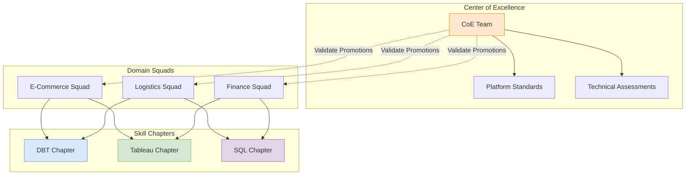

# Analytics Organization at Scale

> **Source**: Decathlon Engineering - "Restructuring Analytics for Global Retail"

> [!IMPORTANT]
> **The Challenge**: How do you organize 280+ data professionals across 110,000 employees without "KPI Chaos"? Decathlon evolved from a **Centralized Factory** to a **Decentralized Data Mesh** supported by a **Center of Excellence (CoE)**.

---

## 🏛️ Organizational Evolution

| Stage | Structure | Pros/Cons |
| :--- | :--- | :--- |
| **Phase 1: Analytics Factory** | Centralized team serving all requests. | ✅ Consistent quality. ❌ Bottleneck for business domains. |
| **Phase 2: Decentralization** | "Explosion" into Domain Teams (Data Mesh). | ✅ Fast domain value. ❌ "KPI Chaos" (2,000 competing dashboards). |
| **Phase 3: Hybrid (Mesh + CoE)** | Distributed teams + Strong CoE. | ✅ Speed + Standards. |

### The Center of Excellence (CoE)
The CoE prevents the "Mesh" from becoming a "Mess".
*   **Responsibilities**: Vendor selection, Platform standards, Technical assessments.
*   **Governance**: Validates promotions (e.g., does a "Senior" in E-commerce have the same bar as a "Senior" in Logistics?).

---

## 📊 Organization Structure

---

## 🧑‍💻 The Staff Analytics Engineer Role
Decathlon created a high-level IC track to retain experts who don't want to manage.

**Requirement**: Must be "Full-Stack Analytics":
1.  **Data Analyst**: SQL, Ad-hoc exploration.
2.  **BI Engineer**: Dashboarding (Tableau/Superset).
3.  **Analytics Engineer**: Data modeling & flows (**dbt**).

> [!TIP]
> **The "Yo-Yo" Career**:
> Engineers are encouraged to switch between **Staff IC** and **Manager** roles to maintain technical empathy and proficiency.

---

## 🛠️ Technical Strategy: Solving "KPI Chaos"
How to fix "2,000 dashboards with different revenue numbers"?

**The Insight Layer**:
*   **Foundation**: Databricks Medallion (Bronze/Silver/Gold).
*   **The Fix**: A **Centralized dbt Project** defining strategic metrics *once*.
*   **Exposure**: Metrics exposed as **Matrix Views** (Headless BI) consumed by Tableau and AI Agents.

---

## 🤝 Community: The Spotify Model (Chapters)
*   **Squad**: Your Business Team (e.g., "Checkout Team"). You work here daily.
*   **Chapter**: Your Skill Community (e.g., "DBT Experts"). You meet here weekly.
*   **Transverse Impact**: A requirement for Senior promotion. You must share tools/knowledge *outside* your squad.

---

## ✅ Principal Architect Checklist

1.  **Don't Skip the CoE**: Decentralization without standards creates "KPI Chaos" (2,000 conflicting dashboards). The CoE is the immune system.
2.  **Define a Skills Matrix**: Decathlon uses a 0-6 scale for each skill (SQL, dbt, Tableau). Make it **public and open-source internally** so engineers see their growth path.
3.  **Enforce Transverse Impact**: Promotion to Senior requires contributions *outside* your squad. This prevents knowledge silos.
4.  **Centralize Strategic Metrics**: Use a single dbt project (or similar) to define company-wide KPIs **once**. Expose as "Headless BI" (Matrix Views) for downstream tools.
5.  **Validate Cross-Domain Promotions**: Ensure a "Senior BI Engineer" in E-Commerce has the same bar as one in Logistics. The CoE conducts independent technical assessments.
6.  **Encourage the "Yo-Yo" Career**: Let Staff ICs become Managers and vice-versa. This maintains technical empathy at leadership levels.

---

## 🧩 Analogy: The Hospital Model

> [!TIP]
> **🏥 Understanding Chapters vs. Squads**:
> *   **The Squad (Department)**: A Cardiologist works in the **Heart Department**. They treat heart patients every day.
> *   **The Chapter (Specialty)**: That same Cardiologist belongs to the **Cardiology Board**. They meet with Heart Doctors from *other* hospitals to discuss new surgical techniques.
>
> This ensures that even though doctors are decentralized across the building, the **Standard of Care** remains high everywhere.
