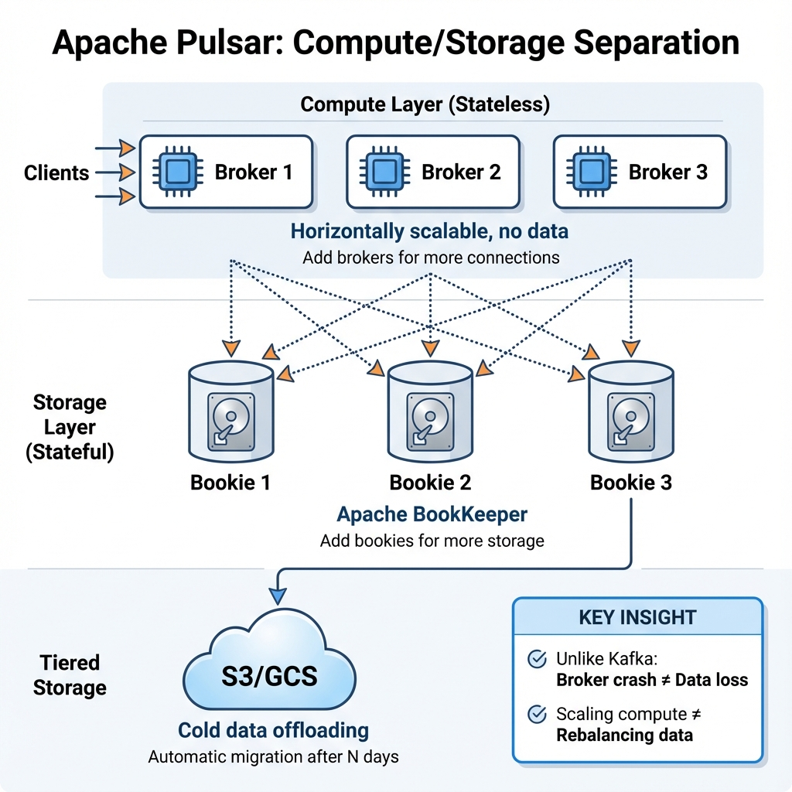
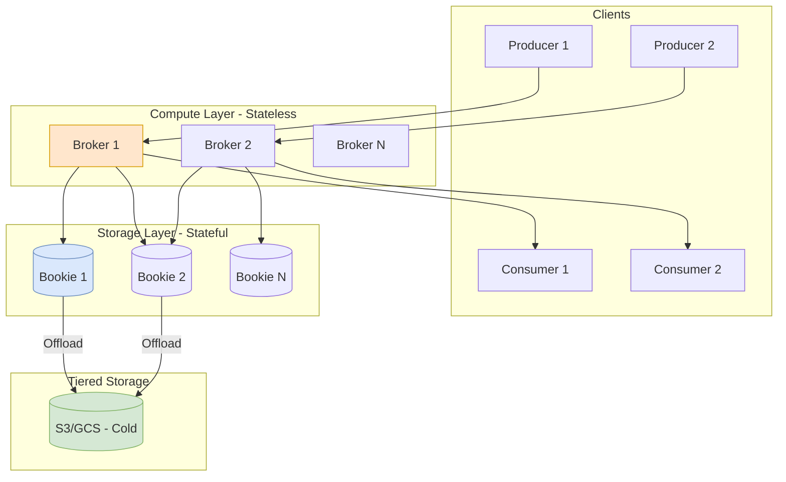

# Apache Pulsar Architecture: The Unified Platform

> **Source**: [Introduction to Apache Pulsar (StreamNative)](https://youtu.be/VD7y5h4AtgM)

> [!IMPORTANT]
> **The Key Distinction**: Pulsar separates **Compute (Brokers)** from **Storage (Bookies)**.
> This enables "Elasticity" (Shrink/Grow fast) not just "Scalability" (Grow slow).

---

## 1. Unified Messaging
Pulsar is not just "Kafka" or "RabbitMQ". It supports both semantics:
*   **Streaming**: High-throughput, ordered data (Like Kafka).
*   **Queuing**: Work queues, individual acks (Like RabbitMQ).
*   **Benefit**: One cluster for all messaging needs, reducing operational overhead.

---

## 📊 Multi-Layer Architecture

---

## 2. Multi-Layer Architecture
Unlike Kafka (where Broker = Storage), Pulsar splits them.

| Node Type | Role | Scaling Behavior |
| :--- | :--- | :--- |
| **Broker** | **Stateless Compute**. Handles connections, routing. | CPU Bound. Add more to handle more Clients. 100% Stateless. |
| **Bookie** | **Stateful Storage**. (Apache BookKeeper). | Disk Bound. Add more to handle more Data Retention. |

### The "No Rebalancing" Advantage
*   **Kafka**: Adding a node requires rebalancing partitions (copying GBs of data).
*   **Pulsar**: Adding a node makes it immediately available for *new* segments. Old segments stay where they are. **Zero-Copy Scaling**.

---

## 3. Advanced Features
*   **Tiered Storage**: Automatically offload old segments to **S3/GCS** (Cheap) while keeping them accessible to consumers.
*   **Geo-Replication**: Native multi-region replication.
*   **Multi-Tenancy**: Built-in isolation (Namespaces) allowing hundreds of teams on one cluster (See [Yahoo Japan Case Study](./yahoo-japan-pulsar-logging.md)).

---

## 4. Protocol Handlers (Migration)
Pulsar speaks multiple languages natively via "Handlers":
*   **Kafka (KoP)**: Existing Kafka apps connect to Pulsar brokers thinking its Kafka.
*   **RabbitMQ (AoP)**: Existing Rabbit apps connect seamlessly.
*   **MQTT (MoP)**: IoT devices connect directly.

---

## ✅ Principal Architect Checklist

1.  **Understand Broker vs Bookie Scaling**:
    *   **CPU Bound (Connections)**: Add Brokers.
    *   **Disk Bound (Retention)**: Add Bookies.
    *   Don't conflate them—this is Pulsar's core advantage.
2.  **Leverage Zero-Copy Scaling**: Unlike Kafka, adding a Pulsar node doesn't require rebalancing data. New nodes receive *new* segments only. Use this for rapid horizontal scaling.
3.  **Use Tiered Storage for Cost**: Old segments (> 7 days) should auto-offload to S3/GCS. This keeps Bookie disk costs low while maintaining data accessibility.
4.  **Evaluate Protocol Handlers for Migration**: KoP (Kafka), AoP (AMQP/RabbitMQ), MoP (MQTT) allow existing apps to connect to Pulsar without code changes. This de-risks migration.
5.  **Plan for Geo-Replication Conflicts**: Bi-directional replication can cause ordering issues. Design consumers to be idempotent.
6.  **Don't Ignore Zookeeper (Yet)**: Pulsar still relies on Zookeeper for metadata. Monitor ZK health. Future versions may move to Raft-based metadata stores.

---

## 🍔 Analogy: The Restaurant Kitchen

> [!TIP]
> **Understanding Broker vs Bookie**:
> *   **Brokers = Waiters** (Processing). If you have too many customers, you hire more waiters. They don't carry food storage on their backs.
> *   **Bookies = Refrigerators** (Storage). If you run out of food space, you plug in a new fridge.
>
> **The Kafka Comparison**: In Kafka, every waiter carries a fridge on their back. To hire a new waiter, you must stop the kitchen and move 50% of the food from the old waiters' fridges to the new waiter's fridge (**Rebalancing**). In Pulsar, you just hire the waiter.
