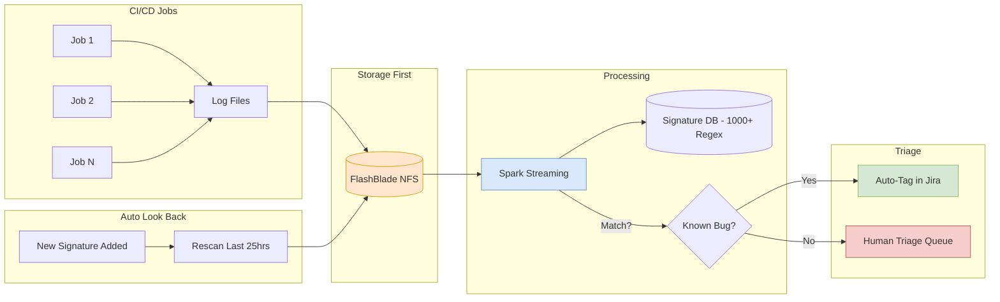

# Auto-Triage at Scale: The Pure Storage Case Study

> **Source**: [Pure Storage Code Factory: Processing Logs at Scale](https://youtu.be/il66a7NAJcw)

> [!IMPORTANT]
> **The Problem**: 100,000 CI/CD jobs per day. 2,000 Failures.
> **The Solution**: An automated "Signature Matching" system that reduces manual triage by **95%** (from 2,000 to 100 tickets).

---

## 📊 Auto-Triage Pipeline

---

## 🏗️ The Methodology: Brute Force Streaming

Pure Storage breaks conventional wisdom ("Index everything") to solve a specific problem: **Fault Localization**.

### 1. Brute Force vs Indexing
*   **Indexing (Elasticsearch)**: Great for ad-hoc search. Terrible/Expensive for **continuous** scanning of 100% of logs.
*   **Brute Force (Regex)**: Pure Storage scans *every* log line against a list of 1,000+ "Signatures" (Regex patterns of known bugs).
*   **Why?**: Cheaper and faster for the "Is this a known bug?" question.

### 2. Architecture: Storage First
*   **Pattern**: Logs are written to **FlashBlade (NFS)** *before* processing.
*   **Benefit**: If the processing pipeline (Spark/Kafka) crashes, the raw data is safe on storage. It allows for "Replayability".

---

## 🔁 The "Auto Look Back" Feature
What happens when you find a *new* bug?
1.  Developer adds a new Signature (Regex) to the database.
2.  **Auto Look Back**: The system instantly spawns a job to re-scan the **last 25 hours** of raw logs on FlashBlade.
3.  **Result**: It retroactively "claims" previously failed jobs that matched this new bug, cleaning up the backlog instantly.

---

## 📊 Operational Metrics

| Metric | Value |
| :--- | :--- |
| **CI/CD Jobs/Day** | 100,000 |
| **Log Lines/Sec** | 5-6 Million |
| **Daily Log Volume** | 1-2 TB |
| **Processing Cores** | 600-700 |
| **Active Signatures** | ~1,000 |
| **Triage Reduction** | 2,000 → 100-200 tickets/day (95%) |
| **Signal Latency** | ~17 seconds |

---

## ✅ Principal Architect Checklist

1.  **Write to Storage First**: Persist logs to durable storage (FlashBlade/S3) *before* processing. If Spark/Kafka fails, you can replay. Never lose raw logs.
2.  **Brute Force > Indexing for Continuous Scan**: If your primary query is "Does this log match any known pattern?", brute-force regex is cheaper than indexing logs that are rarely queried again.
3.  **Implement Auto Look Back**: When a new signature is added, automatically rescan the last N hours. This retroactively claims failures and cleans up the backlog instantly.
4.  **Fragment Large Logs**: Break large log files into chunks to prevent a single file from bottlenecking a processing thread.
5.  **Trust Your Storage Layer**: Pure Storage found FlashBlade more stable than Kafka/Spark at peak. Use enterprise storage for the "source of truth".
6.  **Enable Coalescing**: If multiple rescan requests arrive in a short window, batch them into one Spark job. This saves compute.

---

## 🏭 Analogy: The Automated Bottling Plant

> [!TIP]
> **Understanding Auto-Triage**:
> Imagine a high-speed bottling plant (100k bottles/day).
> *   **Manual Triage**: Humans looking at every broken bottle to guess why it broke. (Slow/Expensive).
> *   **Auto Triage**: A **High-Speed Camera** with a "Blacklist" of known crack shapes.
>     *   If it sees a "Type A" crack, it automatically bins it. Use humans only for *unknown* cracks.
> *   **Auto Look Back**: You discover a new "Type B" crack. You program the camera, and it **rewinds the video tape** for the last 24 hours to find and label every "Type B" crack you missed yesterday.
