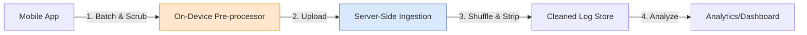

# Privacy-Preserving Mobile Logging at Scale

> **Source**: Google/Android Privacy Team - "Logging at Scale with Privacy"

> [!IMPORTANT]
> **The Mobile Constraint Trinity**: unlike server-side logging, mobile logging is constrained by **Battery**, **Bandwidth**, and **Power**. You cannot just "log everything".

---

## 📱 The Pipeline Architecture

A typical high-scale mobile logging pipeline has two distinct phases of protection:

---

## 🛡️ Phase 1: On-Device Minimization (The First Defense)

The goal is to prevent sensitive data from ever leaving the user's hand.

### 1. String Sanitization
**Rule**: Never log free-form strings (e.g., User Typed Search Queries, Exception Messages).
*   **Risk**: PII (Names, Emails) often slips into "Messages".
*   **Solution**: Log **Enums** or **Exception Class Names** only.
    *   *Bad*: `log.error("User John failed login")`
    *   *Good*: `log.error(AuthErrors.LOGIN_FAILED)`

### 2. Privacy-Preserving Metrics (The "Ping" Method)
How do you count Daily Active Users (DAU) without tracking User IDs?
*   **Technique**: Device sends a **One-Time Unique Ping**.
*   **Server**: Sums the pings.
*   **Result**: You know *how many*, but not *who*.

---

## 🔒 Phase 2: Server-Side Anonymization

### 1. Shuffling (The "Fuchsia" Model)
*   **Mechanism**: Encrypt → Upload → **Shuffle** → Analyze.
*   **Benefit**: Breaks the link between the log entry and the source device. An analyst sees a "bag of events", not a "user journey".

### 2. Advanced Techniques
| Technique | Description | Cost/Complexity |
| :--- | :--- | :--- |
| **K-Anonymity** | Ensure every record is indistinguishable from at least *k-1* others. | Low (Great for scale) |
| **Differential Privacy (DP)** | Add noise to datasets so individual contributions cannot be reverse-engineered. | Medium |
| **Federated Analytics** | Compute results *on the device* and only send the aggregate summary. | High (Complex infra) |

---

## 🧩 Analogy: The Blindfolded Voting System

> [!TIP]
> **🗳️ How to maintain privacy while counting votes**:
> *   **Bad Logging**: Everyone shouts their name and vote. (We know who voted for whom).
> *   **Good Logging**:
>     1.  **Enums**: Everyone uses standardized colored marbles (Red/Blue), not handwritten notes.
>     2.  **Shuffling**: Users drop marbles into an opaque box. The box is shaken vigorously.
>     3.  **Result**: Officials count the marbles. They know "Blue won", but it is mathematically impossible to know *who* voted Blue.

---

## ✅ Principal Architect Checklist

1.  **Never Log Free-Form Strings**: Exception messages and search queries contain PII. Log **Enums** or **Error Codes** only.
2.  **Use Privacy-Preserving Metrics**: Count DAU with one-time unique pings, not user IDs. You know *how many*, not *who*.
3.  **Implement Server-Side Shuffling**: Break the link between log entry and source device by shuffling before analysis.
4.  **Choose the Right Anonymization Level**:
    *   **K-Anonymity**: Low cost. Good for most use cases.
    *   **Differential Privacy**: Medium cost. Required for sensitive datasets.
    *   **Federated Analytics**: High cost. Maximum privacy (compute on-device).
5.  **Quantify the Cost Savings**: 1KB saved per log × 1 Billion users = **1 Petabyte saved**. Privacy engineering reduces payload size.
6.  **Leverage GDPR Exemptions**: Truly anonymized data is often "out of scope" for GDPR. This reduces compliance burden.
