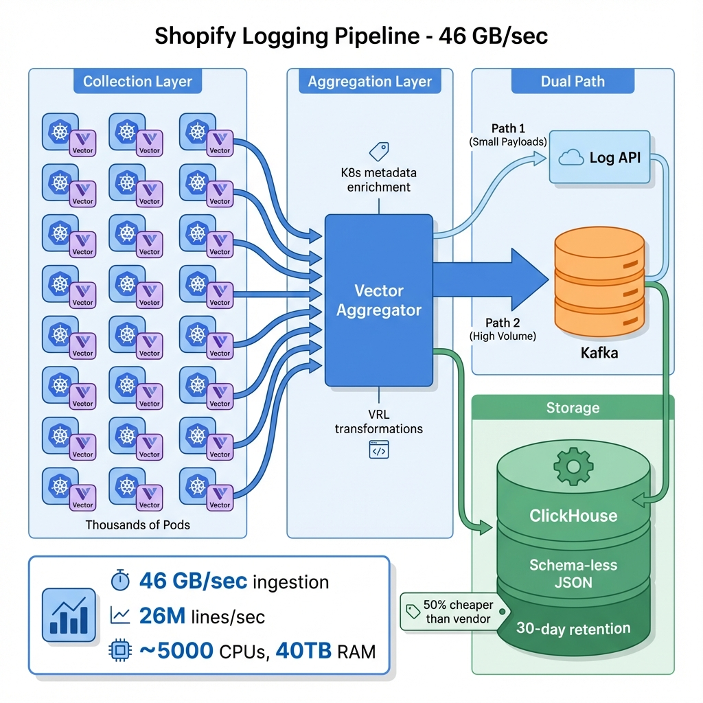
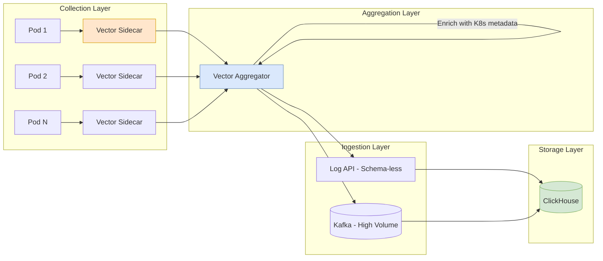

# Logging at Scale: A Case Study (Shopify)

> **Source**: Shopify Engineering (Daniel Oliveira) - "Replacing a Vendor with a Custom Pipeline"

> [!IMPORTANT]
> **The Scale**: 46 GB/sec. 26 Million log lines/sec.
> **The Win**: Built a custom pipeline that handles **3x the volume** at **50% of the cost** of the previous vendor.

---

## 📊 Pipeline Architecture

---

## 🏗️ Architecture Stack

A custom-built pipeline relying on high-performance open-source tools.

| Layer | Technology | Function |
| :--- | :--- | :--- |
| **Collection** | **Vector** (Sidecars) | Runs on every node/pod. Collects via file system or JournalD. |
| **Transport** | **Vector Aggregators** | Batches data, enriches with K8s metadata. |
| **Ingestion** | **Log API** (Custom) | Schema-less entry point. Handles JSON Ingestion. |
| **Buffer** | **Kafka** | Used for specific high-volume streams (Nginx). |
| **Storage** | **ClickHouse** | Columnar store. High compression, standard 30-day retention. |

---

## 🚀 Key Design Decisions

### 1. The Power of Vector
Shopify leans heavily on **Vector** (by Datadog) and its **VRL (Vector Remap Language)**.
*   **Why?**: VRL allows extremely fast, safe transformation of logs (parsing routes, scrubbing fields) at the edge, reducing downstream load.

### 2. Schema-less Ingestion
*   **Approach**: The custom Log API accepts *any* JSON.
*   **Trade-off**: Flexibility vs Query Performance. ClickHouse handles the JSON columns efficiently enough for their search patterns.

### 3. Cost-Driven Engineering
*   **Problem**: "Junk" logs cost millions at this scale.
*   **Solution**: **Cost Attribution**. The platform shows every team exactly how much their logs cost ($), incentivizing them to delete noisy `DEBUG` logs.

---

## ⚠️ Challenges of "Shopify Scale"

### 1. Open Source Limits
> "Industry-Standard tools often break at this volume."
Shopify teams frequently have to patch or reconfigure OSS tools because default assumptions (buffer sizes, connection pools) collapse under **26M events/second**.

### 2. Testing is Impossible
You cannot spin up a "Staging" environment that mimics 46GB/sec traffic without doubling your cloud bill.
*   **Strategy**: Fast iteration + Canary deployments + Feedback from internal power users (SREs).

---

## 📊 Operational Metrics

| Metric | Value |
| :--- | :--- |
| **Ingestion Rate** | 46 GB/sec (26M lines/sec) |
| **Infrastructure** | ~5,000 CPUs, 40 TB RAM |
| **Retention** | 30 days (default), some datasets 1+ year |
| **Cost vs Vendor** | 50% cheaper, 3x more volume |
| **Latency (Log to Search)** | < 2 minutes |

---

## ✅ Principal Architect Checklist

1.  **Adopt Vector**: VRL (Vector Remap Language) allows safe, fast transformation at the edge. This reduces downstream load and enables field scrubbing before storage.
2.  **Implement Cost Attribution**: Show each team their $ cost for logs. This incentivizes deleting `DEBUG` noise. At 46GB/sec, "junk" logs cost millions.
3.  **Accept Testing Limits**: You cannot replicate 46GB/sec in staging. Use **Canary deployments** + **Internal Power Users (SREs)** for validation.
4.  **Expect OSS to Break**: Default buffer sizes, connection pools, and thread limits in tools like Vector/Kafka collapse at this scale. Budget engineering time for tuning and upstreaming patches.
5.  **Use Schema-less Ingestion Carefully**: Flexibility is good, but query performance on JSON columns in ClickHouse degrades with complexity. Monitor query latency.
6.  **Multi-Cluster Topology**: Spread load across clusters to limit "blast radius" of failures.

---

## 🧩 Analogy: The Metropolitan Postal Service

> [!TIP]
> **The Architecture Explained**:
> *   **Services**: Citizens writing letters.
> *   **Vector Forwarders**: **Collection Boxes** on every street corner (Node).
> *   **Vector Aggregators**: **Local Sorting Facilities** that Bundle mail and stamp it with "District Info" (Metadata).
> *   **ClickHouse**: The **Massive Automated Warehouse** where mail is stored on shelves.
> *   **Resilience**: If a truck breaks down, mail goes to a **Holding Area** (Kafka/Queue), ensuring that even in a blizzard (Flash Sale), nothing is lost.
