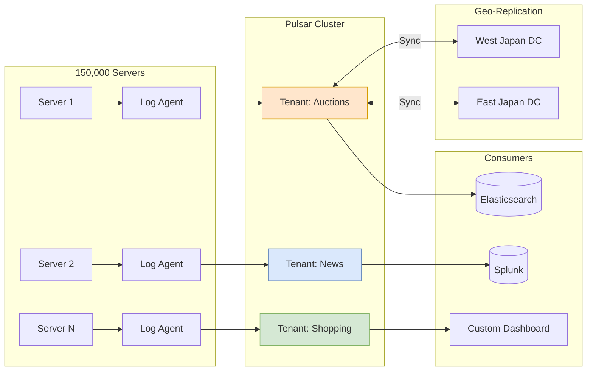

# Large-Scale Log Pipeline with Apache Pulsar (Yahoo Japan)

> **Source**: [Operationalizing Pulsar at Scale](https://youtu.be/srJwOK0oi6c)

> [!IMPORTANT]
> **The Scale**: 150,000 servers. 270 Tenants. 4TB logs/hour.
> **The Key Decision**: Choosing **Apache Pulsar** over Kafka for **Multi-Tenancy** and **Geo-Replication**.

---

## 🏛️ Why Pulsar? (vs Kafka)

Yahoo Japan manages 100+ services (Auctions, News, Shopping) as a centralized platform.
*   **Multi-Tenancy**: Critical requirement. Pulsar handles hundreds of tenants natively with isolation policies.
*   **Geo-Replication**: Built-in support for replicating between West and East Japan data centers.
*   **Decoupling**: moved from "Agent -> Monitoring Tool" (Tight coupling) to "Agent -> Pulsar -> Tool" (Decoupled Buffer).

---

## 📊 Architecture Diagram

---

## 🏗️ Architecture Optimization

### 1. SSD Lifespan Tuning
**Problem**: Heavy write loads caused frequent SSD failures.
**Solution**: Tuned `journalMaxGroupCommitMinWait` (increased from 1ms to 2ms).
**Result**: Reduced write frequency by **30%**, significantly extending hardware life with negligible latency impact.

### 2. Migration Wrapper
**Challenge**: Moving from Kafka to Pulsar without rewriting 15,000 apps.
**Solution**: Built a **Kafka Wrapper** for OpenWhisk. Apps still "speak" Kafka protocol, but the infra translates to Pulsar. Zero code changes for users.

---

## 📐 Design Patterns: Producer vs Consumer Centric

When replacing direct point-to-point logging, how do you organize Topics?

| Pattern | Description | Pros/Cons |
| :--- | :--- | :--- |
| **Producer-Centric** | 1 Topic per Producer App. | ❌ Consumers must filter tons of data to find what they need. |
| **Consumer-Centric** | 1 Topic per Consuming Tool. | ✅ **Chosen Approach**. Producers route data to the right destination. Efficient for consumers. |
| **Function Pattern** | Topics at both ends + Pulsar Function in middle. | ❌ Too complex/costly for the MVP phase. |

---

## 📊 Operational Metrics

| Metric | Value |
| :--- | :--- |
| **Servers Monitored** | 150,000 |
| **Tenants** | 270 |
| **Topics** | 4,400 |
| **Publishers/sec** | 50,000 |
| **Consumers/sec** | 150,000 |
| **Log Volume** | 1.4 - 3.8 TB/hour |
| **Peak Network** | 10+ Gbps |

---

## ✅ Principal Architect Checklist

1.  **Evaluate Multi-Tenancy First**: If you have 10+ teams sharing one messaging platform, Pulsar's native tenant isolation reduces operational overhead vs running separate Kafka clusters.
2.  **Tune `journalMaxGroupCommitMinWait`**: Increasing from 1ms to 2ms reduced write IOPs by 30%, extending SSD lifespan. Profile your write patterns.
3.  **Use the Kafka Wrapper for Migration**: If you have 1000s of existing Kafka apps, use KoP (Kafka on Pulsar) to migrate with **zero code changes**—config only.
4.  **Choose Consumer-Centric Topic Design**: Let Producers route data to the right destination Topic. This keeps Consumers simple and avoids filtering overhead.
5.  **Avoid Function Pattern for MVP**: Pulsar Functions add complexity. Start with Consumer-Centric, add Functions when you need in-stream transformation at scale.
6.  **Plan for Geo-Replication Latency**: Cross-DC replication introduces delay. Ensure your SLA accounts for this (writes are local, reads may be stale).

---

## 🚀 Results
*   **Cost**: Reduced hardware costs by centralizing the buffering layer.
*   **Resilience**: Traffic spikes (10 Gbps+) are absorbed by the Pulsar buffer, preventing "Monitoring Denial of Service".
*   **Unified Platform**: One system handles Logs, Job Queues (Mail Indexing), and Content Update Notifications.
