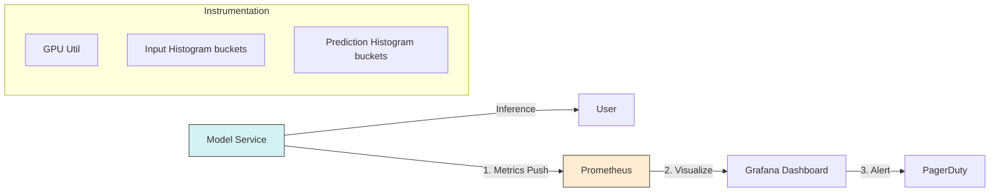

# MLOps Observability: Beyond "Is it Running?"

> **Source**: Rishit Dagli - "Pipelines at Scale: Monitoring vs Observability in ML"

> [!IMPORTANT]
> **The Core Problem**: In traditional software, if a service crashes, you know. In Machine Learning, a model can run perfectly, consume 100% GPU, return 200 OK responses, and yet be **producing complete garbage**. This is a **Silent Failure**.

---

## 🏗️ DevOps vs. MLOps: The Metric Gap

Traditional signals are misleading in ML context.

| Metric | Traditional Interpretation | ML Interpretation |
| :--- | :--- | :--- |
| **CPU/GPU Usage** | > 90% is dangerous (Scaling signal) | > 90% is **ideal**. Less means inefficient batching. |
| **Latency** | Milliseconds matter. | Varies wildly (LLM inference vs Linear Regression). |
| **Output** | Status Codes (200 vs 500) | Distribution correctness (Is the prediction valid?). |
| **Goal** | Availability & Reliability | Model Quality & Generalization. |

---

## 📉 The Hidden Enemy: Distribution Shifts

You cannot debug ML systems by looking at logs alone. You must observe the **data**.

### 1. Types of Drift
*   **Data Shift (Covariate Shift)**: The input distribution changes.
    *   *Example*: Model trained on 2020 tweets (Topic: COVID) running on 2024 tweets (Topic: Elections).
*   **Concept Drift (Feature Shift)**: The *meaning* of the input changes.
    *   *Example*: A temperature model trained in Florida (Warm) deployed in Alaska (Cold). 30°F means "freezing" now, not just "cool".
*   **Output Distribution Shift**: Inputs look normal, but predictions cluster oddly.
    *   *Signal*: Exploring "Similar looking outputs for different inputs".

### 2. The Feedback Loop Trap (Data Pollution)
Modern generative models (LLMs, Diffusion) face a unique circular dependency.

*   **The Risk**: Training a model on data generated by *itself* (or another model).
*   **Consequence**: "Model Collapse" – variance decreases, hallucinations amplify.
*   **Exceptions**: Methods like **InstructPix2Pix** work because the task (Image Editing) is orthogonal to the generation source (Text).

---

## 🔭 What to Measure: The Observability Trinity

Since **Ground Truth** is rarely available in real-time (you don't know if the recommendation was "clicked" until later), proxy metrics are key.

### 1. System Metrics (Context-Aware)
*   Don't alert on high GPU usage. Alert on **low** GPU usage (starved GPU).

### 2. Feature Distributions (The "Shape" of Data)
*   **Technique**: Log histograms of input features.
*   **Action**: Compare `Inference_Distribution` vs `Training_Distribution`.
*   **Alert**: If divergence (KL Divergence / Wasserstein Distance) > Threshold.

### 3. Model Output Distributions
*   If your churn prediction model usually predicts 5% churn, but suddenly predicts 30% for everyone, something is wrong—even if inputs look "valid".

---

## ⚙️ Technical Implementation (K8s Pattern)

A practical stack for MLOps observability:

**Implementation Tip**:
Use Prometheus **Histograms** to capture feature distributions. This is cheaper than logging every raw vector.

---

## 🧠 Conceptual Analogy

> [!TIP]
> **👨‍🍳 The Chef & The Oven**:
> *   **Traditional Monitoring**: Checking if the oven is ON (uptime) and if the Chef is busy (CPU usage).
> *   **ML Observability**: **Tasting the food**.
> 
> The oven might be 400°F (perfect), the Chef might be sweating (100% capacity), but if he accidentally used **salt instead of sugar** (Data Shift), the cake is ruined. Traditional metrics say "Success". Observability says "Failure".
