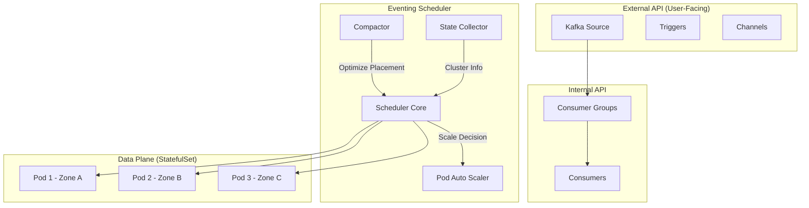
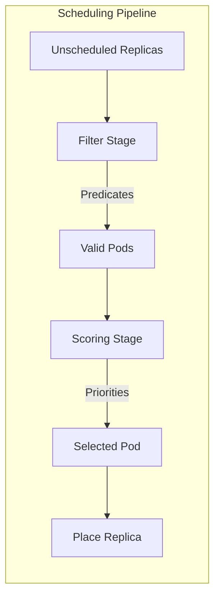
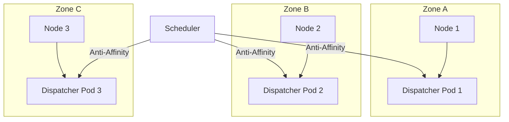
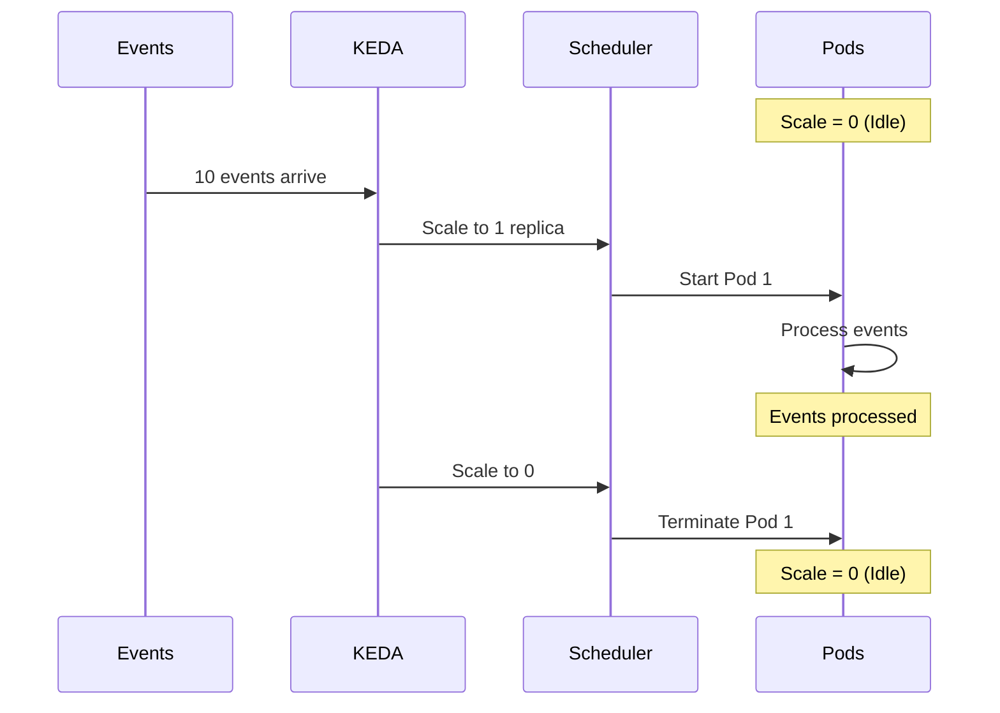

# Knative Eventing Scheduler: Serverless Auto-Scaling

> **Source**: [Knative Eventing Scheduler](https://www.youtube.com/watch?v=PKuUXaDl7w0)

> [!IMPORTANT]
> **The Core Achievement**: The Eventing Scheduler brings true **serverless behavior** to Knative Eventing—including **scale-to-zero**, automatic scale-up, and intelligent placement across availability zones—while maintaining high availability.

---

## 📊 Scheduler Architecture

---

## 🔴 The Problem: No Auto-Scaling

### Current Limitations
*   Knative Eventing sources **don't auto-scale out of the box**.
*   Each dispatcher replica creates one consumer per resource.
*   As resources increase, dispatcher pods must be **manually scaled**.
*   No native way to configure **parallel deliveries** for throughput.

### Enterprise Expectations
| Expectation | Current State |
| :--- | :--- |
| **Scale to Zero** | Not supported |
| **Scale Up on Load** | Manual intervention |
| **Cost Optimization** | Idle resources waste money |
| **High Availability** | Not automatic |

---

## ✅ The Solution: Eventing Scheduler

### Design Principles
*   **Reusable Framework**: Not specific to any single Knative implementation.
*   **Pluggable Architecture**: Works with Kafka Source, Triggers, Channels.
*   **Kubernetes-Native**: Inspired by the core K8s scheduler.

### API Layers

| Layer | Examples | Description |
| :--- | :--- | :--- |
| **External API** | Kafka Source, Triggers | User-facing CRDs |
| **Internal API** | Consumer Groups, Consumers | Scheduler-managed resources |
| **Placement Object** | Duck Type | Stores pod → replica assignments |

---

## 🛠️ Technical Components

### Sub-Components

| Component | Purpose |
| :--- | :--- |
| **Pod Auto Scaler** | Scales K8s pods up/down based on scheduled replicas. |
| **State Collector** | Periodically gathers cluster info for optimal decisions. |
| **Compactor** | Moves replicas from higher-numbered to lower pods to enable scale-down. |

### Scheduling Stages

| Stage | Type | Description |
| :--- | :--- | :--- |
| **Filter** | Predicates | Excludes pods where replica *cannot* be placed (resource limits, affinity). |
| **Scoring** | Priorities | Assigns scores to valid pods. Highest weighted score wins. |

---

## 🛡️ High Availability

### How HA Works
*   Uses **StatefulSet** architecture for sticky pod identity.
*   **Pod anti-affinity** rules spread replicas across nodes and zones.
*   On failure, rebalancing triggers in next reconciliation loop.

---

## 🎬 Demo: Kafka Source with KEDA

### Setup
*   IBM Cloud Kubernetes cluster
*   9 nodes across 3 availability zones
*   KEDA integrated for auto-scaling

### Scenarios Demonstrated

| Scenario | Behavior |
| :--- | :--- |
| **12 Consumers Configured** | Distributed equally: 4 per dispatcher pod, 1 pod per zone. |
| **Idle Source** | KEDA scales to **zero** pods. |
| **10 Events Sent** | KEDA scales 0 → 1 pod, processes, scales back to 0. |
| **10,000 Events** | User scales to 60 replicas, rapid processing. |

---

## ⚙️ Performance Tuning

Kafka broker data plane allows tuning via **ConfigMaps**:
*   Reduce duplicate messages
*   Speed up concurrent processing
*   Tune consumer parameters

---

## 🚀 Future Work

| Feature | Description |
| :--- | :--- |
| **Triggers & Channels** | Expand scheduler to other Knative components. |
| **KEDA Native Integration** | Scheduling + scaling on same APIs. |

---

## ✅ Principal Architect Checklist

1.  **Enable KEDA Integration**: For true scale-to-zero, KEDA is essential. Don't rely on manual scaling.
2.  **Use StatefulSets for Data Plane**: Sticky identity enables graceful rebalancing on failures.
3.  **Configure Pod Anti-Affinity**: Spread dispatcher pods across zones for HA.
4.  **Monitor Compactor Behavior**: Ensure replicas migrate to lower pods to enable scale-down.
5.  **Tune Consumer Groups**: Match consumer count to Kafka partition count for optimal throughput.
6.  **Test Failure Scenarios**: Simulate zone failures to verify automatic rebalancing.

---

## 📖 Analogy: Smart Logistics Dispatcher

> [!TIP]
> The Eventing Scheduler is like a **smart logistics dispatcher for a delivery company**:
>
> *   **Old Model**: One giant truck runs regardless of packages (wasted resources).
> *   **New Model**: Dispatcher monitors incoming mail.
> *   **No Packages**: Trucks stay in garage (**Scale to Zero**).
> *   **Massive Wave**: Dispatcher hires drivers, assigns routes across neighborhoods (**Filter + Score**).
> *   **Road Blocked**: Other drivers complete deliveries (**High Availability**).

---

## 🔗 Related Documents
*   [Airflow Event-Driven Scheduling](../../pipeline/airflow/airflow-event-driven-scheduling.md) — Event-driven workflow orchestration