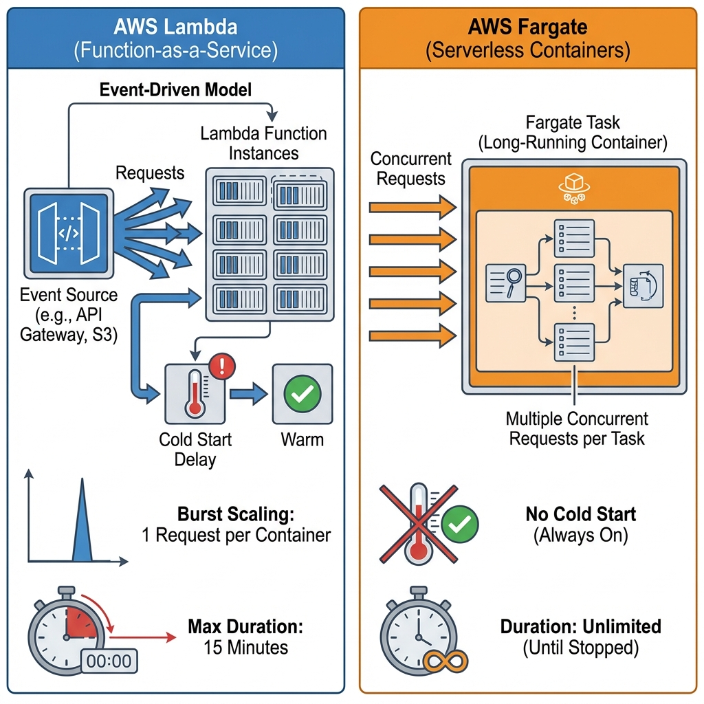
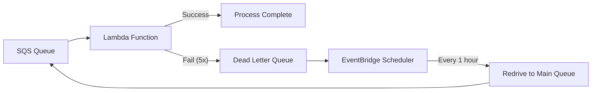

# Serverless Best Practices: AWS Lambda & Fargate

> **Source**: [AWS re:Invent 2024: Serverless Best Practices](https://youtu.be/lZqPdJra-yA)

> [!IMPORTANT]
> **The Paradigm Shift**: Serverless is not "No Servers". It's **"Service-full"**: Replace custom code with managed service integrations.
> **The Goal**: Reduce "undifferentiated heavy lifting" (retries, scaling) to focus on business logic.

---

## 🎯 Lambda vs Fargate: Choosing Compute



| Factor | Lambda | Fargate |
| :--- | :--- | :--- |
| **Execution Model** | Event-driven (1 request/instance) | Long-running (N requests/instance) |
| **Max Duration** | 15 minutes | Unlimited |
| **Pricing** | Per millisecond + Memory | Per second (vCPU + Memory) |
| **Cold Start** | 50-200ms (SnapStart: <1ms) | N/A (always warm) |
| **Concurrency** | Auto-scales (1000/10sec) | Manual (ECS Service scaling) |
| **Use Case** | API Gateway, S3 Events | WebSocket servers, Background workers |

> [!TIP]
> **Rule of Thumb**: Use Lambda for **bursty** workloads. Use Fargate for **sustained** workloads (>15min tasks or >100 req/sec per instance).

---

## 🏗️ "Service-full" Architecture: Reducing Code

### Replace Lambda "Glue Code" with Native Integrations

**Before** (Bad):
```
DynamoDB Stream → Lambda (Filter + Transform) → API Destination
```

**After** (Good):
```
DynamoDB Stream → EventBridge Pipes (Filter + Transform) → API Destination
```

*   **Benefit**: No code to maintain. No cold starts. Lower cost.

### Step Functions SDK Integrations

**Before**:
```yaml
- Lambda: "Call DynamoDB PutItem"
- Lambda: "Call SNS Publish"
```

**After**:
```yaml
- Type: Task
  Resource: arn:aws:states:::dynamodb:putItem
- Type: Task
  Resource: arn:aws:states:::sns:publish
```

*   **Benefit**: Direct SDK calls. No Lambda invocation overhead.

---

## ⚡ Lambda Performance Tuning

### Memory = CPU
Increasing memory proportionally increases CPU and network throughput.
*   **Single-threaded code**: Tops out at **1.8 GB**.
*   **Multi-threaded code**: Can leverage up to **10 GB** (6 vCPUs).

### Cold Start Mitigation
1.  **SnapStart**: Starts from a pre-initialized snapshot. Available for Java, Python, .NET.
2.  **Provisioned Concurrency**: Keep N instances "warm" (costs $$$).

### Scaling
*   **New Model (2024)**: +1000 concurrency every 10 seconds (up from +500).
*   **Burst Limit**: 3000 instances immediately (per region).

---

## 🛡️ Building Production-Ready Services

### 1. Resilience (The DLQ + Redrive Pattern)



**Configuration**:
*   **Batch Size**: 10
*   **VisibilityTimeout**: 6x function timeout
*   **maxReceiveCount**: 5
*   **Partial Batch Response**: Use Powertools to return only failed items.

### 2. Observability (Structured Logging)

```json
{
  "level": "INFO",
  "correlationId": "abc-123",
  "service": "order-processor",
  "message": "Order placed",
  "orderId": "order-456"
}
```

*   **Use Libraries**: AWS Powertools for Lambda (Python, Java, TypeScript).
*   **X-Ray Tracing**: Enable for every function (latency analysis).

### 3. Security Checklist
*   ✅ Block public access to S3 buckets.
*   ✅ Enforce HTTPS (SSL) on API Gateway.
*   ✅ Encrypt at rest (S3, DynamoDB) and in transit.
*   ✅ Use IAM Roles (never embed credentials).

---

## ✅ Principal Architect Checklist

1.  **Avoid "Distributed Monoliths"**: If every Lambda calls another Lambda synchronously, you've recreated a monolith with network latency.
2.  **Use EventBridge for Choreography**: Decouple services via events, not direct invocation.
3.  **Monitor Lambda Duration**: If >80% of invokes hit the 15-min limit, migrate to Fargate.
4.  **Standardize with Blueprints**: Create GitHub template repos with pre-configured DLQ, logging, and security.

---

## 🔗 Related Documents
*   [Async Systems](./async-systems-guide.md) — Event-driven patterns.
*   [Resiliency Patterns](./cicuit-breaker/resiliency-patterns-guide.md) — Circuit breakers for Lambda.
