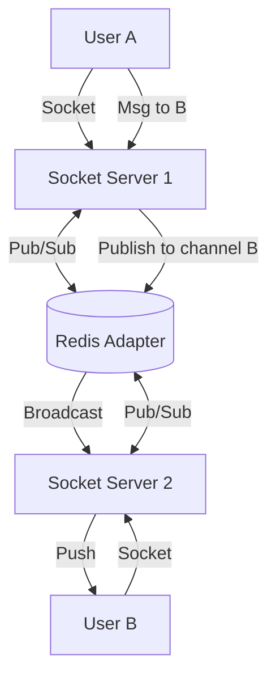

# WebSocket & Real-Time Architecture: The Principal Architect Guide

> **Level**: Principal Architect / SDE-3
> **Scope**: WebSockets, Long-Polling, SSE, and CPaaS Strategies.

> [!IMPORTANT]
> **The Principal Challenge**: WebSockets are **Stateful**. You cannot just "Round Robin" requests. You must maintain a persistent TCP connection. Scaling requires **Horizontal Stickiness** and **Back-channel Synchronization** (Pub/Sub).

---

## 🏗️ The Scaling Problem

### Stateless (HTTP) vs Stateful (WebSocket)
*   **HTTP**: Request comes in, App handles it, Response sent. App forgets client.
*   **WebSocket**: Connection opens. App *remembers* client (Socket ID). Connection stays open for hours.

### The Problem: Broadcasting
User A is on Server 1. User B is on Server 2. User A sends a message "Hello B".
*   Server 1 knows User A.
*   Server 1 *does not* know User B.
*   **Result**: Message lost.

### The Solution: Redis Pub/Sub Adapter
We need a "Backplane" to sync messages across servers.

> **Technology Stack**:
> *   **Node.js**: `Socket.io` with `@socket.io/redis-adapter`.
> *   **Go**: `Gorilla/websocket` with Redis Pub/Sub.

---

## 🛠️ Load Balancing Strategy

You cannot use standard Round-Robin for the *handshake* if you use long-polling fallback (Socket.io).

1.  **Sticky Sessions (Session Affinity)**: The Load Balancer MUST route all requests from ClientID_X to Server_Y for the duration of the session.
    *   *Nginx*: `ip_hash`.
    *   *AWS ALB*: Enable "Stickiness" cookies.
2.  **Pure WebSocket**: If using pure WS (no HTTP fallback), stickiness is less critical for the handshake, but `ConnectionID` mapping is still needed for routing.

---

## 📡 Emerging Standards: WebTransport

WebSockets suffer from **Head-of-Line Blocking** (TCP). If packet 5 is lost, packet 6 waits.
**WebTransport** (over HTTP/3 QUIC) solves this. It allows reliable streams AND unreliable datagrams (UDP-like) over a single connection.
*   **Use Case**: Real-time Gaming, Stock Tickers, Live Video.
*   **Status**: W3C Working Draft (Supported in Chrome/Edge, coming to others).

---

## 📞 Build vs. Buy: The CPaaS Decision

Should you build your own WebSocket/WebRTC clusters?

| Feature | Build (Socket.io / Janus) | Buy (Pusher / Vonage / Ably) |
| :--- | :--- | :--- |
| **Cost** | Low (Infrastructure only) | High (Per message/minute) |
| **Control** | Full (Custom protocols, no limits) | Limited (Vendor APIs) |
| **Maintenance** | High (Scaling, Security, Updates) | Zero |
| **Reliability** | Depends on your SRE team | 99.999% SLA |
| **Time to Market** | Months | Days |

### Real-World Case: Vonage CPaaS
Leveraging vendors like Vonage provides resilience.
*   **Multi-Channel Fallback**: If WebSocket/Video fails (poor 4G), automatically fall back to **PSTN Voice** or **SMS**.
*   **Context Persistence**: Users switch from WhatsApp -> In-App Chat -> Video Call. CPaaS maintains the "Conversation Context".

---

## ✅ Principal Architect Checklist

1.  **Heartbeats (Ping/Pong)**: Mandatory. Load Balancers (AWS ALB) kill idle connections (usually after 60s). App must send "Ping" every 30s.
2.  **Maximum File Descriptors**: A server can only handle 65k open ports by default (ephemeral ports). Tune `ulimit -n` to support 100k+ concurrent connections.
3.  **Presence System**: "Who is online?" Do NOT query the DB. Use **Redis Sets** or **Bloom Filters** for efficient presence.
4.  **Ack Strategy**: Fire-and-forget is dangerous. Implement "Client Acks" (Client confirms receipt) for reliability.

---

## 🔗 Related Documents
*   [Event-Driven Architecture](../event-driven-architecture-guide.md) — Async backend patterns.
*   [Serverless Architecture](../serverless-architecture-guide.md) — Using Fargate for WebSocket servers.
