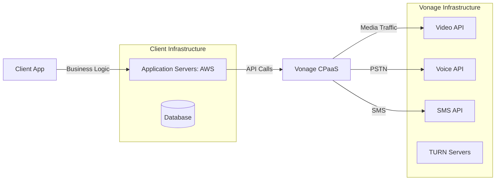
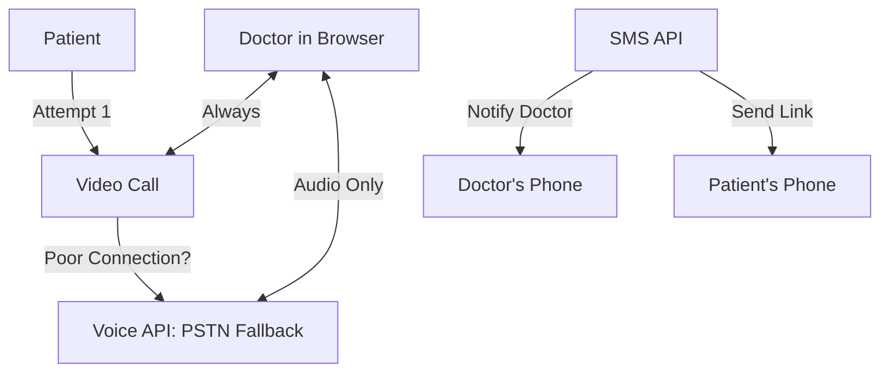

# Vonage CPaaS: Multi-Channel Communication Architecture

> **Source**: [Vonage CPaaS Platform Overview](https://youtu.be/rqRPL3IDnb8)

> [!IMPORTANT]
> **The Value Prop**: Vonage provides **7+ APIs** (Video, Voice, SMS, Messaging, Conversations, Verify, Insights) in one platform.
> **The Strategy**: Multi-channel backup (if video fails, fallback to voice/SMS).

---

## 🏗️ System Architecture: Clean Separation



**Key Insight**: Client never handles video infrastructure. Vonage manages SFU, TURN, and encoding.

---

## 📡 The 7 Core APIs

### 1. Video API
*   **Topology**: P2P, SFU (group chat), Broadcast (webinar).
*   **Features**: Recording, screen sharing, annotations.
*   **Pricing**: $0.0040/min.

### 2. Voice API
*   **Use Case**: PSTN dial-in, fallback when video fails.
*   **Features**: IVR, call routing, recording.
*   **Pricing**: $0.0140/min (vs $0.02-0.05 for Twilio).

### 3. SMS API
*   **Use Case**: Notifications, 2FA codes, appointment reminders.
*   **Features**: Global reach (190+ countries).
*   **Pricing**: $0.0075/SMS (US).

### 4. Messaging API (Omnichannel)
*   **Channels**: WhatsApp, Facebook Messenger, Viber.
*   **Use Case**: Customer support (start on WhatsApp, escalate to video).

### 5. Conversations API
*   **Unique Feature**: **Context persistence** across channels.
*   **Example**: User starts on WhatsApp → Switches to video call → Context (chat history) follows.

### 6. Verify API (2FA)
*   **Flow**: Send SMS code → If not entered in 60s → Auto voice call fallback.
*   **Use Case**: Login security, payment verification.

### 7. Advanced Insights API
*   **Metrics**: Bitrate, packet loss, jitter, connection drops.
*   **Use Case**: Customer support (prove "it was your internet, not our app").

---

## 💰 Cost Comparison (10k Minutes/Month)

| Vendor | Video | Voice | SMS | Total (Video + Voice + SMS) |
| :--- | :--- | :--- | :--- | :--- |
| **Vonage** | $0.0040 | $0.0140 | $0.0075 | ~$50/month |
| **Twilio** | $0.0040 | $0.0200 | $0.0079 | ~$60/month |
| **Agora** | $0.0009 | N/A | N/A | ~$9 (video only) |

**Insight**: Vonage is **mid-priced**. Cheaper voice than Twilio, but more expensive video than Agora.

---

## 🏥 Real-World Pattern: Telehealth (SimplyDoc)

### Multi-Channel Fallback Architecture



### The Flow
1.  **Initial**: Patient clicks video call link (WebRTC).
2.  **Fallback**: If connection fails, app offers "Switch to Phone Call".
3.  **Voice API**: Dials patient's phone number via PSTN.
4.  **Result**: Doctor (still in browser) + Patient (on phone) = Successful call.

### Code Example (Node.js)
```javascript
// Attempt video call
const session = await vonage.video.createSession();

// Monitor connection quality
session.on('connectionQuality', (event) => {
  if (event.quality === 'poor') {
    // Fallback to voice
    v

onage.voice.call({
      to: patient.phoneNumber,
      from: doctorNumber,
      ncco: [{ action: 'connect', from: doctorNumber }]
    });
  }
});
```

---

## 🔐 Advanced Insights: Debugging with Data

### The Problem
**Patient**: "Your app is broken! Video was terrible!"
**Support**: "Was it our app or your internet?"

### The Solution
Query **Advanced Insights API** for that call ID.

**Metrics Retrieved**:
*   **Bitrate**: 200 kbps (vs typical 2 Mbps).
*   **Packet Loss**: 15% (vs acceptable <3%).
*   **Device**: iPhone 6 (2014, low RAM).

**Response**: "Your device/network caused the issue. We recommend upgrading."

---

## ✅ Principal Architect Checklist

1.  **Use Conversations API for Context**: If your app involves escalation (chat → call), this is a killer feature.
2.  **Always Implement Fallback**: Video fails 5-10% of the time. Voice API backup saves customer satisfaction.
3.  **Log Advanced Insights**: Store call quality data for **every** call. Saves hours of support time.
4.  **Compare Total Cost**: Vonage is cheaper for **voice-heavy** apps (vs Twilio). Agora is cheaper for **video-only**.

---

## 🔗 Related Documents
*   [WebRTC Architecture Decision](./webrtc-architecture-decision-guide.md) — CPaaS vs Open-Source.
*   [Twilio WebRTC Go](./twilio-webrtc-go-strategy-guide.md) — Twilio pricing comparison.
*   [AI Marketplace](./ai-marketplace-strategy-guide.md) — CPaaS vendor strategies.
