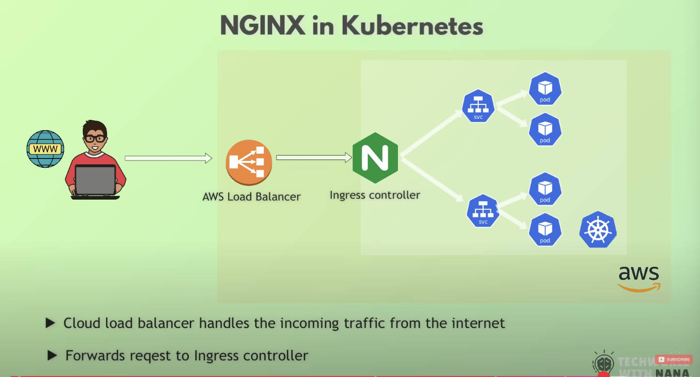

What is NGINX ?

It is a piece of software installed on a server (someone's machine) that allows to listen on incoming http/https requests and then respond

Now, in modern days webapps have millions of traffic which can't be handled by a single server - so, increasing NGINX can do but

# now, question which request goes to which ?
# how many request should be handled by each NGINX ?

- this is another problem

- solution: One of NGINX will act as load balancer to distribute incmoing requests to other NGINXs

- so, now that NGINX receives all incoming traffic and then distributes to other NGINx

# but, again how does it distribute ?

- depends on the alogorithm, 

-> Round Robin: it does it evenly amongth available NGINXs

-> Least connectioin: whichever NGINX has least amount of request to handle

# NGINX can servve as a cache layer for serving static content

- so, in terms of static content when it has been created and response ready then it gets cached within NGINX -> now, whether 100 or 1 million users (concurrent or not) request for such then it could simply be served from NGINX

# NGINX as Reverse Proxy

- Instead of exposing actual servers that sends back the response -> rather expose a single server i.e. NGINX (which distribute incoming requests) so now from outsiders or clients perspective they hit a single server but internally this NGINX (that acts Reverse Proxy) sends to whichever servers needed without exposing them i.e. better for security

# So, NGINX can do `Load Balancing` , `Caching` but also serve as `Reverse Proxy i.e. known as Proxy Server` while off course NGINX server would work as `Web Server`

N.B: Now, that all incoming requests comes to that one NGINX (so all secutiry effor could be implmented there thus making it effortless)

- So, NGINX (that receives all incoming https requests encrypted) -> sends it to actual servers (where those servers decrypt it to do what needed and then sends back response) 

# NGINX can also compress larges files to save bandiwidth (how much data being tranferred from server to client)

# It also supports sending file as chunks

N.B: all these stuff can be configured with .conf file

Reference: nginx.org/en/docs/dirindex.html

# NGINX as a K8s Ingress Controller

-> What is a ingress controller

- A spealized load balancer for managing ingress (i.e. incoming) traffic in Kubernetes

- So, here NGINX (PROXY SERVER) instead of directing the traffic to other WEB SERVERS, it directs to the appropiate services based on rules defined in ingress resource

- In this case, client (i.e. browser which is a webapp here) send requests to an AWS Load Balancer then it directs it Ingress Controller (which lives within K8 cluster -> then Ingress directs to appropiate services) -> this way cluster (within which ingress controller the actual Proxy Server) never exposed and then based on the selected algorithm (or default round-robin) ingress controller routes/distributes the requests amongs available K8 services

