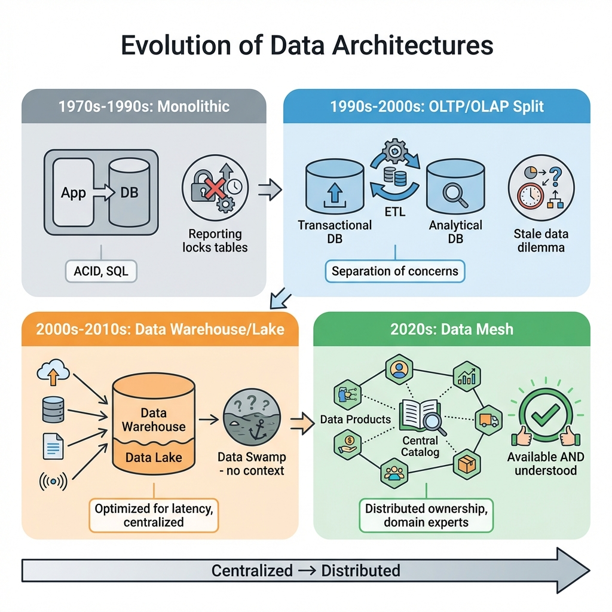
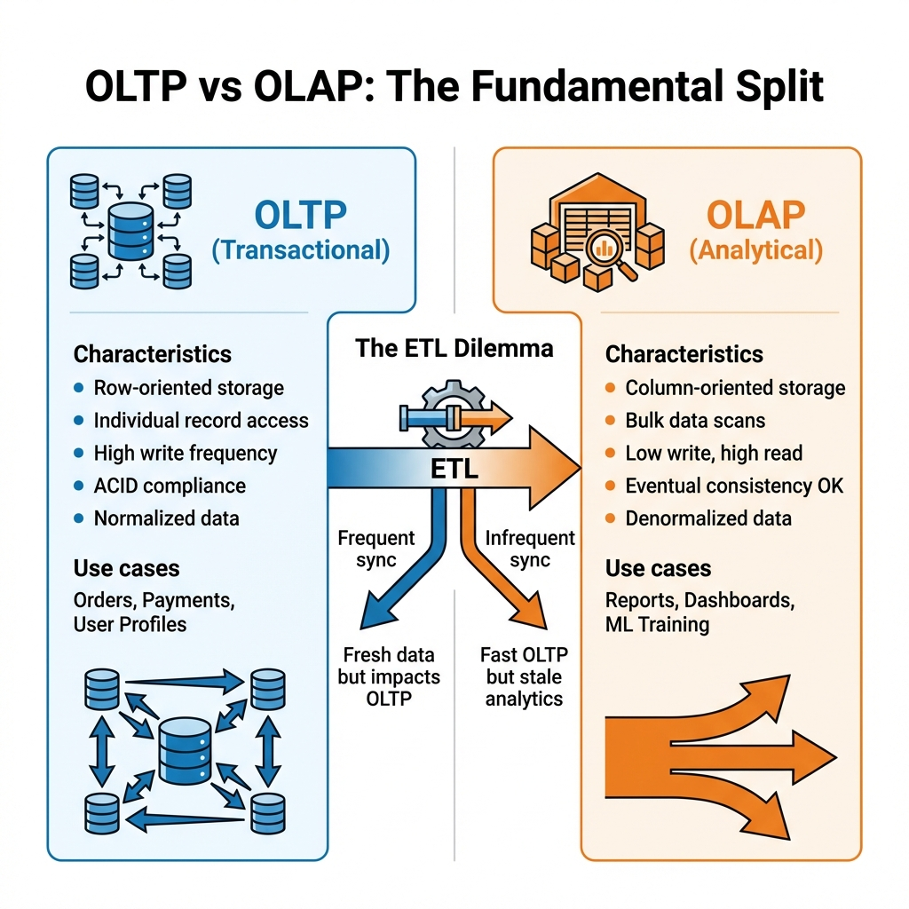
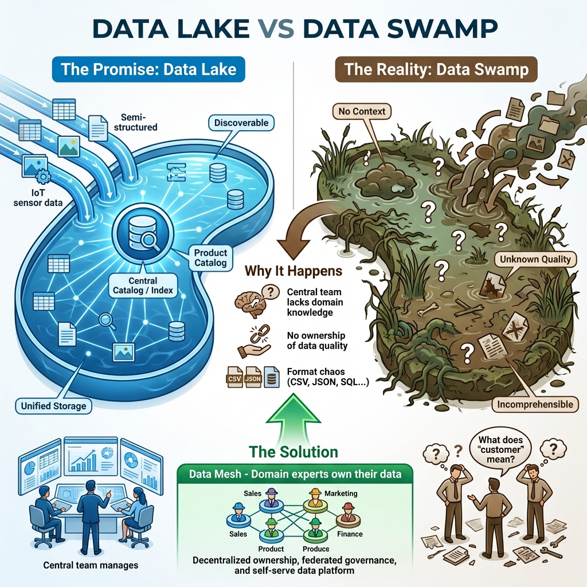

# Data Architecture Evolution: From Monolith to Mesh

> **Source**: [Data Mesh Explained](https://www.youtube.com/watch?v=U8bzjxWGn1o)

> [!IMPORTANT]
> **The Journey**: Data management has evolved through four distinct eras—each solving the problems of the previous while creating new ones. Understanding this evolution is critical for making informed architecture decisions today.

---

## 📊 The Evolution Timeline

---

## 🏛️ Era 1: The Monolithic Database (1970s-1990s)

### The Architecture
In the early days, software was simple:
*   **One application** connected to **one database**.
*   SQL emerged in the 1970s, bringing standardized querying.
*   Databases focused on **ACID** properties (Atomicity, Consistency, Isolation, Durability).

### ACID vs Eventual Consistency

| Model | Behavior | Example |
| :--- | :--- | :--- |
| **ACID** | Transaction succeeds completely or fails completely. Strict consistency. | Bank transfer: debit and credit are atomic. |
| **Eventual Consistency** | Process initiates, token returned, resolved later. | Coffee shop: receipt (token) → coffee (later). |

### The Problem That Emerged
When organizations started running **reports** against their transactional databases:
*   Analytical queries performed **bulk reads**.
*   Bulk reads **locked tables**.
*   Table locks **slowed down the application**.

> [!WARNING]
> **The Conflict**: Transactional workloads (fast, small writes) and Analytical workloads (slow, large reads) are fundamentally incompatible on the same system.

---

## ⚡ Era 2: OLTP vs OLAP Split (1990s-2000s)

### The Solution: Separation of Concerns
The industry split systems into two categories:

| System | Purpose | Optimized For |
| :--- | :--- | :--- |
| **OLTP** (Online Transactional Processing) | Run the business | Individual row access, high write frequency |
| **OLAP** (Online Analytical Processing) | Analyze the business | Bulk scans, aggregations, read-heavy |

### The ETL Dilemma
Moving data between OLTP and OLAP requires **ETL** (Extract, Transform, Load).

| Strategy | Benefit | Cost |
| :--- | :--- | :--- |
| **Frequent Sync** | Fresh, up-to-date analytics | Impacts transactional performance |
| **Infrequent Sync** | Fast transactional system | Analysts work with stale data |

> [!CAUTION]
> **There is no free lunch**: Every ETL strategy is a trade-off between data freshness and system performance.

---

## 🏢 Era 3: Data Warehouse & Data Lake (2000s-2010s)

### The Data Warehouse: Optimizing for Latency
A Data Warehouse is a specialized OLAP database tuned for analytical queries using "radical" optimizations:

| Optimization | Why It Works |
| :--- | :--- |
| **Removing Foreign Keys** | Validation handled at source; faster bulk loading. |
| **Index by Date (not ID)** | Matches how reports are typically run. |
| **Denormalization** | Storage is cheap now; latency is expensive. Duplicate data to avoid joins. |
| **Column Stores** | Store by column to quickly scan specific attributes (e.g., all "countries"). |
| **Horizontal Scaling** | Shard data across machines for parallel processing. |

### The CAP Theorem Trade-off
In analytical systems, architects often prioritize:
*   ✅ **Availability** (always respond)
*   ✅ **Partition Tolerance** (handle network splits)
*   ❌ **Consistency** (accept eventual consistency)

### The Data Lake: Unified Storage
As organizations grew, they ended up with **many small warehouses** that couldn't talk to each other.

**The Promise**:
*   Pool all data into one unified, highly available store.
*   Provide a **product catalog** for discovery.
*   One highly skilled central team manages everything.

### The Reality: The Data Swamp

**Why Lakes Become Swamps**:
*   Central team **lacks domain knowledge**.
*   They don't know what "customer" means to Sales vs. Support vs. Billing.
*   Data is **highly available** but **incomprehensible**.
*   **Result**: Garbage in, garbage stays.

---

## 🌐 Era 4: Data Mesh (2020s)

### The Key Insight
Data Mesh is **not a product** you buy. It's a **methodology**—like Microservices or DevOps.

### The Core Principles

| Principle | Description |
| :--- | :--- |
| **Distributed Ownership** | Teams that own applications also own their **data products**. They are domain experts. |
| **Centralized Catalog** | Storage is distributed, but a **central catalog** enables discovery. |
| **Data as a Product** | Each data product has SLAs, documentation, and quality guarantees. |

### The Grocery Store Analogy

> [!TIP]
> **Understanding Data Mesh**:
>
> A Data Mesh is like a **grocery store**:
> *   You can browse many different **brands of rice** (data products) in one aisle.
> *   The store didn't **make** the rice—farmers (domain teams) did.
> *   The store makes them **discoverable** and provides **labels** (metadata) so you can compare.
> *   If the rice is bad, you blame the brand (domain team), not the store (platform).

---

## 🛠️ Implementation Strategy

### Legacy as Nodes
You don't need to "dump" existing technology:
*   An existing **Data Lake** or **Data Warehouse** can become the first (or largest) **node** in the mesh.
*   Wrap it with proper metadata, SLAs, and publish to the catalog.

### Organizational Shift
| Old Model | New Model |
| :--- | :--- |
| DBAs siloed in a central team | DBAs embedded in cross-functional teams |
| Data quality owned by "data team" | Data quality owned by domain team |
| Publish data to lake, hope for the best | Publish data products with SLAs |

---

## ✅ Principal Architect Checklist

1.  **Understand Your Era**: Identify where your organization currently sits (Monolith, OLTP/OLAP, Lake, Mesh). Don't skip eras—each solves different problems.
2.  **Measure the Pain**: Quantify ETL staleness, reporting bottlenecks, and "swamp" data. Use metrics to justify architectural change.
3.  **Start with Catalog**: Before decentralizing ownership, establish a **central catalog**. Without discoverability, distributed ownership creates chaos.
4.  **Wrap Legacy First**: Make your existing Lake/Warehouse the first "data product" with proper SLAs and metadata.
5.  **Embed Data Experts**: Move DBAs and data engineers **into** domain teams, not as a separate function.
6.  **Publish with SLAs**: Every data product must have documented freshness, quality, and availability guarantees.

---

## 📈 Operational Considerations

| Era | Primary Cost | Primary Bottleneck |
| :--- | :--- | :--- |
| **Monolith** | Hardware | Single database capacity |
| **OLTP/OLAP Split** | ETL infrastructure | Pipeline maintenance |
| **Data Warehouse/Lake** | Specialized team salaries | Central team capacity |
| **Data Mesh** | Governance overhead | Cross-domain coordination |

---

## 🔗 Related Documents
*   [Data Mesh Foundation (4 Pillars)](data-mesh-foundation.md) — Zhamak Dehghani's foundational theory
*   [Data Mesh Architecture](data-mesh-architecture.md) — Practical implementation guide
