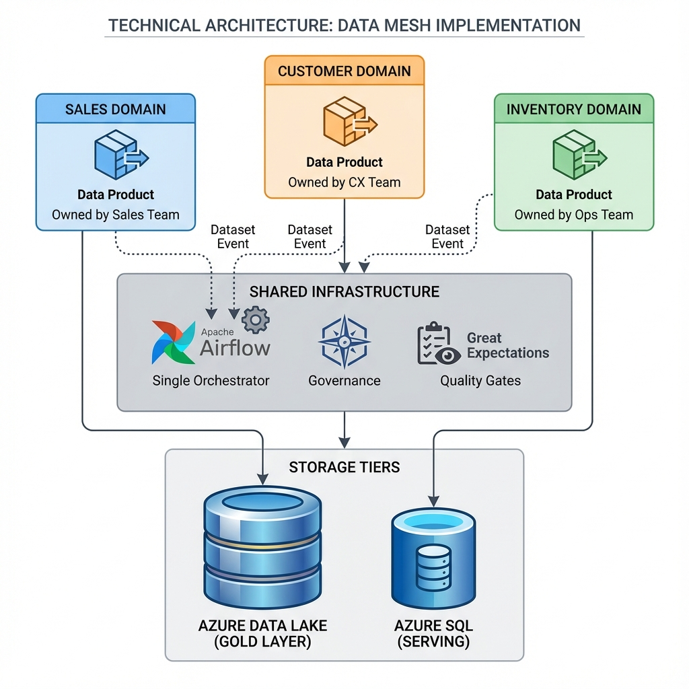
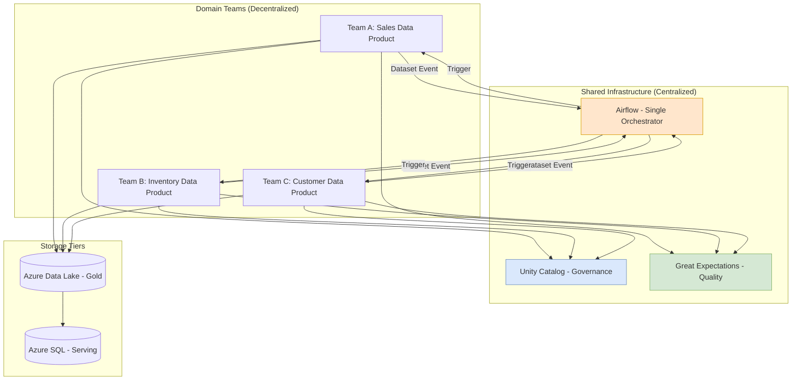

# Data Mesh: A Practical Architecture Guide

> **Source**: [Building a Data Mesh-Compliant Architecture (Speedrun)](https://youtu.be/uk-2RRzJzxU?list=TLGGN-ebi9dPXdAwODAxMjAyNg)

> [!IMPORTANT]
> **The Core Tension**: Autonomy enables speed. Autonomy causes fragmentation.
> **The Solution**: Standardized **Infrastructure Blueprints** + **Centralized Orchestration (Airflow)** + **Decentralized Ownership**.

---

## 🏛️ The Problem: Autonomy vs Fragmentation

Data Mesh advocates independent teams owning their "Data Products". But full autonomy leads to:
*   **Different Schedulers**: Team A uses Cron, Team B uses Airflow, Team C uses Lambda triggers.
*   **Different Formats**: Team A outputs Parquet, Team B outputs CSV.
*   **No Cross-Domain Products**: Aggregating data across domains is impossible if they can't communicate.

---

## 📊 Architecture Diagram

---

## 🏗️ The Hybrid Architecture

### 1. Single Orchestrator (Airflow)
*   **Why?**: A single Airflow instance provides a **global view** of all data product states.
*   **How?**: Teams use **Airflow Datasets** to pass messages. When Product A finishes, it publishes a Dataset event. Product B, which depends on A, is triggered automatically.
*   **Benefit**: Each team owns their recalculation logic. Orchestration just coordinates.

### 2. Heavy Lifting (Databricks/Spark)
*   **Why Databricks?**: Developer familiarity. Managed Spark. High throughput.
*   **Unity Catalog**: Provides **granular access control** and **data lineage**. This is your governance layer if you lack a dedicated tool.

### 3. Two-Tier Storage
| Tier | Technology | Purpose |
| :--- | :--- | :--- |
| **Primary** | Azure Data Lake (ADLS) | All data up to "Gold" layer. Bulk analytics. |
| **Serving** | Azure SQL / Elasticsearch | Specific "niche" needs. Serving single tables over the internet. Avoids Databricks costs for low-volume reads. |

---

## ✅ Data Contracts & Quality

A Data Product is not just data. It includes **Contracts** (SLAs).

### Great Expectations (GX)
*   **Why?**: Python-based. Generates **human-readable reports** that explain errors to non-technical stakeholders.
*   **Threshold-Based Decisions**:
    *   If record loss < 3%, serve the data.
    *   If record loss > 3%, mark the product as **INVALID**. Consumers should not use it.

---

## 📊 Lessons Learned

| Lesson | Explanation |
| :--- | :--- |
| **Focus Beyond Data** | A Data Product includes documentation, contracts, and metadata. The "meat" is only part of it. |
| **Infrastructure ≠ Domains** | Don't organize infrastructure by business domain. Organize by the **needs of Data Products**. |
| **Catalog Early** | Invest in a Data Catalog (e.g., **DataHub**) on Day 1. An early catalog prevents a "Data Mess". |
| **Use Blueprints** | Create a **Data Product Blueprint**—a shareable template with common infra (Airflow DAG, GX suite, Databricks job). Teams customize, not build from scratch. |

---

## ✅ Principal Architect Checklist

1.  **Centralize Orchestration, Decentralize Logic**: Use one Airflow instance for visibility. Teams own their DAG code and recalculation logic.
2.  **Adopt Airflow Datasets**: This is the event-passing mechanism that enables inter-product communication without tight coupling.
3.  **Use Unity Catalog for Governance**: If you don't have a dedicated governance tool, Unity Catalog provides lineage and access control.
4.  **Define Quality Thresholds Upfront**: Decide with stakeholders: "What % data loss is acceptable before we block consumption?" Encode this in Great Expectations.
5.  **Create a Data Product Blueprint**: A template with Airflow DAG, GX suite, Databricks job, and metadata. This accelerates onboarding without being a "straitjacket".
6.  **Invest in Catalog Early**: A Data Catalog (DataHub, Atlan, Alation) is not optional. Without it, you get "Data Mesh" in name only.
7.  **Don't Base Infra on Org Chart**: Infrastructure should serve data product needs, not mirror org structure.

---

## 🍔 Analogy: The International Food Court

> [!TIP]
> **Understanding Data Mesh Tensions**:
>
> *   **Autonomy** = Every stall (Team) chooses their own chef, menu, and ingredients.
> *   **Fragmentation** = Stalls use different currencies, different power outlets, and can't share ingredients. Chaos.
>
> *   **The Blueprint** = The Food Court provides:
>     *   Standard Kitchen Layout (Plumbing, Electricity).
>     *   A shared POS System (Orchestration/Airflow).
>     *   Quality Inspectors (Great Expectations).
>
>     Stalls still cook whatever they want. But they can easily buy ingredients from each other and serve a combined "fusion" dish (Cross-Domain Product).
